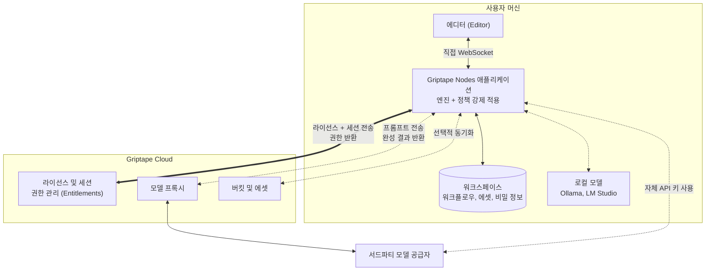
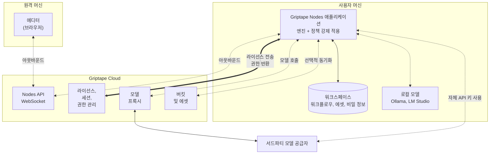
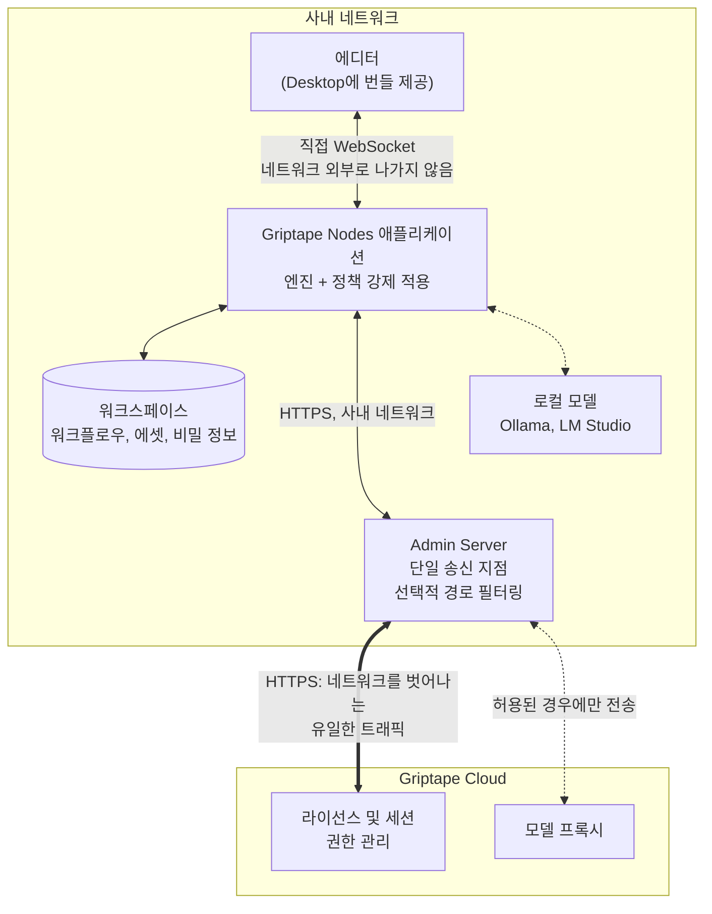

# 아키텍처 (Architecture)

Griptape Nodes는 두 개의 프로그램으로 구성됩니다. 워크플로우를 구축하는 **에디터(Editor)**와 제어 가능한 머신에서 이를 실행하는 **애플리케이션(Application)**입니다. 애플리케이션이 실제 작업을 수행하고 데이터를 보관하며, 자체적으로 수행할 수 없는 소수의 기능에 대해서만 Griptape Cloud를 호출합니다.

이러한 구조는 배포 형태가 바뀌어도 변하지 않습니다. 달라지는 것은 사용자의 머신에서 Griptape Cloud로 이어지는 네트워크 경로뿐입니다:

- **[SaaS 구성](#saas-구성)**은 기본 설정입니다. 사용자의 머신이 Griptape Cloud에 직접 연결됩니다.
- **[온프레미스 구성](#온프레미스-구성)**은 머신을 공용 인터넷으로부터 분리합니다. 사용자가 운영하는 단일 [Admin Server](enterprise/admin_server.md)를 통해서만 Griptape Cloud에 접근합니다.

두 구성 모두 동일한 소프트웨어를 실행합니다. 구성을 변경하는 것은 네트워크 경로의 변경일 뿐 제품 자체가 달라지는 것은 아닙니다.

## 구성 요소

| 구성 요소 | 역할 | 실행 위치 |
| --- | --- | --- |
| **Editor** | 워크플로우를 시각적으로 구축하는 캔버스. | 웹 브라우저 내부, 또는 Griptape Nodes Desktop에 번들로 제공. |
| **Application** | 워크플로우를 실행하는 프로그램으로, [`griptape-nodes`](https://pypi.org/project/griptape-nodes/)로 배포됨. 그래프를 실행하고 워크스페이스를 관리하며 라이선스가 부여한 권한을 적용. | 사용자의 로컬 머신. |
| **Engine** | 오픈소스 워크플로우 런타임으로, [`griptape-nodes-engine`](https://pypi.org/project/griptape-nodes-engine/)으로 배포되며 소스코드는 [griptape-nodes-engine](https://github.com/griptape-ai/griptape-nodes-engine)에 공개됨. 노드 라이브러리를 로드하고 그래프를 실행. | 애플리케이션 내부. |

엔진은 실제 워크플로우 실행이 일어나는 공간이며 완전히 오픈소스이므로, 워크플로우가 실행되는 방식이나 파일이 작성되는 위치 등을 투명하게 감사(audit)할 수 있습니다. 별도의 배포 대상이 아니며, 에디터는 애플리케이션에 연결될 뿐 엔진에 직접 연결되지 않습니다.

[Griptape Nodes Desktop](installation.md#griptape-nodes-desktop-권장)은 에디터를 번들로 제공하고 고정된 Python 인터프리터와 함께 애플리케이션을 배포하므로 별도로 설치할 필요가 없습니다.

## 데이터 저장 위치

생성되는 거의 모든 항목은 사용자의 **워크스페이스(Workspace)**에 기록됩니다. 워크스페이스는 애플리케이션이 읽고 쓰는 단일 루트 디렉토리이며 상대 경로가 이를 기준으로 확인됩니다. 워크스페이스의 위치는 사용자가 직접 지정할 수 있습니다. 기본값은 애플리케이션 옆의 폴더이지만, NAS 마운트나 LucidLink와 같은 네트워크 연결 스토리지(공유 인프라에서 프로젝트 데이터를 관리하는 스튜디오의 일반적인 방식)를 포함하여 머신이 접근할 수 있는 모든 위치를 지정할 수 있습니다. 자세한 내용은 [워크스페이스](guides/projects/workspace.md)를 참조하세요.

따라서 데이터가 어디로 가는지 확인할 때는 워크스페이스를 확인하면 됩니다. 애플리케이션은 설정된 경로에만 데이터를 쓰며, 기본적으로 아래 표의 어떤 데이터도 Griptape Cloud로 전송되지 않습니다.

| 항목 | 저장 위치 | Griptape Cloud 전송 여부 |
| --- | --- | --- |
| 워크플로우 및 프로젝트 파일 | 사용자 워크스페이스 | 전송 안 됨 |
| 생성된 에셋: 이미지, 비디오, 오디오 | 사용자 워크스페이스 | 전송 안 됨 (스토리지 백엔드를 Griptape Cloud로 전환하지 않는 한) |
| 비밀 정보 및 API 키 | 환경 변수 → 워크스페이스 내 `.env` 파일 → 사용자 설정 디렉토리 순으로 확인 | 전송 안 됨 |
| 대화 기록 (Conversation history) | 사용자 워크스페이스 | 전송 안 됨 |
| 노드 라이브러리 | 애플리케이션이 실행 중인 머신에 각각 독립된 가상 환경으로 설치 | 전송 안 됨 |

두 가지 설정을 통해 이를 변경할 수 있으며 둘 다 기본적으로 꺼져 있고 [설정](guides/configuration.md)에 문서화되어 있습니다:

- **Storage backend**: 기본값은 `local`이며 에셋을 워크스페이스에 저장합니다. `gtc`로 설정하면 생성된 에셋이 Griptape Cloud 버킷으로 전송됩니다.
- **Synced workflows**: 여러 머신 간에 워크플로우를 공유하기 위해 Griptape Cloud 버킷을 통한 동기화를 활성화합니다.

이 외에 데이터가 워크스페이스를 벗어나는 경우는 워크플로우에서 명시적으로 외부로 전송할 때뿐입니다. 모델 공급자를 호출하는 노드는 해당 노드의 입력을 공급자에게 전송합니다. 이에 대한 자세한 내용은 다음 섹션을 참조하세요.

## Griptape Cloud와의 통신 내용

애플리케이션은 소수의 기능에 대해서만 Griptape Cloud에 의존합니다. 전체 목록은 다음과 같습니다.

| 기능 | 필수 여부 | 통신 내용 |
| --- | --- | --- |
| **라이선스 및 세션** | **필수.** 없으면 애플리케이션이 실행되지 않음. | 라이선스 정보, 세션 할당, 갱신 및 해제 호출. 워크플로우 콘텐츠는 전송되지 않음. |
| **사용 권한 (Entitlements)** | 필수 (세션과 함께 확인) | 라이선스가 부여한 권한 정보가 애플리케이션에 전달되어 로컬에서 적용됨. |
| **모델 프록시 (Model proxy)** | 선택 사항 | 프록시를 가리키도록 설정된 노드의 프롬프트와 입력이 모델 공급자에게 전달됨. |
| **버킷 및 에셋** | 선택 사항 (동의 시) | 동기화를 선택한 에셋 및 워크플로우. |
| **Nodes API WebSocket** | 선택 사항 | 에디터와 애플리케이션이 동일 머신에 있지 않을 때의 이벤트 중계. |
| **Admin Dashboard** | 선택 사항 (관리자 전용) | 브라우저를 통한 라이선스 및 권한 관리. [Admin Dashboard](enterprise/admin_dashboard.md) 참조. |

**라이선스는 유일한 필수 의존성입니다.** 라이선스는 애플리케이션 실행을 허가하는 기준입니다. 애플리케이션은 라이선스를 검증하고 Griptape Cloud에 세션 할당을 요청하며 부여된 권한을 받아 실행 중에 로컬에서 이를 강제 적용합니다. 워크플로우 콘텐츠는 이 통신에 절대 포함되지 않습니다. 활성화에 대한 내용은 [Admin Server 사용하기](enterprise/using_the_admin_server.md)를 참조하세요.

모델 호출은 Griptape Cloud를 전혀 거치지 않아도 됩니다. 자체 API 키로 서드파티 공급자를 가리키거나 Ollama 또는 LM Studio 기반으로 로컬에서 실행되는 모델을 지정할 수 있으며 이 경우 프롬프트가 머신 외부로 나가지 않습니다. [AI 공급자](guides/agent/providers/index.md)를 참조하세요.

### 에디터와 애플리케이션의 통신 방식

에디터와 애플리케이션은 별개의 프로그램이므로 둘 사이의 이벤트 전달을 위한 전송 수단이 필요합니다:

- **직접 WebSocket (Direct WebSocket)**: 애플리케이션이 로컬에서 수신 대기하고 에디터가 이에 직접 연결됩니다. 이벤트가 로컬 머신 밖으로 나가지 않습니다. Griptape Nodes Desktop에서 라이선스로 활성화했을 때 이 방식을 사용합니다.
- **Nodes API WebSocket**: 에디터와 애플리케이션이 각각 Griptape Cloud로 아웃바운드 연결을 열고 Cloud가 둘 사이의 이벤트를 중계합니다. 이를 통해 브라우저의 에디터가 다른 머신의 애플리케이션을 제어할 수 있습니다.

에디터 트래픽에는 워크플로우 내용(노드 그래프, 파라미터 값, 생성된 에셋의 미리보기 등)이 포함되므로 개인정보 보호 측면에서 이러한 구분이 중요합니다. 직접 WebSocket에서는 네트워크에 아무것도 노출되지 않습니다. 어느 방식이든 워크스페이스는 워크플로우를 실행하는 머신에 유지됩니다. 아래의 [SaaS 구성](#saas-구성) 섹션에서 두 가지 구조를 다이어그램으로 확인할 수 있습니다.

## SaaS 구성

기본 구성입니다. 사용자의 머신이 Griptape Cloud에 직접 연결되므로 사용자 측에 별도로 배포할 것이 없습니다. 이 구성은 에디터가 애플리케이션에 도달하는 방식에 따라 두 가지 형태로 나뉩니다.

이 페이지의 세 가지 다이어그램 모두에서 실선은 필수 연결, 점선은 선택적 연결을 나타내며 양방향 화살표는 동일한 경로로 데이터가 반환됨을 의미합니다. Griptape Nodes가 실행되는 데 필수적인 트래픽은 라이선스뿐입니다.

### 에디터와 엔진이 동일 머신에 있는 경우

Griptape Nodes Desktop을 사용할 때의 구조입니다. 에디터가 엔진을 호스팅하는 애플리케이션에 직접 연결되므로 워크플로우 콘텐츠가 네트워크를 타지 않습니다.

### 에디터와 엔진이 서로 다른 머신에 있는 경우

현재 작업 중인 컴퓨터보다 더 사양이 좋은 머신에서 엔진을 실행하거나 노트북 브라우저에서 에디터를 사용하려는 경우에 적합합니다. 에디터와 애플리케이션이 각각 Nodes API WebSocket으로 **아웃바운드** 연결을 열고 Cloud가 둘 사이의 이벤트를 중계합니다.

양쪽 모두 아웃바운드로 연결하므로 인바운드 포트를 열 필요가 없으며 서로의 주소를 알 필요도 없습니다. 대신 에디터 트래픽(노드 그래프, 파라미터 값, 에셋 미리보기 등)이 Griptape Cloud를 거쳐 인터넷을 통과하게 됩니다. 워크스페이스는 이동하지 않으며 워크플로우는 여전히 엔진을 호스팅하는 머신에서 실행됩니다.

**온프레미스 환경에는 두 변형 모두 적용되지 않습니다.** Nodes API WebSocket은 Griptape Cloud 서비스이므로 온프레미스 배포에서는 워크플로우 이벤트를 네트워크 내부에 유지하기 위해 직접 연결을 사용합니다.

## 온프레미스 구성

사용자의 머신이 공용 인터넷에 직접 연결되지 않습니다. 사내 네트워크 내에서 실행되는 [Admin Server](enterprise/admin_server.md)를 통해 Griptape Cloud에 연결되므로 방화벽에서 머신별로 허용할 필요 없이 단 하나의 호스트만 허용하면 됩니다.

이 구성은 세 가지 핵심 특징을 가집니다.

**워크플로우 구축 및 실행과 관련된 어떤 데이터도 경계를 벗어나지 않습니다.** Griptape Nodes Desktop은 에디터를 번들로 제공하므로 브라우저가 인터넷을 통해 에디터를 가져오지 않으며 직접 WebSocket을 통해 애플리케이션에 연결됩니다. 워크플로우, 에셋, 비밀 정보는 머신의 워크스페이스에 유지됩니다. 로컬 모델 실행기와 결합하면 패킷 하나도 사내 네트워크 밖으로 나가지 않고 워크플로우를 처음부터 끝까지 실행할 수 있습니다.

**단 하나의 호스트만 외부로 송신하며 허용할 트래픽을 직접 결정할 수 있습니다.** 모든 애플리케이션이 `cloud.griptape.ai` 대신 Admin Server를 가리키므로 방화벽 규칙 하나와 아웃바운드 트래픽 감사 지점 하나만 관리하면 됩니다. Admin Server는 허용되는 Cloud 경로를 제한할 수도 있으므로 라이선스를 유지하면서 모델 호출은 사내에만 머물도록 제한할 수 있습니다([전송 규칙](enterprise/admin_server.md#전송-규칙-forwarding-rules) 참조). Admin Server는 결정을 내리기보다 단순히 중계합니다. 라이선스를 검증하거나 세션을 할당하거나 데이터를 캐시하지 않으며 각 애플리케이션의 인증 정보는 Griptape Cloud가 수락/거부할 수 있도록 수정 없이 그대로 전달됩니다.

**외부로 송신되어야 하는 경로는 고정되어 있으며 검사가 가능합니다.** 라이선스 관리를 위해 아래의 경로만 필요하며 그 외에는 아무것도 요구되지 않습니다. 설정에서 이 경로들을 차단하는 경우 Admin Server는 시작되지 않습니다:

| 경로 | 필요한 이유 |
| --- | --- |
| `/api/sessions/*` | 애플리케이션 실행을 허가하는 세션의 할당 및 관리. |
| `/api/session-renew` | 세션 유지(Keep-alive). |
| `/api/session-release` | 세션을 정상 종료하고 좌석을 해제. |
| `/api/users` | 시작 시 및 각 하트비트에서 라이선스 소유자 확인. |
| `/api/organizations` | 시작 시 및 각 하트비트에서 소속 조직 확인. |

!!! note "Cloud 연결을 유지하는 것이 유리한 이유"

    이 연결은 세션 할당 이상의 역할을 합니다. 애플리케이션이 라이선스의 최신 내용을 수신하는 통로이기도 하므로 관리자가 라이선스 권한을 변경하면 실행 중인 배포 환경이 재발급이나 재배포를 기다릴 필요 없이 다음 세션에서 새 권한을 즉시 적용받게 됩니다. 권한을 중앙에서 관리하고 즉시 적용할 수 있다는 점이 이 경로를 열어두는 실질적인 이점입니다.

    이는 온프레미스가 완전한 오프라인 모드를 의미하는 것은 아님을 뜻합니다. 온프레미스는 머신, 워크플로우, 에셋이 사내 네트워크 내에 유지된다는 의미이지 Griptape Nodes가 외부 연결 없이 완전히 독립 실행된다는 뜻은 아닙니다. 세션은 Griptape Cloud에서 할당되므로 Admin Server가 Cloud에 도달할 수 있어야 합니다. 해당 경로를 사용할 수 없는 경우 Admin Server는 만료된 승인을 제공하는 대신 오류를 반환하며 애플리케이션은 새 세션을 시작할 수 없습니다.

## 관련 문서

- [설치](installation.md): Desktop 또는 애플리케이션 수동 설치 방법 안내.
- [설정](guides/configuration.md): 워크스페이스, 스토리지 백엔드, 정적 서버 설정 안내.
- [에셋 및 출력물](guides/assets.md): 생성된 파일의 저장 위치 및 에디터 미리보기 안내.
- [Admin Server 사용하기](enterprise/using_the_admin_server.md): 라이선스 키 활성화 과정 안내.
- [Admin Server](enterprise/admin_server.md): 온프레미스 프록시 배포 및 구성 안내.
- [Admin Dashboard](enterprise/admin_dashboard.md): 라이선스 키 발급 및 권한 템플릿 생성 안내.
