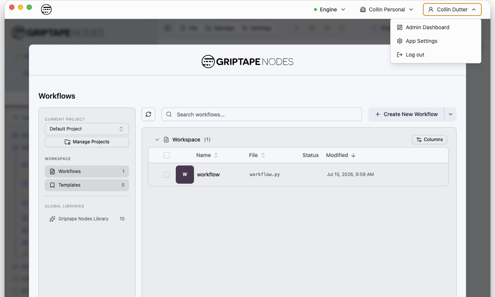
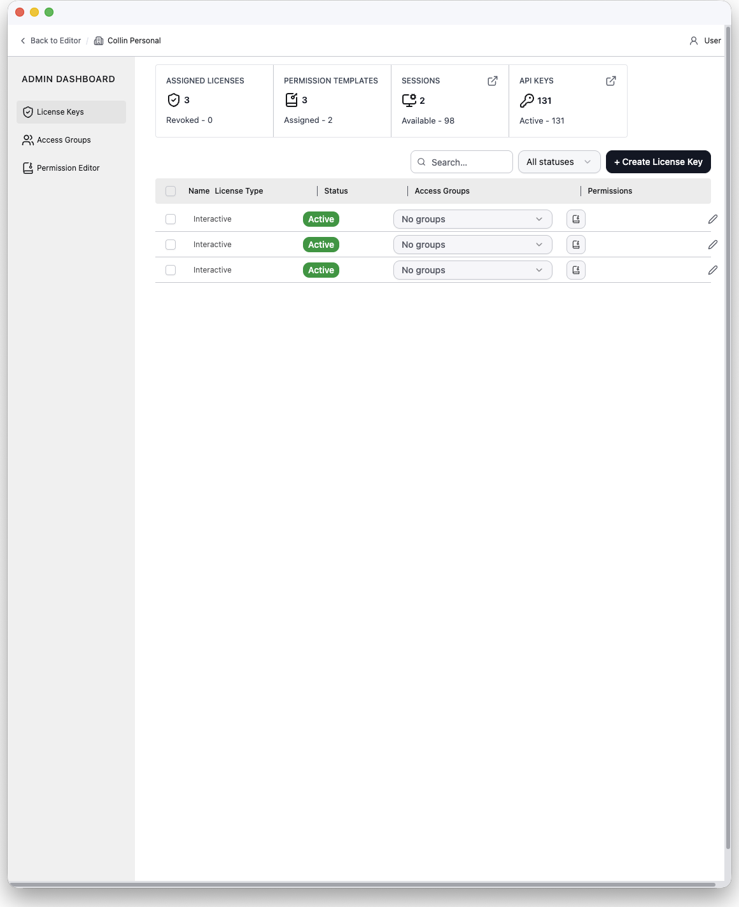
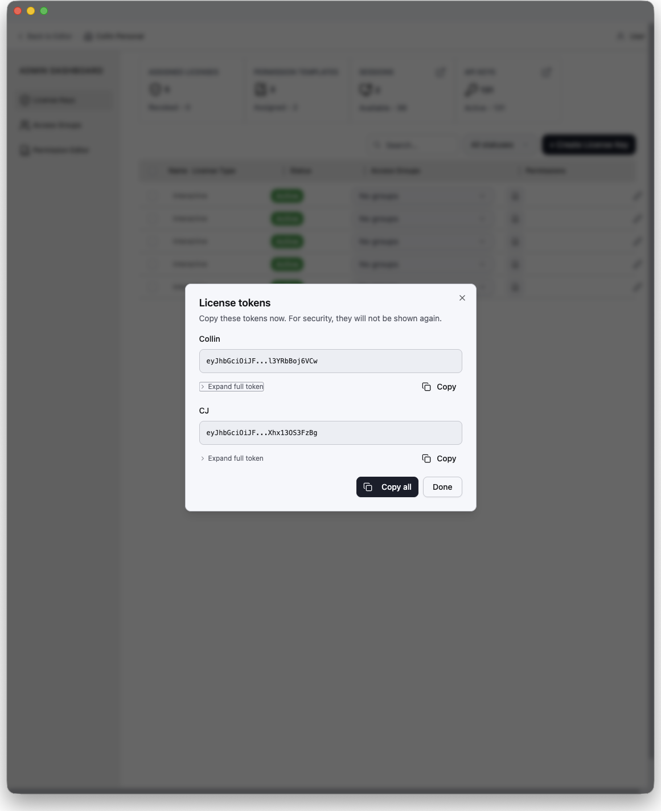
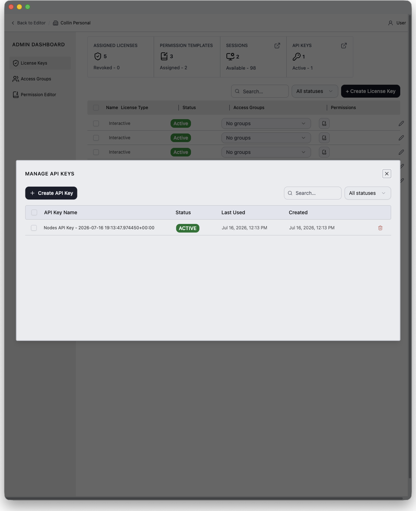
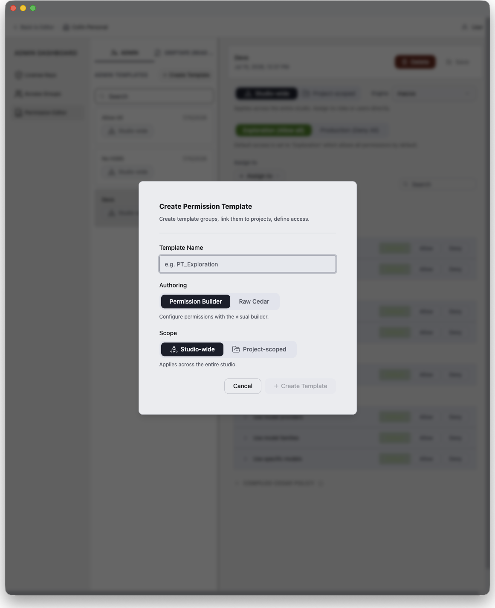
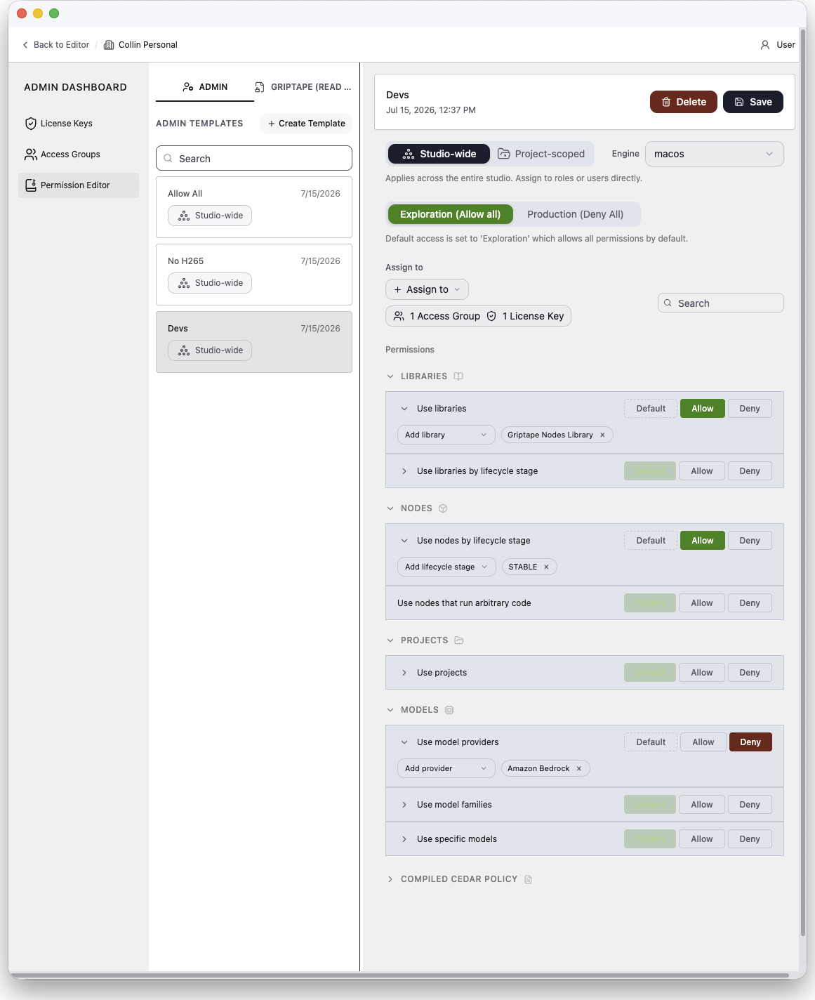

# Admin Dashboard (관리자 대시보드)

Admin Dashboard는 Griptape Nodes 에디터에 내장된 관리 인터페이스입니다. 조직 소유자는 이를 사용하여 라이선스 키를 발급 및 관리하고, 사용자를 액세스 그룹으로 구성하며, 권한 템플릿(로드할 수 있는 라이브러리와 노드, 호출할 수 있는 모델, 열 수 있는 프로젝트)을 통해 각 사용자가 수행할 수 있는 작업을 정밀하게 제어합니다.

## 이용 대상

Admin Dashboard는 **소유한 조직**을 관리하며 Griptape Cloud와 통신합니다. 따라서 **Griptape Cloud 계정으로 로그인한 상태**에서만 사용할 수 있습니다.

데스크톱 애플리케이션에서는 라이선스 키로 활성화된 좌석이 아니라 **Login or Sign-Up**을 통해 로그인한 사용자에게만 대시보드가 표시됩니다. 라이선스 활성화([Admin Server 사용하기](using_the_admin_server.md) 참조)는 클라우드 계정 없이 세션을 생성하므로 관리 대상 좌석에 해당하며 **Admin Dashboard** 메뉴 항목이 절대 표시되지 않습니다. 활성 조직이 소유하지 않은 조직인 경우에도 해당 항목이 숨겨집니다.

둘 이상의 조직을 소유한 경우 대시보드 상단 표시줄의 조직 전환기를 통해 조직 간을 이동할 수 있으며 소유하지 않은 조직으로는 전환할 수 없습니다.

## Admin Dashboard 열기

데스크톱 애플리케이션의 오른쪽 상단 모서리에 있는 프로필 메뉴(이름이 표시된 버튼)를 열고 **Admin Dashboard**를 선택합니다.

대시보드는 에디터와 별도의 자체 창으로 열리므로 일상 작업과 병행하여 라이선스를 관리할 수 있습니다. **Admin Dashboard**를 다시 선택하면 기존 창에 포커스가 맞춰집니다. 작업이 끝나면 창을 닫아도 에디터에는 영향이 없습니다.

!!! note "웹 에디터에서도 이용 가능"

    Griptape Nodes 웹 에디터에서도 동일한 대시보드를 사용할 수 있습니다: 왼쪽 하단 모서리의 사용자 메뉴를 열고 **Admin Dashboard**를 선택하세요. 웹 에디터에서는 에디터 화면이 대시보드로 전환되며 상단 표시줄의 **Back to Editor** 링크를 클릭하면 워크플로우로 돌아갑니다.

대시보드 구성:

- **상단 표시줄**: **Back to Editor** 링크, 활성 조직(또는 조직 전환기), 로그인한 사용자 정보.
- **사이드바**: 세 가지 섹션(**License Keys**, **Access Groups**, **Permission Editor**).
- **Dashboard Settings 메뉴**: 온보딩 가이드 및 문서 링크가 포함된 사이드바 하단 고정 메뉴.

### 시작 안내 대화상자

처음 방문하면 조직 현황(할당된 라이선스, 권한 템플릿, 활성 세션)을 한눈에 요약하는 시작 대화상자가 표시되며 세 가지 사이드바 섹션과 연결된 빠른 시작 바로가기가 제공됩니다:

1. **각 사용자를 위한 라이선스 키 생성**: 좌석당 고유 키를 생성하여 사용자에게 전달합니다. 사용자는 Griptape에 키를 붙여넣어 액세스를 활성화합니다.
2. **라이선스 키 세트를 액세스 그룹으로 생성**: 부서나 프로젝트별로 키를 그룹화한 후 전체 그룹에 권한 템플릿을 할당합니다.
3. **프로젝트별 권한 맞춤 설정**: 스튜디오 전체 또는 프로젝트별로 접근을 제어하는 권한 템플릿을 작성합니다.

**Don't show this again**을 선택하면 다시 표시되지 않으며 언제든지 **Dashboard Settings → Onboarding Guide**를 통해 다시 열 수 있습니다.

## 라이선스 키 (License Keys)

**License Keys** 섹션은 대시보드의 홈 화면입니다. 사용자당 하나의 라이선스 키를 발급하며 사용자가 데스크톱 앱에 붙여넣을 수 있는 토큰 형태로 전달됩니다([Admin Server 사용하기](using_the_admin_server.md) 참조).

### 통계 표시줄

상단의 네 개 타일이 조직의 전반적인 상태를 요약합니다:

| 타일 | 내용 | 클릭 동작 |
| --- | --- | --- |
| **Assigned Licenses** | 전체 라이선스 키 수 및 해지된(revoked) 키 수 | — |
| **Permission Templates** | 전체 템플릿 수 및 할당된 템플릿 수 | — |
| **Sessions** | 활성 세션 수 및 사용 가능한 좌석 수 | Sessions 모달 열기 |
| **API Keys** | 전체 API 키 수 및 활성 키 수 | API Keys 모달 열기 |

### 라이선스 테이블

각 행은 하나의 라이선스 키를 나타내며 다음 정보를 포함합니다:

- **Name**: 해당 좌석 또는 사용자 이름.
- **License Type**: `Interactive`(에디터를 사용하는 사람) 또는 `Headless`(자동화/무인 사용).
- **Status**: `Active`, `Revoked`, `Expired`.
- **Access Groups**: 해당 키가 속한 그룹의 인라인 다중 선택기. 여러 행을 선택한 상태에서 변경하면 선택된 모든 행에 일괄 적용됩니다.
- **Permissions**: 직접 할당되었거나 액세스 그룹을 통해 상속된 모든 권한 템플릿을 나열하는 팝오버(상속된 항목은 소스 그룹 표시). 여기서 템플릿을 제거할 수도 있습니다.
- **Actions**: 편집(Edit), 토큰 재발급(Reissue token), 해지(Revoke), 삭제(Delete).

테이블 상단의 툴바에서 검색, 상태 필터링, **+ Create License Key** 버튼을 제공합니다. 열 헤더 클릭으로 정렬할 수 있으며 열 너비 조절이 가능합니다.

### 라이선스 키 생성

**+ Create License Key**를 클릭합니다. 다음 항목을 입력합니다:

- **License Name(s)**: 하나 이상의 이름. 여러 이름을 입력하면 이름당 하나씩 키가 일괄 생성됩니다.
- **License Type**: `Interactive` 또는 `Headless`. 생성 후에는 **변경할 수 없습니다**.
- **Expiration Date**: 필수 항목으로 1일에서 730일 사이로 설정합니다.
- **Access Groups**: 선택 사항으로 새 키를 기존 그룹에 추가합니다.

생성이 완료되면 각 라이선스 토큰이 **단 한 번** 표시됩니다. 토큰을 복사하여 사용자에게 전달하세요. 나중에 다시 조회할 수 없습니다. 토큰을 분실한 경우 해당 라이선스에서 **Reissue**를 사용하여 새 토큰을 생성합니다.

### 라이선스 키 관리

- **Edit**: 키 이름을 변경하고 액세스 그룹 소속을 수정합니다.
- **Reissue token**: 동일한 라이선스에 대해 새 토큰을 생성합니다(예: 원본 분실 시). 새 토큰은 생성 시와 마찬가지로 한 번만 표시됩니다.
- **Revoke**: 키의 기존 세션을 해제하고 새 세션 할당을 차단합니다. 활성(Active) 키만 해지하거나 재발급할 수 있습니다.
- **Delete**: 키를 영구 삭제합니다. 실행 취소할 수 없습니다.

### 세션 (Sessions)

**Sessions** 타일을 클릭하여 Sessions 모달을 엽니다. 세션 ID, 점유 중인 라이선스 키, 상태, 만료 시간, 생성 시간을 포함하여 조직의 세션을 상태별로 필터링하여 나열합니다. 다음 작업을 수행할 수 있습니다:

- 구성 가능한 유예 기간(grace period)과 함께 세션을 **Release**하여 다른 사용자를 위한 좌석을 확보합니다.
- 세션 기록을 **Delete**합니다.

### API 키 (API Keys)

**API Keys** 타일을 클릭하여 조직의 Griptape Cloud API 키([Admin Server](admin_server.md) 구동 등에 사용)를 관리하는 API Keys 모달을 엽니다. 키를 생성할 수 있으며(값은 한 번만 표시되므로 즉시 복사 필요), 불필요해진 키를 삭제할 수 있습니다.

## 액세스 그룹 (Access Groups)

액세스 그룹은 라이선스 키들을 세트(부서, 팀, 프로젝트 등)로 묶어 전체 세트에 대한 권한을 한 번에 관리할 수 있게 해줍니다. 그룹에 할당된 권한 템플릿은 해당 그룹의 모든 라이선스 키에 적용됩니다.

각 행은 하나의 그룹을 나타내며 다음을 포함합니다:

- **Access Group Name**
- **License Keys**: 그룹 내 키들의 인라인 다중 선택기.
- **Permissions**: 그룹에 할당된 권한 템플릿(자체 템플릿 및 Managed 배지가 붙은 Griptape 관리형 템플릿 포함)의 인라인 다중 선택기.

**+ Add New Access Group**으로 그룹을 생성하며 이름을 지정하고 선택적으로 초기 라이선스 키와 권한 템플릿을 연결합니다. 각 행에서 그룹을 편집하거나 삭제할 수 있으며 그룹을 삭제해도 소속 라이선스 키는 삭제되지 않습니다.

## 권한 에디터 (Permission Editor)

Permission Editor에서는 라이선스 키가 수행할 수 있는 작업을 결정하는 명명된 정책인 **권한 템플릿(permission templates)**을 작성합니다. 템플릿은 액세스 그룹에 할당되거나 개별 라이선스 키에 직접 할당됩니다. 키의 유효 권한은 할당된 모든 템플릿의 조합이며 명시적 거부(explicit deny)가 항상 허용보다 우선합니다.

### 템플릿 목록

왼쪽 패널에는 두 개의 탭으로 템플릿이 나열됩니다:

- **Admin**: 조직 관리자가 작성한 템플릿. 전체 편집 가능.
- **Griptape (read-only)**: Griptape이 작성하고 유지 관리하는 템플릿. 액세스 그룹이나 라이선스 키에 연결하고 내용을 감사할 수 있지만 수정할 수는 없습니다.

검색창으로 두 탭 모두 필터링할 수 있습니다. **+ Create Template**을 클릭하면 생성 대화상자가 열립니다.

### 템플릿 생성

생성 대화상자에서 다음 항목을 설정합니다:

- **Template Name**
- **Authoring mode**:
    - **Permission Builder**: 아래 설명된 시각적 빌더로 권한을 구성합니다(권장 모드).
    - **Raw Cedar**: 생성 후 [Cedar](https://www.cedarpolicy.com/) 에디터에서 직접 정책을 작성합니다. 원시 Cedar 템플릿에는 시각적 빌더를 사용할 수 없습니다.
- **Scope** (빌더 모드 전용): **Studio-wide** 또는 **Project-scoped** (아래 참조).

### 권한 빌더 (Permission Builder)

빌더 템플릿을 선택하면 상단부터 하단까지 구성된 세부 정보 패널이 열립니다:

#### 범위 (Scope)

템플릿은 다음 중 하나입니다:

- **Studio-wide**: 라이선스가 사용되는 모든 곳에서 스튜디오 전체에 적용됩니다.
- **Project-scoped**: 엔진의 특정 프로젝트 템플릿에 연결되며 해당 프로젝트 내에서만 스튜디오 기본값을 재정의합니다.

범위 행에서는 **Engine**도 선택합니다. 엔진을 연결하면 매니페스트(설치된 라이브러리, 프로젝트 템플릿, 모델, 모델 공급자)가 로드되어 빌더 전반의 선택기에 채워지므로 식별자를 직접 입력하는 대신 실제 리소스를 이름으로 선택할 수 있습니다. 프로젝트 범위 템플릿은 엔진의 프로젝트 템플릿 중에서 **Linked project**를 추가로 선택합니다.

#### 기본 접근 자세 (Default access)

명시적으로 구성하지 않은 항목에 대해 적용할 기본 보안 자세:

- **Exploration (Allow all)**: 기본적으로 모든 것이 허용되며 특정 항목을 거부합니다. R&D 및 룩뎁 작업에 적합합니다.
- **Production (Deny All)**: 기본적으로 모든 것이 거부되며 특정 항목을 허용합니다. 제작 중인 프로젝트를 위한 잠금 자세입니다.

나중에 자세를 변경하더라도 명시적인 권한별 설정값은 유지됩니다.

#### 할당 대상 (Assign to)

템플릿을 **액세스 그룹** 및/또는 개별 **라이선스 키**에 직접 연결합니다. 그룹을 통한 할당은 그룹 내 모든 키에 도달합니다.

#### 권한 목록 (Permissions)

권한 목록은 카테고리별로 그룹화된 기능 카탈로그입니다. 각 행은 **Allow** 또는 **Deny**로 설정하거나 기본 자세를 따르도록 **Default**로 둘 수 있으며, 대부분의 행은 **특정 리소스로 범위를 지정**할 수 있습니다(예: 모든 라이브러리가 아닌 특정 라이브러리만 거부):

| 카테고리 | 기능 | 제어 내용 | 범위 지정 가능 대상 |
| --- | --- | --- | --- |
| **Libraries** | Use libraries | 노드 라이브러리 로드 | 특정 라이브러리 |
| **Libraries** | Use libraries by lifecycle stage | 특정 수명 주기 단계(`STABLE`, `BETA`, `ALPHA`, `LABS`, `DEPRECATED`)의 라이브러리 로드 | 수명 주기 단계 |
| **Nodes** | Use nodes by lifecycle stage | 특정 수명 주기 단계의 노드 로드 및 인스턴스화 | 수명 주기 단계 |
| **Nodes** | Use nodes that run arbitrary code | 임의의 Python 또는 Cypher를 실행하는 노드 사용 | — |
| **Projects** | Use projects | 프로젝트 로드 및 활성화 | 특정 프로젝트 |
| **Models** | Use model providers | 공급자 아래의 모든 모델. 거부된 모델은 선택기에서 필터링되고 호출이 차단됨(노드 생성은 가능) | 특정 공급자 |
| **Models** | Use model families | 특정 제품군(예: Claude 4, GPT-4)의 모델. 공급자와 동일한 필터링 및 차단 적용 | 특정 제품군 |
| **Models** | Use specific models | ID별 개별 모델. 동일한 필터링 및 차단 적용 | 특정 모델 |

동일한 라이선스 키에 적용되는 다른 템플릿이나 액세스 그룹과 설정이 충돌하는 경우(예: 이 템플릿에서는 허용하지만 할당된 그룹 템플릿에서는 거부하는 경우) 충돌 템플릿과 키 이름이 표시된 충돌 경고가 해당 행에 나타납니다. 거부(Deny)가 항상 허용보다 우선합니다.

#### 컴파일된 Cedar 정책

내부적으로 빌더는 선택 사항을 엔진이 실제로 강제 적용하는 [Cedar](https://www.cedarpolicy.com/) 정책 문으로 컴파일합니다. **Compiled Cedar Policy** 섹션(기본적으로 접혀 있음)에서 감사를 위해 마지막 저장된 Cedar 정책을 확인할 수 있습니다.

### 원시 Cedar 템플릿 (Raw Cedar)

**Raw Cedar** 모드로 생성된 템플릿은 빌더를 건너뛰고 구문 유효성 검사가 포함된 Cedar 에디터를 표시합니다(구문 오류가 있는 템플릿은 저장할 수 없음). 에디터 상단의 읽기 전용 문 요약이 문별로 정책을 분석하여 보여주며 동일한 **Assign to** 컨트롤이 적용됩니다. 새 원시 템플릿은 빌더의 Exploration 기본값과 마찬가지로 `permit(principal, action, resource);`(모두 허용)으로 시작합니다.

### Griptape 관리형 템플릿

**Griptape (read-only)** 탭에서 템플릿을 선택하면 설명, 부여하는 권한의 문별 분석, 전체 Cedar 소스코드가 포함된 읽기 전용 상세 뷰가 표시됩니다. 관리형 템플릿은 편집하거나 삭제할 수 없으며 액세스 그룹 및 라이선스 키에 연결하거나 연결 해제하는 것만 가능합니다.

## 전체적인 배포 흐름

일반적인 배포 절차는 다음과 같습니다:

1. Permission Editor에서 **권한 템플릿 생성**: 예를 들어 R&D용 "Exploration" 템플릿과 승인된 라이브러리 및 모델 공급자만 허용하는 잠금형 "Production" 템플릿을 생성합니다.
2. 각 팀이나 프로젝트별로 **액세스 그룹 생성** 후 각 그룹에 적절한 템플릿을 할당합니다.
3. 각 키를 적절한 액세스 그룹에 추가하면서 **사용자당 라이선스 키 생성** 후 각 사용자에게 토큰을 전달합니다.
4. 사용자는 데스크톱 앱에 토큰을 붙여넣어(온프레미스 배포의 경우 [Admin Server](admin_server.md) 지정) 좌석을 **활성화**합니다. 라이선스 활성화 사용자는 에디터만 이용할 수 있으며 Admin Dashboard는 표시되지 않습니다.
5. License Keys 섹션에서 좌석을 모니터링 및 관리합니다: 활성 **세션** 확인, 정체된 세션 **해제**, 분실된 토큰 **재발급**, 퇴사자 발생 시 키 **해지**.
