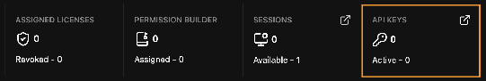

# 온프레미스 빠른 시작 가이드 (On-Premises Quick Start)

이 가이드는 완전한 온프레미스 배포 환경을 구축하는 가장 빠른 경로를 제공합니다. 사내 네트워크 내의 단일 [Admin Server](admin_server.md), [Admin Dashboard](admin_dashboard.md)에서 발급된 라이선스 좌석, 그리고 해당 서버를 통해서만 Griptape Cloud에 접근하는 데스크톱 애플리케이션으로 구성됩니다. 각 인스턴스는 `cloud.griptape.ai` 대신 Admin Server를 가리키므로 관리할 아웃바운드 송신 규칙 하나와 아웃바운드 트래픽 감사 지점 하나만 유지하면 됩니다.

인스턴스가 이미 `cloud.griptape.ai`에 직접 연결될 수 있고 사내 환경에서 이를 허용하는 경우 이 설정은 필요하지 않습니다.

1~4단계는 관리자가 한 번만 수행하며 5~7단계는 사용자별 배포 과정입니다.

## 시작하기 전에

다음 항목이 필요합니다:

- **Admin Server 바이너리**: 엔터프라이즈 고객에게 제공됩니다([Foundry에 문의](https://www.foundry.com/products/griptape/request-demo)).
- **배포 대상 조직을 소유한 Griptape Cloud 계정**: Admin Dashboard는 조직 소유자에게만 표시됩니다.
- **사내 네트워크 호스트**: `cloud.griptape.ai`로의 아웃바운드 HTTPS 통신이 허용되고 작업 스테이션이 수신 포트(기본값 `8080`)로 접근할 수 있는 호스트입니다. 다른 Griptape Nodes 인스턴스는 인터넷 접근이 필요하지 않습니다.
- **관리를 위한 인터넷 연결 머신**: Admin Dashboard는 Griptape Cloud와 직접 통신하므로 격리된 사내 머신에서는 사용할 수 없습니다 (1단계 참조).

## 1. Griptape Cloud API 키 생성

Admin Server를 시작하려면 **Griptape Cloud API 키**가 필요합니다. 이는 5단계에서 사용자에게 발급하는 **라이선스 키**와 다릅니다. API 키는 Admin Server 자체를 Griptape Cloud에 인증하며 한 번 생성되고 개별 좌석이 아닌 관리자 계정에 귀속됩니다.

이 키는 **Admin Dashboard**에서 발급받으므로 아직 아무것도 설치할 필요가 없습니다. 인터넷에 연결된 브라우저에서 웹 에디터에 로그인하세요. 데스크톱 앱을 이미 실행 중인 경우에도 동일하게 동작하며 두 환경 모두 같은 인터페이스를 사용합니다.

1. **Login or Sign-Up**으로 로그인합니다. 배포 대상 조직의 소유자여야 합니다.
1. **Admin Dashboard**를 엽니다:
    - **웹 에디터**: 좌측 하단 모서리의 사용자 메뉴. 대시보드가 에디터 화면을 대체하며 **Back to Editor**로 돌아갈 수 있습니다.
    - **데스크톱 앱**: 우측 상단 모서리의 프로필 메뉴. 대시보드가 별도 창으로 열립니다.
1. 대시보드가 **License Keys** 화면으로 열립니다. 아직 좌석을 발급하지 않으므로 라이선스 테이블을 건너뛰고 통계 표시줄의 **API Keys** 타일을 클릭합니다.
1. 키를 생성합니다. 값은 **단 한 번**만 표시되므로 즉시 복사하세요.



이 키는 일반 사용자 요청 경로에서 사용되지 않습니다. 운영자가 Griptape 조직을 소유하고 있음을 확인하는 용도로만 쓰이며, 사용자 애플리케이션은 자체 `Authorization` 헤더를 계속 전송하고 Admin Server는 이를 수정 없이 전달합니다.

## 2. Admin Server 설치

선택한 호스트에서 아카이브 압축을 풉니다. 다음 파일이 포함되어 있습니다:

- `server` — 실행 바이너리
- `config.example.yaml` — 복사하여 편집해 사용할 수 있는 템플릿
- `README` 및 `LICENSE`

## 3. Admin Server 구성

반드시 설정해야 하는 유일한 항목은 API 키 환경 변수입니다:

```bash
export GT_CLOUD_API_KEY="gt-..."
```

서버는 시작 시 키를 검증하며 키가 없으면 부팅되지 않습니다. 설정 파일에는 키를 읽어올 변수 이름만 지정하며 키 값 자체는 파일에 저장하지 않습니다.

설정 파일은 **선택 사항**입니다. `./server`를 설정 파일 없이 실행해도 정상 동작합니다. `config.yaml`이 없어도 오류가 아니며 서버는 기본값 및 환경 변수 오버라이드를 적용합니다. 기본값이 적합하다면 4단계로 이동하여 바로 시작할 수 있습니다.

!!! note "기본값을 신뢰하기 전에 버전을 확인하세요"

    `./server -version`을 실행하세요. 기본 설정만으로 안전하게 구동되는 것은 Admin Server 0.3.0 이상입니다. 이전 버전에서는 `read_timeout` 및 `write_timeout`이 `30s`로 기본 설정되어 스트리밍 응답이 중간에 끊길 수 있습니다. 자세한 설정은 [Admin Server: 구성](admin_server.md#구성-configuration)을 참조하세요.

설정을 변경하려면 템플릿을 복사하여 수정하세요:

```bash
cp config.example.yaml config.yaml
```

설정은 기본값 → 설정 파일 → 환경 변수 순으로 우선순위가 결정되며 환경 변수가 항상 최우선 적용됩니다.

파일에는 `server`, `upstream`, `logging`, `forwarding` 4개 블록이 있습니다. 키별 레퍼런스와 환경 변수 대응표는 [Admin Server: 구성](admin_server.md#구성-configuration)을 참조하세요.

## 4. 시작 및 검증

```bash
./server                      # 기본값 + 환경 변수 오버라이드
./server -config config.yaml  # 설정 파일을 생성한 경우
```

서버는 stdout 및 stderr에 로그를 출력합니다. 자체 로그 파일을 작성하지 않으므로 필요한 경우 스트림을 리다이렉션하거나 서비스 관리자(systemd 등)가 수집하도록 구성하세요.

서버가 정상 동작하는지 확인합니다:

```bash
curl http://<admin-server-address>:8080/health
# {"status":"ok"}
```

API 키가 누락되었거나 유효하지 않거나 업스트림에 접근할 수 없는 경우 서버는 이유를 로깅하고 서비스를 시작하지 않고 종료합니다. 구성 문제는 부팅 시 즉시 드러납니다.

## 5. 라이선스 키 발급

**Admin Dashboard**로 돌아가 **License Keys → + Create License Key**를 선택합니다:

- **License Name(s)**: 좌석당 하나의 이름. 여러 이름을 입력하여 한 번에 일괄 생성할 수 있습니다.
- **License Type**: 에디터를 사용하는 사람의 경우 `Interactive`, 자동화된 무인 환경의 경우 `Headless`. 생성 후에는 **변경할 수 없습니다**.
- **Expiration Date**: 필수 항목으로 1일에서 730일 사이로 지정합니다.
- **Access Groups**: 키를 해당 그룹에 즉시 추가할 수 있습니다.

각 토큰은 **단 한 번** 표시됩니다. 복사하여 사용자에게 전달하세요. 토큰을 분실한 경우 해당 라이선스에서 **Reissue**를 사용하여 새 토큰을 생성합니다.

라이선스 좌석이 사용할 수 있는 기능(라이브러리, 노드, 프로젝트, 모델)을 제한하려는 경우 사이드바의 해당 메뉴에서 **권한 템플릿(permission templates)**과 **액세스 그룹(access groups)**을 먼저 생성하세요. 키 생성 시 둘 다 바로 할당할 수 있어 사후 설정보다 편리합니다. Griptape에서 제공하는 읽기 전용 관리형 템플릿을 그대로 연결할 수도 있습니다. [Admin Dashboard: 권한 에디터](admin_dashboard.md#권한-에디터-permission-editor)를 참조하세요.

## 6. 워크스테이션에 Griptape Nodes 배포

각 사용자 머신에 **데스크톱 애플리케이션**을 설치합니다([설치](../installation.md) 참조).

여기서는 데스크톱 앱이 필수입니다. 웹 에디터는 클라우드 호스팅 기반이며 클라우드 릴레이를 통해 엔진에 도달하므로 온프레미스 경로가 아닙니다. 온프레미스 환경에서는 엔진과 직접 WebSocket으로 연결되는 데스크톱 앱을 실행합니다. 웹 에디터는 키 발급을 위한 관리자용 도구로 적합하지만 이 배포 환경에서 아티스트용 에디터로는 사용되지 않습니다.

이 머신들은 인터넷 접근이 **필요하지 않습니다**. Admin Server에만 접근할 수 있으면 됩니다.

각 사용자에게 다음 두 가지 정보를 전달하세요:

1. 발급된 라이선스 토큰.
2. Admin Server 주소 (예: `http://admin.internal.example.com:8080`).

## 7. 각 워크스테이션에서 활성화

1. 데스크톱 애플리케이션을 실행합니다.
1. 로그인 화면에서 로그인 대신 **Activate with a License**를 클릭합니다.
1. **License Key**에 토큰을 붙여넣습니다.
1. **Griptape Server Endpoint**에서 `https://cloud.griptape.ai`를 사내 Admin Server 주소로 변경합니다. 이 단계가 온프레미스 배포를 완성합니다.
1. **Activate License**를 클릭합니다.

엔드포인트와 라이선스는 모두 저장되어 기억됩니다. 이후 로그인 시 사용자는 **Saved licenses**에서 키를 선택할 수 있습니다. 화면 예시는 [Admin Server 사용하기](using_the_admin_server.md)를 참조하세요.

라이선스로 활성화한 사용자에게는 에디터만 제공됩니다. 활성화 시 클라우드 계정 없이 세션이 생성되므로 Admin Dashboard 메뉴는 표시되지 않습니다.

## 문제 해결

**Admin Dashboard 메뉴가 표시되지 않음**: 클라우드 계정 대신 라이선스 키로 로그인했거나 활성 조직이 소유한 조직이 아닙니다. **Login or Sign-Up**으로 로그인하고 조직 전환기를 확인하세요.

기타 문제(`502` 응답, `403 {"error":"path not permitted"}`, 시작 실패, 업로드 오류, 활성화 문제 등)는 다음 문서를 참조하세요:

- [Admin Server: 문제 해결](admin_server.md#문제-해결-troubleshooting) (운영자 측)
- [Admin Server 사용하기: 문제 해결](using_the_admin_server.md#문제-해결-troubleshooting) (사용자 활성화 측)

## 관련 문서

- [설치](../installation.md): Griptape Nodes 설치
- [Admin Server](admin_server.md): 구성, 환경 변수 및 문제 해결
- [Admin Dashboard](admin_dashboard.md): 라이선스 키, 액세스 그룹, 권한 템플릿
- [Admin Server 사용하기](using_the_admin_server.md): 최종 사용자 활성화 과정
- [아키텍처: 온프레미스 구성](../architecture.md#온프레미스-구성): Admin Server의 네트워크 위치
