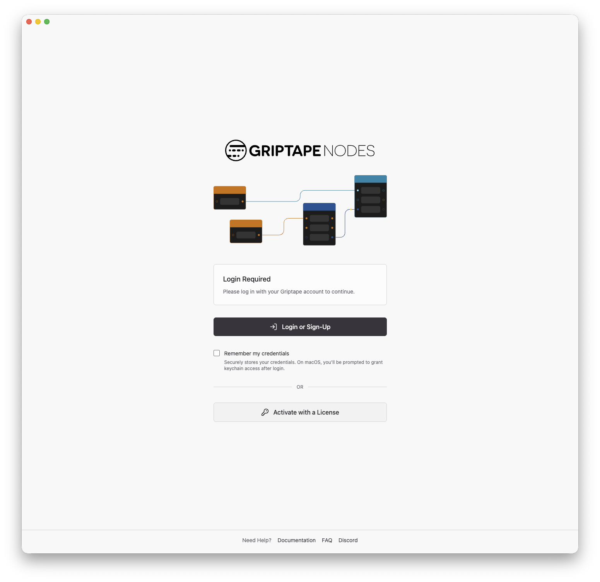
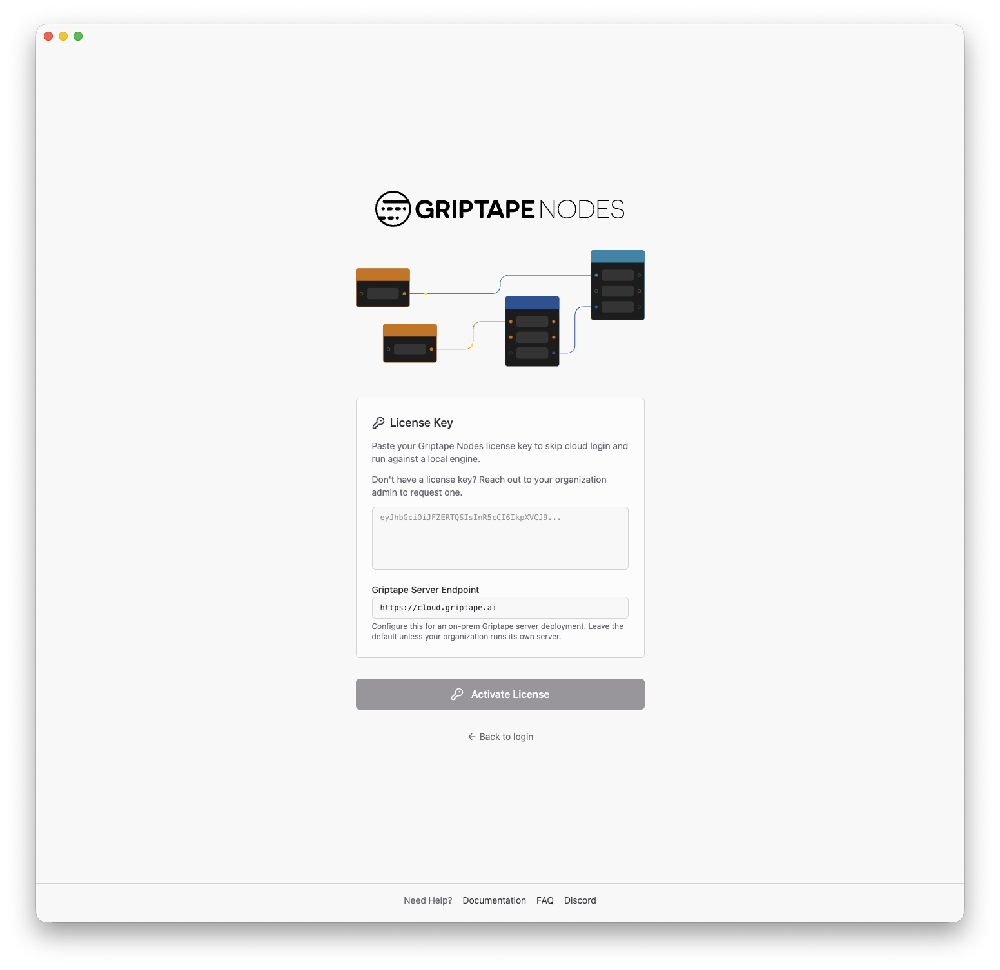
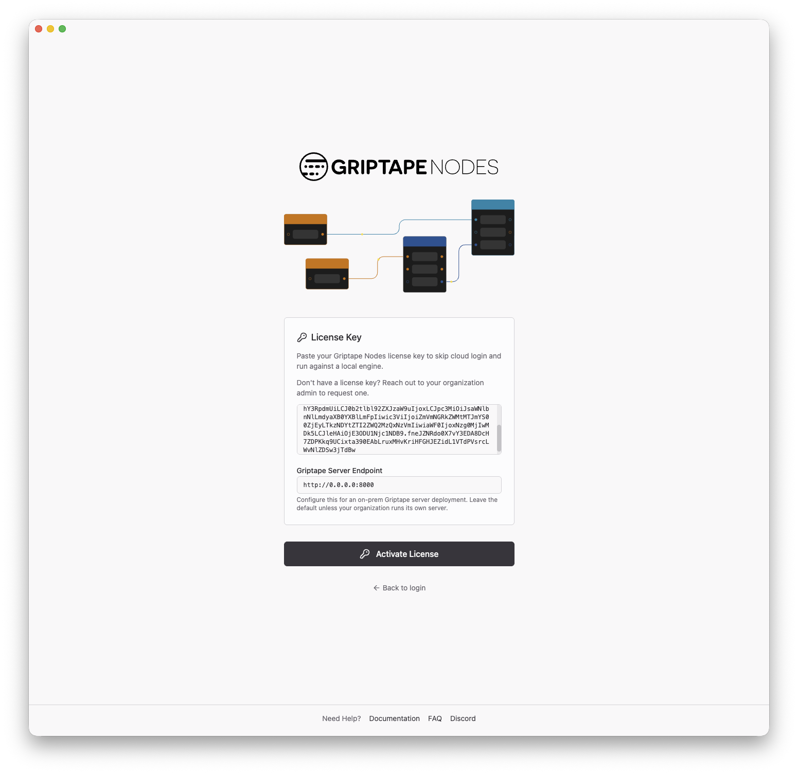

# Admin Server 사용하기

[Admin Server](admin_server.md)가 설정되어 실행되면 사용자는 Griptape Cloud에 로그인하는 대신 라이선스로 활성화하여 Griptape Nodes 데스크톱 애플리케이션에서 서버에 연결합니다. 이 페이지에서는 사용자 관점에서 해당 활성화 과정을 단계별로 설명합니다.

## 시작하기 전에

각 사용자에게 다음 항목이 필요합니다:

- 설치된 **Griptape Nodes 데스크톱 애플리케이션**.
- **라이선스 키(License key)**: 조직에 발급되며 사용자는 조직 관리자에게 요청해야 합니다.
- **Admin Server 주소**: 사내 네트워크에서 Admin Server에 접근할 수 있는 URL(예: `http://admin.internal.example.com:8080`). Admin Server 운영자가 이를 제공합니다.

## 라이선스로 활성화하기

### 1. 라이선스 양식 열기

데스크톱 애플리케이션을 실행합니다. 로그인 화면에서 Griptape Cloud로 로그인하는 대신 **Activate with a License**를 클릭합니다.



### 2. 라이선스 키 붙여넣기

**License Key** 필드에 조직 관리자로부터 받은 라이선스 키를 붙여넣습니다.



### 3. Admin Server 주소 지정하기

**Griptape Server Endpoint** 필드에서 기본 Griptape Cloud 주소(`https://cloud.griptape.ai`)를 사내 Admin Server 주소로 변경합니다:

```text
http://admin.internal.example.com:8080
```

이는 온프레미스 배포를 위한 핵심 단계입니다. 엔드포인트를 설정하면 애플리케이션이 공용 인터넷에 직접 접근하는 대신 모든 Griptape Cloud 트래픽을 사내 Admin Server를 통해 전송합니다.



### 4. 활성화 완료

**Activate License**를 클릭합니다. 애플리케이션이 라이선스를 검증하고 정상적으로 엔진을 실행하여 에디터 화면으로 이동합니다. 이 시점부터 라이선스 관리, 세션, 조직에서 허용한 모든 Cloud 기능이 사내 Admin Server를 통해 전달됩니다.

## 저장된 라이선스 재사용

이전에 활성화한 라이선스는 저장되어 기억됩니다. 로그아웃하거나 라이선스가 비활성화된 경우 **Activate with a License**를 클릭하면 로그인 화면에 **Saved licenses** 섹션이 표시됩니다. 저장된 라이선스 옆의 **Use**를 클릭하면 키를 다시 붙여넣지 않고도 재활성화할 수 있습니다. 구성된 서버 엔드포인트도 기억되므로 Admin Server 주소는 한 번만 입력하면 됩니다.

## 문제 해결 (Troubleshooting)

- **활성화가 즉시 실패함**: 라이선스 키가 완전히 붙여넣어졌는지, 만료되지 않았는지 확인하세요. 키가 올바르다면 **Griptape Server Endpoint**가 맞는지, 머신에서 해당 서버에 접근할 수 있는지 확인합니다. 브라우저에서 `http://<admin-server-address>/health`를 열어보세요. 정상적인 서버는 `{"status":"ok"}`로 응답합니다.
- **이전에는 활성화되었으나 지금은 실패함**: 라이선스가 만료되었을 수 있습니다. 조직 관리자에게 새 라이선스를 요청하세요.
- **활성화 후 일부 기능에서 오류 반환**: Admin Server가 [전송 규칙(forwarding rules)](admin_server.md#전송-규칙-forwarding-rules)으로 구성된 경우 허용되지 않은 경로는 `403 {"error":"path not permitted"}`로 거부됩니다. 해당 기능의 경로가 아웃바운드로 허용되어 있는지 Admin Server 운영자에게 문의하세요.
- **모든 요청에서 오류 반환**: 모든 요청이 실패하면 Admin Server 자체가 Griptape Cloud에 접근하지 못하고 있을 수 있습니다. 이는 운영자 측의 문제이므로 [Admin Server 문제 해결 섹션](admin_server.md#문제-해결-troubleshooting)을 참조하세요.
