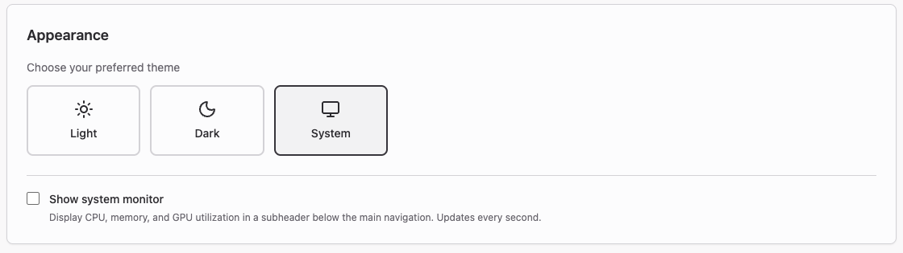
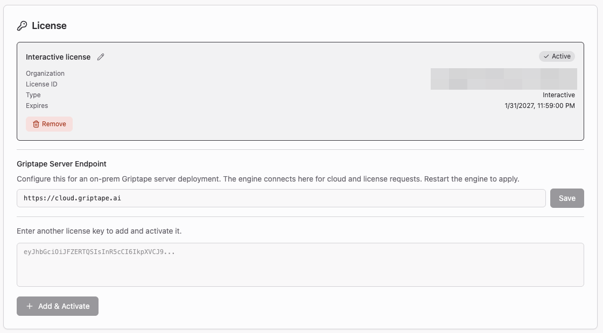
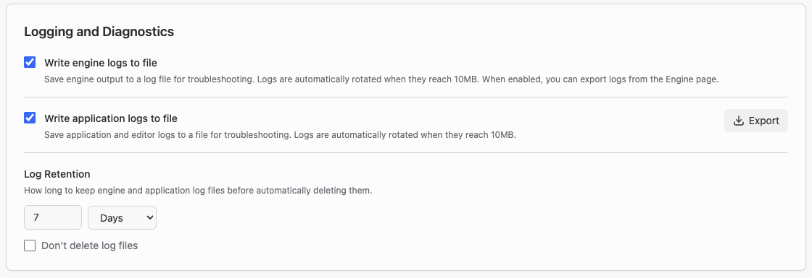
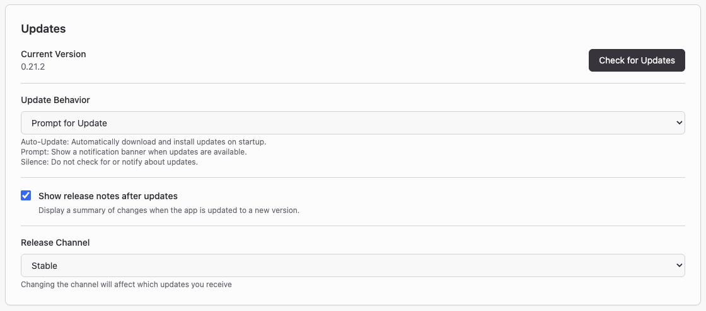
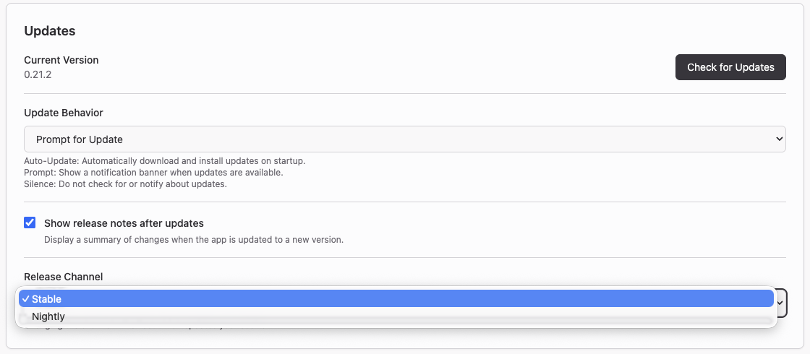
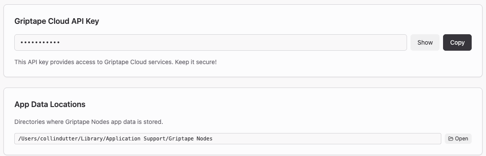
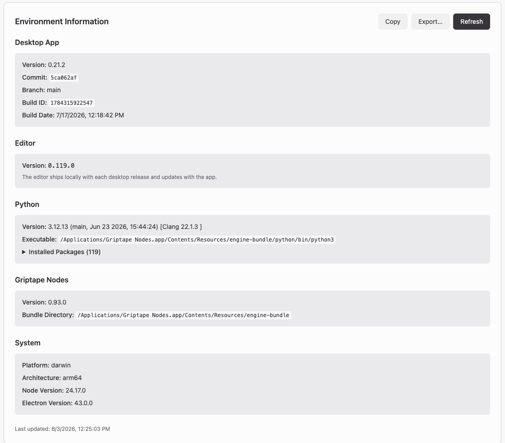

# 앱 설정 (App Settings)

Griptape Nodes Desktop에는 에디터의 **Settings** 메뉴에서 접근하는 엔진 및 에디터 설정과 별개로 자체 설정 화면이 있습니다. App Settings는 애플리케이션 자체가 제어하는 항목(종료 방법, 적용 테마, 엔진에 전달할 작업 공간, 라이선스, 로그 파일 및 앱 자체 업데이트 방식)을 다룹니다.

## 앱 설정 열기 (Opening App Settings)

창 오른쪽 상단에서 사용자 이름을 클릭한 다음 **App Settings**를 선택합니다. Griptape 계정으로 로그인하는 대신 라이선스 키로 활성화한 경우 버튼에 사용자 이름 대신 **Interactive license**(또는 사용자의 라이선스 유형)가 표시됩니다.

완료되면 왼쪽 상단의 **Back to editor**를 클릭합니다. 대부분의 변경 사항은 설정하는 즉시 저장됩니다. 그렇지 않은 부분은 아래에 별도로 설명되어 있습니다.

!!! note

    App Settings는 에디터의 **Settings** 메뉴와 다릅니다. 해당 메뉴는 엔진과 에디터를 구성하며(캔버스 테마, 자동 저장, API 키 및 비밀 정보, MCP 서버, 라이브러리 설정) [에디터 개요](../editor/index.md#settings-설정)에 문서화되어 있습니다. Griptape Nodes Desktop에만 App Settings가 있으며, 엔진을 직접 실행하고 브라우저에서 에디터를 사용하는 경우 [설정](../configuration.md)을 참조하세요.

## 일반 (General)

**Confirm before closing**은 앱을 종료할 때 확인 대화 상자를 표시합니다. 종료하면 엔진이 중지되어 실행 중인 모든 작업이 취소되므로 긴 워크플로우를 실행하는 경우 이 설정을 켜두는 것이 좋습니다.

## 모양 (Appearance)

**Theme**은 애플리케이션 크롬을 **Light**, **Dark** 또는 **System**(운영 체제 설정 따름)으로 설정합니다.

**Show system monitor**는 메인 내비게이션 아래에 1초마다 업데이트되는 실시간 CPU, 메모리 및 GPU 사용량 스트립을 추가합니다. 로컬 모델을 실행 중이고 리소스 여유가 있는지 확인하려는 경우 유용합니다.

## 작업 공간 및 라이브러리 (Workspace & Libraries)

**Workspace Directory**는 Griptape Nodes가 [프로젝트 파일](../../glossary.md#project-files)과 [생성된 에셋](../../glossary.md#generated-assets)을 저장하는 위치입니다. 다른 폴더를 선택하려면 **Browse**를 사용하세요. 이를 변경해도 기존 파일이 이동되지 않으므로 나중에 찾을 수 있는 폴더를 지정하세요. 엔진이 이를 사용하는 방법은 [작업 공간](../projects/workspace.md)을 참조하세요.

**Import existing configuration**은 사용자가 직접 설치하고 설정한 엔진의 Griptape Nodes 구성을 일반적인 위치에서 검색하는 **Import Configuration** 대화 상자를 엽니다. **Select configuration to import**에서 원하는 구성을 선택하면 앱이 작업 공간 디렉터리를 포함한 해당 설정을 적용하므로 다시 입력할 필요가 없습니다. 아무것도 나타나지 않으면 **Browse for config file** 또는 **Scan home directory**를 사용하세요.

**Additional Libraries**는 기본 제공 라이브러리와 함께 선택적 노드 라이브러리를 설치합니다:

- **Install Griptape Nodes Diffusers Library** — Diffusers를 사용한 미디어 생성. 고성능 머신이 필요하며 일부 모델은 CUDA가 지원되는 NVIDIA GPU가 필요합니다.
- **Install Griptape Cloud Library** — Griptape Cloud 서비스용 노드.

둘 다 나중에 **Manage → Library Management**에서도 설치할 수 있습니다. [라이브러리](../libraries.md)를 참조하세요.

이 섹션의 항목은 **Apply Changes**를 클릭할 때까지 적용되지 않으며, 클릭 시 엔진이 중지되고 재구성된 후 다시 시작됩니다. 먼저 워크플로우를 저장하세요.

## 엔진 (Engine)

!!! note

    이 섹션은 앱을 직접 엔진 모드로 전환하는 라이선스 키로 활성화한 경우에만 나타납니다. Griptape 계정으로 로그인한 경우에는 표시되지 않으며 엔진 재시작 및 관리는 Engine 페이지에서 수행됩니다.

**Direct Engine WebSocket URL**은 로컬 엔진이 바인딩하고 앱이 엔진과 직접 통신할 때 접속하는 주소입니다. 기본값인 `ws://127.0.0.1:18125`는 로컬 머신에서만 접근할 수 있는 루프백 소켓입니다. 엔진이 다른 위치에서 수신 대기하는 경우에만 변경한 후 엔진을 재시작하여 적용하세요.

## 라이선스 (License)

조직에서 라이선스 키로 Griptape Nodes를 실행하는 경우 이 섹션에서 관리합니다. 활성화된 각 라이선스는 조직, 라이선스 ID, 유형, 만료 날짜가 표시된 카드로 나타나며 현재 사용 중인 라이선스에는 **Active** 배지가 표시됩니다. 연필 아이콘을 사용하여 더 알기 쉬운 이름을 지정하거나 **Remove**를 클릭하여 이 머신에서 비활성화할 수 있습니다. 다른 라이선스를 활성 라이선스로 변경하면 엔진이 재시작됩니다.

**Griptape Server Endpoint**는 클라우드 및 라이선스 요청을 위해 기본값인 `https://cloud.griptape.ai` 대신 온프레미스 Griptape 서버를 가리키도록 설정합니다. 변경 후 엔진을 재시작하세요.

다른 키를 추가하려면 상자에 붙여넣고 **Add & Activate**를 클릭합니다.

전체 활성화 단계는 [Admin Server 사용하기](../../enterprise/using_the_admin_server.md)를 참조하세요. 키를 발급하는 관리자는 [Admin Dashboard](../../enterprise/admin_dashboard.md)를 참조하세요.

## 로깅 및 진단 (Logging and Diagnostics)

보고하려는 문제를 재현하기 전에 이 옵션들을 켜세요.

- **Write engine logs to file** — 엔진 출력을 로그 파일에 저장합니다. 파일은 10MB 단위로 순환(rotate)됩니다. 이 기능을 켜면 Engine 페이지에서 엔진 로그를 내보낼 수도 있습니다.
- **Write application logs to file** — 애플리케이션 및 에디터 로그를 저장하며 마찬가지로 10MB 단위로 순환됩니다. **Export**는 현재 세션을 원하는지 특정 시간 범위를 원하는지 묻고 버그 보고서에 첨부할 수 있는 파일로 로그를 출력합니다.
- **Log Retention** — 로그 파일을 자동으로 삭제하기 전까지 보관하는 기간입니다. 숫자와 단위(**Days**, **Months**, **Years**)를 선택하세요. 기본값은 7일입니다. 영구 보관하려면 **Don't delete log files**를 선택하세요.

로그를 확보한 후 확인해야 할 사항은 [문제 해결](../../troubleshooting.md)을 참조하세요.

## 업데이트 (Updates)

**Current Version**은 실행 중인 앱 버전이며, **Check for Updates**는 다음 실행을 기다리지 않고 지금 바로 최신 버전을 확인합니다.

**Update Behavior**는 업데이트 발견 시 수행할 작업을 제어합니다:

| 설정 | 동작 |
| ---- | ---- |
| **Auto-Update** | 시작 시 업데이트를 자동으로 다운로드하고 설치합니다. |
| **Prompt for Update** | 업데이트가 있을 때 알림 배너를 표시합니다. 기본값입니다. |
| **Silence Updates** | 자동 업데이트 확인 및 알림을 건너뜁니다. 여전히 **Check for Updates**를 수동으로 실행할 수 있습니다. |

**Show release notes after updates**는 앱이 자체 업데이트된 후 변경 사항 요약을 표시합니다.

!!! note "조직에 의해 업데이트가 비활성화됨"

    이 메시지는 관리자가 [머신 레벨 정책 파일](../../enterprise/disabling_app_updates.md)을 사용하여 앱 업데이트를 비활성화했음을 의미합니다. **Check for Updates**, **Update Behavior**, **Release Channel**을 사용할 수 없습니다. **Show release notes after updates**는 계속 사용할 수 있습니다.

### 릴리스 채널 (Release channels)

**Release Channel**은 앱이 업데이트할 빌드를 선택합니다.

| 채널 | 제공 내용 |
| ---- | --------- |
| **Stable** | 검증된 릴리스. 기본값이며 Nightly를 사용할 특별한 이유가 없는 한 권장되는 설정입니다. |
| **Nightly** | 매일 발행되는 새로운 빌드로, 시험판 엔진 및 에디터 빌드가 앱과 함께 번들링되어 제공됩니다. 버전은 `0.22.0-nightly.20260611.123`과 같은 형식입니다. |

Nightly 빌드는 하루에 한 번 발행되며 가장 최근의 14개만 유지되므로 2주 이상 방치된 nightly 설치는 다음 업데이트 시 여러 버전을 한 번에 건너뛰게 됩니다.

!!! warning

    Nightly 빌드는 검증된 릴리스가 아니라 최신 개발 작업에서 생성됩니다. 버그, 미완성된 기능, 롤백될 수 있는 변경 사항이 포함될 수 있습니다. 프로덕션 작업에 Nightly를 사용하지 마시고, 실행하는 경우 워크플로우를 자주 저장하세요.

채널 전환은 다음 업데이트 확인 시 적용됩니다(앱을 다음에 실행할 때, 백그라운드에서 몇 시간마다 실행되는 확인 시, 또는 **Check for Updates**를 클릭하는 즉시). 다시 설치할 필요가 없으며 안정화 버전 번호가 사용 중이던 nightly 버전보다 낮더라도 **Stable**로 다시 전환할 수 있습니다. 작업 공간, 워크플로우 및 설정은 어느 쪽이든 영향을 받지 않습니다.

앱을 사용하는 대신 엔진을 직접 설치한 경우 해당하는 방식은 [FAQ](../../faq.md#출시-전-기능unreleased-features을-미리-테스트해보려면-어떻게-해야-하나요)에 설명된 시험판 엔진 채널입니다.

## Griptape Cloud API Key

앱이 사용자를 위해 프로비저닝한 API 키로, 기본적으로 숨겨져 있습니다. **Show**를 클릭하면 표시되고 **Copy**를 클릭하면 클립보드에 복사됩니다. 수동으로 설치된 엔진이나 스크립트에서 동일한 키를 사용하려는 경우 유용합니다. 비밀번호처럼 안전하게 다루세요. 이 섹션은 앱에 키가 있는 경우에만 표시되므로 로그인하는 대신 라이선스 키로 활성화한 경우에는 표시되지 않습니다.

## 앱 데이터 위치 (App Data Locations)

작업 공간과 별도로 앱이 자체 데이터를 보관하는 디렉터리입니다. **Open**을 클릭하면 Finder, 탐색기 또는 파일 관리자에서 폴더가 열립니다. 로그 파일은 여기에 포함되지 않으므로 [로깅 및 진단](#로깅-및-진단-logging-and-diagnostics) 또는 엔진 로그의 경우 Engine 페이지에서 내보내세요.

## 환경 정보 (Environment Information)

실행 중인 항목의 정확한 스냅샷입니다: 앱 버전 및 빌드, 번들링된 에디터 버전, Python 인터프리터 및 설치된 패키지, Griptape Nodes 엔진 버전 및 번들 디렉터리, 플랫폼 세부 정보. **Refresh**는 정보를 다시 읽습니다.

**Copy**는 전체 보고서를 클립보드에 복사하고 **Export...**는 파일로 저장합니다. 버그 보고서를 제출할 때 둘 중 하나를 첨부하세요.
