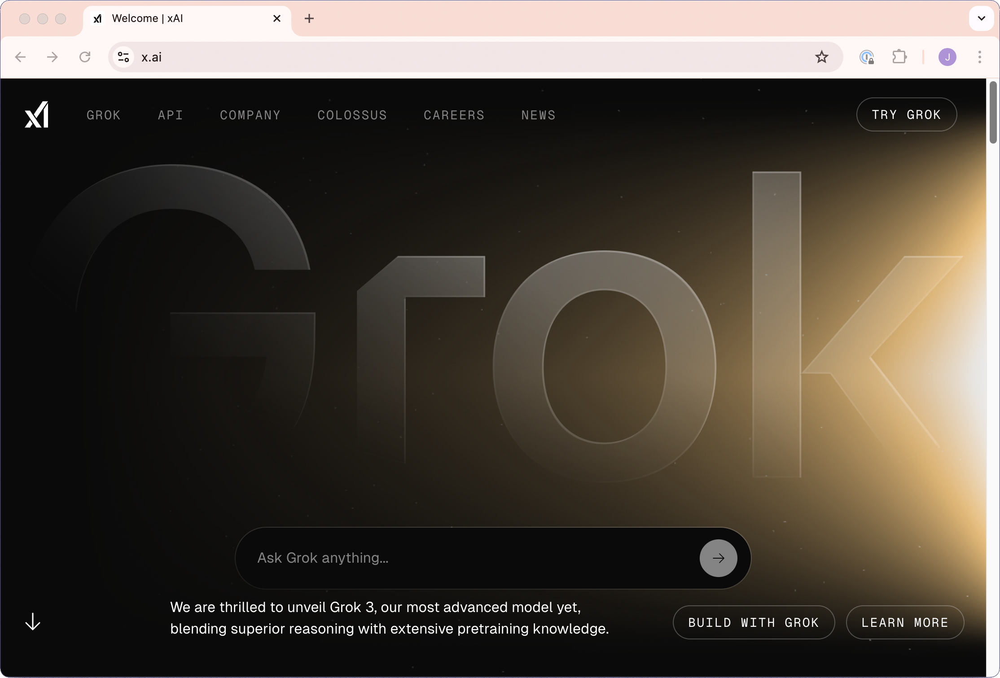
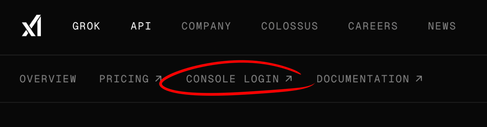
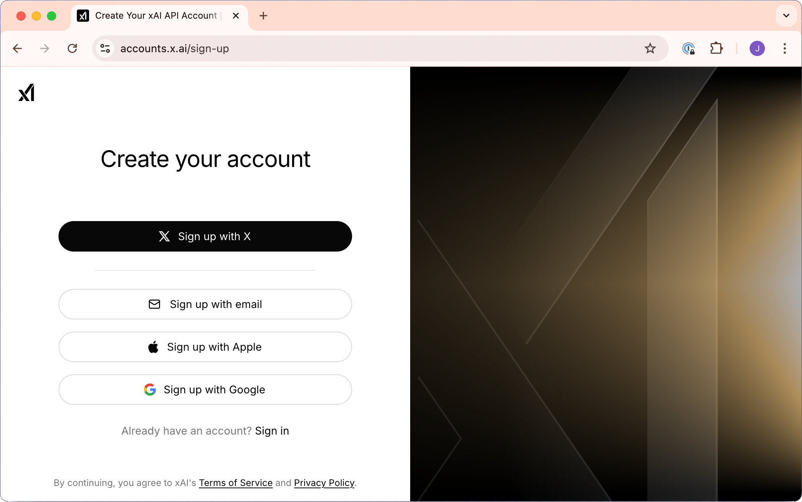
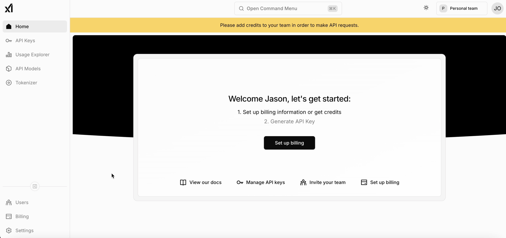
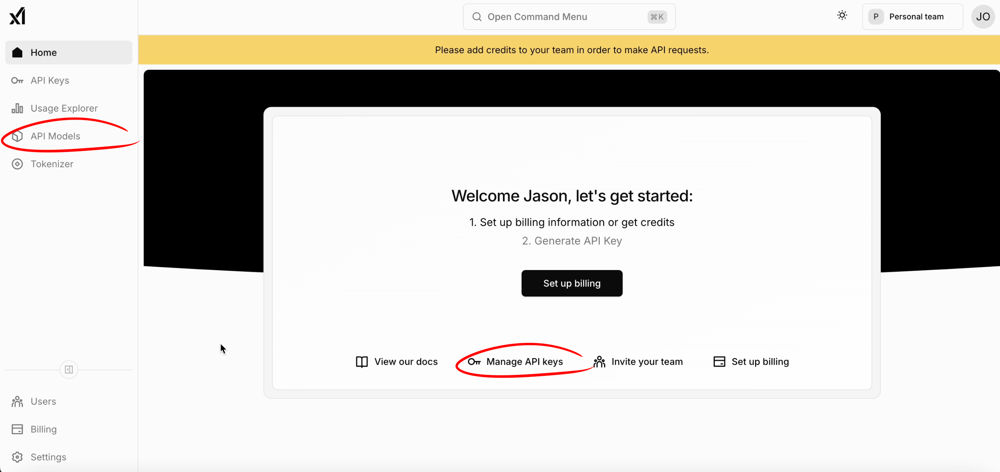
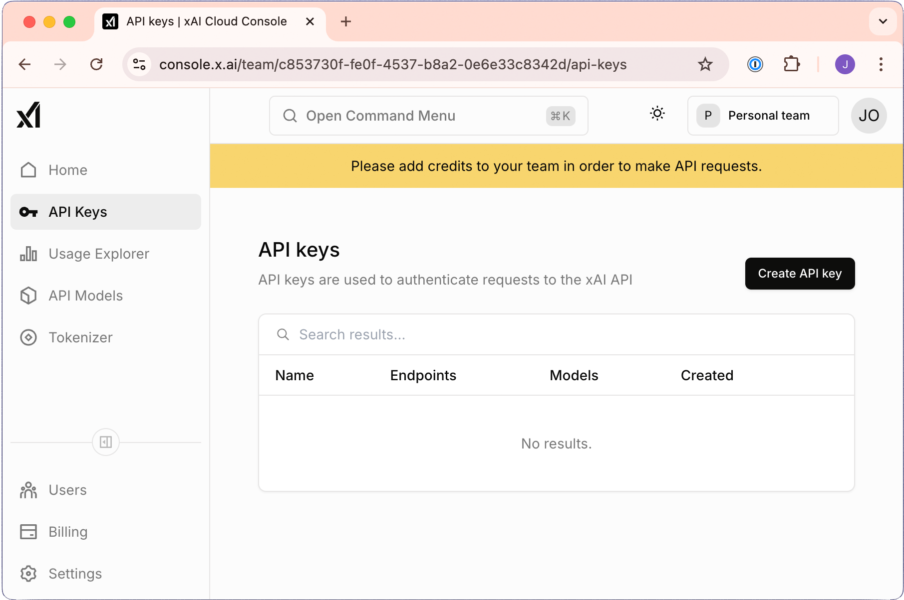
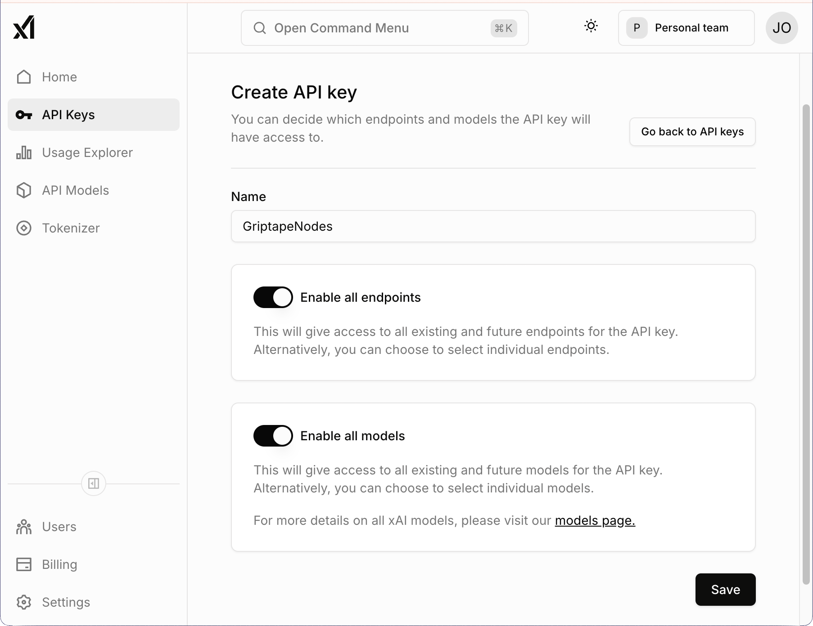
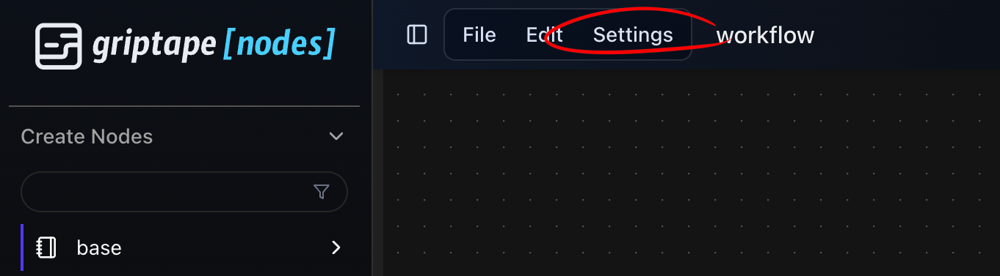
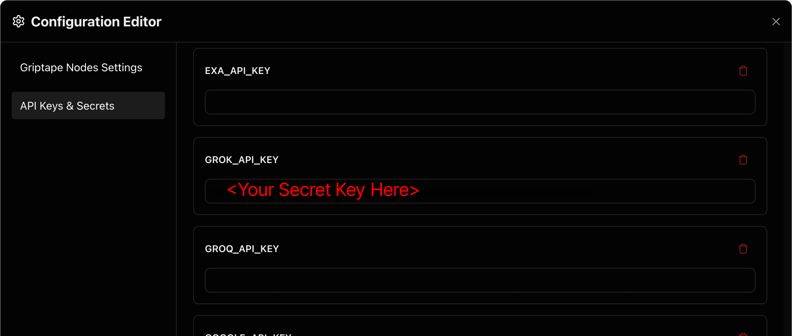

# xAI Grok API 키 발급 및 사용 방법

Grok은 xAI에서 개발한 대형 언어 모델(LLM) 제품군입니다. GrokPrompt 구성 노드를 통해 이러한 모델에 접근할 수 있습니다. 하지만 이를 사용하려면 xAI 계정이 있어야 하고 API 키를 생성해야 합니다. xAI는 유료 서비스이며 이를 이용하려면 웹사이트에서 결제 정보를 설정해야 한다는 점에 유의하세요.

## 계정 및 API 키 생성 (Account and API Key Creation)

xAI 계정용 API 키를 받으려면 먼저 xAI 계정이 *필요*합니다. 시작하려면 [https://x.ai](https://x.ai) 로 이동하세요.

    

!!! info

    이미 계정이 있는 경우 [2단계](#2-결제-정보-설정-set-up-billing)로 바로 이동하세요.

### 1. xAI 계정 생성

1. 콘솔 로그인 옵션을 클릭하거나 [https://accounts.x.ai/sign-up](https://accounts.x.ai/sign-up) 으로 이동합니다.

    

    
    

1. 가입 절차를 완료합니다. 매우 간단하게 진행할 수 있습니다.

    

    
    

### 2. 결제 정보 설정 (Set Up Billing)

!!! warning "결제 정보 등록 필수"

    Griptape Nodes에서 xAI 모델을 사용하기 전에, xAI는 결제 정보 등록을 *필수*로 요구한다는 점에 유의하세요. 이 단계를 완료하지 않으면 노드에서 모델을 사용할 수 없습니다.

    결제 설정을 완료하지 않고 xAI를 사용하는 노드를 실행하려고 하면 서비스에서 계정 자격 증명을 거부하므로 워크플로우가 실패합니다.

    

### 3. API 키 생성 (Generate an API Key)

1. API 키 섹션으로 이동합니다. 이동할 수 있는 여러 링크가 있습니다.

    

    
    

1. "Create API Key"를 클릭합니다.

    

    
    

1. API 키의 이름을 지정합니다(추천 이름: GriptapeNodes!).

    

    
    

1. **Save**를 클릭합니다.

1. API 키를 복사하여 안전하게 보관합니다.

    !!! danger "보안 유의사항"

        토큰을 쉽게 찾을 수 있으면서도 안전하게 유지할 수 있도록 비밀번호 관리자나 보안 메모 앱에 저장하는 것이 좋습니다.

        액세스 토큰은 xAI 서비스에 대한 요청에 사용되는 개인 식별자입니다. 절대 타인과 공유하지 마시고 스크린샷, 비디오 또는 화면 공유 세션 중에 노출되지 않도록 주의하세요.

        신용카드 번호처럼 안전하게 취급하세요.

## Griptape Nodes 설정에 API 키 추가 (Add Your API Key to Griptape Nodes Settings)

!!! info "개요"

    이제 xAI 계정을 설정했으므로 API 키를 사용하도록 Griptape Nodes를 구성해야 합니다. 이 과정은 간단합니다.

### 1. Griptape Nodes 설정 메뉴 열기

1. Griptape Nodes를 실행합니다.

1. 상단 메뉴 바(File 및 Edit 바로 오른쪽)에 있는 **Settings** 메뉴를 찾습니다.

1. **Settings**를 클릭하여 구성 옵션을 엽니다.

    

    
    

### 2. API Keys & Secrets에 xAI API 키 추가

1. 환경설정 에디터(Configuration Editor)의 왼쪽에서 **API Keys and Secrets**를 클릭합니다.
1. 아래로 스크롤하여 **GROK_API_KEY** 필드를 찾습니다.
1. 방금 생성한 API 키를 이 필드에 붙여넣습니다.
1. 환경설정 에디터를 닫으면 설정이 자동으로 저장됩니다.

    

!!! success "설정 완료"

    이 단계를 완료하면 자체 Grok.ai 계정 자격 증명을 통해 모델을 사용할 수 있습니다.
