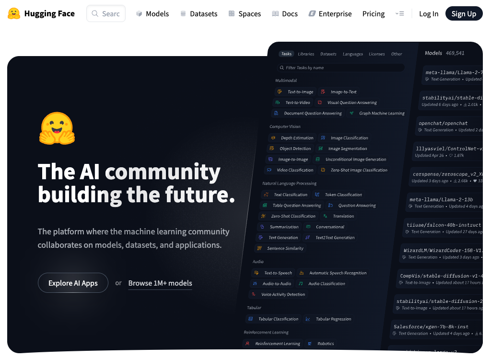
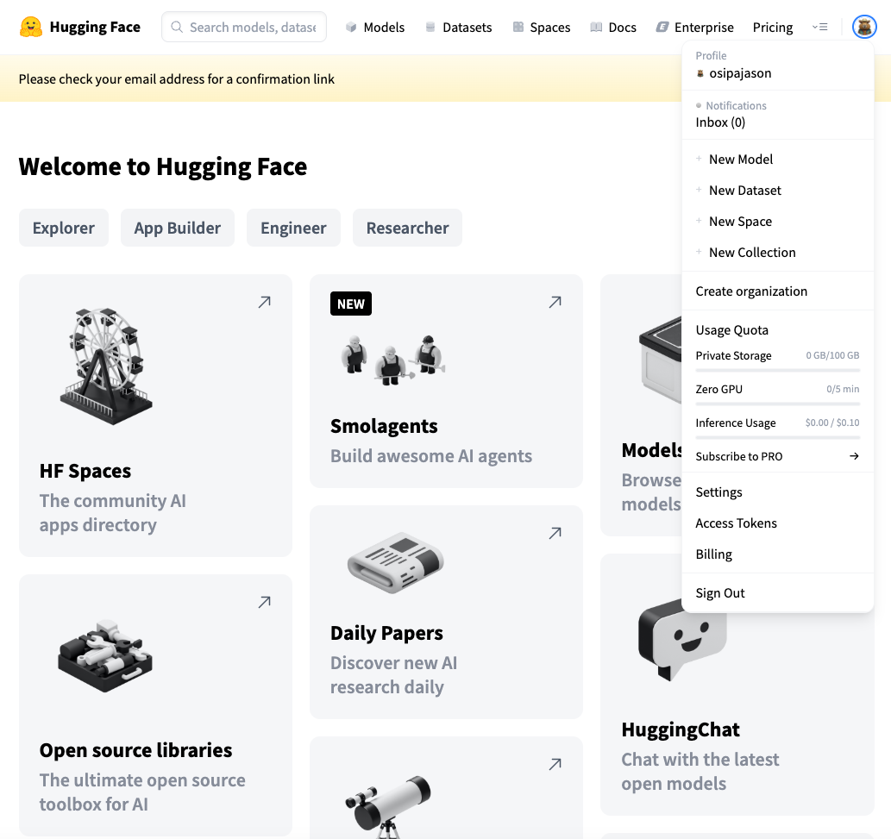
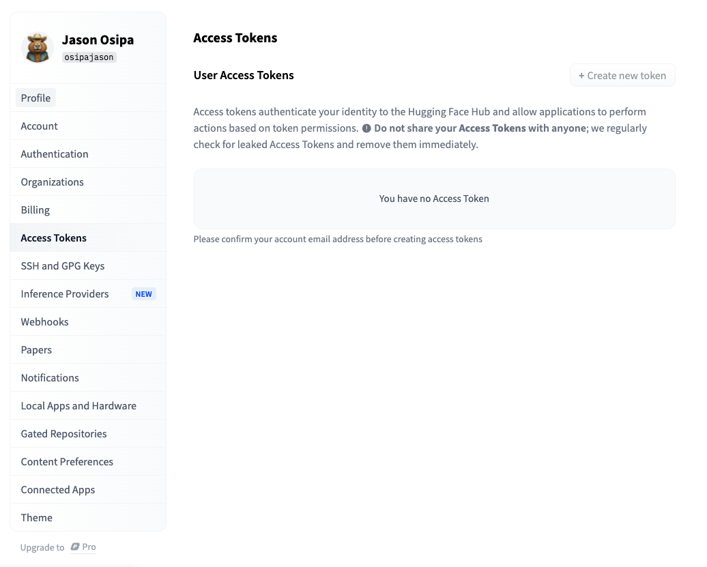
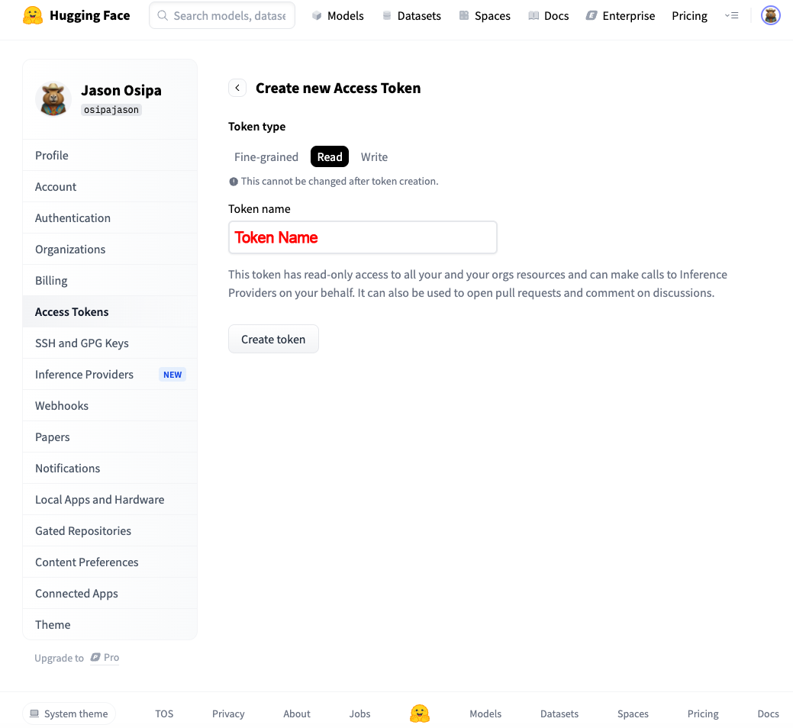
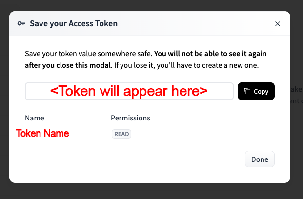
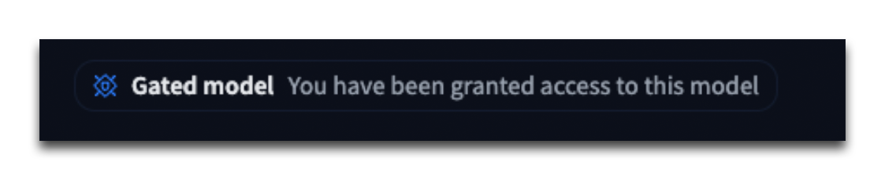
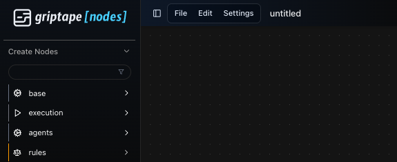
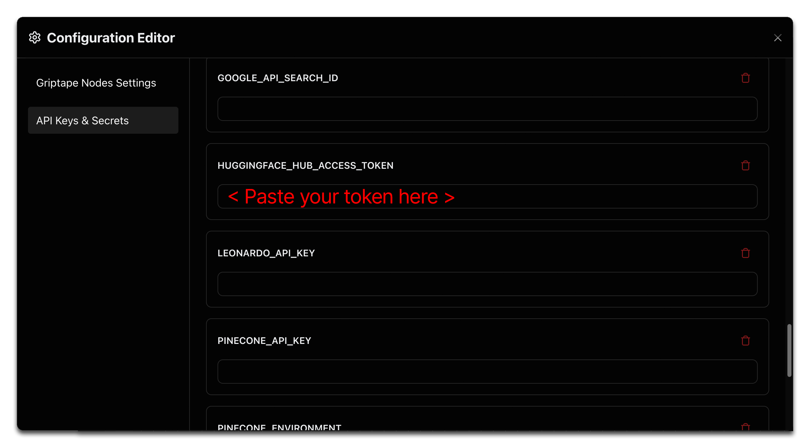

# Hugging Face를 사용하는 노드 설정 (Setup for Nodes that use Hugging Face)

## 계정 및 토큰 생성 (Account and Token Creation)

이 가이드에서는 Hugging Face 계정을 설정하고 액세스 토큰을 생성하며 Griptape Nodes와 함께 사용하는 데 필요한 모델을 설치하는 과정을 안내합니다.

!!! info

    이미 계정이 있는 경우 [2단계](#2-액세스-토큰-생성-create-an-access-token)로 바로 이동하세요.

### 1. Hugging Face에서 새 계정 생성

1. [https://huggingface.co/](https://huggingface.co/) 로 이동합니다.
1. 우측 상단의 **Sign Up**을 클릭합니다.
1. 로봇이 아님을 증명하는 인증 단계를 완료합니다.

<p align="center">
    
</p>

<p align="center">
    
</p>

### 2. 액세스 토큰 생성 (Create an Access Token)

1. 계정 설정에 접근합니다.

1. Hugging Face 계정에 로그인합니다.

1. 우측 상단의 프로필 아이콘을 클릭합니다.

1. 드롭다운 메뉴에서 **Settings**를 선택합니다(또는 [Settings](https://huggingface.co/settings/profile/)로 직접 이동).

    <p align="center">
    
    </p>

!!! warning "이메일 인증 필수"

    토큰 생성 중 문제가 발생하면 이메일 주소를 인증했는지 확인하세요. 계속 진행하기 전에 인증 절차를 완료해야 합니다.

1. 설정 메뉴에서 **Access Tokens**로 이동합니다.

<p align="center">
  
</p>

1. 우측 상단 영역에서 **Create new token**을 클릭합니다.

1. 필요한 접근 권한 유형으로 **Read**를 선택합니다.

<p align="center">
  
</p>

1. 토큰에 설명이 포함된 이름(예: GriptapeNodes)을 지정합니다.
1. **Create Token**을 클릭합니다. 새 토큰이 포함된 창이 나타납니다. 표시된 메시지를 주의 깊게 확인하세요. 이 키를 확인하거나 복사할 수 있는 유일한 기회입니다.

<p align="center">
  
</p>

1. 토큰을 복사하여 안전하게 보관합니다.
1. **Done**을 클릭하여 토큰 창을 닫습니다.

!!! danger "보안 유의사항"

    토큰을 쉽게 찾을 수 있으면서도 안전하게 유지할 수 있도록 비밀번호 관리자나 보안 메모 앱에 저장하는 것이 좋습니다.

    액세스 토큰은 Hugging Face 서비스에 대한 요청에 사용되는 개인 식별자입니다. 절대 타인과 공유하지 마시고 스크린샷, 비디오 또는 화면 공유 세션 중에 노출되지 않도록 주의하세요.

    신용카드 번호처럼 안전하게 취급하세요.

## 필수 파일 설치 (Install Required Files)

이제 계정에 연결된 토큰이 있으므로 명령줄에서 Hugging Face와 상호 작용할 수 있는 Hugging Face CLI(명령줄 인터페이스)를 설치할 수 있습니다.

### 1. Hugging Face CLI 설치

터미널을 열고 다음 명령을 실행합니다:

```bash
pip install -U "huggingface_hub[cli]"
```

자세한 내용은 [공식 CLI 문서](https://huggingface.co/docs/huggingface_hub/main/en/guides/cli)를 참조하세요.

### 2. 토큰으로 로그인

터미널에서 앞서 생성한 액세스 토큰으로 인증합니다:

```bash
huggingface-cli login
```

토큰을 입력하라는 메시지가 표시됩니다.

### 3. 필요에 따라 모델 설치 (Install Models as Required)

각 Hugging Face 노드는 특정 모델과 함께 작동하도록 설계되었습니다. 일부 노드는 하나의 모델에서만 작동하지만 다른 노드는 여러 옵션과 호환됩니다. 아래 표는 각 노드에서 사용할 수 있는 모델을 보여줍니다:

| 노드 (Node) | 호환 모델 (Compatible Model(s)) |
| ----------- | ------------------------------- |
| SPAN Upscale | 4x-ClearRealityV1.pth |
| Flux | FLUX.1-dev, FLUX.1-schnell |
| Flux Post Upscale | FLUX.1-dev, FLUX.1-schnell |

## 모델 설치 고려 사항 (Model Installation Considerations)

모델 설치에는 두 가지 옵션이 있습니다. 선택은 특정 워크플로우 요구 사항, 사용 가능한 디스크 공간 및 인터넷 연결 속도에 따라 달라집니다.

1. **선택적 설치 (Selective Installation)**: 사용할 계획인 노드에 필요한 특정 모델만 설치합니다.

    - **장점**: 다운로드 시간 및 디스크 공간 사용량 절약.
    - **단점**: 추가 모델을 설치할 때까지 기능이 제한됨.

1. **전체 설치 (Complete Installation)**: 사용 가능한 모든 모델을 다운로드합니다.

    - **장점**: 추가 다운로드 없이 모든 노드 기능을 완전하게 사용 가능.
    - **단점**: 초기 다운로드 시간이 더 길고 더 많은 디스크 공간이 필요함.

!!! note "다운로드 시간"

    이러한 모델 다운로드는 용량이 상당히 크며 인터넷 연결 속도에 따라 완료하는 데 30분에서 몇 시간까지 걸릴 수 있습니다. 다운로드가 진행되는 동안 마지막 단계로 이동할 수 있습니다.

!!! info "다운로드 위치"

    모델은 Hugging Face Hub 캐시 디렉터리에 다운로드됩니다. 위치를 확인하려면 huggingface-cli를 사용하여 HF_HUB_CACHE를 찾을 수 있습니다.

    터미널에서 다음 명령을 실행하면 여러 항목이 포함된 목록이 출력됩니다:

    ```
    huggingface-cli env
    ```

    `- HF_HUB_CACHE:`로 시작하는 항목을 찾으세요:

    ```
    - HF_HUB_CACHE: /Users/jason/.cache/huggingface/hub
    ```

#### SPAN Upscale 용

```bash
huggingface-cli download skbhadra/ClearRealityV1 4x-ClearRealityV1.pth
```

#### Flux 및 Flux Post Upscale 용

```bash
huggingface-cli download black-forest-labs/FLUX.1-schnell
```

#### FLUX.1-dev 용

```bash
huggingface-cli download black-forest-labs/FLUX.1-dev
```

!!! warning "다운로드 오류"

    다운로드 중에 다음과 같이 시작되는 오류가 발생할 수 있습니다:

    ```
    Cannot access gated repo for url https://huggingface.co...
    ```

    이러한 오류의 끝부분에는 접근 권한을 요청하는 안내 링크가 포함되어 있습니다.

    해당 지침을 따르세요:

    [https://huggingface.co/black-forest-labs/FLUX.1-schnell](https://huggingface.co/black-forest-labs/FLUX.1-schnell) 을 방문하여 접근 권한을 요청합니다. 요청이 성공하면 접근 권한이 부여되었다는 메시지가 표시되며 다시 다운로드를 시도할 수 있습니다.

    <p align="center">
      
    </p>

## Griptape Nodes 설정에 토큰 추가 (Add Your Token to Griptape Nodes settings)

!!! info "개요"

    이제 Hugging Face 계정을 설정하고 필요한 모델을 설치했으므로 토큰을 사용하도록 Griptape Nodes를 구성해야 합니다. 이 과정은 간단합니다.

### 1. Griptape Nodes 설정 메뉴 열기

1. Griptape Nodes를 실행합니다.
1. 상단 메뉴 바(File 및 Edit 바로 오른쪽)에 있는 **Settings** 메뉴를 찾습니다.
1. **Settings**를 클릭하여 구성 옵션을 엽니다.

<p align="center">
  
</p>

### 2. API Keys & Secrets에 Hugging Face 토큰 추가

1. 환경설정 에디터(Configuration Editor)의 왼쪽 하단에서 **API Keys and Secrets**를 찾습니다.
1. 클릭하여 이 섹션을 펼칩니다.
1. 아래로 스크롤하여 **HUGGINGFACE_HUB_ACCESS_TOKEN** 필드를 찾습니다.
1. 앞서 생성한 토큰을 이 필드에 붙여넣습니다.
1. 환경설정 에디터를 닫으면 설정이 자동으로 저장됩니다.

<p align="center">
  
</p>

!!! success "설정 완료"

    이 단계를 완료하면 Griptape Nodes에서 Hugging Face 노드를 사용할 준비가 완료됩니다!
