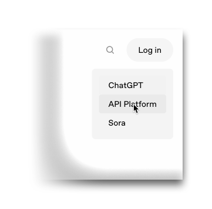
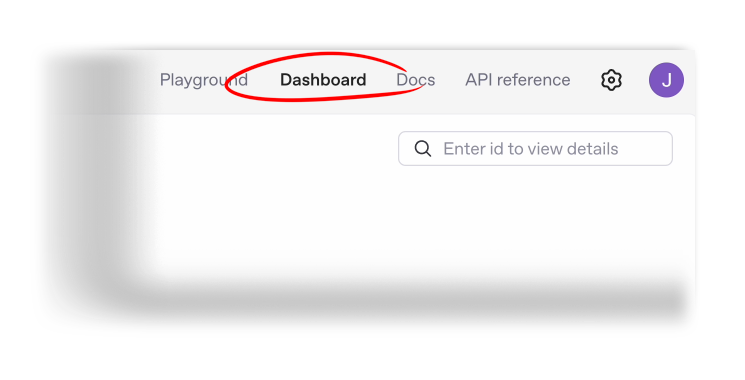
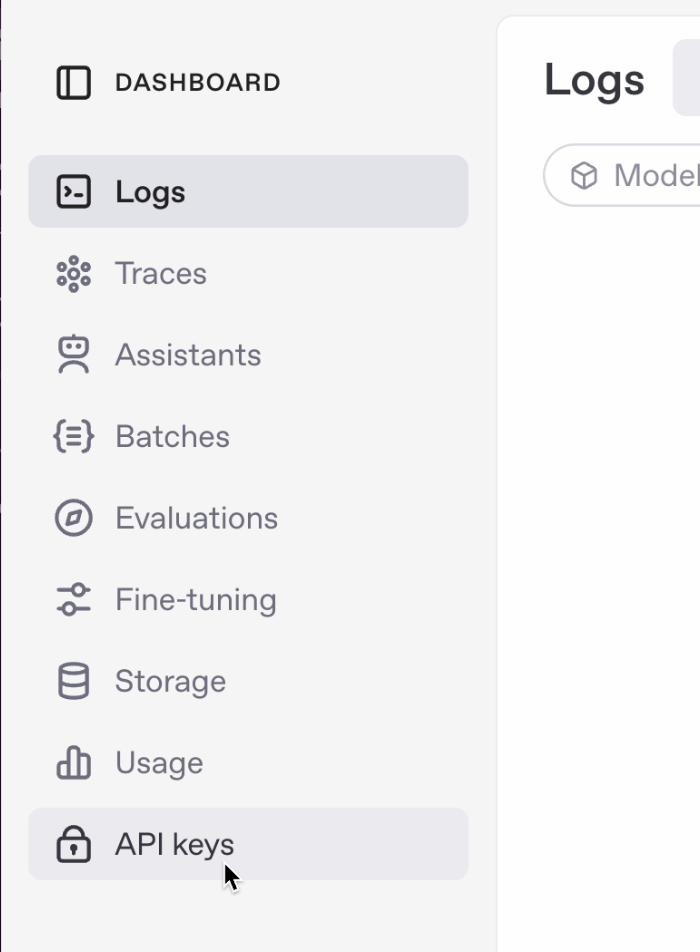
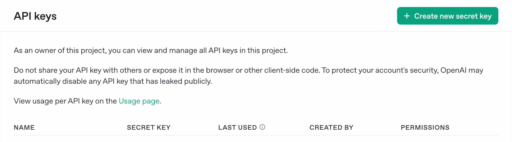
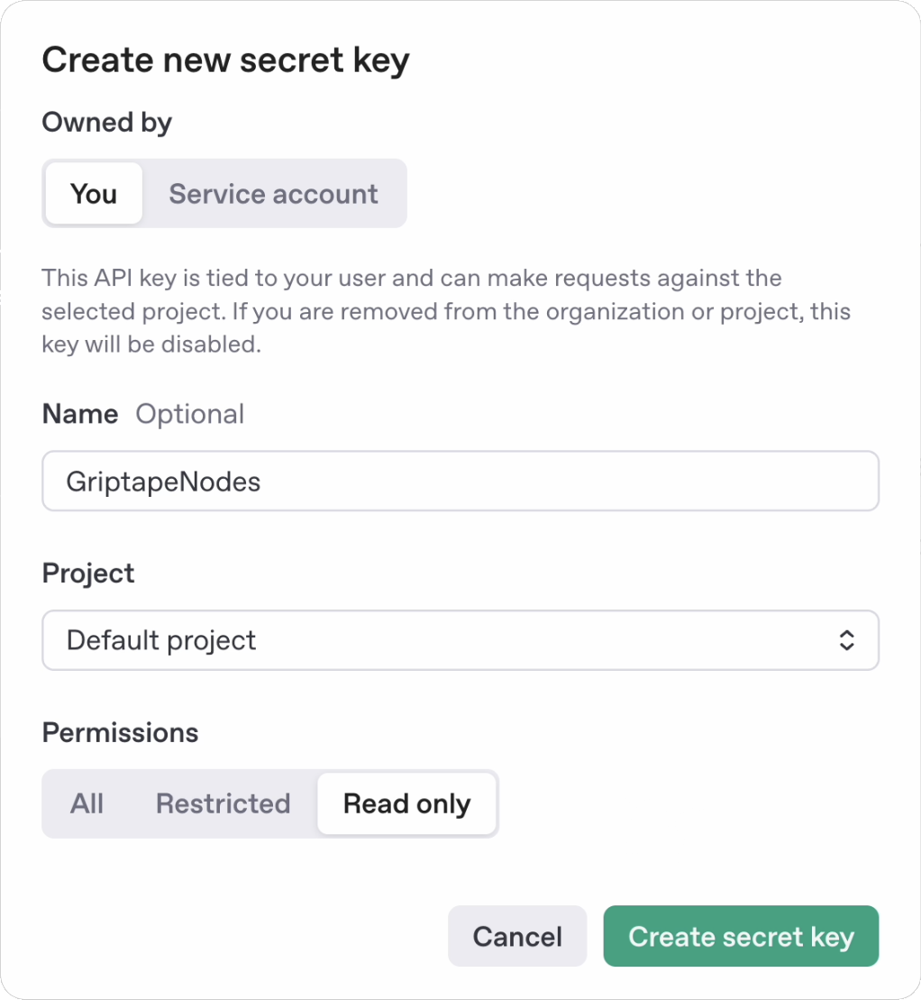
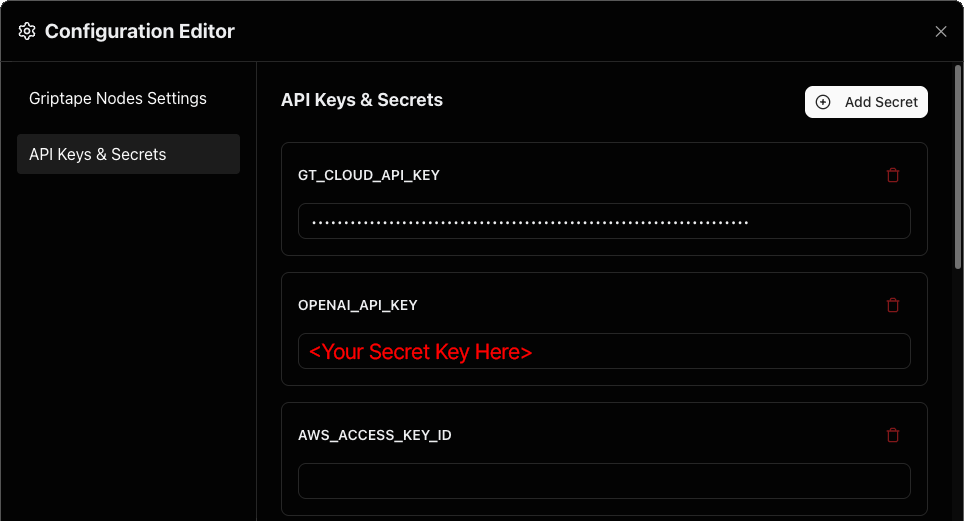

# OpenAI API 키 발급 및 사용 방법

Griptape Nodes는 기본적으로 Griptape Cloud 계정과 해당 키를 통해 OpenAI 모델에 쉽게 접근할 수 있도록 제공하지만(설치 중에 자동으로 처리됨), 자체 OpenAI 계정에 직접 연결할 수도 있습니다. 이를 통해 사용량, 설정 및 권한을 완전히 직접 제어할 수 있습니다. 이를 원하는 경우 OpenAI API 키를 발급받는 것이 첫 번째 단계입니다.

## 계정 및 API 키 생성 (Account and API Key Creation)

OpenAI 계정용 API 키를 받으려면 먼저 OpenAI 계정이 필요합니다. 시작하려면 [https://openai.com](https://openai.com) 으로 이동하세요.

    

!!! info

    이미 계정이 있는 경우 [2단계](#2-api-키-생성-create-an-api-key)로 바로 이동하세요.

### 1. OpenAI 계정 생성

1. Log In으로 이동(어떤 옵션을 선택하든 동일한 계정이 생성됨)한 후 "sign up"을 선택하거나 [https://auth.openai.com/create-account](https://auth.openai.com/create-account) 로 직접 이동합니다.

1. 가입 절차를 완료합니다.

    Platform" width="300"/>

### 2. API 키 생성 (Create an API Key)

1. 아직 접속하지 않은 경우 [https://openai.com/](https://openai.com/) 으로 돌아가 우측 상단의 **Log In** 버튼에서 **API Platform** 옵션을 선택합니다.

1. "Dashboard" 영역으로 이동합니다. 로그인 후 페이지 상단 근처에서 찾을 수 있습니다.

    

1. **API Keys** 섹션으로 이동합니다. 대시보드를 연 후 왼쪽에서 찾을 수 있습니다.

    

    
    

    !!! warning "계정 인증 필수"

        키 생성 중 문제가 발생하면 웹사이트 안내에 따른 계정 생성 과정의 일부였던 계정 **인증(verified)**을 완료했는지 확인하세요. 계속 진행하기 전에 인증 절차를 완료해야 합니다.

    그러면 우측 상단에 다음과 같은 화면이 나타납니다:

    

    
    

1. **Create New Secret Key**를 클릭하면 다음과 같은 모달이 표시됩니다:

    

    
    

1. 키 권한을 "Read-Only"로 설정합니다(다른 옵션을 살펴보셔도 되며, 여기서는 빠른 진행을 위해 권장되는 설정입니다).

1. **Create Secret Key**를 클릭합니다. 새 API 키가 포함된 창이 나타납니다. 표시된 메시지를 주의 깊게 확인하세요. 이 키를 확인하거나 복사할 수 있는 유일한 기회입니다.

1. API 키를 복사하여 안전하게 보관합니다.

    !!! danger "보안 유의사항"

        토큰을 쉽게 찾을 수 있으면서도 안전하게 유지할 수 있도록 비밀번호 관리자나 보안 메모 앱에 저장하는 것이 좋습니다.

        액세스 토큰은 OpenAI 서비스에 대한 요청에 사용되는 개인 식별자입니다. 절대 타인과 공유하지 마시고 스크린샷, 비디오 또는 화면 공유 세션 중에 노출되지 않도록 주의하세요.

        신용카드 번호처럼 안전하게 취급하세요.

1. **Done**을 클릭하여 키 창을 닫습니다.

## Griptape Nodes 설정에 비밀 키 추가 (Add Your Secret Key to Griptape Nodes Settings)

!!! info "개요"

    이제 OpenAI 계정을 설정했으므로 비밀 키를 사용하도록 Griptape Nodes를 구성해야 합니다. 이 과정은 간단합니다.

### 1. Griptape Nodes 설정 메뉴 열기

1. Griptape Nodes를 실행합니다.

1. 상단 메뉴 바(File 및 Edit 바로 오른쪽)에 있는 **Settings** 메뉴를 찾습니다.

1. **Settings**를 클릭하여 구성 옵션을 엽니다.

    

    
    

### 2. API Keys & Secrets에 OpenAI 비밀 키 추가

1. 환경설정 에디터(Configuration Editor)의 왼쪽에서 **API Keys and Secrets**를 클릭합니다.
1. 아래로 스크롤하여 **OPENAI_API_KEY** 필드를 찾습니다.
1. 방금 생성한 비밀 키를 이 필드에 붙여넣습니다.
1. 환경설정 에디터를 닫으면 설정이 자동으로 저장됩니다.

    

!!! success "설정 완료"

    이 단계를 완료하면 자체 계정 자격 증명을 통해 모델을 사용할 수 있습니다.
