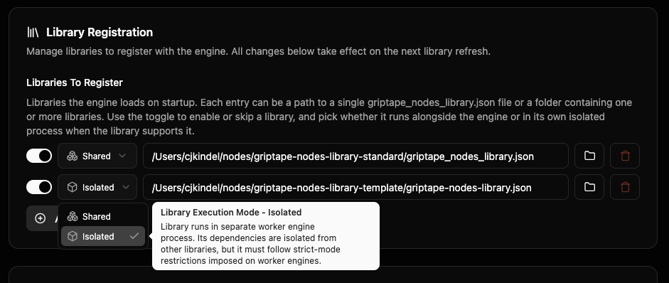

# 라이브러리 (Libraries)

**라이브러리(library)**는 에디터에서 사용할 수 있는 노드들의 모음 번들입니다. 일부는 엔진과 함께 제공되며, 일부는 Git URL에서 설치하고, 일부는 직접 작성할 수도 있습니다. 이 페이지는 라이브러리를 직접 개발하는 개발자가 아닌, 라이브러리를 설치하고 사용하는 아티스트를 위한 문서입니다. (라이브러리 개발자라면 [커스텀 노드 가이드](../development/custom_nodes/index.md) 및 [워커를 통한 노드 격리](../development/custom_nodes/node_isolation_with_workers.md)를 참조하세요.)

두 라이브러리가 충돌할까 걱정된다면 [공존 보장](#공존-보장-coexistence-guarantees) 섹션으로 이동하세요. 요약하자면 두 라이브러리의 Python 의존성은 서로 영향을 주지 않지만, 동일한 노드 이름을 가진 두 라이브러리는 모호할 수 있으며 엔진이 이에 대해 알려줍니다.

## 시작 시 제공되는 라이브러리 (What you start with)

엔진은 전체 라이브러리를 작성하지 않고도 자체 커스텀 노드를 신속하게 개발할 수 있는 스크래치패드 라이브러리인 **샌드박스 라이브러리(Sandbox Library)**를 지원합니다. 이는 설정하기 전까지는 존재하지 않습니다. **Settings → Library → Sandbox Settings**에서 **Sandbox Library Directory**를 디스크에 존재하는 폴더로 지정하세요. 설정이 완료되면 엔진이 해당 디렉터리에서 `.py` 노드 파일을 가져오며, 에디터의 Sandbox 카테고리에 표시되는 내용은 해당 디렉터리에 실제로 존재하는 파일에 따라 달라집니다.

`gtn init`을 실행하는 동안 **Advanced Media Library**(디퓨전, 이미지 생성, 비디오)를 추가할 것인지 묻는 메시지가 표시됩니다. 이때 등록하거나 나중에 `gtn init`을 다시 실행하여 추가할 수 있습니다. 해당 경로는 [FAQ](../faq.md#초기-설정-후-advanced-media-library를-설치하려면-어떻게-해야-하나요)를 참조하세요.

기타 라이브러리(퍼스트 파티 또는 커뮤니티 라이브러리)는 에디터를 통해 직접 설치합니다.

## 라이브러리 설치하기 (에디터 내)

에디터의 **Libraries** 패널이 기본 설치 인터페이스입니다. 헤더의 **Manage** 메뉴 → **Library Management**에서 엽니다.

**Add Library**(우측 상단)를 클릭하여 **Add Library** 모달을 엽니다. Git URL(예: 커뮤니티 라이브러리를 호스팅하는 GitHub 리포지토리)을 붙여넣고 **Install**을 클릭합니다. 에디터가 리포지토리를 클론하고 라이브러리의 `griptape_nodes_library.json` 매니페스트를 읽고 의존성을 설치한 후 등록합니다. 모달의 **Advanced Options**를 사용하면 리포지토리 기본값 대신 특정 브랜치, 태그 또는 커밋을 선택할 수 있습니다.

무엇을 설치해야 할지 잘 모르겠다면 모달 하단의 **Browse Community Libraries** 버튼을 클릭하여 설치 가능한 엄선된 라이브러리 목록을 확인하세요.

성공적으로 설치되면 새 라이브러리가 패널의 라이브러리 목록에 표시됩니다. 각 항목에는 다음이 표시됩니다:

- 라이브러리 이름 및 버전.
- 제공하는 노드의 수.
- 파일 관리자에서 라이브러리 디렉터리를 여는 **Open** 동작.
- 라이브러리의 Git 원격(remote), 참조(ref, 브랜치 또는 태그), 현재 커밋을 보여주는 **Advanced** 펼침 메뉴. 버그를 보고해야 하는 경우 여기에 표시된 커밋이 인용할 정확한 버전입니다.

상단의 칩을 사용하여 목록을 **All**, **Updates**, **Errors**별로 필터링할 수 있습니다. **Errors**는 라이브러리 중 하나에 문제가 발생했을 때 가장 먼저 확인해야 하는 위치로, 설치 실패, 의존성 설치 실패, 로드 시간 실패를 함께 표시합니다.

## 라이브러리 업데이트

동일한 **Libraries** 패널에서 필터 칩 옆의 아이콘 버튼을 사용하여 다음을 수행할 수 있습니다:

- **Check for updates** — 설치된 모든 라이브러리에서 새 버전을 검색합니다. 업데이트가 있는 모든 항목은 **Updates** 필터 아래에 나타납니다.
- **Refresh** — 라이브러리 목록을 다시 읽습니다(방금 무언가를 설치하고 제대로 적용되었는지 확인하려는 경우 유용함).

상시 업데이트 확인을 위해 **Configuration Editor → Libraries**에서 엔진이 자체적으로 라이브러리 업데이트를 얼마나 적극적으로 확인할지 제어할 수 있습니다.

**Update Notifications** 옵션:

- **Enable sidebar notifications** — 업데이트가 있을 때 Libraries 탭과 라이브러리별 버튼에 배지를 표시합니다.
- **Notification color / animation** — 배지의 시각적 스타일.
- **Check on startup** — 엔진이 로드될 때마다 업데이트를 검색합니다.
- **Check periodically** — 반복 일정 (Never, Hourly 등).
- **Check Now** — 즉시 검색을 트리거합니다.

이러한 항목을 반드시 구성할 필요는 없으며 대부분의 아티스트에게 기본값으로 충분합니다.

## 라이브러리 토글 및 제거

동일한 **Configuration Editor → Libraries** 뷰에는 **Library Registration → Libraries To Register**도 표시됩니다. 해당 목록의 각 항목은 엔진이 시작 시 로드하는 라이브러리입니다. 항목당 3개의 컨트롤이 있습니다:

- 토글 (왼쪽) — 디스크에 라이브러리를 유지하되 엔진 시작 시 로드를 중지하려면 끕니다.
- **Shared / Isolated** 드롭다운 (가운데) — 라이브러리가 실행될 위치를 선택합니다(아래 참조).
- 휴지통 아이콘 (오른쪽) — 항목을 완전히 제거합니다. 디스크의 클론은 그대로 유지되므로 디스크 공간을 확보하려면 해당 디렉터리를 수동으로 삭제하세요.

### 공유 모드 vs 격리 모드 (Shared vs. Isolated)

드롭다운을 통해 라이브러리가 실행되는 프로세스를 선택합니다:

- **Shared** — 라이브러리가 다른 공유 라이브러리와 함께 기본 엔진 프로세스 내부에서 실행됩니다.
- **Isolated** — 라이브러리가 별도의 독립된 프로세스에서 실행되므로 Python 의존성이 다른 모든 라이브러리와 분리되며, 라이브러리 내부에서 충돌이 발생해도 엔진의 나머지 부분이 중단되지 않습니다.

드롭다운에는 엔진이 실제로 사용할 모드가 표시됩니다. 여기서 오버라이드하지 않는 한 라이브러리 작성자가 제안한 모드가 사용됩니다. 격리하려는 무거운 라이브러리에는 **Isolated**를 선택하고, 프로세스 내에 유지하려면 **Shared**를 선택하세요. 일부 라이브러리는 작성자에 의해 격리와 호환되지 않는 것으로 표시되어 있으며, 이러한 라이브러리의 경우 드롭다운이 **Shared로 고정**됩니다.

드롭다운은 엔진 버전이 이를 지원하는 경우(0.86.0 이상)에만 나타납니다. 변경 사항은 다음 라이브러리 새로고침 시 적용됩니다.

아래의 **Add Library** 버튼을 사용하면 이미 디스크에 있는 `griptape_nodes_library.json`(수동으로 클론한 라이브러리 또는 로컬에서 개발 중인 라이브러리)을 엔진에 지정할 수 있습니다.

## 공존 보장 (Coexistence guarantees)

두 라이브러리를 나란히 설치하는 목적은 서로에게 영향을 주지 않도록 하는 것입니다. 이를 보장하기 위해 세 가지 레이어가 작동합니다:

### Python 의존성 격리

등록된 모든 라이브러리는 고유한 **가상 환경(virtual environment)**을 갖습니다. 이는 엔진 자체 패키지나 다른 라이브러리와 상태를 공유하지 않는 격리된 Python 패키지 세트입니다. 라이브러리 A는 `torch==2.4.1`을 고정할 수 있고 라이브러리 B는 `torch==2.0.0`을 고정할 수 있습니다. 둘 다 별도의 `.venv` 디렉터리에 설치되며 각 라이브러리는 해당 노드가 실행될 때 자체 가상 환경을 사용합니다.

이는 라이브러리가 **Shared**로 실행되든 **Isolated**로 실행되든 동일하게 유지됩니다([프로세스 격리](#프로세스-격리-isolated-모드) 참조). 어느 방식이든 `.venv`는 디스크의 라이브러리 매니페스트 옆에 위치합니다. 유일한 차이점은 해당 패키지를 로드하는 프로세스입니다(Shared 라이브러리의 경우 기본 엔진 프로세스, Isolated 라이브러리의 경우 라이브러리 자체 프로세스). 아티스트의 관점에서 의존성 격리는 동일합니다.

**pip 버전 충돌 없이 호환되지 않는 버전이 고정된 라이브러리들을 함께 설치할 수 있습니다.** 이것이 이 페이지에서 가장 중요한 보장 사항입니다.

### 프로세스 격리: Isolated 모드

라이브러리를 **Isolated**(엔진의 기본 프로세스 내부가 아닌 전용 프로세스)로 실행하면 다음과 같은 이점이 있습니다:

- **내결함성(Fault tolerance):** 라이브러리가 충돌하더라도 해당 라이브러리만 중단되고 엔진의 나머지 부분은 계속 실행됩니다.
- **리소스 격리:** 라이브러리가 메모리에 로드하는 모든 항목(모델 가중치, GPU 메모리, 백그라운드 스레드)은 라이브러리 자체 프로세스에 상주하며 다른 라이브러리의 성능을 저하시킬 수 없습니다.

무거운 ML 라이브러리(디퓨전, 트랜스포머, 커스텀 CUDA 스택)가 가장 큰 이점을 얻으며, 가벼운 라이브러리(단순 HTTP / 데이터 노드)는 일반적으로 Shared로 문제없이 실행됩니다. [라이브러리 토글 및 제거](#공유-모드-vs-격리-모드-shared-vs-isolated)에서 설명한 **Shared / Isolated** 드롭다운을 사용하여 라이브러리별로 이를 제어할 수 있습니다. 라이브러리 작성자가 제안된 시작 모드와 라이브러리가 Isolated로 실행될 수 있는지 여부를 설정하며, 드롭다운 선택 항목은 이를 허용하는 모든 라이브러리에 대해 작성자의 제안을 오버라이드합니다.

라이브러리 작성자는 `griptape_nodes_library.json`에서 격리 호환성 및 제안된 모드를 선언합니다(`worker_mode_compatibility` 및 `suggested_worker_mode` 선언). 스키마에 대한 자세한 내용은 [워커를 통한 노드 격리](../development/custom_nodes/node_isolation_with_workers.md)를 참조하세요. 아티스트에게는 Shared / Isolated 드롭다운이 필요한 유일한 인터페이스입니다.

### 노드 이름 충돌: 해결되지 않음

두 라이브러리가 동일한 이름의 노드 클래스를 등록하는 경우(예: 둘 다 `MyImageNode`를 제공함), 엔진은 둘 다 수락합니다. **엔진은 설치 시 경고를 표시하지 않습니다.** 해당 노드를 생성할 때:

- 워크플로우에서 라이브러리를 명시적으로 지정하면 정상 작동합니다.
- 그렇지 않은 경우 엔진은 모호성을 해결할 수 있도록 두 라이브러리를 나열하는 오류를 발생시킵니다.

이것은 엔진이 사용자를 대신해 해결해주지 않는 유일한 공존 관련 문제입니다. 충돌이 의심되는 경우 가장 안전한 해결책은 원하지 않는 라이브러리를 **Libraries To Register** 목록에서 제거하는 것입니다.

## 문제 해결 (When something goes wrong)

### "라이브러리를 설치했지만 해당 노드가 보이지 않습니다"

**Libraries** 패널을 열고 필터를 **Errors**로 전환합니다. 이는 설치 실패, 의존성 설치 실패 또는 로드 실패가 발생한 모든 라이브러리의 통합 뷰입니다. 특정 오류 메시지를 보려면 해당 라이브러리를 클릭하세요.

일반적인 원인:

- 라이브러리가 사용자의 Python 버전 또는 플랫폼용으로 존재하지 않는 휠(wheel, 사전 빌드된 Python 패키지)을 고정함(예: 지원되지 않는 CUDA 버전용 `torch` 휠).
- 네트워크에서 설치를 차단함(회사 프록시 또는 설치 단계 중 인터넷 연결 없음).
- 디스크 공간 부족(엔진이 이를 명시적으로 보고함).

근본적인 문제를 해결한 다음 설치를 다시 트리거하세요(**Add Library** 모달에서 URL을 다시 붙여넣거나 아래 CLI 대안에서 `--overwrite` 사용).

### "에디터에서 노드가 깨졌거나 빨간색으로 표시됩니다"

엔진이 해당 노드를 생성할 수 없었음을 의미하며, 대개 라이브러리 로드에 실패했기 때문입니다. 워크플로우 파일이 손상되지 않도록 에디터가 플레이스홀더로 교체합니다. **Libraries** 패널의 **Errors** 필터에서 근본적인 로드 오류를 확인하세요. 문제를 해결한 후 워크플로우를 다시 열면 실제 노드가 다시 사용됩니다.

### 원시 오류 텍스트 확인하기

엔진이 실행 중인 터미널 창(엔진을 실행한 창)에는 스택 추적을 포함한 자세한 오류 로그가 표시됩니다. Isolated 모드로 실행 중인 라이브러리의 오류는 `Worker-<id>` 접두사와 함께 나타납니다.

## CLI 대안

자동화, 헤드리스 엔진 또는 개인적 선호로 인해 명령줄을 사용하려는 경우 에디터의 라이브러리 동작에 해당하는 `gtn` 명령어가 있습니다:

| 에디터 동작 | CLI 명령어 |
| ----------- | ---------- |
| Add Library → Install | `gtn libraries download <git_url>` |
| Check for updates → install pending | `gtn libraries sync` |
| Sync over local edits | `gtn libraries sync --overwrite` |
| Advanced Media Library 재등록 | `gtn init`, `y` 응답 |

전체 레퍼런스는 [명령줄 인터페이스](../reference/command_line_interface.md)를 참조하세요.

## 디스크의 라이브러리 저장 위치

- **구성(Config)**: `~/.config/griptape_nodes/griptape_nodes_config.json`(또는 플랫폼에 해당하는 파일 — [엔진 설정](configuration.md) 참조). 내부의 `app_events.on_app_initialization_complete.libraries_to_register` 목록이 에디터의 Libraries To Register 목록이 편집하는 대상입니다.
- **클론 / 가상 환경(venvs)**: 에디터가 라이브러리를 클론한 디렉터리 내부. 라이브러리의 `.venv`는 `griptape_nodes_library.json` 옆에 있습니다.
- **샌드박스 라이브러리**: 샌드박스 디렉터리는 설정에서 별도로 구성됩니다. 기본값은 플랫폼에 따라 다릅니다.

프로젝트를 특정 라이브러리 버전에 고정하려면(활성화 시 일치하도록 라이브러리를 프로비저닝하고 필요한 경우 덮어씀) [엔진 및 라이브러리 버전 고정](projects/version_pinning.md)을 참조하세요.

라이브러리 작성자를 위한 안내: [커스텀 노드](../development/custom_nodes/index.md) 및 [워커를 통한 노드 격리](../development/custom_nodes/node_isolation_with_workers.md)를 참조하세요.
