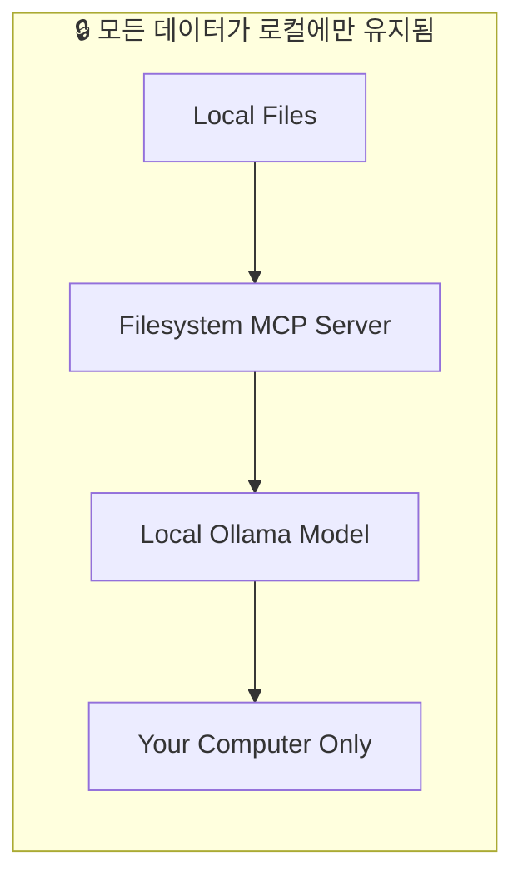

# 에이전트와 함께 로컬 모델 사용하기

!!! tip "채팅 사이드바나 Agent 노드에서 로컬 모델을 사용하고 싶으신가요?"

    Ollama나 LM Studio를 **채팅 사이드바**나 **Agent 노드**의 AI 제공자로 직접 사용하려면 [AI 제공자](../agent/providers/index.md)를 참조하세요. 대부분의 사용 사례에서는 이 방법이 훨씬 간단합니다.

    이 튜토리얼에서는 다른 패턴을 다룹니다. 워크플로우 내부에서 **로컬 모델을 MCP 서버를 통해 라우팅**하여, 모든 데이터를 로컬 머신에 안전하게 유지하면서 로컬 파일 및 도구에 접근할 수 있도록 만드는 방법입니다.

이 고급 튜토리얼에서는 **로컬 AI 모델**을 MCP 서버와 함께 사용하여 민감한 데이터를 외부 서비스로 전송하지 않고 처리하는 방법을 보여줍니다. 사내 문서, 비공개 파일 또는 로컬 머신에 안전하게 보관해야 하는 모든 데이터에 적합합니다.

## MCP와 함께 로컬 모델을 사용하는 이유

### 보안상의 이점

- ✅ **데이터가 머신 외부로 유출되지 않음** - 모든 작업이 로컬에서 처리됩니다
- ✅ **API 비용 없음** - 보유한 하드웨어에서 모델을 실행합니다
- ✅ **완벽한 개인정보 보호** - 민감한 문서 처리에 최적입니다
- ✅ **오프라인 동작 가능** - 인터넷 연결 없이도 작동합니다

### 적합한 사용 사례

- **사내 문서** - 회사 파일, 계약서, 기밀 보고서
- **개인 데이터** - 비공개 메모, 비밀번호, 개인 식별 정보
- **독점 코드** - 외부에 공유하고 싶지 않은 소스 코드
- **로컬 파일 관리** - 컴퓨터 내의 파일 정리 및 관리

## 이번 튜토리얼에서 구축할 내용

다음과 같은 워크플로우를 생성합니다:

1. **[Filesystem MCP](https://github.com/modelcontextprotocol/servers/blob/main/src/filesystem/README.md) 서버를 설정**하여 로컬 파일에 접근합니다.
1. AI 처리를 위해 **Ollama와 로컬 모델**(`qwen3:1.7b`)을 사용합니다.
1. "비밀(secret)" 파일을 읽어 **안전한 파일 접근**을 시연합니다.
1. 전체 과정에서 **민감한 데이터가 로컬에만 유지되는 방식**을 확인합니다.

## 사전 요구 사항

- 기본적인 MCP 개념을 이해하고 있어야 합니다 ([시작하기](./getting_started.md) 참조)
- Mac, Windows 또는 Linux 컴퓨터가 준비되어 있어야 합니다
- 기본적인 파일 조작에 익숙해야 합니다

## 1단계: Ollama 설치하기

### Ollama 다운로드 및 설치

1. **[ollama.org](https://ollama.org)에 접속**합니다.
1. 사용 중인 운영체제에 맞는 **Ollama를 다운로드**합니다.
1. 설치 지침에 따라 **Ollama를 설치**합니다.
1. 터미널을 열고 다음 명령을 실행하여 **설치를 확인**합니다:
    ```bash
    ollama --version
    ```

### Qwen3 모델 다운로드

1. **터미널을 열고** 다음 명령을 실행합니다:
    ```bash
    ollama pull qwen3:1.7b
    ```
1. **다운로드가 완료될 때까지 대기**합니다 - 인터넷 속도에 따라 몇 분 정도 걸릴 수 있습니다.
1. 모델이 사용 가능한지 **확인**합니다:
    ```bash
    ollama list
    ```

> **왜 Qwen3:1.7b인가요?** 이 모델은 대부분의 컴퓨터에서 원활하게 실행될 만큼 작으면서도, MCP 통합에 필수적인 도구 사용(Tool Use) 기능을 지원합니다.

## 2단계: Filesystem MCP 서버 설정하기

[Filesystem MCP 서버](https://github.com/modelcontextprotocol/servers/blob/main/src/filesystem/README.md)는 로컬 파일 시스템에 대한 안전한 접근을 제공하여 AI 에이전트가 파일과 디렉터리를 읽고, 쓰고, 관리할 수 있도록 해줍니다. 명시적으로 허용한 디렉터리에만 접근하므로 민감한 파일을 안전하게 보호하면서 로컬 데이터를 처리할 수 있습니다. 디렉터리 목록 조회, 파일 읽기, 새 파일 생성, 로컬 스토리지 정리 등 일반적인 파일 작업을 모두 지원하며, 모든 과정이 로컬 머신 내에서만 실행됩니다.

Filesystem 서버의 기능과 구성 옵션에 대한 자세한 정보는 [Filesystem 서버 문서](./servers/filesystem.md)를 참조하세요.

### MCP 서버 구성 생성

1. **Griptape Nodes를 열고** **Settings** → **MCP Servers**로 이동합니다.
1. **+ New MCP Server를 클릭**합니다.
1. 다음과 같이 **서버를 구성**합니다:
    - **Server Name/ID**: `filesystem`
    - **Connection Type**: `Local Process (stdio)`
    - **Configuration JSON**:

```json
{
  "transport": "stdio",
  "command": "npx",
  "args": [
    "-y",
    "@modelcontextprotocol/server-filesystem",
    "/Users/jason/Desktop",
    "/Users/jason/Downloads"
  ],
  "env": {},
  "cwd": null,
  "encoding": "utf-8",
  "encoding_error_handler": "strict"
}
```

> **중요**: `/Users/jason/Desktop` 및 `/Users/jason/Downloads`를 실제 사용자의 바탕화면 및 다운로드 폴더 경로로 변경하세요. Filesystem 서버는 명시적으로 허용한 디렉터리에만 접근할 수 있습니다.

1. **Create Server를 클릭**합니다.

### 파일 시스템 접근 테스트

1. 바탕화면에 `secret.txt`라는 **테스트 파일을 생성**합니다.
1. 파일에 다음 **내용을 추가**합니다:
    ```
    The password is: CAPYBARA
    ```
1. **파일을 저장**합니다.

## 3단계: 로컬 AI 워크플로우 구축하기

### Ollama Prompt 구성 노드 추가

1. **Ollama Prompt 노드를 워크플로우로 드래그**합니다.
1. **모델을 구성**합니다:
    - **Model**: `qwen3:1.7b`
    - **Temperature**: `0.1` (일관된 결과를 위해)
    - **Max Tokens**: `-1` (무제한)
    - **Stream**: `True`
    - **Use Native Tools**: `True` (MCP에 필수)

### Agent 노드 생성

1. **Agent 노드를 워크플로우로 드래그**합니다.
1. **Ollama Prompt의 `prompt_model_config` 출력**을 Agent의 `prompt_model_config` 입력에 연결합니다.
1. **에이전트를 구성**합니다:
    - **Prompt**: 현재는 비워 둡니다
    - **Additional Context**: 현재는 비워 둡니다

### MCP Task 생성

1. **MCPTask 노드를 워크플로우로 드래그**합니다.
1. **Agent의 `agent` 출력**을 MCPTask의 `agent` 입력에 연결합니다.
1. **MCPTask를 구성**합니다:
    - **MCP Server Name**: `filesystem`
    - **Prompt**: `"what's the password in secret.txt? it's in the desktop folder"`

## 4단계: 보안 워크플로우 실행하기

### 워크플로우 실행

1. **Ollama Prompt 노드를 먼저 실행**하여 모델을 초기화합니다.
1. **Agent 노드를 실행**하여 로컬 모델 접근 권한을 가진 에이전트를 생성합니다.
1. **MCPTask 노드를 실행**하여 파일 접근 작업을 수행합니다.

### 예상 결과

MCPTask가 다음과 유사한 결과를 반환해야 합니다:

```
<think>
Okay, the user asked for the password in secret.txt. After checking the allowed directories and listing the contents, the secret.txt file was found. Reading the file revealed the password "CAPYBARA". Since the user requested the password, the assistant needs to provide it. The previous steps were successful, so the final answer is the password.
</think>

The password in secret.txt is **CAPYBARA**.
```

## 이것이 안전한 이유

### 데이터 흐름 분석



### 입증된 보안상의 이점

1. **외부 API 호출 없음** - AI 모델이 내 머신에서 직접 실행됩니다
1. **데이터 전송 없음** - 파일 읽기 및 처리가 로컬에서만 이루어집니다
1. **클라우드 스토리지 미사용** - 외부 서버로 아무것도 전송되지 않습니다
1. **완벽한 제어 권한** - AI가 접근할 수 있는 대상을 사용자가 정확히 제어합니다

## 고급 구성 옵션

### 모델 선택

필요에 맞는 모델을 선택하세요:

| 모델 | 크기 | 속도 | 기능 | 적합한 용도 |
| --- | --- | --- | --- | --- |
| `qwen3:1.7b` | 소형 | 빠름 | 기본 도구 사용 지원 | 단순한 작업 |
| `qwen3:4b` | 중형 | 중간 | 더 나은 추론 능력 | 복잡한 분석 |
| `llama4` | 대형 | 느림 | 고급 추론 능력 | 복잡한 워크플로우 |

### 파일 시스템 보안

특정 디렉터리에만 접근하도록 Filesystem 서버를 구성하세요:

```json
{
  "args": [
    "-y",
    "@modelcontextprotocol/server-filesystem",
    "/Users/jason/Documents/Work",
    "/Users/jason/Documents/Projects"
  ]
}
```

### 성능 최적화

- **충분한 RAM 할당** (더 큰 모델의 경우 8GB 이상 권장)
- 대형 모델을 실행할 때는 **다른 애플리케이션 종료**
- 빠른 응답을 원할 경우 **더 작은 모델 사용**

## 문제 해결

### 일반적인 문제

#### 모델을 찾을 수 없음

```bash
# 사용 가능한 모델 확인
ollama list

# 누락된 모델 다운로드
ollama pull qwen3:1.7b
```

#### 파일 시스템 접근이 거부됨

- MCP 서버 구성의 디렉터리 경로를 확인합니다
- 해당 디렉터리가 실제로 존재하고 접근 가능한지 확인합니다
- 디렉터리에 대한 읽기 권한이 있는지 확인합니다

#### 모델 성능 문제

- `qwen3:1.7b`와 같은 더 작은 모델을 사용해 보세요
- 다른 애플리케이션을 종료하여 메모리를 확보하세요
- 시스템 리소스(CPU, RAM 사용량)를 확인하세요

#### 도구 사용이 작동하지 않음

- Ollama Prompt에서 `use_native_tools`가 `True`로 설정되어 있는지 확인하세요
- 모델이 도구 사용을 지원하는지 확인하세요 (Qwen3 모델은 지원함)
- MCP 서버가 올바르게 구성되었는지 확인하세요

## 다음 단계

로컬 모델과 MCP 서버 연동을 마스터했으므로 다음 항목들을 살펴보세요:

- **[예제 MCP 서버](./servers/index.md)** - 다양한 기능을 위한 추가 서버 설정하기
- **[연결 유형](./index.md#연결-유형)** - 외부 시스템에 연결하는 다양한 방법 살펴보기
