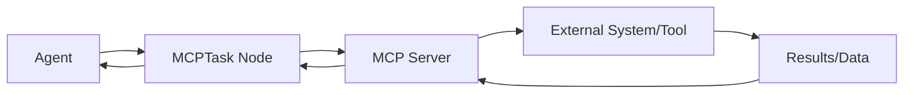
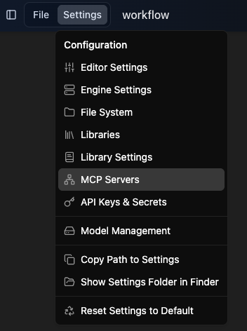
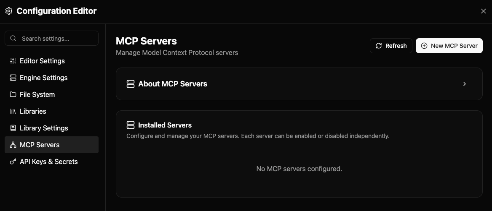
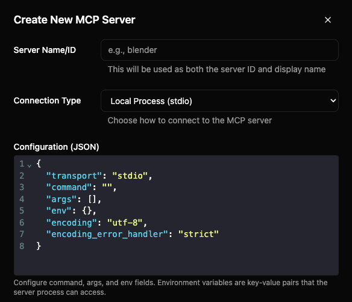
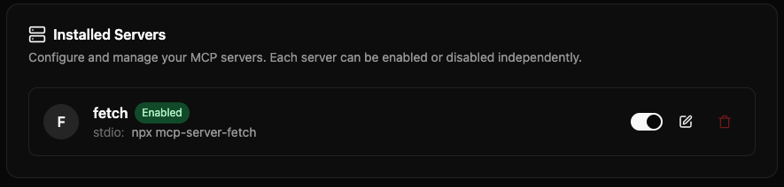
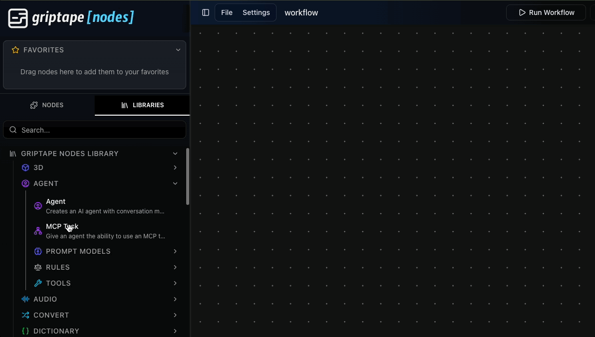
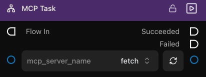
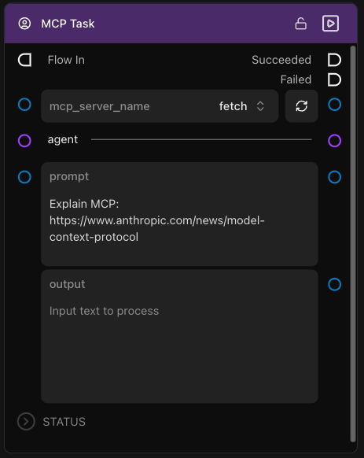
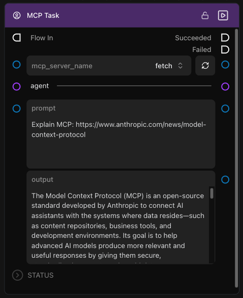
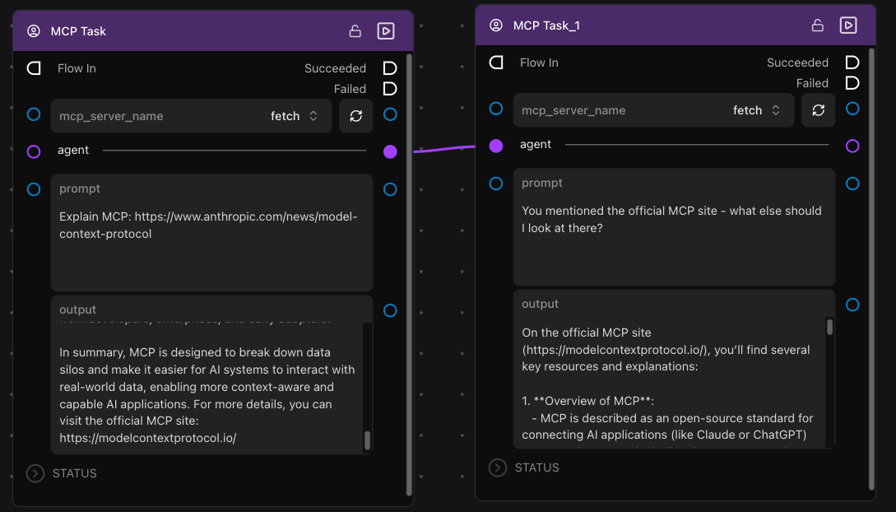

# MCP 시작하기: Fetch 서버 튜토리얼

이 튜토리얼에서는 초보자에게 안성맞춤인 간단한 웹 콘텐츠 가져오기 도구인 **[Fetch MCP 서버](https://github.com/modelcontextprotocol/servers/tree/main/src/fetch)**를 사용하여 첫 번째 MCP 서버를 설정하는 방법을 안내합니다.

## 이번 튜토리얼에서 만들 내용

웹 콘텐츠 가져오기 기능을 제공하는 [Fetch MCP 서버](https://github.com/modelcontextprotocol/servers/tree/main/src/fetch)를 설정해 봅니다. 이 서버를 사용하면 AI 에이전트가 웹 페이지에서 콘텐츠를 가져와 처리할 수 있으며, 더 쉽게 활용할 수 있도록 HTML을 마크다운으로 변환해 줍니다.

**Fetch를 선택하는 이유:**

- ✅ **쉬운 설정** - `uvx`를 사용하여 자동으로 설치됩니다
- ✅ **복잡한 의존성 없음** - 인터넷 연결만 있으면 됩니다
- ✅ **즉각적인 결과** - 바로 테스트해 볼 수 있습니다
- ✅ **실무에서의 유용성** - 조사 및 콘텐츠 분석에 매우 적합합니다

## Griptape Nodes에서 MCP의 작동 방식



MCPTask 노드는 Griptape Nodes 워크플로우와 외부 MCP 서버 사이의 다리 역할을 하여 AI 에이전트가 외부 시스템과 매끄럽게 상호작용할 수 있도록 해줍니다.

## 단계별 튜토리얼

### 1단계: MCP 서버 설정 열기

1. Griptape Nodes를 엽니다.

1. **Settings** → **MCP Servers**로 이동합니다.

    

1. MCP 서버 설정을 처음 여는 경우 아직 구성된 MCP 서버가 없습니다.

    

### 2단계: MCP 서버 생성하기

새 MCP 서버를 생성하려면 해당 MCP 서버 설정을 구성해야 합니다.

1. **+ New MCP Server**를 클릭합니다.

    

1. **Server Name/ID**를 `fetch`로 설정합니다.

1. **Connection Type**이 아직 설정되어 있지 않다면 `Local Process (stdio)`로 설정합니다.

1. **Configuration (JSON)**을 확인합니다. 다음과 같은 형태로 표시됩니다:

    ```json
    {
        "transport": "stdio",
        "command": "",
        "args": [],
        "env": {},
        "encoding": "utf-8",
        "encoding_error_handler": "strict"
    }
    ```

    이 정보는 _클라이언트_(Griptape Nodes)가 _서버_에 연결하는 방법을 알려주기 위해 채워 넣어야 하는 구성입니다.

    대부분의 MCP 서버 문서는 Claude나 VS Code용 설정 지침을 제공합니다. Fetch 서버도 마찬가지이며, 해당 지침을 우리 사용 환경에 맞게 적용해 보겠습니다.

1. [Fetch](https://github.com/modelcontextprotocol/servers/tree/main/src/fetch) MCP 서버의 GitHub 페이지로 이동합니다.

1. [Configuration](https://github.com/modelcontextprotocol/servers/tree/main/src/fetch#configuration) 섹션이 보일 때까지 아래로 스크롤합니다.

1. **Configure for Claude.app** 섹션에서 "Using `uvx`" 항목을 확인합니다. 이 항목을 열고 지침을 확인해 보세요:

    ```json
    {
        "mcpServers": {
            "fetch": {
            "command": "uvx",
            "args": ["mcp-server-fetch"]
            }
        }
    }
    ```

    우리가 필요로 하는 부분은 `command`와 `args`입니다. 이것이 우리 서버 설정에 사용할 내용입니다.

1. **Configuration (JSON)**을 다음과 같이 수정합니다:

    ```json
    {
        "transport": "stdio",
        "command": "uvx",
        "args": ["mcp-server-fetch"],
        "env": {},
        "encoding": "utf-8",
        "encoding_error_handler": "strict"
    }
    ```

    문서에 나온 내용과 일치하도록 **command**와 **args** 설정을 수정했습니다.

    **선택 사항: 커스텀 규칙 추가**

    **Rules** 텍스트 영역에 커스텀 규칙을 추가하여 AI 에이전트가 이 MCP 서버를 사용할 때 따를 지침을 제공할 수 있습니다. 이러한 규칙은 에이전트가 이 서버의 도구를 사용할 때 자동으로 적용됩니다.

    예를 들어 다음과 같이 입력할 수 있습니다:

    ```
    Always validate URLs before fetching. Return errors in JSON format if a fetch fails.
    ```

    규칙은 에이전트가 이 특정 MCP 서버와 상호작용할 때의 동작을 가이드하여 일관되고 적절한 사용을 보장합니다.

1. **Create Server**를 클릭합니다.

    

### 3단계: 서버 관리하기

서버가 생성되면 목록에서 확인할 수 있습니다. 다음 작업을 수행할 수 있습니다:

- 토글 버튼을 사용하여 서버 **활성화/비활성화 (Enable/Disable)**
- **Edit** 버튼을 클릭하여 서버 편집 (여기서 규칙을 추가하거나 수정할 수 있습니다)
- 삭제 버튼을 사용하여 서버 **삭제 (Delete)**

완료되면 설정을 닫습니다.

### 4단계: MCP Task 생성하기

1. 워크플로우 편집기에서 **Agent** 섹션의 **MCP Task** 노드를 끌어다 놓습니다.

    

1. MCP Task 노드에서 **mcp_server_name** 드롭다운의 `fetch`를 선택합니다.

    

1. 서버가 표시되지 않는 경우 **새로고침(reload) 버튼**을 클릭하여 목록을 갱신합니다.

### 5단계: 설정 테스트하기

prompt 필드에 인터넷 정보에 관한 질문을 입력합니다. 예를 들면 다음과 같습니다:

```
Explain MCP: https://www.anthropic.com/news/model-context-protocol
```



그런 다음 노드의 **Run** 버튼을 누릅니다.

### 6단계: 결과 확인하기

노드가 실행되고 다음과 같은 결과를 반환합니다:



## 다음 단계: 작업 체이닝

이제 작동하는 MCP 서버가 준비되었으므로 다음과 같은 작업을 진행할 수 있습니다:

### 여러 작업 체이닝하기

- 첫 번째 노드에 또 다른 **MCP Task** 노드를 연결합니다
- 두 번째 작업은 추가 정보를 요청할 수 있으며, 필요한 경우 MCP 서버를 사용합니다
- 필요한 경우 각 작업마다 다른 MCP 서버를 사용할 수도 있습니다



두 번째 작업에서는 에이전트에게 공식 MCP 사이트에 대해 질문하면서 실제 URL을 _구체적으로_ 언급하지 않았다는 점에 주목하세요. 이전 응답에서 MCP 서버가 해당 URL을 응답에 포함했기 때문입니다. 에이전트는 대화 내용을 기억하고 이를 바탕으로 작업을 이어갈 수 있습니다.

## 다음으로 할 일은?

첫 번째 MCP 서버를 성공적으로 설정했으므로 다음 항목들을 살펴보세요:

- **[에이전트와 함께 MCPTask 사용하기](./mcp_task_agents.md)** - 고급 통합 패턴
- **[예제 MCP 서버](./servers/index.md)** - 유용한 다른 서버들의 설정 가이드
- **[연결 유형](./index.md#연결-유형)** - 앱에 연결하는 다양한 방법 알아보기
