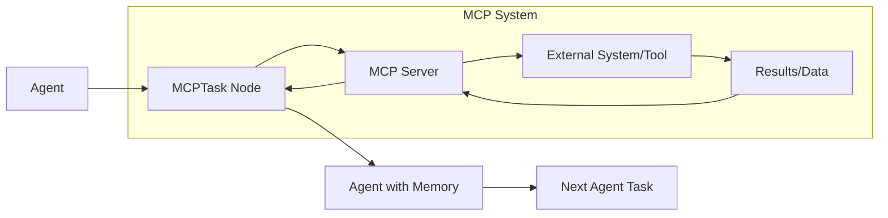
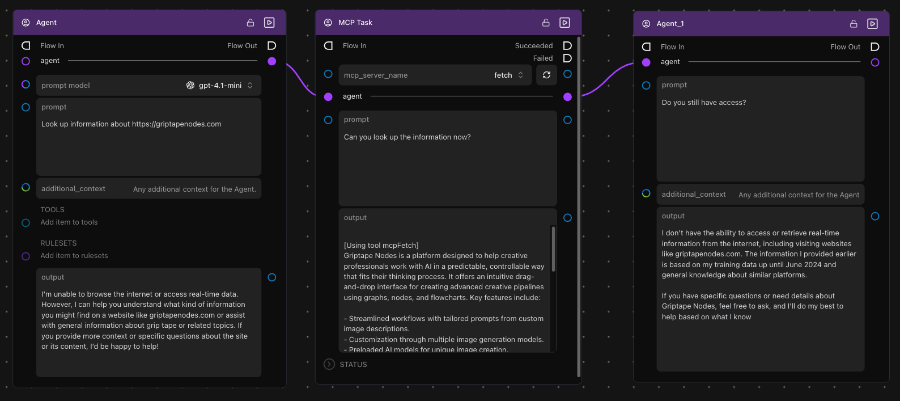

# 에이전트와 함께 MCPTask 사용하기

**MCPTask** 노드를 사용하면 AI 에이전트에 외부 도구 및 데이터 소스에 대한 임시 접근 권한을 부여할 수 있습니다. 이 강력한 기능을 통해 에이전트가 외부 시스템과 상호작용하는 시점과 방식을 정밀하게 제어할 수 있습니다.

## 핵심 개념: 기억이 유지되는 임시 접근 권한

에이전트를 MCPTask 노드에 연결하면 다음과 같이 동작합니다:

- ✅ **에이전트가 권한을 획득함** - MCP 서버의 도구에 접근할 수 있게 됩니다
- ✅ **에이전트가 작업을 수행함** - 이전에는 할 수 없었던 작업을 수행할 수 있습니다
- ✅ **에이전트가 기억을 유지함** - 습득한 지식을 기억합니다
- ❌ **작업 후 접근 권한 상실** - 작업이 끝나면 MCP 도구에 대한 접근 권한이 사라집니다

이를 통해 에이전트가 학습한 내용을 보존하면서도 외부 기능을 사용할 수 있는 시점을 정밀하게 제어할 수 있습니다.

## 에이전트와 MCPTask의 작동 방식

MCPTask 노드는 에이전트의 기능을 일시적으로 확장한 다음, 외부 접근 권한은 제거하되 습득한 지식은 유지한 상태의 에이전트를 반환하는 브리지 역할을 합니다.

## 단계별 실습: 기억이 유지되는 임시 접근 권한

에이전트가 MCP 기능을 일시적으로 얻고 지식을 유지하는 방식을 보여주는 워크플로우를 만들어 보겠습니다. Fetch MCP 서버를 사용하여 에이전트가 인터넷에 접근한 뒤, 획득한 지식을 바탕으로 작업을 이어가는 방법을 알아봅니다.

### 사전 요구 사항

- **Fetch MCP 서버**가 설정되어 있어야 합니다 ([시작하기 튜토리얼](./getting_started.md) 참조)
- 기본적인 Griptape Nodes 워크플로우 개념을 이해하고 있어야 합니다

### 1단계: 첫 번째 에이전트 생성

1. **Agent 노드를 워크플로우 편집기로 드래그**합니다.

1. **에이전트를 구성**합니다:

    - **prompt model**을 `gpt-4o-mini`(또는 선호하는 모델)로 설정합니다.
    - **prompt**를 `"Look up information about https://griptapenodes.com"`으로 설정합니다.
    - **additional_context**는 현재 비워 둡니다.

1. **에이전트를 실행**합니다 - 인터넷에 접근할 수 없다는 응답이 표시됩니다:

    > I'm unable to browse the internet or access real-time data. However, I can help you understand what kind of information you might find on a website like griptapenodes.com...

이를 통해 MCP 접근 권한이 없을 때의 에이전트 한계를 확인할 수 있습니다.

### 2단계: MCPTask 노드 추가

1. **MCPTask 노드를 워크플로우로 드래그**합니다.

1. **Agent의 출력**을 MCPTask 노드의 **agent** 입력에 연결합니다.

1. **MCPTask를 구성**합니다:

    - **mcp_server_name**을 `fetch`로 설정합니다.
    - **prompt**를 `"Can you look up the information now?"`로 설정합니다.

1. **MCPTask를 실행**합니다 - 에이전트가 이제 Fetch 서버에 접근하여 정보를 가져올 수 있습니다:

    > [Using tool mcpFetch] Griptape Nodes is a platform designed to help creative professionals work with AI in a predictable, controllable way that fits their thinking process. It offers an intuitive drag-and-drop interface for creating advanced creative pipelines using graphs, nodes, and flowcharts...

### 3단계: 다른 에이전트에 연결

1. 또 다른 **Agent 노드를 워크플로우로 드래그**합니다.

1. **MCPTask의 agent 출력**을 새 Agent의 **agent** 입력에 연결합니다.

1. **두 번째 에이전트를 구성**합니다:

    - **prompt**를 `"Do you still have access?"`로 설정합니다.

1. **두 번째 에이전트를 실행**합니다 - 다음과 같이 응답하는 것을 확인하세요:

    > I don't have the ability to access or retrieve real-time information from the internet... The information I provided earlier is based on my training data...

**주요 관찰 사항**: 에이전트는 더 이상 MCP 접근 권한을 가지고 있지 않지만, MCPTask 중에 습득한 정보는 여전히 기억하고 있습니다!

### 4단계: 메모리 유지 여부 테스트

1. 이전 에이전트에 연결된 **또 다른 Agent 노드를 추가**합니다.

1. 다음과 같이 **구성**합니다: `"What did you learn about Griptape Nodes?"`

1. **실행**합니다 - 에이전트가 습득했던 정보를 기억하여 답변합니다:

    > Based on the information I learned earlier, Griptape Nodes is a platform designed to help creative professionals work with AI in a predictable, controllable way...

이를 통해 에이전트가 MCP 접근 권한을 상실한 후에도 지식을 유지하고 있음을 확인할 수 있습니다.

## 고급 에이전트 구성

### 에이전트 동작 커스터마이징

다양한 추가 기능을 통해 에이전트를 강화할 수 있습니다:

#### 규칙 세트 (Rulesets)

규칙 세트를 추가하여 에이전트의 동작 방식을 제어할 수 있습니다:

- **Research Agent**: "Always cite sources when providing information (정보를 제공할 때 항상 출처를 명시하세요)"
- **Creative Agent**: "Think outside the box and suggest innovative solutions (틀에서 벗어나 혁신적인 해결책을 제안하세요)"
- **Analytical Agent**: "Provide detailed analysis with pros and cons (장단점이 포함된 상세한 분석을 제공하세요)"

#### 도구 (Tools)

MCP 기능을 보완할 추가 도구를 더할 수 있습니다:

- 수학적 연산을 위한 **Calculator tools**
- 날짜를 이해하기 위한 **Date Time**

#### 프롬프트 모델 (Prompt Models)

작업에 따라 다양한 모델을 선택할 수 있습니다:

- **gpt-4o-mini**: 간단한 작업에 빠르고 비용 효율적임
- **gpt-4o**: 복잡한 추론 작업에 더 뛰어남
- **Claude Sonnet**: 분석 및 작문 작업에 탁월함

## 다음 단계

이제 에이전트가 MCPTask 노드와 함께 작동하는 방식을 이해했으므로 다음을 살펴보세요:

- **[에이전트와 함께 로컬 모델 사용하기](./advanced_local_models.md)** - 민감한 데이터 처리를 위해 로컬 AI 모델 사용하기
- **[예제 MCP 서버](./servers/index.md)** - 다양한 기능을 위한 추가 서버 설정하기
- **[연결 유형](./index.md#연결-유형)** - 외부 시스템에 연결하는 다양한 방법 알아보기
