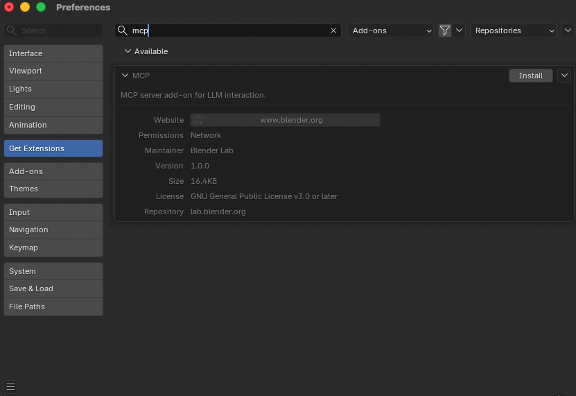
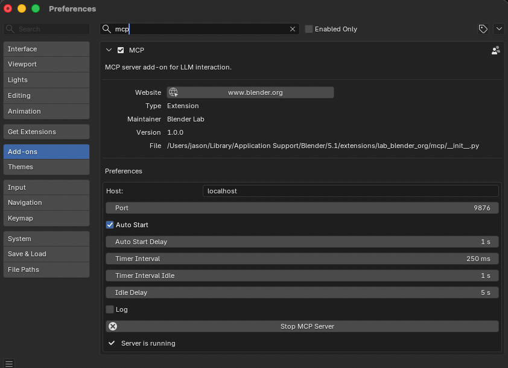

# Blender MCP 서버

**[Blender MCP Server](https://www.blender.org/lab/mcp-server/)**는 Blender Lab 팀에서 개발 및 유지 관리하는 [Blender](https://www.blender.org)용 공식 MCP 연동 기능입니다. 이를 통해 AI 에이전트가 Blender와 직접 상호작용하고 제어하여 프롬프트 기반 3D 모델링, 씬(Scene) 검사 및 조작을 수행할 수 있습니다.

!!! note "사전 요구 사항"

    Blender MCP 서버를 사용하기 전에 다음 사항을 준비해야 합니다:

    1. [Blender](https://www.blender.org) 5.1 이상 설치
    1. `uv` 패키지 관리자 설치 ([설치 가이드](https://docs.astral.sh/uv/getting-started/installation/))
    1. [Blender MCP 저장소](https://projects.blender.org/lab/blender_mcp) 복제(clone)
    1. Blender MCP 확장 프로그램(Extension) 설치 (아래 참조)

## Blender MCP 확장 프로그램 설치

Blender MCP 서버는 공식 Blender Extensions 플랫폼을 통해 Blender 확장 프로그램 형태로 배포됩니다.

1. [blender.org/lab/mcp-server](https://www.blender.org/lab/mcp-server/#addon)에 방문하여 **Add-on** 섹션으로 스크롤합니다.

1. 다음 두 가지 설치 방법 중 하나를 선택합니다:

    **방법 A — 드래그 앤 드롭 (Drag and Drop)**

    **Drag and Drop into Blender** 버튼을 열려 있는 Blender 창 위로 드래그합니다.

    !!! warning "두 번 드래그 앤 드롭"

        반드시 **두 번** 드래그 앤 드롭해야 합니다: 첫 번째 드롭은 Blender Lab 저장소를 추가하고, 두 번째 드롭은 애드온 자체를 설치합니다.

    **방법 B — 디스크에서 설치 (Install from Disk)**

    페이지에서 **download**를 클릭한 후, Blender에서 **Edit** → **Preferences** → **Get Extensions** → 드롭다운 → **Install from Disk...**로 이동하여 다운로드한 파일을 선택합니다.

1. Blender에서 **Edit** → **Preferences** → **Get Extensions**로 이동합니다.

1. `mcp`를 검색하면 **MCP** 확장 프로그램이 사용 가능(Available)으로 표시됩니다.

1. **Install**을 클릭합니다.



## Blender에서 MCP 서버 시작하기

확장 프로그램이 설치되면 Griptape Nodes에서 연결하기 전에 Blender 내부에서 MCP 서버를 시작해야 합니다:

1. Blender에서 **Edit** → **Preferences** → **Add-ons**로 이동합니다.
1. `mcp`를 검색하고 **MCP** 확장 프로그램 환경설정을 확장합니다.
1. 필요한 경우 **Host** 및 **Port**를 구성합니다 (기본값: `localhost` / `9876`).
1. 선택적으로 **Auto Start**를 활성화하여 Blender와 함께 서버가 자동으로 시작되도록 설정합니다.
1. **Start MCP Server**를 클릭합니다.

연결 준비가 완료되면 패널에 **Server is running**이 표시됩니다.



## MCP 서버 코드 복제(Clone)하기

Griptape Nodes MCP 연결에는 Blender MCP 저장소의 로컬 복제본이 필요합니다. 쉽게 찾을 수 있는 위치에 복제하세요. 예를 들어 Mac에서는 `$HOME/Documents/GitHub`를 사용할 수 있습니다:

```bash
cd $HOME/Documents/GitHub
git clone https://projects.blender.org/lab/blender_mcp.git
```

아래의 Griptape Nodes 구성에서 복제본 내부의 `mcp/` 하위 디렉터리 경로를 참조하게 됩니다.

## Griptape Nodes에서 설치

1. **Griptape Nodes를 열고** **Settings** → **MCP Servers**로 이동합니다.

1. **+ New MCP Server를 클릭합니다.**

1. **서버를 구성합니다**:

    - **Server Name/ID**: `blender`
    - **Connection Type**: `Local Process (stdio)`
    - **Configuration JSON**:

    ```json
    {
      "transport": "stdio",
      "command": "uv",
      "args": [
        "--directory",
        "/path/to/blender_mcp/mcp",
        "run",
        "blender-mcp"
      ],
      "env": {},
      "cwd": null,
      "encoding": "utf-8",
      "encoding_error_handler": "strict"
    }
    ```

1. **`/path/to/blender_mcp/mcp`를 로컬 복제본 내부의 `mcp/` 하위 디렉터리 실제 경로로 변경합니다.**

1. **Create Server를 클릭합니다.**

!!! example "경로 예시"

    저장소를 `$HOME/Documents/GitHub/blender_mcp`에 복제한 경우 `--directory` 값은 다음과 같습니다:

    ```
    /Users/yourname/Documents/GitHub/blender_mcp/mcp
    ```

## 활용 예시

- "현재 열려 있는 Blender 파일에서 모든 데이터 블록에 대해 설명적인 이름을 제안하고, 승인 시 적용해줘"
- "이 파일에서 폴리곤 수가 가장 많은 객체는 무엇인가요? 어떤 씬에도 연결되지 않은 객체는 무시하세요"
- "구(sphere)를 생성하고 큐브 위에 배치해줘"
- "조명을 스튜디오처럼 설정해줘"
- "카메라가 씬을 바라보도록 맞추고 아이소메트릭(isometric) 뷰로 설정해줘"
- "현재 씬에 대한 정보를 가져와서 JSON으로 내보내줘"

## 문제 해결

### 일반적인 문제

- **Connection refused (연결 거부)**: Blender에서 MCP 서버가 실행 중인지 확인하세요 (확장 프로그램 환경설정에 **Server is running**이 표시되는지 확인).
- **첫 번째 명령 실패**: 연결 후 첫 번째 명령이 제대로 전달되지 않는 경우가 있습니다. 명령을 다시 실행해 보세요.
- **잘못된 경로**: `--directory` 인수가 저장소 루트가 아닌 복제본의 `mcp/` 하위 디렉터리를 가리키는지 확인하세요.
- **시간 초과(Timeout) 오류**: 요청을 단순화하거나 더 작은 단계로 나누어 보세요.
- **코드 실행 경고**: 서버가 코드 실행 도구를 노출하는 경우, 해당 도구를 사용하기 전에 항상 Blender 작업을 저장하세요.

### 디버깅 팁

1. **Edit** → **Preferences** → **Add-ons**에서 확장 프로그램이 설치되어 있고 활성화되어 있는지 확인합니다.
1. 양쪽(Blender 확장 프로그램과 Griptape Nodes 설정)의 Host 및 Port가 일치하는지 확인합니다.
1. 먼저 간단한 쿼리로 테스트합니다 (예: "씬에 어떤 객체가 있나요?").
1. 문제가 지속되면 Blender와 MCP 서버를 모두 재시작합니다.

## 참고 자료

- [Blender MCP Server](https://www.blender.org/lab/mcp-server/) - 공식 페이지 및 확장 프로그램 다운로드
- [Blender MCP Repository](https://projects.blender.org/lab/blender_mcp) - 소스 코드 및 이슈 트래커
- [Blender Python API](https://docs.blender.org/api/current/) - Blender 스크립팅 레퍼런스
- [uv 설치 가이드](https://docs.astral.sh/uv/getting-started/installation/) - MCP 서버 실행에 필요한 패키지 관리자

## 보안 고려 사항

!!! danger "코드 실행"

    일부 MCP 도구는 Blender 내에서 직접 코드를 실행할 수 있습니다. 이는 강력하지만 잠재적으로 위험할 수 있습니다:

    - 코드 실행 도구를 사용하기 전에 **항상 Blender 작업 내용을 저장하세요**.
    - 가능한 경우 생성된 코드를 검토하세요.
    - 프로덕션 환경에서는 주의하여 사용하세요.
