# GUI에서 프로젝트 관리하기 (Managing Projects in the GUI)

**프로젝트(Project)**는 파일이 저장되는 위치와 사용할 라이브러리 및 엔진 버전을 Griptape Nodes에 알려주는 저장된 설정입니다. 프로젝트를 전환하면 수행하는 모든 작업에 대한 컨텍스트가 변경됩니다. 즉, 렌더링된 이미지와 다운로드가 저장되는 위치, 표시되는 워크플로, 사용할 수 있는 노드 라이브러리가 변경됩니다.

이 페이지에서는 GUI에서 수행할 수 있는 모든 프로젝트 작업(프로젝트 간 전환, 새 프로젝트 생성, 프로젝트 조회 및 편집, 프로젝트 제거)을 안내합니다. 프로젝트의 기본 개념(파일 형식, 매크로, 버전 고정)은 [프로젝트 개요](index.md)를 참조하세요.

> 이 페이지의 모든 작업은 **Project Management** 창 내부에서 이루어집니다. 상단 메뉴 표시줄에서 **Manage → Project Management**를 열어 액세스하세요.

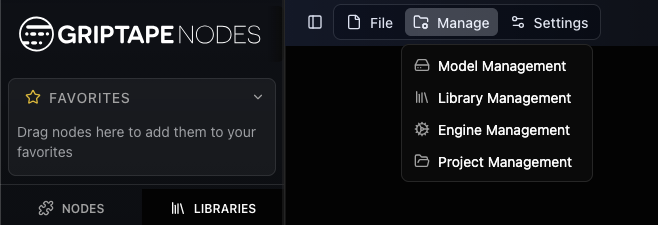

## 프로젝트 관리 창 (The Project Management window)

프로젝트 관리 창은 **프로젝트 목록**으로 열립니다. 프로젝트는 트리 형태로 표시됩니다. 하위 프로젝트는 상위 프로젝트 아래에 중첩되어 나타납니다. 현재 작업 중인 프로젝트에는 **Active** 배지가 표시됩니다.

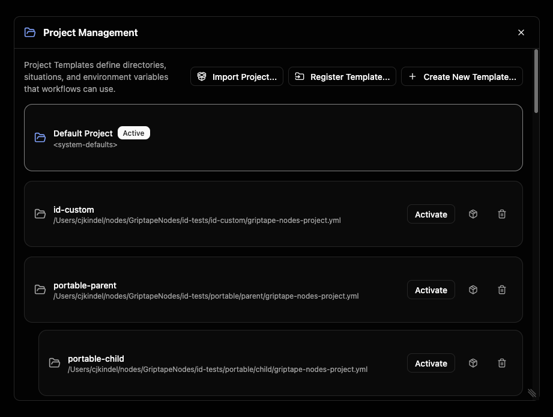

오른쪽 상단 모서리에 있는 두 개의 버튼을 통해 이 목록에 프로젝트를 추가할 수 있습니다:

- **Register Template…**: 디스크에 이미 존재하는 프로젝트 파일을 지정하여 목록에 추가합니다.
- **Create New Template…**: 처음부터 완전히 새로운 프로젝트를 만듭니다.

목록에서 프로젝트를 클릭하면 상세 보기가 열려 검토하고 편집할 수 있습니다.

## 프로젝트 전환하기

전환은 가장 자주 수행하는 작업입니다. 프로젝트 관리 창에서 전환할 수 있지만(프로젝트 클릭 후 **Activate** 선택), 가장 빠른 방법은 워크플로 선택기의 **프로젝트 선택기(project picker)**를 사용하는 것입니다.

선택기에는 현재 위치한 프로젝트가 표시됩니다. 선택기를 열어 목록을 검색하고 다른 프로젝트를 선택하세요. 활성 프로젝트에는 체크 표시가 되어 있습니다.

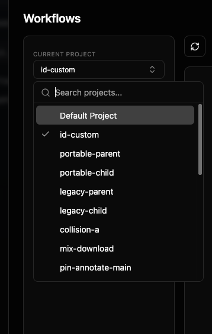

다른 프로젝트를 선택하면 Griptape Nodes에서 확인을 요청합니다. 대화 상자에는 현재 떠나는 프로젝트와 이동할 프로젝트가 표시됩니다.

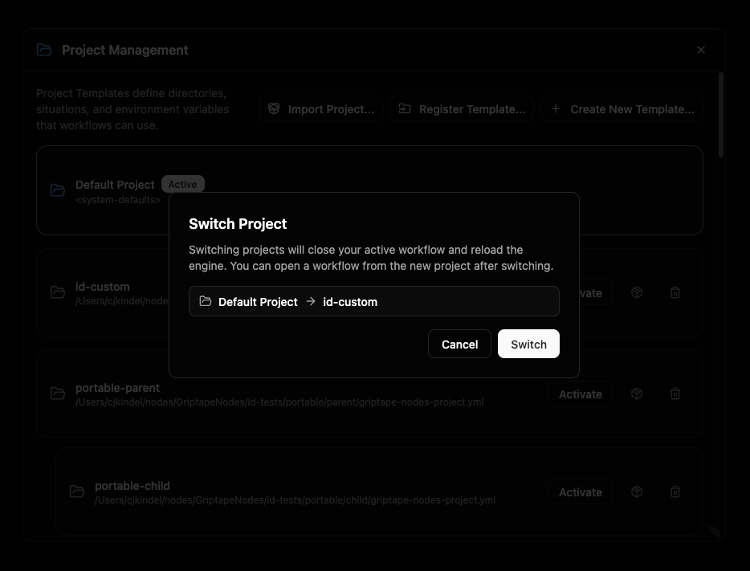

> **전환하면 엔진이 다시 로드됩니다.** 활성 워크플로가 먼저 닫히고(저장되지 않은 변경 사항이 있는 경우 저장하라는 메시지가 표시됨), 새 프로젝트의 워크플로를 표시하도록 워크플로 목록이 새로 고쳐집니다. 전환 후 작업을 계속하려면 새 프로젝트에서 워크플로를 여세요.

전환하려는 프로젝트가 특정 라이브러리 버전을 고정하는 경우, 전환이 이루어지기 전에 설치되거나 변경될 라이브러리를 검토(및 승인)할 수 있도록 **프로비저닝 미리보기(provisioning preview)**가 먼저 나타납니다.

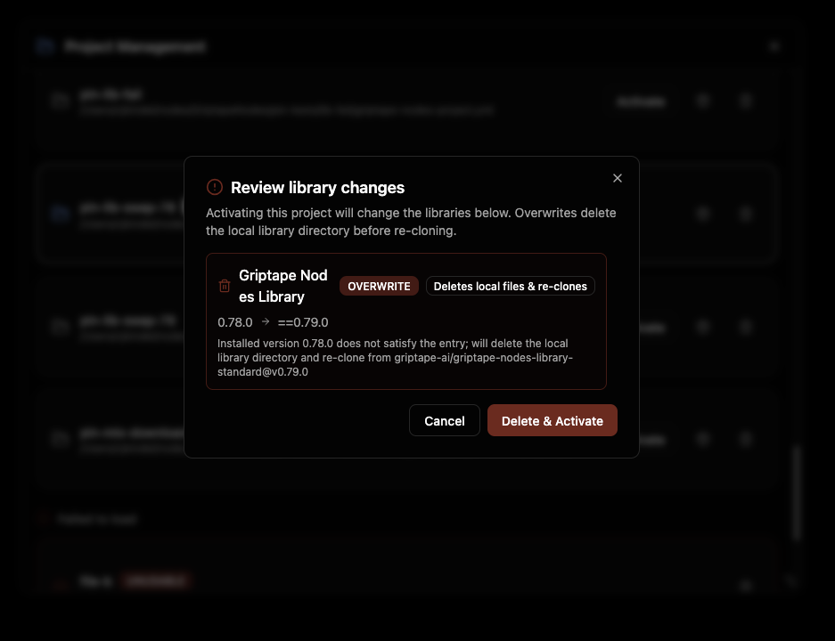

**Switching to <project>…**라는 진행 상태 표시기가 나타나고, 완료되면 **Switched to <project>** 확인 메시지가 표시됩니다.

## 프로젝트 생성하기

**Create New Template…**을 클릭하여 **New Project Template** 대화 상자를 엽니다. 대부분의 프로젝트의 경우 이름만 입력하면 되며, 다른 모든 항목에는 적절한 기본값이 있습니다.

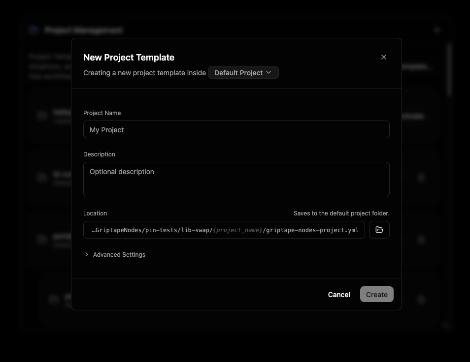

상단의 부제목에는 "Creating a new project template inside *Default Project*."라고 표시됩니다. 강조 표시된 이름은 **Location(위치)**으로, 새 프로젝트가 저장될 프로젝트 폴더를 선택하는 선택기입니다. 기본값은 활성 프로젝트(또는 Default Project)입니다. 다른 폴더를 선택하려면 클릭하세요.

기본 정보를 입력합니다:

- **Project Name**: GUI 전체에 표시되는 사람이 읽을 수 있는 이름입니다. 유일한 필수 필드입니다.
- **Description**: 프로젝트의 용도를 설명하는 선택적 메모입니다.
- **Location**: 프로젝트 파일(`griptape-nodes-project.yml`)이 작성되는 위치입니다. 기본적으로 이 항목은 선택한 위치에 연결되어 `your-project-name/griptape-nodes-project.yml`로 끝나는 읽기 전용 경로로 표시되므로 이름을 입력하면 자동으로 업데이트됩니다. 수동으로 경로를 설정하려면 경로(또는 찾아보기용 폴더 버튼)를 클릭하세요. **Reset** 링크를 누르면 다시 기본값으로 연결됩니다.

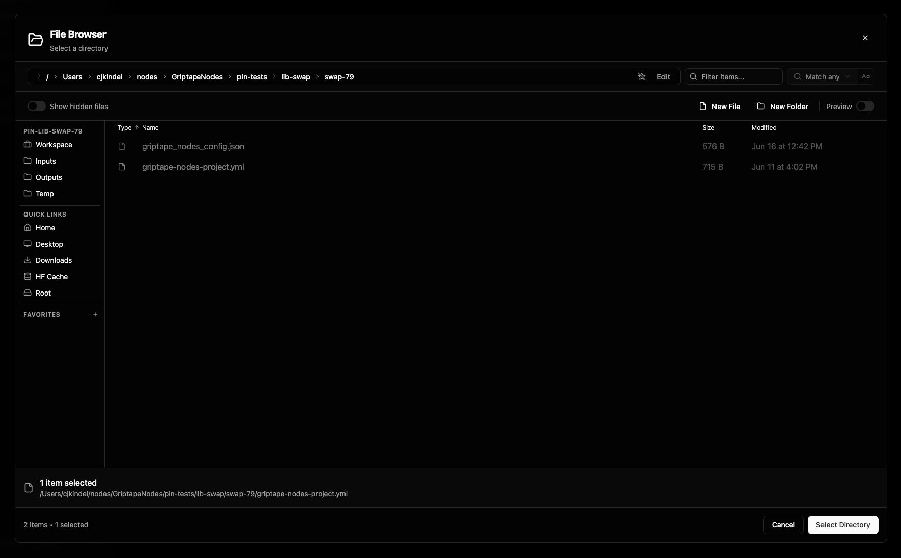

### 고급 설정 (Advanced Settings)

대부분의 아티스트는 이 항목을 열 필요가 없습니다. **Advanced Settings**를 확장하면 다음이 나타납니다:

- **Project ID**: 프로젝트의 고유하고 영구적인 식별자입니다. 이름과 짧은 임의의 접미사로부터 자동 생성되며 그대로 둘 수 있습니다. 직접 입력하려면 클릭하세요(소문자, 숫자, 대시만 사용 가능하며 고유해야 함). 프로젝트가 생성된 후에는 ID를 변경할 수 없습니다.
- **Inherits settings from**: 상위 프로젝트입니다. 하위 프로젝트는 상위 프로젝트의 설정에서 시작하여 변경한 항목만 저장합니다. 기본적으로 위치에 연결되어 있으므로 위치를 선택하면 상위 프로젝트도 설정됩니다. 상속을 원하지 않는 경우 여기서 **Default Project**를 선택하세요. 상속 작동 방식은 [프로젝트](projects.md#상위-프로젝트-parent-projects)를 참조하세요.
- **Workspace directory**: 새 프로젝트가 워크플로와 생성된 파일을 유지하는 위치입니다. 새 프로젝트의 기본값은 `./`(자체 폴더)이므로 자체 포함됩니다. 다른 위치를 가리키도록 변경하거나 비워 두어 상위 프로젝트에서 작업 공간을 상속받도록 하세요. (현재 스키마 프로젝트에만 표시됨. [스키마 버전](projects.md#스키마-버전-schema-versions) 참조.)

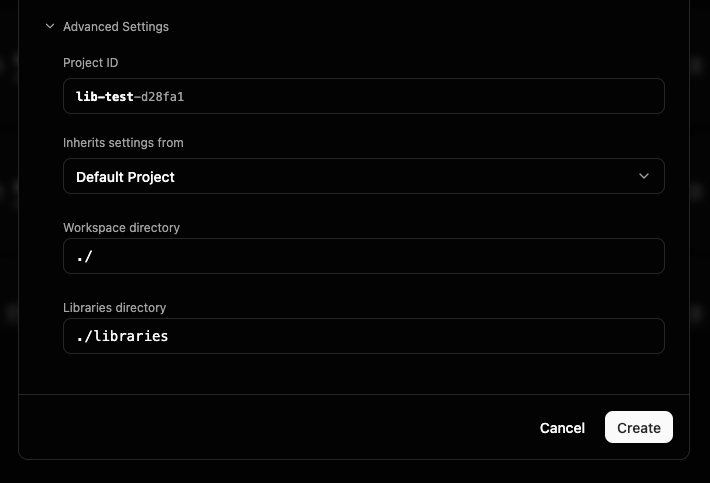

**Create**를 클릭합니다. 진행 패널이 프로젝트 저장, 엔진 등록, 활성화 및 마무리를 순서대로 진행합니다. 프로젝트를 생성하면 해당 프로젝트가 활성 프로젝트가 되므로 엔진이 다시 로드됩니다(전환 시 발생하는 것과 동일한 다시 로드). 저장되지 않은 워크플로가 열려 있는 경우 먼저 저장하라는 메시지가 표시됩니다.

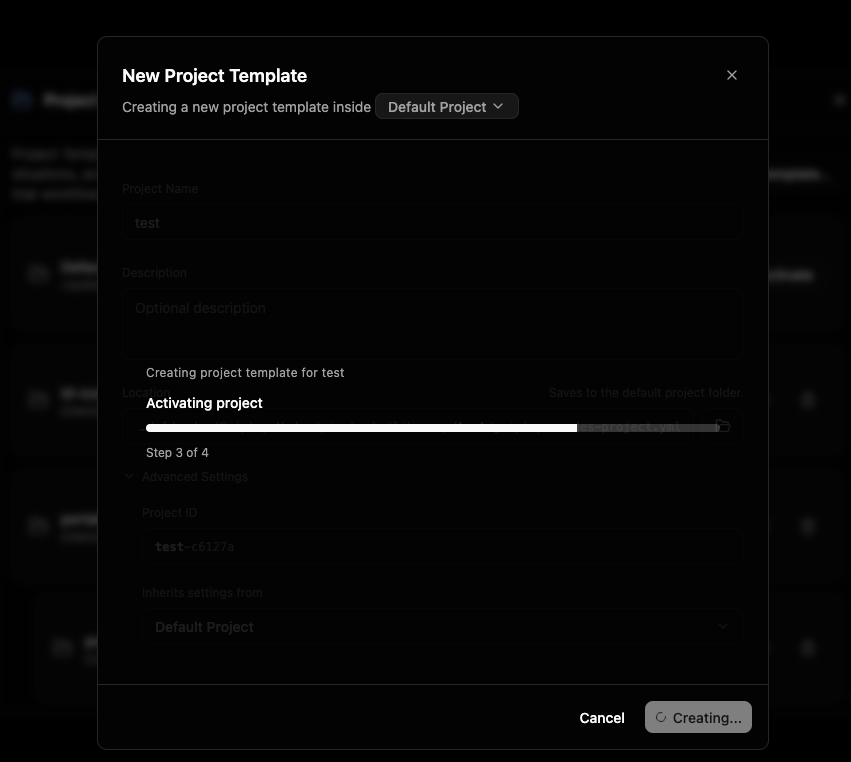

> 위치 또는 상위 프로젝트가 특정 라이브러리 버전을 고정하는 경우, 전환할 때 표시되는 것과 동일한 [프로비저닝 미리보기](#프로젝트-전환하기)가 여기에 나타나 새 프로젝트가 활성화되기 전에 해당 라이브러리를 검토하고 승인할 수 있습니다.

준비가 완료되면 **Project created** 확인 메시지가 나타납니다.

## 프로젝트 조회 및 편집

목록에서 프로젝트를 클릭하여 상세 보기를 엽니다. 헤더에는 프로젝트 이름, 파일 경로(복사 버튼 포함), **Active** 및 **Unsaved changes** 배지가 표시됩니다.

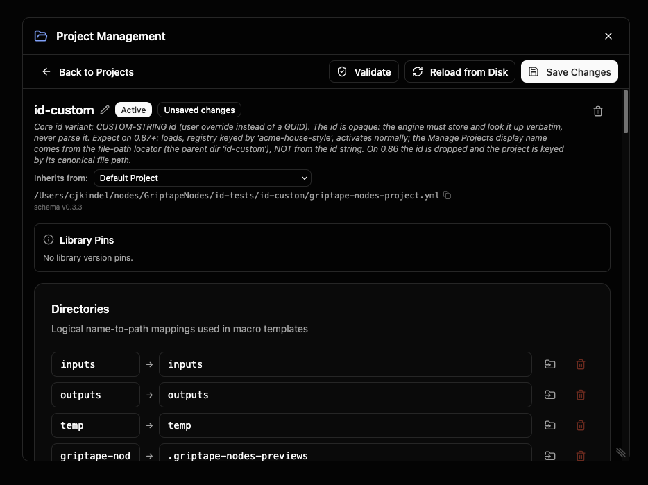

이름 옆의 연필 아이콘을 사용하여 **name**과 **description**을 인라인으로 편집할 수 있습니다.

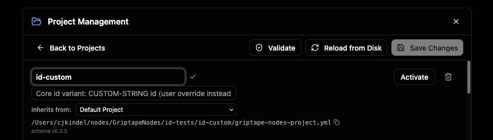

**Inherits from** 드롭다운은 상위 프로젝트를 설정(또는 지움)합니다. 상세 보기에는 프로젝트의 편집 가능한 섹션도 표시됩니다:

### 작업 공간 디렉터리 (Workspace directory)

**Workspace dir** 필드는 이 프로젝트의 작업이 시작되는 위치를 설정합니다. 즉, 상대 경로, 출력 및 다운로드가 확인되는 기준 폴더입니다. 이는 작업 공간을 선택하는 최우선 방법으로 사용자별 설정 및 전역 설정을 오버라이드합니다.

비워 두면 프로젝트는 엔진이 설정에서 계산한 작업 공간을 사용합니다. 비어 있을 때 필드에는 해당 **계산된(calculated)** 경로가 회색 플레이스홀더 텍스트로 표시되므로 아무것도 설정하지 않고도 프로젝트 작업이 어디에 저장될지 확인할 수 있습니다. 작업 공간을 명시적으로 고정하려면 경로를 입력하거나 폴더 버튼을 사용하여 찾아보세요. 디렉터리와 마찬가지로 Linux, macOS, Windows에서 작업 공간에 서로 다른 경로를 지정할 수 있는 플랫폼별 토글이 있습니다.

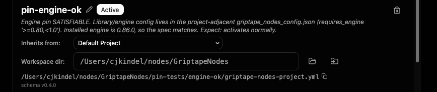

전체 레퍼런스는 [작업 공간 디렉터리](projects.md#작업-공간-디렉터리-workspace-directory) 및 [작업 공간](workspace.md)을 참조하세요.

### 라이브러리 디렉터리 (Libraries directory)

**Libraries dir** 필드는 이 프로젝트가 작업 공간과 별도로 라이브러리를 설치하고 확인하는 위치를 설정합니다. 관련 프로젝트가 각각 자체 복사본을 다시 다운로드하는 대신 하나의 라이브러리 설치 위치를 공유할 수 있도록 설정하세요.

비워 두면 프로젝트는 상위 프로젝트의 라이브러리 디렉터리를 상속하며 체인 위쪽에 선언된 것이 없으면 작업 공간 내부의 `libraries` 폴더로 대체됩니다. 새로운 최상위 프로젝트에는 `./libraries`가 미리 채워져 있어 하위 프로젝트가 기본적으로 해당 공유 위치를 상속받습니다. 하위 프로젝트는 비어 있는 상태로 생성됩니다. 특정 위치를 고정하려면 경로를 입력하거나 폴더 버튼을 사용하여 찾아보세요. 작업 공간 필드와 마찬가지로 Linux, macOS, Windows에서 서로 다른 경로를 설정할 수 있는 플랫폼별 토글이 있습니다.

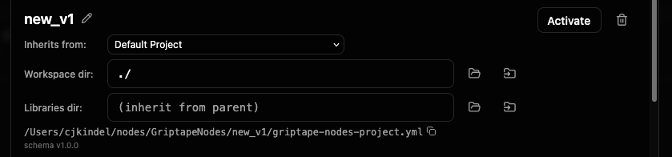

전체 레퍼런스는 [라이브러리 디렉터리](projects.md#라이브러리-디렉터리-libraries-directory)를 참조하세요.

### 디렉터리 (Directories)

**Directories**는 짧은 논리적 이름(예: `outputs`)을 실제 폴더 경로에 매핑합니다. 워크플로와 노드는 이름을 참조하고 프로젝트는 실제로 가리키는 위치를 결정합니다. **Add Directory**를 사용하여 디렉터리를 생성하고 행의 플랫폼별 토글을 사용하여 Linux, macOS, Windows에서 디렉터리에 서로 다른 경로를 지정할 수 있습니다.

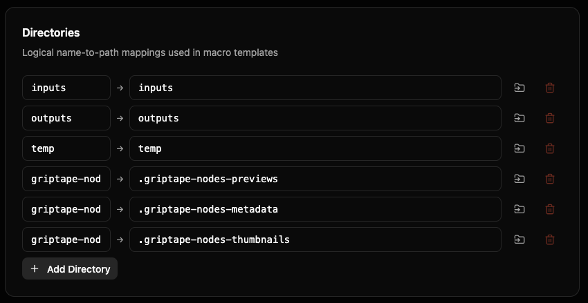

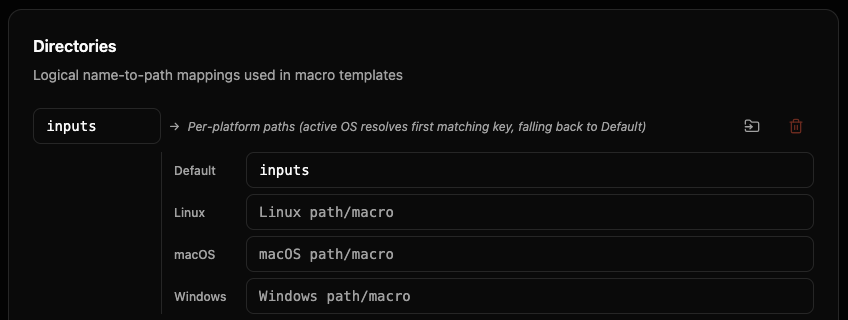

전체 레퍼런스는 [디렉터리](directories.md)를 참조하세요.

### 파일 확장자 디렉터리 (File Extension Directories)

**File Extension Directories**는 확장자를 기반으로 파일을 폴더로 라우팅합니다(예: `png → images`, `mp4 → videos`). 매핑을 추가하거나 편집하려면 섹션을 확장하세요.

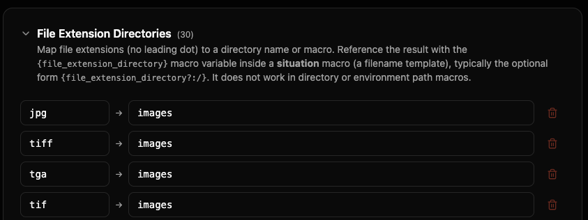

전체 레퍼런스는 [파일 확장자 디렉터리](file_extension_directories.md)를 참조하세요.

### 환경 (Environment)

**Environment**는 이 프로젝트가 제공하는 사용자 정의 키-값 변수 집합입니다. 프로젝트의 다른 곳에서 이를 참조할 수 있습니다. 변수를 추가하려면 **Add Variable**을 사용하세요.

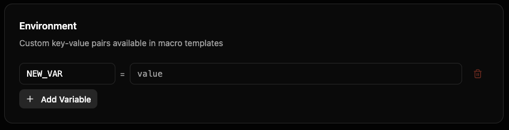

전체 레퍼런스는 [환경 및 내장 변수](environment.md)를 참조하세요.

### 상황 (Situations)

**Situations**는 명명된 파일 저장 시나리오입니다(예: 노드 출력 저장, URL 다운로드). 각 상황에는 경로 템플릿(매크로)과 파일이 이미 존재할 때 수행할 동작에 대한 정책이 있습니다. 상황을 정의하려면 **Add Situation**을 사용하세요.

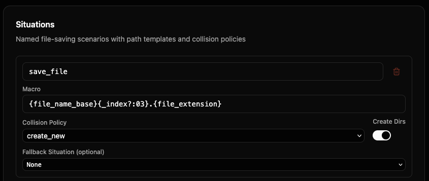

전체 레퍼런스는 [상황](situations.md)을 참조하세요.

### 저장, 유효성 검사 및 다시 로드

상세 보기 상단의 툴바에는 편집 중인 프로젝트에 대한 작업이 있습니다:

- **Validate**: 저장하지 않고 프로젝트에 문제가 있는지 확인합니다. 문제는 필드 및 설명과 함께 나열되며, 문제가 없으면 **Template is valid**로 보고됩니다.
- **Reload from Disk**: 창 내부의 편집 내용을 취소하고 디스크에 저장된 상태로 파일을 다시 로드합니다.
- **Save Changes**: 편집 내용을 프로젝트 파일에 다시 저장합니다. (저장되지 않은 변경 사항이 있는 경우에만 활성화됨.)
- **Upgrade schema**: 프로젝트가 엔진의 현재 스키마 버전보다 이전 버전인 경우에만 나타납니다. 아래의 [프로젝트 스키마 업그레이드](#프로젝트-스키마-업그레이드-upgrading-a-projects-schema)를 참조하세요.
- **Back to Projects**: 목록으로 돌아갑니다. 저장되지 않은 변경 사항이 있는 경우 취소하기 전에 확인을 요청합니다.

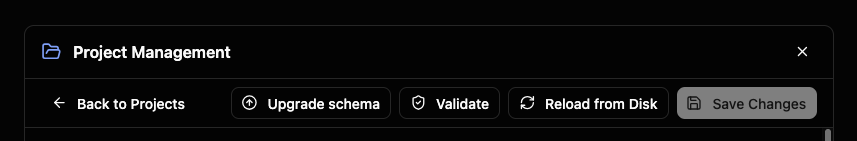

프로젝트가 특정 라이브러리 버전을 고정하는 경우 **Library Pins** 패널에 해당 고정 정보가 표시됩니다.

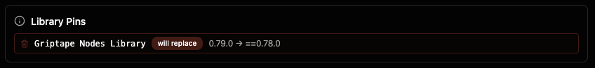

### 프로젝트 스키마 업그레이드 (Upgrading a project's schema)

프로젝트가 엔진이 제공하는 버전보다 이전 메이저 스키마 버전으로 생성된 경우(예: 현재 스키마가 `1.x`인 엔진의 `0.x` 프로젝트), 툴바에 **Upgrade schema** 버튼이 나타납니다. 업그레이드하면 현재 기본값에 프로젝트를 다시 기반으로 설정합니다. 명시적으로 사용자 정의한 설정은 유지되고 이전 기본값으로 남겨둔 모든 항목은 새 기본값을 채택합니다.

이는 **주요 변경 사항(breaking change)**으로, 프로젝트가 작업 공간, 라이브러리 및 저장된 파일을 확인하는 위치가 변경될 수 있으므로 절대 자동으로 발생하지 않습니다. 변경 사항이 작성되기 전에 확인 대화 상자에 결과가 명확히 설명되며 취소할 수 있습니다. (이전 버전을 유지하는 것도 완벽하게 지원되므로 새로운 동작을 원할 때만 업그레이드하세요.)

저장되지 않은 변경 사항이 있는 동안에는 버튼이 비활성화됩니다. 업그레이드는 디스크에서 프로젝트를 다시 읽으므로 먼저 저장하거나 다시 로드하세요.

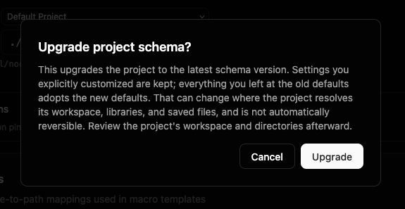

## 기존 프로젝트 등록하기

디스크에 프로젝트 파일이 이미 존재하는 경우(예: 팀에서 공유한 파일), 프로젝트 목록에서 **Register Template…**을 사용하여 해당 `griptape-nodes-project.yml`을 찾아보면 목록에 추가됩니다. 거기서 다른 프로젝트와 마찬가지로 활성화, 조회 또는 편집할 수 있습니다.

## 프로젝트 제거하기

목록에서 프로젝트를 제거하려면 프로젝트를 열고 휴지통 아이콘을 클릭합니다(또는 목록의 해당 행에 있는 휴지통 아이콘 사용). **Remove Template** 대화 상자에서 확인합니다.

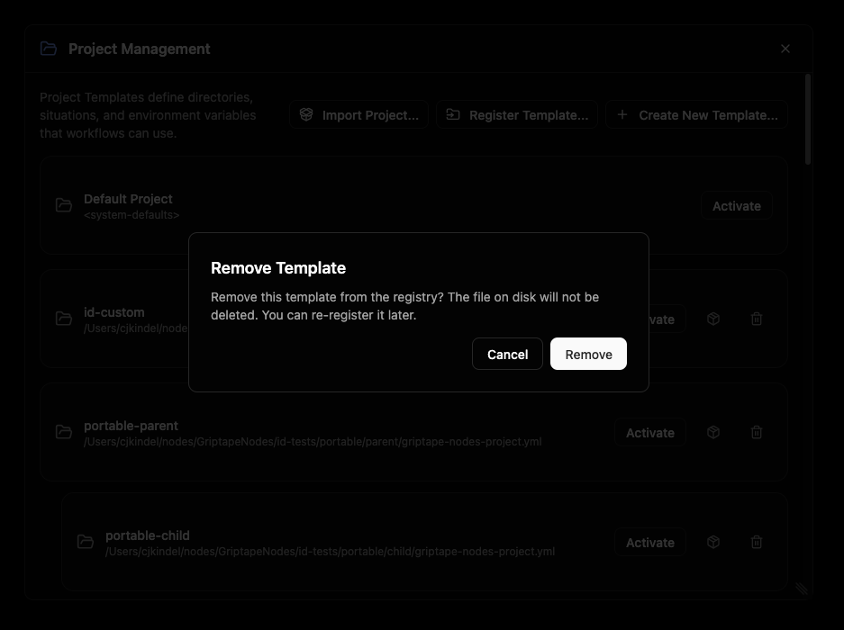

> **제거는 등록만 취소합니다.** 디스크의 프로젝트 파일은 삭제되지 **않으므로** 나중에 **Register Template…**을 사용하여 다시 등록할 수 있습니다.

## 프로젝트 내보내기 및 가져오기

프로젝트를 단일 `.zip` 파일로 패키징하여 다른 머신으로 이동하거나, 팀원에게 전달하거나, 백업으로 보관할 수 있습니다. 패키지에는 프로젝트 파일과 종속된 라이브러리가 함께 번들로 제공되므로 수동 설정 없이 다른 환경에서도 프로젝트가 작동합니다.

> **시크릿 값은 패키지에 포함되지 않습니다.** API 키와 같은 항목은 이름으로만 참조됩니다. 가져온 후 **Settings**에서 해당 시크릿을 직접 설정해야 합니다. 가져오기 대화 상자에 필요한 시크릿이 정확히 나열됩니다.

### 프로젝트 내보내기

프로젝트 목록에서 각 프로젝트의 행에는 작은 패키지 아이콘이 있습니다. 이를 클릭하고 대상 폴더를 선택하면 Griptape Nodes가 해당 위치에 `<project-name>.zip`을 작성합니다. 경로와 함께 확인 메시지가 나타나며 프로젝트가 시크릿에 의존하는 경우 패키지를 가져오는 사람이 제공해야 하는 시크릿 키 이름도 나열됩니다.

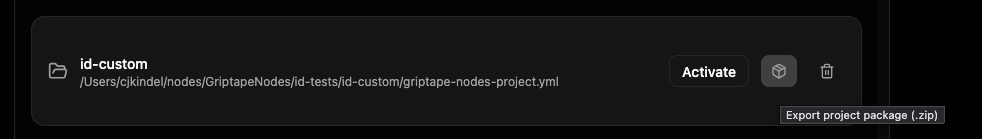

### 프로젝트 가져오기

프로젝트 목록의 오른쪽 상단에서 **Import Project…**를 클릭하고 `.zip` 패키지를 선택합니다. 압축이 풀리기 전에 **Import project** 대화 상자에 내용이 표시됩니다:

- **Package**: 프로젝트의 원래 이름입니다.
- **New project name** (선택 사항): 가져온 사본의 이름을 변경합니다. 원래 이름을 유지하려면 비워 둡니다. 이름 변경은 프로젝트를 브랜칭하거나 복제할 때 유용합니다.
- **Libraries**: 번들된 각 라이브러리로, **bundled**(전체 복사본이 패키지와 함께 이동) 또는 **referenced**(가져올 때 다시 다운로드됨)로 태그가 지정됩니다.
- **Secrets to set**: 이 프로젝트에 필요하지만 환경에 아직 설정되지 않은 시크릿 키입니다. 프로젝트를 실행하기 전에 **Settings**에서 설정하세요.

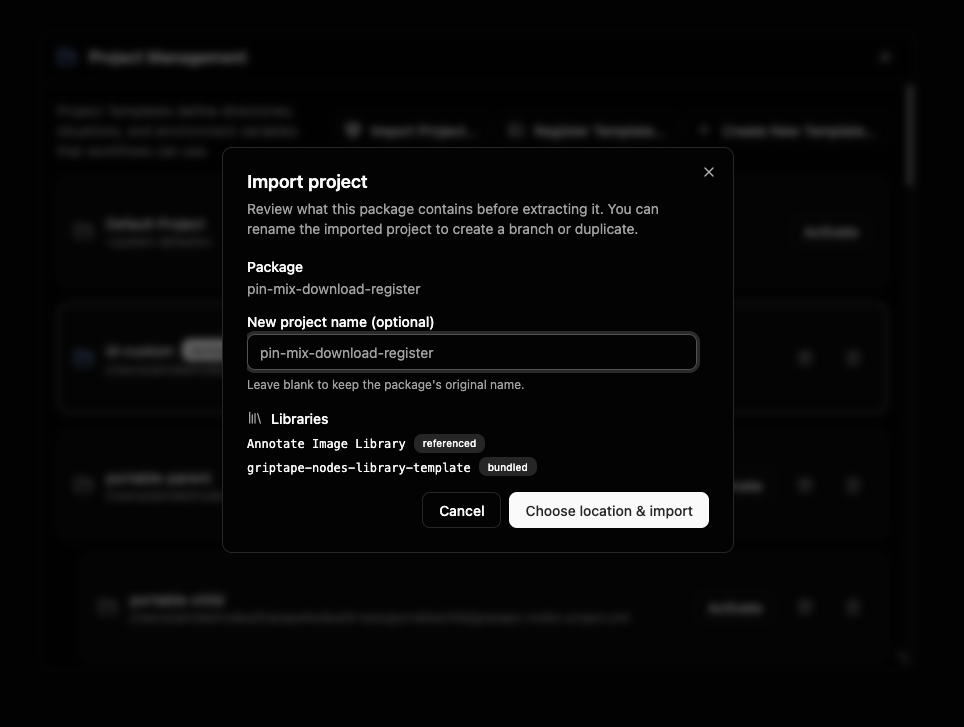

**Choose location & import**를 클릭하고 압축을 풀 폴더를 선택하면 프로젝트가 목록에 등록됩니다. 저장된 위치를 보여주는 확인 메시지가 나타납니다(설정할 시크릿도 다시 알려줌). 가져온 프로젝트가 목록에 추가되지만 자동으로 활성화되지는 **않습니다**. 준비가 되었을 때 전환하세요.

## 기본 프로젝트 (The Default Project)

Griptape Nodes에는 항상 내장된 **Default Project**가 포함되어 있습니다. 읽기 전용으로 조회할 수는 있지만 편집하거나 저장할 수는 없습니다. 열면 배너에 이에 대한 설명이 표시되고 **Create a custom project** 바로가기가 제공되어 자체 디렉터리, 상황 및 변수를 정의할 수 있습니다.

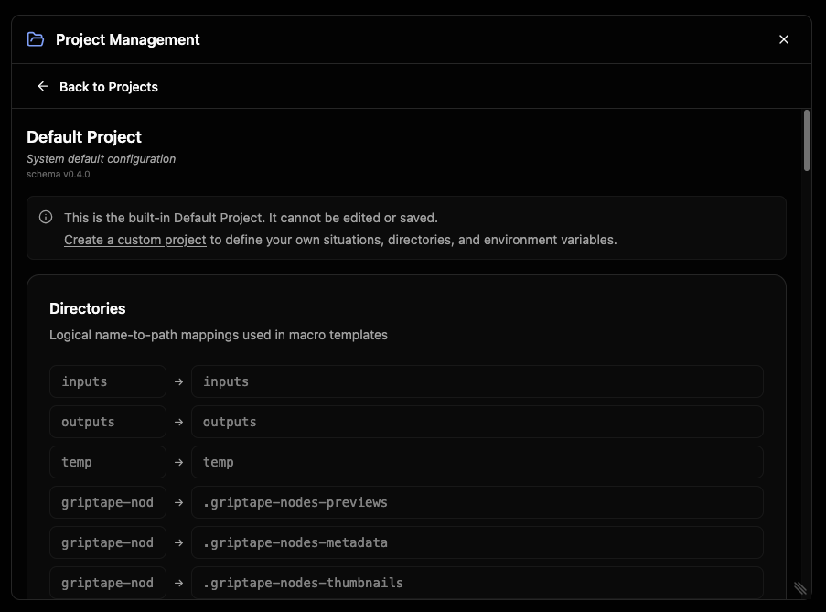

Default Project는 다른 활성 프로젝트가 없을 때 위치하는 프로젝트이기도 합니다.

## 프로젝트의 워크플로 확인하기

워크플로 선택기에는 현재 위치한 프로젝트에 속한 워크플로만 표시되므로 프로젝트를 전환하면 표시되는 워크플로도 전환됩니다.

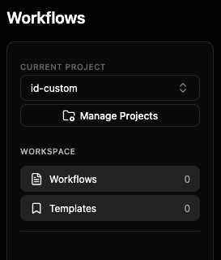

## 다음 단계

- [프로젝트 개요](index.md): 구성 요소의 결합 방식
- [작업 공간](workspace.md): 루트 작업 컨텍스트 및 상대 경로 해석 방법
- [프로젝트](projects.md): 프로젝트 파일 형식, 상위 프로젝트 및 병합 모델
- [버전 고정](version_pinning.md): 프로젝트를 엔진 버전 및 특정 라이브러리 버전에 고정
- [매크로](macros.md): 상황 및 디렉터리에서 사용되는 템플릿 구문
- [디렉터리](directories.md), [상황](situations.md), [파일 확장자 디렉터리](file_extension_directories.md), [환경 및 내장 변수](environment.md)\n