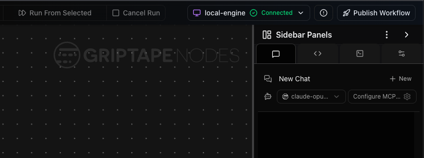
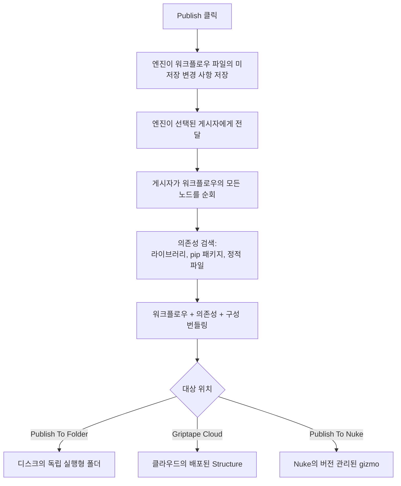

# 워크플로우 게시 (Publishing a workflow)

게시(Publishing)는 저장된 워크플로우를 독립적인 번들(워크플로우와 이에 필요한 라이브러리, Python 의존성, 구성 및 파일)로 변환하여 디스크 폴더, Griptape Cloud의 Structure 또는 Foundry Nuke 내부의 gizmo 등 실행할 수 있는 위치로 전달합니다. 번들을 패키징하고 전달하는 컴포넌트를 *게시자(publisher)*라고 하며 각 대상마다 고유한 게시자가 있습니다.

모든 게시자는 동일한 라이프사이클을 따르며 동일한 방식으로 의존성을 검색합니다. 이 페이지에서는 이러한 공유 동작을 다룬 다음 각 게시자의 차이점을 설명합니다. 게시된 워크플로우에서 로드하는 미디어 파일(이미지, 오디오 클립, 비디오 또는 텍스트 파일)이 누락된 경우 [정적 파일: 번들에 포함되도록 확인하기](#정적-파일-번들에-포함되도록-확인하기) 섹션으로 바로 이동하세요.

## 게시자 (Publishers)

게시 기능은 엔진에 내장되어 있지만 게시자는 노드 라이브러리에서 제공됩니다. 모든 라이브러리가 게시자를 등록할 수 있으므로 표시되는 목록은 설치된 라이브러리에 따라 다릅니다. Griptape는 다음과 같은 몇 가지 기본 게시자를 제공합니다:

| 게시자 (Publisher) | 제공 라이브러리 | 워크플로우가 전달되는 위치 |
| ------------------ | --------------- | -------------------------- |
| **Publish To Folder** | Griptape Nodes Library | 헤드리스로 실행할 수 있는 디스크 상의 독립 실행형 폴더. |
| **Griptape Cloud** | Griptape Cloud Library | 원격으로 실행하고 연동할 수 있는 Griptape Cloud에 배포된 Structure. |
| **Publish To Nuke** | Foundry Nuke Library | Foundry Nuke 설치 환경에 설치되어 Nuke UI에서 실행 가능한 버전 관리된 `.gizmo`. |

게시할 때 사용할 게시자를 선택합니다. 각 게시자는 사용자에게 필요한 옵션을 결정합니다. Publish To Folder는 출력 디렉터리를 묻고, Griptape Cloud는 구성된 클라우드 버킷과 워크플로우의 Griptape Cloud Start Flow 노드에서 대상을 읽으며, Publish To Nuke는 설치할 Nuke 설치 위치와 gizmo 디렉터리, 기존 버전을 업데이트할지 새 버전을 게시할지 묻습니다.

## 게시하기 전에

**Publish Workflow** 버튼은 상단 툴바의 맨 오른쪽, 사이드바 패널 위(엔진 상태 표시기 옆)에 있습니다. 이는 전역 에디터 작업으로, 대화 상자에서 최종적으로 어떤 라이브러리나 게시자를 선택하든 버튼과 위치는 동일합니다.



- **워크플로우를 한 번 이상 저장했어야 합니다.** 그래야 디스크에 파일이 존재합니다. 저장되지 않은 변경 사항은 게시할 때 자동으로 저장되므로 게시 직전에 다시 저장할 필요는 없습니다. 하지만 한 번도 저장되지 않은 워크플로우는 파일 경로가 없어 한 번 저장하기 전에는 게시할 수 없습니다.
- **게시자를 선택합니다.** 워크플로우를 보낼 위치에 대한 게시자를 선택합니다(위 표 참조). 하나의 라이브러리에서만 게시자를 제공하는 경우 자동으로 선택됩니다.
- **게시자의 옵션을 입력합니다.** 게시 대화 상자에는 선택한 게시자가 요구하는 필드(예: Publish To Folder의 출력 디렉터리)가 표시됩니다. 가능한 경우 이전 게시에서 필드가 미리 채워집니다.

## 게시할 때 일어나는 일

어떤 게시자를 선택하든 라이프사이클은 동일합니다. 엔진은 워크플로우 파일에 저장되지 않은 변경 사항을 저장하고 선택한 게시자에게 전달하며, 게시자는 워크플로우를 순회하여 종속된 모든 항목을 검색하고 번들링한 후 대상 위치로 전달합니다:



작업이 진행되는 동안 게시자는 `Copying libraries...` 또는 `Deploying workflow to Griptape Cloud...`와 같은 메시지로 진행 상황을 보고하므로 번들이 결합되는 과정을 지켜볼 수 있습니다.

## 번들에 포함되는 항목

워크플로우가 어디서나 실행되려면 모든 핵심 요소가 필요하므로 모든 게시자는 동일한 핵심 요소를 구성합니다:

- **워크플로우 파일** 자체.
- 워크플로우가 참조하는 **노드 라이브러리** 및 전이적 의존성(해당 라이브러리가 차례로 의존하는 라이브러리이므로 워크플로우가 간접적으로 의존하는 어떤 것도 제외되지 않음).
- 로드할 라이브러리를 엔진에 알리는 **구성**.
- **전체** 작업 공간 환경, 구성된 **모든** 비밀 정보, 게시를 수행하는 셸 환경에 내보내진 비밀 정보를 일반 텍스트(plaintext)로 포함하는 **`.env` 파일**. 아래 보안 경고를 참조하세요.
- 런타임에 [디렉터리 매크로](projects/macros.md) 및 [시츄에이션](projects/situations.md)이 확인될 수 있도록 하는 **프로젝트 템플릿**.
- 워크플로우가 빌드된 엔진 및 라이브러리 버전에 고정된 **Python 의존성**.
- 워크플로우가 이러한 모델을 사용하는 경우 **Hugging Face 모델 다운로드 단계**.

!!! warning "번들에는 모든 비밀 정보가 일반 텍스트로 포함됩니다"

    패키징된 `.env`는 워크플로우가 사용하는 것만으로 필터링되지 **않습니다**. 전체 작업 공간 `.env`와 Secrets Manager에 구성된 모든 비밀 정보(이 워크플로우가 절대 접근하지 않는 서비스의 API 키 포함)를 일반 텍스트로 병합합니다. 또한 게시를 실행하는 셸에서 환경 변수로 설정된 해당 비밀 정보도 가져오며 내보낸 값이 파일의 값보다 우선합니다(엔진 자체가 비밀 정보를 확인하는 것과 동일함). 엔진이 이미 알고 있는 비밀 이름만 환경에서 읽으며 전체 환경 변수를 모두 읽지는 않습니다. 게시된 폴더를 전달받는 사람(또는 gizmo가 설치된 머신의 모든 사용자)은 이러한 모든 자격 증명을 얻게 됩니다. **게시된 번들을 공유하기 전에 번들링된 `.env`를 검토하고 워크플로우에 필요하지 않은 항목을 제거하세요.**

차이점은 전달되는 결과물의 *형태(shape)*입니다:

- **Publish To Folder**는 이를 디스크의 폴더에 기록하고 `run.py` 진입점 및 `README.md`를 추가합니다. README에는 의존성 설치(`uv sync`) 및 워크플로우 실행(`uv run python run.py --help`)이 설명되어 있습니다.
- **Griptape Cloud**는 이를 Structure 패키지로 압축하여 업로드하고 계정에 Structure를 생성하거나 업데이트합니다. 또한 웹훅 연동을 생성할 수 있으며 배포된 Structure를 호출하는 데 사용할 수 있는 별도의 *executor* 워크플로우를 생성합니다. 성공하면 Griptape Cloud 콘솔의 Structure 링크를 반환합니다.
- **Publish To Nuke**는 이를 버전 관리된 `.gizmo`(및 실행 스크립트)로 선택한 Nuke 설치의 gizmo 디렉터리에 설치하고 Nuke 툴바에 Griptape 하위 메뉴를 추가하여 Nuke 내부에서 워크플로우를 실행할 수 있도록 합니다. 동일한 워크플로우를 다시 게시하면 현재 버전을 업데이트하거나 새 버전을 추가하며 출력은 Nuke 스크립트 옆에 저장되도록 라우팅됩니다.

## 의존성이 검색되는 방식

게시자는 워크플로우의 모든 노드를 순회하며 각 노드에 의존하는 항목을 묻습니다. 전체 워크플로우에 걸쳐 세 가지 종류의 의존성을 집계합니다:

- **라이브러리(Libraries)** — 사용 중인 노드 라이브러리의 이름과 버전. 이는 종속된 라이브러리와 함께 항상 수집됩니다.
- **Python (pip) 의존성** — 참조된 각 라이브러리가 매니페스트에 선언한 Python 패키지로, 워크플로우가 빌드된 환경을 번들이 재현할 수 있도록 고정됩니다.
- **정적 파일(Static files)** — 노드가 프로젝트에서 읽는 미디어 및 데이터 파일(이미지, 오디오, 비디오, 텍스트 등). 이는 노드가 의존성으로 **선언한 경우에만** 번들링됩니다.

마지막 지점은 게시 시 예상치 못한 문제가 발생할 수 있는 부분이며 모든 게시자에게 동일하게 적용됩니다.

## 정적 파일: 번들에 포함되도록 확인하기

!!! warning "참조된 파일이 번들에서 누락될 수 있습니다"

    정적 파일은 해당 파일을 사용하는 노드가 의존성으로 *선언*한 경우에만 번들에 포함되며 모든 노드가 그렇게 선언하지는 않습니다. 노드가 파일을 로드하지만 선언하지 않으면 해당 파일은 **제외**되며 게시된 워크플로우가 존재하지 않는 파일을 읽으려고 할 때 오류가 발생합니다. 이는 어떤 게시자를 사용하든 마찬가지입니다.

파일이 번들에 포함되도록 보장하는 안정적인 방법은 [Griptape Nodes Library](https://github.com/griptape-ai/griptape-nodes-library-standard)와 함께 제공되는 **`SelectFromProject`** 노드를 통해 라우팅하는 것입니다:

1. `SelectFromProject` 노드를 추가하고 `selected_path` 입력을 포함하려는 파일(또는 디렉터리)로 설정합니다.
1. `project_path` 출력을 파일을 사용하는 노드에 연결합니다.

`SelectFromProject`는 `selected_path`를 정적 파일 의존성으로 명시적으로 선언하므로 게시자는 항상 해당 파일을 번들에 포함합니다. 이를 통해 파일을 전달하면 게시된 워크플로우와 함께 파일이 이동하도록 보장할 수 있습니다.

!!! tip "프로젝트 내부의 파일은 이식성을 유지합니다"

    선택한 파일이 프로젝트 내부에 있는 경우 `SelectFromProject`는 절대 경로가 아닌 프로젝트 상대 [매크로](projects/macros.md) 경로로 이를 확인합니다. 이렇게 하면 번들이 다른 머신으로 이동하거나 클라우드에 배포된 후에도 참조가 유효하게 유지됩니다.

!!! warning "프로젝트 폴더 외부의 파일은 이동하지 않습니다"

    번들과 함께 이동하는 폴더 외부에서 접근하는 파일(외부 드라이브 또는 네트워크 마운트, 직접 참조되었든 해당 위치를 가리키는 [디렉터리](projects/directories.md)를 통해 참조되었든)은 번들 내부에 포함되지 않으므로 원래 위치에 그대로 남아 있습니다. 게시된 워크플로우는 여전히 동일한 절대 경로에서 파일을 찾으므로 해당 경로가 존재하는 곳에서는 실행되고 존재하지 않는 곳에서는 실패합니다.

    이는 렌더 팜이 이미 마운트하고 있는 공유 스토리지에 적합한 방식입니다. 번들과 함께 이동해야 하는 파일의 경우 프로젝트 폴더로 복사하고 해당 복사본을 참조하세요.

    제외된 각 파일은 사유와 함께 엔진 로그에 `will not be bundled because ...`로 기록됩니다. 게시된 워크플로우에서 필요한 파일을 찾을 수 없는 경우 해당 로그 라인이 문제 해결의 시작점입니다. [엔진 로그 내보내기](../troubleshooting.md#엔진-로그-내보내기)를 참조하세요.

**언제 이것이 필요한가요?** 노드가 읽지만 게시 후 누락되는 이미지, 오디오 클립, 비디오 또는 텍스트 파일과 같이 게시된 번들에 나타나지 않는 프로젝트 로드 파일에 `SelectFromProject`를 사용하세요.

노드를 직접 작성하는 경우 사용자가 이 해결 방법을 사용할 필요가 없도록 노드가 사용하는 파일을 선언하도록 작성하는 것이 영구적인 해결책입니다. 아래 [라이브러리 작성자를 위한 안내](#라이브러리-작성자를-위한-안내)를 참조하세요.

## 라이브러리 작성자를 위한 안내

게시 기능은 확장 가능합니다. 노드 라이브러리는 모든 대상을 대상으로 하는 자체 게시자를 제공할 수 있으며 해당 노드는 필요한 파일을 정확하게 선언할 수 있습니다.

**게시자 등록.** 라이브러리는 `AdvancedNodeLibrary`를 서브클래싱하고 `after_library_nodes_loaded`에서 `LibraryManager.on_register_event_handler(...)`를 통해 `PublishWorkflowRequest`에 대한 핸들러를 등록합니다. 등록 시 라이브러리 자체의 시작/종료 플로우 노드 유형(및 선택적으로 대화 상자 필드를 제공하는 `get_publish_options` 콜백)도 지정합니다. 핸들러는 게시 대화 상자에서 선택 가능한 게시자가 됩니다. 몇 가지 참조 구현이 존재합니다:

- **Publish To Folder** — [Griptape Nodes Library](https://github.com/griptape-ai/griptape-nodes-library-standard)(`griptape_nodes_library_advanced.py`): 출력 디렉터리에 대한 게시 옵션을 제공하고 로컬 폴더로 패키징합니다.
- **Griptape Cloud** — [Griptape Cloud Library](https://github.com/griptape-ai/griptape-nodes-library-griptape-cloud)(`griptape_cloud_library_advanced.py`): 자체 `GriptapeCloudStartFlow`/`GriptapeCloudEndFlow` 노드 유형을 등록하고 디스크 대신 클라우드에 배포합니다.
- **Publish To Nuke** — [Foundry Nuke Library](https://github.com/griptape-ai/griptape-nodes-library-nuke)(`nuke_library_advanced.py`): `NukeStartFlow`/`NukeEndFlow` 노드 유형을 등록하고, 다중 필드 대화 상자(종속 및 버전 관리 필드 포함)를 제공하며, 공통 요소를 위한 공유 패키징 도구를 재사용하고 자체 Nuke 전용 설치를 수행합니다.

게시자는 원하는 방식으로 번들을 전달할 수 있으며, 엔진은 `PublishWorkflowRequest`를 처리하고 결과를 반환하기만 하면 됩니다. 공통 구성 요소를 번들링해야 하는 게시자는 해당 로직을 다시 구현하는 대신 엔진의 `WorkflowPackager`(Folder 및 Nuke 게시자가 수행하는 방식)를 재사용할 수 있습니다.

**노드 의존성 선언.** 위의 정적 파일 누락 문제에 대한 영구적인 해결책은 각 노드가 사용하는 파일을 선언하는 것이며, 이는 *모든* 게시자에게 도움이 됩니다. `get_node_dependencies()`를 오버라이드하고 파일을 `NodeDependencies.static_files`에 추가하세요. 노드가 이를 수행하면 게시자가 해당 파일을 자동으로 번들링하므로 `SelectFromProject` 해결 방법이 필요하지 않습니다:

```python
def get_node_dependencies(self) -> NodeDependencies | None:
    deps = super().get_node_dependencies()
    if deps is None:
        deps = NodeDependencies()
    value = self.get_parameter_value("path")
    if value and isinstance(value, str):
        deps.static_files.add(value)
    return deps
```

라이브러리 및 위젯 의존성이 유지되도록 항상 `super().get_node_dependencies()`를 먼저 호출한 다음 자체 의존성을 추가하세요.

이를 올바르게 수행하는 노드의 예는 [Griptape Nodes Library](https://github.com/griptape-ai/griptape-nodes-library-standard)(`griptape_nodes_library/files/select_from_project.py`)의 `SelectFromProject`를 확인하세요. 이 노드는 `selected_path`를 정적 파일 의존성으로 선언하므로 이를 통해 라우팅된 파일이 번들에 포함되도록 보장합니다. 일반적인 노드 개발에 대해서는 [커스텀 노드 개발 문서](../development/custom_nodes/index.md)를 참조하세요.
