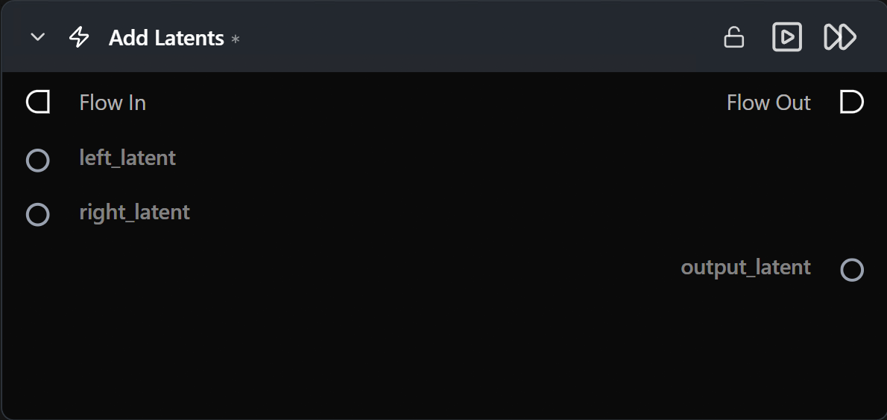

# Add Latents

**두 개의 잠재(latent) 텐서에 대한 요소별(elementwise) 합산 연산을 수행합니다.**

카테고리: `ModularDiffusion/Transform`

## 어떤 노드인가요?

- 요소별 연산: `output = left_latent + right_latent`.
- 두 입력은 동일한 형태(shape) 및 잠재 공간(latent space)을 공유해야 합니다(즉, 동일한 파이프라인 유형에서 생성되어야 함).
- 주요 용도: 노이즈가 제거된(denoised) 두 잠재 텐서 혼합, 제어된 노이즈 주입, 단계 간 잔차(residual) 추가.

## 일반적인 워크플로우 위치

```text
Generate Media Latents (A) ─┐
                            ├─→ [Add Latents] → Generate / Decode
Generate Media Latents (B) ─┘
```

## 노드 미리보기



### 입력 (Inputs)

| 이름 | 유형 | 필수 여부 | 설명 |
| --- | --- | --- | --- |
| `left_latent` | `LatentArtifact` | 예 | 좌측 잠재 텐서입니다. |
| `right_latent` | `LatentArtifact` | 예 | 우측 잠재 텐서입니다. `left_latent`와 형태(shape)가 일치해야 합니다. |

### 출력 (Outputs)

| 이름 | 유형 | 설명 |
| --- | --- | --- |
| `output_latent` | `LatentArtifact` | `left + right` 결과 텐서입니다. |

## 팁 및 주의사항

- **두 입력의 형태(shape)가 동일해야 합니다.** 크기가 다른 경우 입력 중 하나를 먼저 크기 조정(resize)하거나 업샘플링하세요.
- **동일한 파이프라인 계열 내에서 잠재 텐서를 유지하세요.** 각 모델은 서로 다른 잠재 공간을 사용하므로, 서로 다른 계열(예: Flux와 SDXL) 간에 잠재 텐서를 혼합하면 비정상적인 결과가 생성됩니다.

## 관련 항목

- [Subtract Latents](subtract_latents.md) · [Multiply Latents](multiply_latents.md) · [Latents Composite Mask](latents_composite_mask.md)
