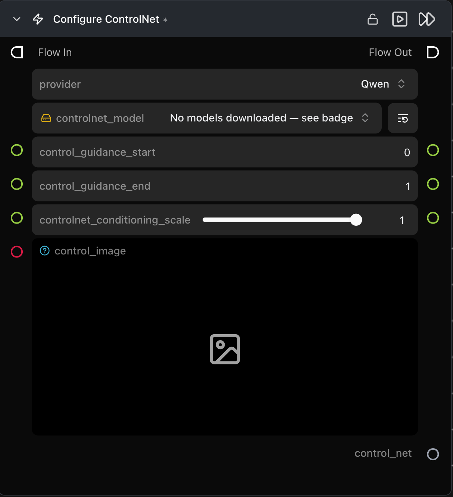

# Configure ControlNet

**ControlNet Pipeline 노드와 함께 사용할 단일 ControlNet 항목(모델, 제어 이미지, 컨디셔닝 강도)을 구성합니다.**

카테고리: `ModularDiffusion/Conditioning`

## 어떤 노드인가요?

- 먼저 `provider`를 선택하세요. 나머지 파라미터는 **동적(dynamic)**으로 제공업체에 따라 다시 생성됩니다.
- 하나의 노드는 하나의 ControlNet에 해당합니다. 여러 개를 중첩(stack)하려면 여러 노드를 배치하고 각 `control_net` 출력을 [ControlNet Pipeline](controlnet_pipeline.md) 노드의 `control_nets` 리스트 입력에 연결하세요.
- 지원되는 제공업체: **Flux, Qwen, Stable Diffusion, Z-Image** 등.

## 일반적인 워크플로우 위치

```text
Load Image → [Configure ControlNet] → ControlNet Pipeline → Generate Media Latents
```

## 노드 미리보기



### 입력 (Inputs)

| 이름 | 유형 | 필수 여부 | 설명 |
| --- | --- | --- | --- |
| `control_image` | `ImageArtifact` / `ImageUrlArtifact` | 예 | 제어 신호 이미지(Canny 엣지, 뎁스 맵, 포즈 등 — 사용되는 ControlNet 모델에 따라 다름). |
| `controlnet_conditioning_scale` | float (0.0–1.0) | 아니요 | 이 ControlNet의 영향력 강도 (기본값: `1.0`). |
| `controlnet_model` | HF repo picker | 예 | 사용할 ControlNet 모델. 제공업체에 따라 선택 항목이 업데이트됩니다. |

### 출력 (Outputs)

| 이름 | 유형 | 설명 |
| --- | --- | --- |
| `control_net` | `control_net` (dict) | ControlNet Pipeline 노드로 전달할 설정 항목입니다. |

### 제공업체 / 모델별 동작

모델 드롭다운 및 추가 파라미터는 제공업체마다 달라집니다. 주요 추가 항목:

- **Flux** — `control_mode` (`canny`, `tile`, `depth`, `blur`, `pose`, `gray`, `low_quality`), `control_guidance_start`, `control_guidance_end`.
- **Qwen / Stable Diffusion / Z-Image** — 제공업체별 전용 모델 리포지토리 및 컨디셔닝 조절 파라미터.

## 팁 및 주의사항

- **제공업체가 기본 파이프라인과 일치해야 합니다.** SDXL 파이프라인에 연결된 Flux ControlNet은 ControlNet Pipeline 노드의 유효성 검사기에서 거부됩니다.
- **제어 이미지를 상류(upstream)에서 전처리하세요.** 이전 노드에서 감지기(Canny, 뎁스 추정기, 포즈 감지 등)를 실행하고 그 결과를 직접 연결하세요. 이 노드는 전처리가 완료된 제어 이미지를 입력받습니다.
- **`controlnet_conditioning_scale`은 ControlNet별로 적용됩니다.** 여러 개를 중첩할 때 각 노드는 고유한 가중치를 가집니다.

## 관련 항목

- [ControlNet Pipeline](controlnet_pipeline.md) — 필수 다운스트림 노드.
- 워크플로우 템플릿: `workflows/templates/ControlnetText2Image.py`.
