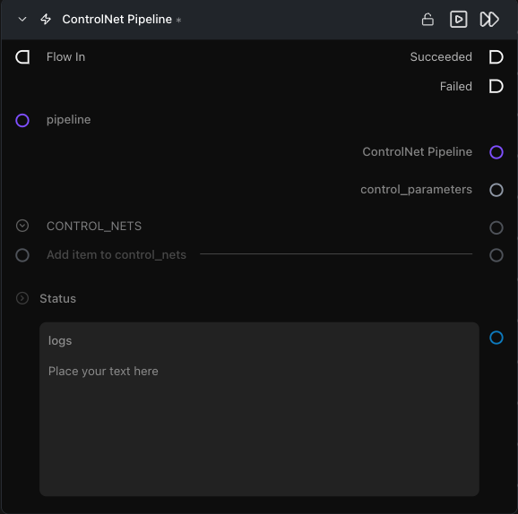

# ControlNet Pipeline

**생성 시점에 ControlNet 입력을 받을 수 있도록 빌드된 파이프라인을 래핑(wrapping)합니다.**

카테고리: `ModularDiffusion/Pipeline`

## 어떤 노드인가요?

- [Pipeline Builder](pipeline_builder.md)와 [Generate Media Latents](generate_media_latents.md) **사이에 위치**하며, 캐시된 파이프라인을 ControlNet 변형 파이프라인으로 다시 연결합니다.
- 하나 이상의 [Configure ControlNet](configure_controlnet.md) 노드에서 생성된 `control_net` 설정 목록을 입력받습니다. 모델이 허용하는 경우(예: Flux Union) 여러 ControlNet의 중첩(stacking)을 지원합니다.
- 출력 유형: `Pipeline Config` — 다운스트림에서 기본 파이프라인을 대체하여 직접 연결할 수 있습니다.

## 일반적인 워크플로우 위치

```text
Pipeline Builder → [ControlNet Pipeline] → Generate Media Latents → Decode Media Latent
Configure ControlNet ─┘
Configure ControlNet ─┘
```

## 노드 미리보기



### 입력 (Inputs)

| 이름 | 유형 | 필수 여부 | 설명 |
| --- | --- | --- | --- |
| `pipeline` | `Pipeline Config` | 예 | 기본 [Pipeline Builder](pipeline_builder.md)에서 생성된 파이프라인. 이미 ControlNet 파이프라인인 상태여서는 **안 됩니다**. |
| `control_nets` | `list[control_net]` | 예 | [Configure ControlNet](configure_controlnet.md)에서 생성된 하나 이상의 항목. 모든 항목은 기본 파이프라인의 제공업체와 일치해야 합니다. |

### 출력 (Outputs)

| 이름 | 유형 | 설명 |
| --- | --- | --- |
| `controlnet_pipeline` | `Pipeline Config` | ControlNet 연결이 완료된 파이프라인 아티팩트입니다. |
| `control_parameters` | `control_parameters` | 연결된 모든 ControlNet 설정을 그대로 전달합니다. Generate Media Latents 노드의 `controlnet_parameters` 입력에 연결하세요. |
| `logs` | `str` | 확인된 구성 해시(config hash)를 포함한 빌드 로그입니다. |

## 팁 및 주의사항

- **제공업체가 일치해야 합니다.** 각 ControlNet의 `provider`는 기본 파이프라인의 provider와 동일해야 합니다. 노드는 실행 전에 이 일치 여부를 검증합니다.
- **파이프라인 클래스 호환성.** 모든 기본 파이프라인이 ControlNet 중첩을 지원하는 것은 아닙니다. 노드는 실행 전에 드라이버를 검증하고 지원되지 않는 조합인 경우 오류를 표시합니다.
- **단일 노드 내에서 여러 ControlNet을 중첩하세요.** 두 개의 ControlNet Pipeline 노드를 직렬로 체이닝하지 말고, 하나의 ControlNet Pipeline 노드에 여러 개의 `control_nets` 항목을 연결하세요. 입력이 이미 ControlNet 아티팩트인 경우 두 번째 노드에서 오류가 발생합니다.
- **파이프라인 재사용:** 선택된 `control_nets`에 대한 ControlNet 가중치가 로드될 수 있으며, 기본 파이프라인 자체는 사용 가능한 경우 캐시에서 재사용됩니다.

## 관련 항목

- [Configure ControlNet](configure_controlnet.md) — 이 노드가 사용하는 `control_net` 항목을 생성합니다.
- [Modular Diffusion Pipeline Builder](pipeline_builder.md) — 필수 업스트림 노드.
- 워크플로우 템플릿: `workflows/templates/ControlnetText2Image.py`.
