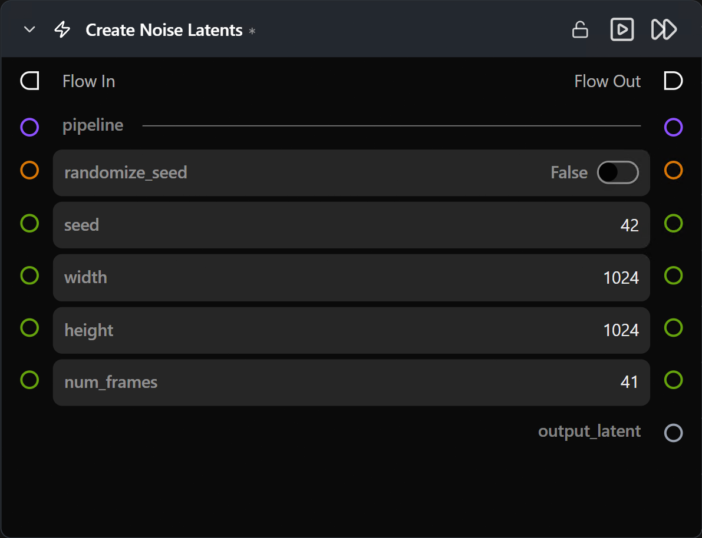

# Create Noise Latents

**연결된 파이프라인의 예상 형태(shape)와 일치하는 랜덤 노이즈 잠재 텐서를 생성합니다. 일반적인 텍스트 투 이미지(Text-to-Image) / 텍스트 투 비디오(Text-to-Video) 워크플로우의 시작점입니다.**

카테고리: `ModularDiffusion/Create`

## 어떤 노드인가요?

- 순수 텍스트 투 이미지 / 텍스트 투 비디오 워크플로우를 위해 **Pipeline Builder**와 **Generate Media Latents** 사이에 배치합니다.
- `width` / `height`는 픽셀 공간 기준이며, 노드 내부에서 VAE 다운스케일링을 자동으로 처리합니다.
- `num_frames`는 연결된 파이프라인이 비디오 파이프라인(LTX, LTX2, WAN)일 때만 나타납니다. 이미지 파이프라인에서는 숨겨집니다.
- `seed`는 재현성을 제어합니다 — 동일한 시드 + 동일한 파이프라인 + 동일한 차원 → 동일한 잠재 텐서 생성.

## 일반적인 워크플로우 위치

```text
Pipeline Builder → [Create Noise Latents] → Generate Media Latents → Decode Media Latent
```

## 노드 미리보기



### 입력 (Inputs)

| 이름 | 유형 | 필수 여부 | 설명 |
| --- | --- | --- | --- |
| `pipeline` | `Pipeline Config` | 예 | Pipeline Builder에서 전달받습니다. 형태(shape), VAE 스케일 팩터 및 `num_frames` 표시 여부를 결정합니다. |

### 출력 (Outputs)

| 이름 | 유형 | 설명 |
| --- | --- | --- |
| `output_latent` | `LatentArtifact` | 언팩 및 정규화(~N(0,1))된 노이즈 텐서입니다. Generate Media Latents 노드로 전달합니다. |

### 파라미터 (Parameters)

| 이름 | 유형 | 기본값 | 설명 |
| --- | --- | --- | --- |
| `width` | int (픽셀) | `1024` | 픽셀 공간 가로 크기. 내부적으로 VAE 스케일 팩터로 나뉩니다. |
| `height` | int (픽셀) | `1024` | 픽셀 공간 세로 크기. |
| `num_frames` | int | `41` | 비디오 프레임 수. **이미지 파이프라인에서는 숨겨집니다.** |
| `seed` | int | random | 결과의 재현성을 위한 시드 값. |
| `num_inference_steps` | int | `20` | **SDXL에만 표시됨** — SDXL에서 초기 노이즈의 스케일을 조정하는 데 사용됩니다. 다른 파이프라인에서는 무시됩니다. |

## 팁 및 주의사항

- **`width` / `height`는 VAE 배수 요구 사항을 준수해야 합니다.** 대부분의 VAE는 8 또는 16의 배수를 요구합니다. 올바른 형태를 유지하려면 표준 규격 치수(512, 768, 1024 등)를 선택하세요.
- **서로 다른 파이프라인 간의 동일 시드 ≠ 동일 이미지.** 잠재 형태와 VAE 공간은 모델마다 다르므로 시드는 동일한 파이프라인 유형 내에서만 의미가 있습니다.
- **Image-to-Image 또는 재디퓨전(rediffusion)의 경우 [Encode Media Latent](encode_media_latent.md)를 사용하세요.** 기존 이미지를 인코딩하면 조건화된 시작점이 생성되며, 선택적으로 `add_noise=True` 설정과 함께 Generate Media Latents에 연결할 수 있습니다.

## 관련 항목

- [Create Empty Latents](empty_latents.md) — 마스크 합성 또는 특정 다단계 기법을 위한 0으로 채워진 잠재 변형.
- [Encode Media Latent](encode_media_latent.md) — 이미지 / 비디오 → 잠재 텐서 변환.
- [Generate Media Latents](generate_media_latents.md) — 일반적인 다운스트림 노드.
