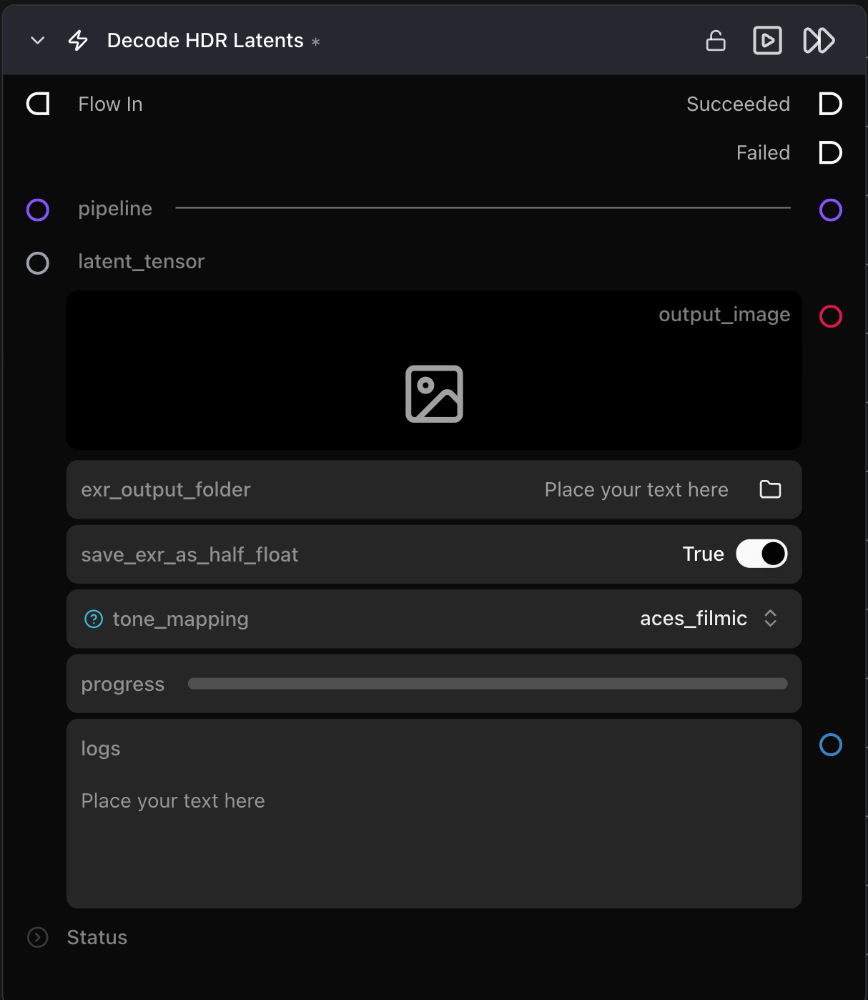

# Decode HDR Latents

**HDR 잠재 텐서를 디코딩하고 톤 매핑(tone mapping)을 적용하며, 선택적으로 원시 선형(raw linear) EXR 프레임 시퀀스를 내보냅니다.**

카테고리: `ModularDiffusion/Encode\Decode`

## 어떤 노드인가요?

- [Decode Media Latent](decode_media_latent.md)를 확장한 노드입니다: 동일한 입력 및 동적 이미지/비디오 출력과 함께 HDR 비디오 파이프라인(예: LTX 2.3 HDR)을 위한 톤 매핑 및 EXR 내보내기 기능을 제공합니다.
- 출력은 항상 톤 매핑된 SDR 이미지 또는 MP4 비디오입니다 — 톤 매핑이 적용되기 전의 원시 선형 HDR 프레임을 OpenEXR 시퀀스로 저장하려면 `exr_output_folder`를 설정하세요.
- 표준(비 HDR) 파이프라인은 Decode Media Latent와 동일하게 작동하며 톤 매핑이 적용되지 않습니다.
- HDR 출력은 선형 `np.ndarray` 프레임을 반환하는 파이프라인 드라이버(LTX 2.3 HDR)에만 적용되며, 다른 모든 파이프라인은 표준 디코드 경로를 사용합니다.

## 일반적인 워크플로우 위치

```text
Generate Media Latents → [Decode HDR Latents] → Save Image / Save Video
```

## 노드 미리보기



### 입력 (Inputs)

| 이름 | 유형 | 필수 여부 | 설명 |
| --- | --- | --- | --- |
| `pipeline` | `Pipeline Config` | 예 | 잠재 텐서를 생성한 파이프라인과 일치해야 합니다. 선형 프레임 출력을 얻으려면 HDR 지원 모델(예: LTX 2.3 HDR)을 사용하세요. |
| `latent_tensor` | `LatentArtifact` | 예 | 디코딩할 잠재 텐서입니다. |

### 출력 (Outputs)

| 이름 | 유형 | 설명 |
| --- | --- | --- |
| `output_image` | `ImageArtifact` | 톤 매핑된 이미지. 이미지 파이프라인인 경우 표시됩니다. |
| `output_video` | `VideoUrlArtifact` | 톤 매핑된 MP4 비디오. 비디오 파이프라인인 경우 표시됩니다. |
| `logs` | str | 프레임별 EXR 작성 로그. `exr_output_folder`가 설정된 경우에만 출력됩니다. |

### 파라미터 (Parameters)

| 이름 | 유형 | 기본값 | 설명 |
| --- | --- | --- | --- |
| `tone_mapping` | `clip \| reinhard \| aces_filmic \| cv2_reinhard \| cv2_mantiuk` | `aces_filmic` | SDR 출력으로 인코딩하기 전에 선형 HDR 프레임에 적용할 연산자입니다. 비 HDR 파이프라인에서는 무시됩니다. |
| `fps` | int (1–120) | `25` | 출력 프레임 레이트. 비디오 파이프라인에서만 표시됩니다. |
| `exr_output_folder` | path | — | 원시 선형 HDR EXR 시퀀스를 저장할 폴더 또는 `.exr` 파일 경로입니다. EXR 내보내기를 건너뛰려면 비워 두세요. |
| `save_exr_as_half_float` | bool | `True` | EXR 프레임을 float16으로 저장합니다 — 미미한 품질 손실로 파일 크기를 2.5배 줄입니다. |

## 팁 및 주의사항

- **`aces_filmic`은 `clip`보다 밝은 하이라이트를 더 잘 보존합니다.** 채도 정확도가 하이라이트 롤오프보다 중요하거나 SDR과 HDR 출력을 수치적으로 비교할 때만 `clip`을 사용하세요.
- **EXR 파일 이름은 입력한 경로에서 파생되며 3가지 패턴이 지원됩니다:**
    - `output/frames/` (끝에 슬래시, 폴더) → 파일이 `output/frames/frame_0000.exr`, `frame_0001.exr`, … 형식으로 저장됨.
    - `output/frames` (끝 슬래시 없음, 확장자 없음, 기존 폴더 또는 새 폴더) → 위와 동일하게 접두사 `frame`으로 저장됨.
    - `output/frames/shot.exr` (`.exr` 확장자) → 파일이 `output/frames/shot_0000.exr`, `shot_0001.exr`, … 형식으로 저장됨.
- **잠재 텐서를 생성한 동일한 파이프라인을 사용하세요.** 각 파이프라인에는 학습된 고유 VAE가 포함되어 있으므로 일치하지 않는 VAE로 디코딩하면 결과물이 깨집니다.
- **큰 잠재 텐서는 디코딩 시 더 많은 VRAM을 필요로 합니다.** 고해상도 또는 다중 프레임 잠재 텐서는 디코딩 중 더 많은 메모리가 필요합니다. 배치 단위로 디코딩하여 최대 VRAM 사용량을 낮추려면 Pipeline Builder에서 `vae_slicing`을 활성화하세요.

## 관련 항목

- [Decode Media Latent](decode_media_latent.md) — 기본 노드; 비 HDR 파이프라인에 사용됩니다.
- [Generate Media Latents](generate_media_latents.md) — 일반적인 업스트림 노드.
