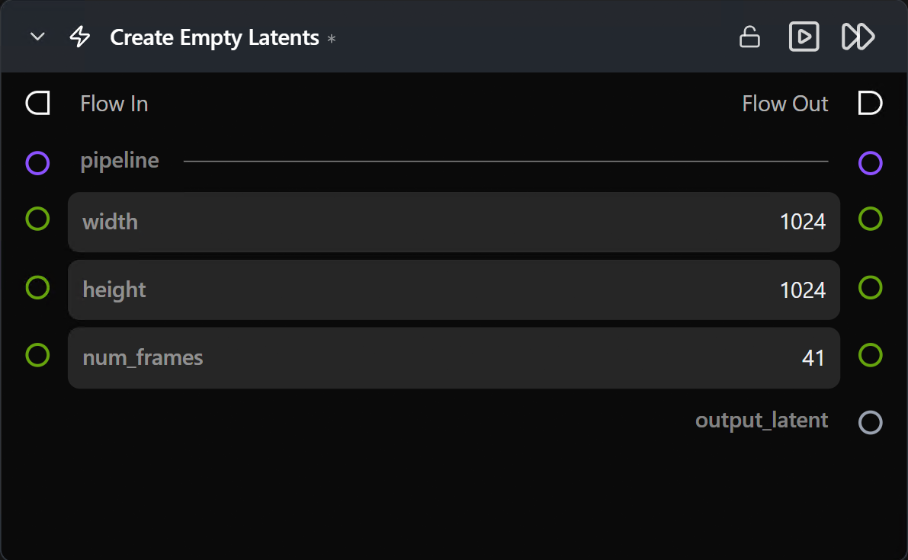

# Create Empty Latents

**연결된 파이프라인에서 예상하는 형태(shape)의 0으로 채워진 잠재 텐서를 생성합니다.**

카테고리: `ModularDiffusion/Create`

## 어떤 노드인가요?

- [Create Noise Latents](create_noise_latents.md)와 동일한 형태 동작을 가지지만, 텐서가 모두 0으로 채워집니다(랜덤 시드 없음).
- [Latents Composite Mask](latents_composite_mask.md)의 **대상(destination)**으로 유용하거나, 다운스트림에서 완전히 제어된 노이즈 주입을 원할 때 시작점으로 적합합니다.
- 일반적인 텍스트 투 이미지 / 텍스트 투 비디오 생성의 경우 대부분 [Create Noise Latents](create_noise_latents.md)를 사용해야 합니다.

## 일반적인 워크플로우 위치

```text
Pipeline Builder → [Create Empty Latents] → Latents Composite Mask → Generate Media Latents
```

## 노드 미리보기



### 입력 (Inputs)

| 이름 | 유형 | 필수 여부 | 설명 |
| --- | --- | --- | --- |
| `pipeline` | `Pipeline Config` | 예 | 잠재 텐서의 형태(shape) 및 `num_frames` 표시 여부를 결정합니다. |

### 출력 (Outputs)

| 이름 | 유형 | 설명 |
| --- | --- | --- |
| `output_latent` | `LatentArtifact` | 파이프라인의 표준 잠재 공간에 있는 0으로 채워진 잠재 텐서입니다. |

### 파라미터 (Parameters)

| 이름 | 유형 | 기본값 | 설명 |
| --- | --- | --- | --- |
| `width` | int (픽셀) | `1024` | 픽셀 공간 가로 크기. |
| `height` | int (픽셀) | `1024` | 픽셀 공간 세로 크기. |
| `num_frames` | int | `41` | 비디오 프레임 수. **이미지 파이프라인에서는 숨겨집니다.** |

`seed` 파라미터는 없습니다 — 출력은 항상 결정론적으로 0으로 생성됩니다.

## 팁 및 주의사항

- **생성 전에 노이즈와 결합하세요.** 모두 0으로 채워진 잠재 텐서는 디노이징 전에 노이즈가 필요합니다 — [Generate Media Latents](generate_media_latents.md)에서 `add_noise=True`를 활성화하거나, 먼저 합성/수학 연산 노드를 통해 노이즈를 주입하세요. 노이즈가 없으면 디노이징할 기준이 없습니다.

## 관련 항목

- [Create Noise Latents](create_noise_latents.md) — 일반적인 텍스트 투 이미지 / 텍스트 투 비디오 시작 텐서.
- [Latents Composite Mask](latents_composite_mask.md) — 주요 다운스트림 노드.
