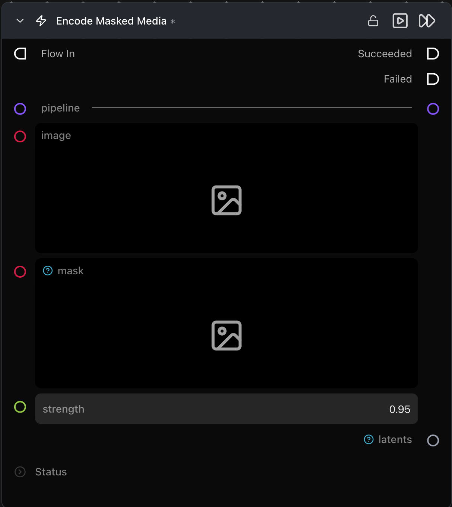

# Encode Masked Media Latent

**소스 이미지와 바이너리 마스크를 `InpaintMaskArtifact`로 인코딩합니다 — 이 입력 형식은 Generate Media Latents를 인페인팅(inpainting) 모드로 전환합니다.**

카테고리: `ModularDiffusion/Encode\Decode`

## 어떤 노드인가요?

- **인페인팅(Inpainting)**에 사용됩니다. 생성된 아티팩트는 마스크 + 마스크된 이미지 잠재 텐서 + 강도(strength)를 함께 담고 있으므로 다운스트림 노드에 별도의 입력을 제공할 필요가 없습니다.
- `latents` 출력을 Generate Media Latents 노드의 `input_latent`에 연결하세요. Generate 노드가 아티팩트 유형을 감지하고 자동으로 인페인트 파이프라인을 통해 라우팅합니다.
- 등록된 인페인트 파이프라인 클래스가 있는 파이프라인(예: Flux Fill, SDXL Inpaint)에서만 작동합니다.

## 일반적인 워크플로우 위치

```text
Load Image ──┐
             ├─→ [Encode Masked Media Latent] → Generate Media Latents → Decode
Paint Mask ──┘
```

## 노드 미리보기



### 입력 (Inputs)

| 이름 | 유형 | 필수 여부 | 설명 |
| --- | --- | --- | --- |
| `pipeline` | `Pipeline Config` | 예 | 인페인팅을 지원해야 합니다(드라이버에 `_inpaint_pipeline_class`가 있어야 함). |
| `image` | `ImageArtifact` / `ImageUrlArtifact` | 예 | 원본 소스 이미지입니다. |
| `mask` | `ImageArtifact` / `ImageUrlArtifact` | 예 | 바이너리 마스크 — **흰색 픽셀 = 인페인트 영역**, 검은색 = 원본 유지. |
| `strength` | float (0.0–1.0) | 아니요 | 인페인트 디노이징 강도 (기본값: `1.0`). 값이 낮을수록 원본을 더 많이 보존합니다. |

### 출력 (Outputs)

| 이름 | 유형 | 설명 |
| --- | --- | --- |
| `latents` | `InpaintMaskArtifact` | 마스크 + 소스/마스크 이미지 잠재 텐서 + 강도가 번들로 포함된 아티팩트입니다. |

## 팁 및 주의사항

- **파이프라인이 인페인팅을 지원해야 합니다.** 선택한 파이프라인에 인페인트 변형이 없는 경우 노드 유효성 검사에서 오류가 발생합니다. Pipeline Builder에서 Flux Fill 등을 선택하세요.
- **마스크는 소스 이미지의 크기와 일치해야 합니다.** (내부적으로 잠재 그리드로 리샘플링되며 종횡비가 크게 다르면 왜곡이 발생합니다).
- **`strength`는 아티팩트에 포함되어 전달**되며 Generate Media Latents에 있지 않습니다. 이 노드에서 조절하세요.

## 관련 항목

- [Encode Media Latent](encode_media_latent.md) — 마스크가 없는 일반 인코딩 노드.
- [Generate Media Latents](generate_media_latents.md) — 인페인트 아티팩트를 자동으로 감지합니다.
