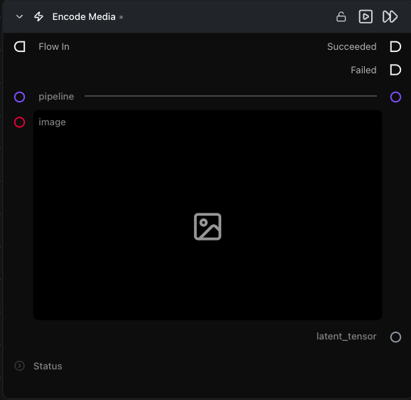

# Encode Media Latent

**이미지 또는 비디오에 대해 파이프라인의 VAE 인코더를 실행하여 Image-to-Image / Video-to-Video 워크플로우의 디노이징 단계로 전달할 수 있는 잠재 텐서를 생성합니다.**

카테고리: `ModularDiffusion/Encode\Decode`

## 어떤 노드인가요?

- 입력 파라미터가 **동적**입니다: 이미지 파이프라인의 경우 `image`, 비디오 파이프라인(LTX, LTX2, WAN 등)의 경우 `input_video`로 전환됩니다. `pipeline`을 연결하면 자동으로 바뀝니다.
- 잠재 텐서는 정규화되고 언팩된 상태입니다 — [Create Noise Latents](create_noise_latents.md)와 형태가 호환되므로 잠재 수학 연산 / 합성 노드에서 직접 작업할 수 있습니다.
- 클래식한 Image-to-Image 작업을 위해 다운스트림 Generate Media Latents에서 `add_noise=True`와 함께 사용하세요. 추가되는 노이즈의 양은 해당 노드의 `start_step`에 의해 제어됩니다: `strength = 1 − (start_step / num_inference_steps)`. `num_inference_steps=20`일 때의 예:
    - `start_step=0` → 전체 노이즈(강도 1.0) — 원본 이미지가 무시되고 Text-to-Image처럼 동작합니다.
    - `start_step=10` → 절반 노이즈(강도 0.5) — 원본과 생성된 이미지의 균형 있는 혼합.
    - `start_step=18` → 아주 적은 노이즈(강도 0.1) — 결과가 원본 이미지와 매우 가깝게 유지됩니다.

## 일반적인 워크플로우 위치

```text
Load Image → [Encode Media Latent] → Generate Media Latents → Decode Media Latent
```

## 노드 미리보기



### 입력 (Inputs)

| 이름 | 유형 | 필수 여부 | 설명 |
| --- | --- | --- | --- |
| `pipeline` | `Pipeline Config` | 예 | 입력 슬롯이 `image`인지 `input_video`인지 결정합니다. |
| `image` | `ImageArtifact` / `ImageUrlArtifact` | 이미지 파이프라인일 때 필수 | 소스 이미지입니다. |
| `input_video` | `VideoArtifact` / `VideoUrlArtifact` | 비디오 파이프라인일 때 필수 | 소스 비디오입니다. |

### 출력 (Outputs)

| 이름 | 유형 | 설명 |
| --- | --- | --- |
| `latent_tensor` | `LatentArtifact` | 파이프라인의 표준 잠재 공간에 인코딩된 잠재 텐서입니다. |

## 팁 및 주의사항

- **입력 슬롯은 연결된 파이프라인에 맞게 조정됩니다.** 이미지 파이프라인(Flux, SD3 등)은 `image` 입력을 표시하고 비디오 파이프라인(LTX, LTX2, WAN 등)은 `input_video`를 표시합니다. 파이프라인 유형을 전환하면 슬롯이 교체되므로 전환 후 입력을 다시 연결하세요.
- **새로운 텍스트 투 이미지 또는 텍스트 투 비디오의 경우 [Create Noise Latents](create_noise_latents.md)를 대신 사용하세요.** 이 노드는 처음부터 생성하는 것이 아니라 Image-to-Image 또는 Video-to-Video 워크플로우를 위해 기존 이미지나 비디오를 잠재 공간으로 인코딩합니다.

## 관련 항목

- [Encode Masked Media Latent](encode_masked_media_latent.md) — 인페인트 변형 노드.
- [Decode Media Latent](decode_media_latent.md) — 역연산 노드.
- 워크플로우 템플릿: `workflows/templates/Image2Image.py`.
