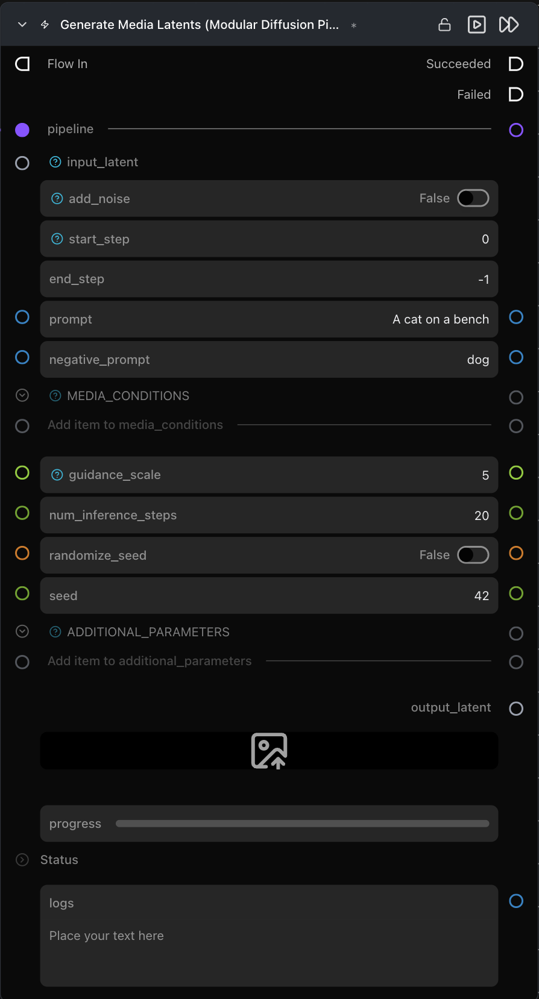

# Generate Media Latents (Modular Diffusion Pipeline)

**노이즈 제거(denoising) 루프를 실행합니다. 노이즈 / 인코딩된 / 부분적으로 노이즈가 제거된 잠재 텐서를 입력받아 노이즈가 제거된 잠재 텐서를 출력합니다.**

카테고리: `ModularDiffusion/Processing`

## 어떤 노드인가요?

- 가장 핵심적인 워크호스(workhorse) 노드입니다. `pipeline`과 `input_latent`를 연결하고, 프롬프트와 스텝 수를 구성한 후 실행하세요.
- 모든 런타임 파라미터(프롬프트, 가이던스, 크기, ControlNet 입력)는 **동적(dynamic)**으로 동작합니다. 연결된 파이프라인에 따라 적응하여 나타납니다.
- **다단계(multi-stage) / 재확산(rediffusion)** 워크플로우의 경우 여러 Generate 노드를 체이닝하고 `start_step` / `end_step`을 사용하여 노이즈 제거 스케줄을 분할할 수 있습니다.
- 출력은 잠재(latent) 텐서입니다. 이미지 또는 비디오를 얻으려면 [Decode Media Latent](decode_media_latent.md)를 통과시키세요.

## 일반적인 워크플로우 위치

```text
Pipeline Builder → Create Noise Latents → [Generate Media Latents] → Decode Media Latent
```

## 노드 미리보기



### 입력 (Inputs)

| 이름 | 유형 | 필수 여부 | 설명 |
| --- | --- | --- | --- |
| `pipeline` | `Pipeline Config` | 예 | [Pipeline Builder](pipeline_builder.md) 또는 [ControlNet Pipeline](controlnet_pipeline.md)에서 생성된 파이프라인. |
| `input_latent` | `LatentArtifact` 또는 `InpaintMaskArtifact` | 예 | 시작 잠재 텐서. 노이즈(Text-to-Image / Text-to-Video), 인코딩(Image-to-Image, Video-to-Video), 또는 이전 Generate 출력(다단계)을 사용합니다. |
| `controlnet_parameters` | `control_parameters` | `pipeline`이 ControlNet 파이프라인인 경우에만 필수 | ControlNet Pipeline 노드의 `control_parameters` 출력에서 연결합니다. |
| `additional_parameters` | list[dict] | 아니오 | 파이프라인 호출에 전달되는 일반적인 제공업체별 kwargs입니다. |

### 출력 (Outputs)

| 이름 | 유형 | 설명 |
| --- | --- | --- |
| `output_latent` | `LatentArtifact` | 노이즈가 제거된 잠재 텐서입니다. |
| `preview_image` | `ImageUrlArtifact` | 실시간 중간 미리보기 — **설정(Settings) → Modular Diffusion Library → Enable Image Preview Intermediates**가 켜져 있을 때만 채워집니다. |
| `progress` | progress bar | 스텝 카운터(진행률 표시줄)입니다. |
| `logs` | str | 스텝별 타이밍 로그입니다. |

## 파라미터 (Parameters)

### Generation *(동적 — 제공업체별)*

정확한 목록은 연결된 파이프라인에 따라 다릅니다. 일반적인 파라미터:

| 이름 | 유형 | 설명 |
| --- | --- | --- |
| `prompt` | str | 긍정 프롬프트(Positive prompt)입니다. |
| `negative_prompt` | str | 부정 프롬프트(Negative prompt) — 분류기 없는 가이던스(classifier-free guidance)를 지원하는 파이프라인에 나타납니다. |
| `guidance_scale` / `true_cfg_scale` | float | 분류기 없는 가이던스(CFG) / True-CFG 강도입니다. 파이프라인에 따라 이름이 다릅니다. |
| `num_inference_steps` | int (기본값 `20`) | 노이즈 제거 스케줄의 길이(스텝 수)입니다. |
| `seed` | int | 재현성을 위한 시드값입니다. |

### 다단계 / 부분 노이즈 제거 (Multi-stage / partial denoise)

| 이름 | 유형 | 기본값 | 설명 |
| --- | --- | --- | --- |
| `add_noise` | bool | `False` | 노이즈 제거 전에 입력에 노이즈를 다시 추가합니다(재확산 / Image-to-Image 스타일 실행에 유용함). |
| `start_step` | int | `0` | 노이즈 제거 스케줄의 0부터 시작하는 시작 인덱스입니다. |
| `end_step` | int | `-1` | 0부터 시작하는 종료 인덱스입니다. `-1`은 끝까지 실행함을 의미합니다. |

## 제공업체 / 모델별 동작

- **ControlNet:** `pipeline`이 `ControlNetDiffusionPipelineArtifact`인 경우 `controlnet_parameters` 입력이 자동으로 추가됩니다.
- **인페인팅(Inpainting):** `input_latent`가 `InpaintMaskArtifact`([Encode Masked Media Latent](encode_masked_media_latent.md)에서 출력됨)인 경우 노드는 자동으로 인페인트 파이프라인 클래스를 통해 라우팅되며 아티팩트의 `strength`를 사용합니다.

## 팁 및 주의사항

- **파이프라인을 전환해도 일치하는 연결은 유지됩니다.** 새 파이프라인에 파라미터 이름이 존재하는 연결은 자동으로 유지되며, UI는 새 레이아웃을 반영하여 재정렬됩니다.
- **실시간 미리보기는 추론 속도를 저하시킵니다.** 기본적으로 꺼져 있습니다. **설정(Settings) → Modular Diffusion Library → Enable Image Preview Intermediates**에서 전환할 수 있습니다.
- **`start_step` / `end_step`은 스케줄러에서 슬라이스됩니다.** 다단계 정제(multi-stage refinement)를 위해 두 개의 Generate 노드(예: `0–10` 이후 `10–20`)를 결합하세요.
- **스텝 진행 중에도 취소가 작동합니다.** 취소 버튼을 누르면 파이프라인의 `_interrupt` 플래그가 설정되어 현재 스텝이 완료된 후 실행이 중지됩니다.
- **크기(Dimensions)는 `input_latent`에서 가져옵니다.** Generate 노드에는 width / height / num_frames 필드가 없습니다. 업스트림의 [Create Noise Latents](create_noise_latents.md)(또는 시작 잠재 텐서를 생성하는 노드)에서 설정하세요.

## 관련 항목

- [Modular Diffusion Pipeline Builder](pipeline_builder.md)
- [Create Noise Latents](create_noise_latents.md) · [Encode Media Latent](encode_media_latent.md) · [Encode Masked Media Latent](encode_masked_media_latent.md) — 일반적인 업스트림 노드.
- [Decode Media Latent](decode_media_latent.md) — 일반적인 다운스트림 노드.
- 워크플로우 템플릿: `workflows/templates/Text2Image.py`, `workflows/templates/MultistageText2Image.py`, `workflows/templates/Image2Image.py`.\n