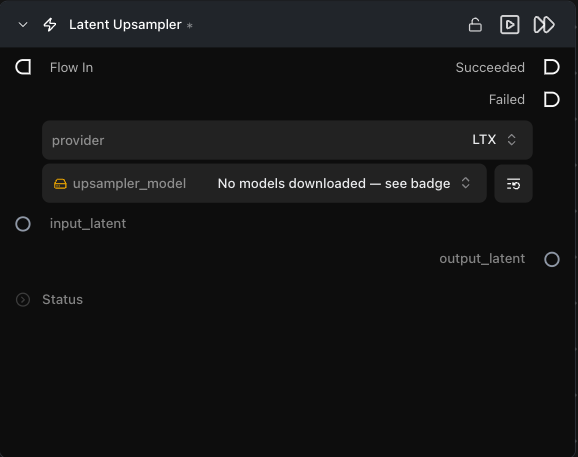

# Latent Upsampler

**잠재 공간을 벗어나지 않고 잠재(latent) 텐서를 공간적으로 업스케일합니다 — 일반적으로 빠르고 고해상도인 정제 패스를 위해 두 Generate 단계 사이에서 사용됩니다.**

카테고리: `ModularDiffusion/Processing`

## 어떤 노드인가요?

- **잠재 공간(latent space)**에서 업샘플링하므로, 비용이 많이 드는 디코딩 → 업스케일 → 재인코딩 왕복 과정을 피할 수 있습니다.
- `provider`로 업샘플러 패밀리를 선택합니다.
- 두 Generate Media Latents 노드 사이에서 사용합니다: 저해상도 패스 → 업샘플 → 고해상도 정제(refinement) 패스.

## 일반적인 워크플로우 위치

```text
Generate Media Latents (저해상도) → [Latent Upsampler] → Generate Media Latents (정제) → Decode
```

## 노드 미리보기



### 입력 (Inputs)

| 이름 | 유형 | 필수 여부 | 설명 |
| --- | --- | --- | --- |
| `input_latent` | `LatentArtifact` | 예 | 업샘플할 잠재 텐서입니다. 파이프라인의 표준 잠재 공간에 있어야 합니다(모든 Generate / Encode 출력이 적합함). |

### 출력 (Outputs)

| 이름 | 유형 | 설명 |
| --- | --- | --- |
| `output_latent` | `LatentArtifact` | 공간적으로 업스케일된 잠재 텐서입니다. |

### 파라미터 (Parameters)

| 이름 | 유형 | 설명 |
| --- | --- | --- |
| `provider` | choice | 업샘플러 패밀리(예: `LTX2`). 전환 시 모델 선택기가 다시 생성됩니다. |
| `upsampler_model` | HF repo picker | 업샘플러 가중치에 대한 Hugging Face 리포지토리 ID입니다. |

## 팁 및 주의사항

- **잠재 공간 업샘플러는 모델 패밀리에 따라 다릅니다.** LTX2 업샘플러는 SDXL 잠재 텐서에 대해 올바른 출력을 생성하지 못합니다. 업샘플러 패밀리를 잠재 텐서의 파이프라인과 일치시키세요.
- **업샘플링 후에는 거의 항상 정제 Generate 노드가 필요합니다.** 업샘플러는 해상도를 높이지만 노이즈를 제거하지는 않으므로, 낮은 강도(strength)의 짧은 후속 Generate 노드와 결합하세요.

## 관련 항목

- [Generate Media Latents](generate_media_latents.md) — 업스트림 및 다운스트림으로 결합.
- [Decode Media Latent](decode_media_latent.md) — 최종 단계.\n