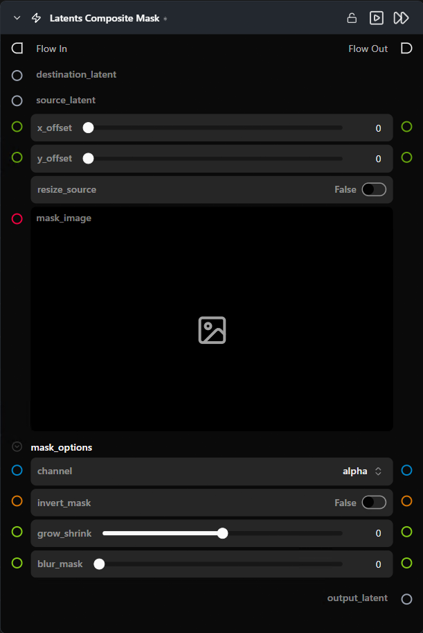

# Latents Composite Mask

**선택적 이미지 마스크를 통해 블렌딩하여 지정된 픽셀 오프셋 위치에서 소스 잠재 텐서를 대상 잠재 텐서 위에 합성합니다.**

카테고리: `ModularDiffusion/Transform`

## 어떤 노드인가요?

- 소스 잠재 텐서를 대상 잠재 텐서의 `(x_offset, y_offset)` 위치에 배치합니다. 마스크의 흰색 픽셀 → 소스; 검은색 → 대상.
- 오프셋은 **픽셀 공간(pixel-space)** 기준이며, 노드 내부에서 잠재 공간으로 변환됩니다 (÷ 8).
- `resize_source`를 활성화하면 합성 전에 소스 크기를 대상의 공간 크기에 맞게 조정합니다.
- 마스크는 소스 잠재 텐서에 맞게 자동으로 리샘플링됩니다.

## 일반적인 워크플로우 위치

```text
Generate Latents (대상) ──┐
Generate Latents (소스) ──┼─→ [Latents Composite Mask] → Generate Media Latents
Paint Mask (마스크) ──────┘
```

## 노드 미리보기



### 입력 (Inputs)

| 이름 | 유형 | 필수 여부 | 설명 |
| --- | --- | --- | --- |
| `destination_latent` | `LatentArtifact` | 예 | 기본 캔버스 역할을 하는 대상 잠재 텐서입니다. |
| `source_latent` | `LatentArtifact` | 예 | 붙여넣을 소스 잠재 텐서입니다. |
| `mask_image` | `ImageArtifact` / `ImageUrlArtifact` | 아니오 | 블렌드 마스크입니다. 생략할 경우 소스가 배치 영역 내에서 대상을 전체적으로 대체합니다. |

### 출력 (Outputs)

| 이름 | 유형 | 설명 |
| --- | --- | --- |
| `output_latent` | `LatentArtifact` | 소스가 합성된 대상 잠재 텐서입니다. |

## 파라미터 (Parameters)

### 배치 (Placement)

| 이름 | 유형 | 기본값 | 설명 |
| --- | --- | --- | --- |
| `x_offset` | int (픽셀, 0–2000) | `0` | 가로 배치 위치 (내부적으로 8로 나뉨). |
| `y_offset` | int (픽셀, 0–2000) | `0` | 세로 배치 위치 (내부적으로 8로 나뉨). |
| `resize_source` | bool | `False` | 합성 전에 소스를 쌍선형(bilinear) 보간으로 대상 공간 크기에 맞춥니다. |

### 마스크 옵션 *(기본적으로 접혀 있음)*

| 이름 | 유형 | 기본값 | 설명 |
| --- | --- | --- | --- |
| `channel` | choice | `alpha` | 블렌드 가중치로 사용할 `mask_image`의 채널입니다. |
| `invert_mask` | bool | `False` | 소스/대상 영역을 반전합니다. |
| `grow_shrink` | float (-100..100) | `0` | 마스크 가장자리를 팽창(+)하거나 침식(-)합니다. |
| `blur_mask` | float (0..100) | `0` | 마스크 가장자리를 부드럽게 페더링(feathering)합니다. |

## 팁 및 주의사항

- **겹치는 영역만 합성됩니다.** `x_offset` + 소스 너비가 대상 캔버스를 벗어나면 범위를 벗어난 부분은 무시됩니다. 소스와 대상이 전혀 교차하지 않으면 대상이 변경 없이 그대로 반환됩니다.
- **잠재 오프셋이 아닌 픽셀 오프셋입니다.** 1024픽셀 대상 = 128 잠재 단위입니다. 오프셋은 더 큰 픽셀 공간 기준이며, 노드는 내부적으로 VAE 스케일 팩터(8)로 나눕니다.
- **4D 이미지 잠재 텐서와 5D 비디오 잠재 텐서 모두에서 작동합니다.** 마스크는 시간(temporal) 차원에 걸쳐 브로드캐스팅됩니다.
- **출력은 대상의 `shape`를 상속합니다.** 메타데이터는 병합되며, 키 충돌 시 대상의 메타데이터가 우선 적용됩니다.

## 관련 항목

- [Create Empty Latents](empty_latents.md) — 일반적인 대상 캔버스 노드.
- [Add Latents](add_latents.md) — 마스크 없는 요소별 블렌딩용.\n