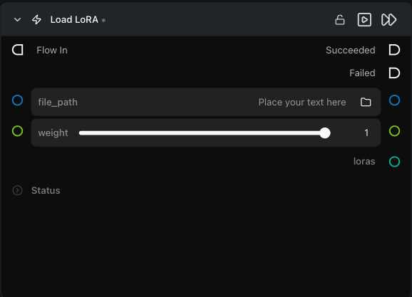

# Load LoRA

**로컬 디스크에서 LoRA 파일을 로드하고 Pipeline Builder가 수락하는 출력으로 제공합니다.**

카테고리: `ModularDiffusion/Pipeline`

## 어떤 노드인가요?

- 노드당 하나의 LoRA를 로드합니다. 여러 LoRA를 중첩(stack)하려면 여러 `Load LoRA` 노드를 배치하고 모두 동일한 소비자(consumer) 노드에 연결하세요.
- **LoRA를 사용하는 두 가지 방법:**
    - **Pipeline Builder** — 빌드 시점에 LoRA가 모델 가중치에 **융합(fuse/bake)**됩니다. `weight`는 해당 시점에 고정되며, 이를 변경하면 캐시된 파이프라인이 **다시 빌드**됩니다. 항상 활성화 상태로 유지하려는 LoRA에 가장 적합합니다.
    - **LoRA Pipeline** — **생성할 때마다(per generation)** LoRA가 활성화되고 이후 해제됩니다. 기본 파이프라인은 절대 수정되지 않으므로 실행 간에 `weight`를 변경해도 재빌드가 트리거되지 않습니다. IC LoRA, 슬라이더 LoRA, 또는 브랜치 간에 어댑터를 교체하는 워크플로우에 가장 적합합니다.
- `.safetensors`, `.sft`, `.pt`, `.bin`, `.json`, `.lora` 형식을 지원합니다.

## 일반적인 워크플로우 위치

```text
# 융합 방식 (빌드 시점에 모델에 구워짐):
[Load LoRA] ─┐
[Load LoRA] ─┼─→ Pipeline Builder → Generate Media Latents
[Load LoRA] ─┘

# 생성별 방식 (런타임에 적용됨):
Pipeline Builder ──┐
[Load LoRA] ───────┤→ LoRA Pipeline → Generate Media Latents
[Load LoRA] ───────┘
```

## 노드 미리보기



### 입력 (Inputs)

| 이름 | 유형 | 필수 여부 | 설명 |
| --- | --- | --- | --- |
| `file_path` | path | 예 | LoRA 파일의 절대 경로입니다. |
| `weight` | float (0.0–1.0) | 아니오 | 이 LoRA의 영향력(가중치)이며, 기본값은 `1.0`입니다. |

### 출력 (Outputs)

| 이름 | 유형 | 설명 |
| --- | --- | --- |
| `loras` | `loras` (dict) | `{path: weight}` — Pipeline Builder의 `loras` 입력에 연결합니다. |
| `trigger_phrase` | str | 프롬프트에 포함할 선택적 패스스루 문구입니다. 기본적으로 숨겨져 있습니다. |

## 팁 및 주의사항

- **Hugging Face 리포지토리 ID는 여기서 지원되지 않습니다.** 파일을 먼저 다운로드하세요. 이 노드는 디스크에서만 로드합니다.
- **LoRA는 기본 파이프라인 아키텍처와 일치해야 합니다** (Flux LoRA → Flux 파이프라인 등). 불일치는 LoRA를 로드할 때가 아니라 파이프라인 빌드 시점에 나타납니다.
- **`weight`는 융합(fuse) 시점에 반영됩니다.** LoRA가 모델에 융합되므로 전체 파이프라인을 다시 빌드하지 않고는 생성 간에 `weight`를 변경할 수 없습니다.
- **트리거 문구:** LoRA에 트리거 워드가 필요한 경우 프롬프트에 직접 입력하세요 — `trigger_phrase` 파라미터는 기본적으로 숨겨져 있으며 현재는 패스스루 메타데이터일 뿐입니다.

## 관련 항목

- [Modular Diffusion Pipeline Builder](pipeline_builder.md) — 융합 LoRA 소비자.
- [LoRA Pipeline](lora_pipeline.md) — 생성별 LoRA 소비자.
- 워크플로우 템플릿: `workflows/templates/LoRAText2Image.py`.\n