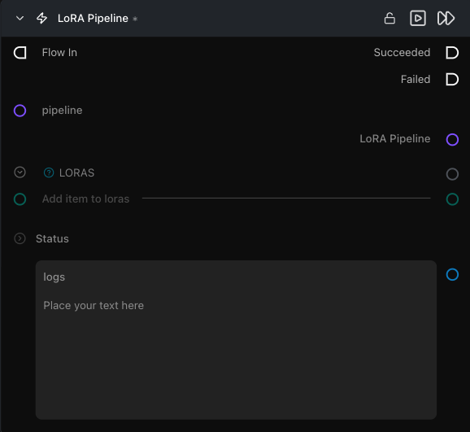

# LoRA Pipeline

**동일한 캐시 모델이 여러 브랜치를 동시에 구동할 수 있도록 기존 파이프라인 위에 비융합(non-fused) LoRA 어댑터를 레이어링합니다.**

카테고리: `ModularDiffusion/Pipeline`

## 어떤 노드인가요?

- Pipeline Builder 출력과 하나 이상의 Load LoRA 노드를 여기에 연결합니다. `lora_pipeline` 출력을 Pipeline Builder에 직접 연결하는 대신 Generate Media Latents에 연결하세요.
- 어댑터는 생성할 때마다 활성화되고 이후 해제됩니다 — 기본 파이프라인은 **영구적으로 수정되지 않으므로**, 단일 캐시 모델로 재빌드 없이 여러 브랜치(LoRA 적용 브랜치 하나, 미적용 브랜치 하나)를 구동할 수 있습니다.
- 실행 간 어댑터를 교체하거나 컨텍스트 내(in-context, IC) LoRA, 증류/가속 LoRA, 슬라이더 LoRA를 사용할 때 Pipeline Builder에서 LoRA를 융합하는 대신 이 노드를 사용하는 것이 좋습니다.

## 일반적인 워크플로우 위치

```text
Pipeline Builder ──→ [LoRA Pipeline] ←── Load LoRA
                          │
                          └──→ Generate Media Latents → Decode Media Latent
```

## 노드 미리보기



### 입력 (Inputs)

| 이름 | 유형 | 필수 여부 | 설명 |
| --- | --- | --- | --- |
| `pipeline` | `Pipeline Config` | 예 | 기본 확산 파이프라인입니다. Pipeline Builder에서 연결합니다. 기본 파이프라인은 수정되지 않고 재사용되므로 다른 노드에 동시에 연결할 수 있습니다. |
| `loras` | `loras` | 예 | Load LoRA 노드에서 전달되는 하나 이상의 LoRA 페이로드입니다. 목록(list)을 수락하며, 여러 Load LoRA 출력을 연결하여 어댑터를 중첩할 수 있습니다. |

### 출력 (Outputs)

| 이름 | 유형 | 설명 |
| --- | --- | --- |
| `lora_pipeline` | `Pipeline Config` | 각 생성 호출 시 나열된 LoRA를 활성화하는 파이프라인 참조입니다. 입력 파이프라인의 캐시 항목을 공유하므로 이를 Generate Media Latents에 연결해도 재빌드가 트리거되지 않습니다. |
| `logs` | str | 파이프라인 구성 해시를 포함한 빌드 로그입니다. |

## 팁 및 주의사항

- **활성화(Activation) LoRA와 융합(Fused) LoRA는 동일하지 않습니다.** 융합 LoRA(Pipeline Builder `loras` 입력을 통해 구워짐)는 가중치에 영구적으로 병합됩니다. 활성화 LoRA(이 노드)는 일시적으로 적용됩니다. 융합 LoRA를 변경하면 전체 파이프라인 캐시가 제거되지만, 활성화 LoRA를 변경하면 캐시가 유지됩니다.
- **적어도 하나의 LoRA를 연결하세요.** 노드를 활성화하려면 `loras`에 하나 이상의 항목이 필요합니다. 실행 전에 하나 이상의 [Load LoRA](load_lora.md) 노드를 연결하세요.
- **`lora_pipeline` 출력은 입력 `pipeline`과 캐시를 공유합니다.** 모델을 두 번 로드하지 않고도 두 출력을 별도의 Generate Media Latents 노드(하나는 LoRA 포함, 하나는 미포함)에 연결할 수 있습니다.
- **LoRA 가중치는 실행당 적용됩니다.** 융합 LoRA와 달리 실행 간에 Load LoRA 노드의 `weight`를 변경해도 파이프라인이 다시 빌드되지 않습니다.

## 관련 항목

- [Load LoRA](load_lora.md) — `loras` 입력을 제공합니다.
- [Modular Diffusion Pipeline Builder](pipeline_builder.md) — 기본 `pipeline` 입력을 제공합니다.
- [Generate Media Latents](generate_media_latents.md) — `lora_pipeline` 출력을 소비합니다.\n