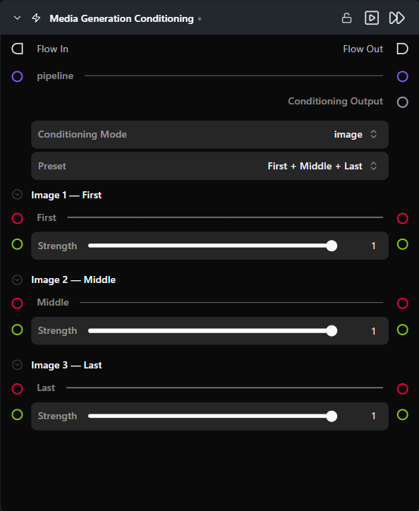

# Media Generation Conditioning

**미디어 기반 컨디셔닝을 지원하는 모든 파이프라인에 연결할 수 있도록, 프레임별 배치 및 강도와 함께 하나 이상의 컨디셔닝 이미지(또는 비디오)를 패키징합니다.**

카테고리: `ModularDiffusion/Conditioning`

## 어떤 노드인가요?

- 파이프라인을 연결하여 해당 모델에 맞는 프리셋 레이아웃(예: WAN Image-to-Video용 첫 번째/마지막 프레임 슬롯)을 가져옵니다.
- 파이프라인이 없으면 "Preset" 드롭다운이 있는 유연한 이미지 또는 비디오 레이아웃이 표시되며, "Custom" 프리셋 모드에서는 이미지 개수 슬라이더가 표시됩니다.
- `conditioning` 출력을 Generate Media Latents의 `media_conditions` (LTX / LTX2 / WAN) 또는 `reference_images` (Flux2 Klein) 입력에 연결하세요.

## 일반적인 워크플로우 위치

```text
Pipeline Builder ──────────────────────────────────────────┐
                                                           ├─→ Generate Media Latents → Decode
Load Image (첫 번째) ──┐                                   │
Load Image (마지막) ───┴─→ [Media Generation Conditioning] ──┘
```

## 노드 미리보기



### 입력 (Inputs)

| 이름 | 유형 | 필수 여부 | 설명 |
| --- | --- | --- | --- |
| `pipeline` | `Pipeline Config` | 아니오 | 연결 시 해당 파이프라인에 맞게 컨디셔닝 서피스를 맞춤 레이아웃으로 전환합니다. |
| `image_{i}` | `ImageUrlArtifact` | 아니오 | 슬롯 `i`의 컨디셔닝 이미지입니다. 이미지 모드에서 표시되며 슬롯 수는 사용자 설정에 따라 달라집니다. |
| `video` | `VideoUrlArtifact` | 아니오 | 컨디셔닝 비디오입니다. 비디오 모드에서만 표시됩니다. |

### 출력 (Outputs)

| 이름 | 유형 | 설명 |
| --- | --- | --- |
| `conditioning` | `media_gen_conditioning` | 이미지/비디오 + 항목별 프레임 위치 + 강도의 타입 지정된 페이로드입니다. Generate Media Latents의 일치하는 입력에 연결하세요. |

## 파라미터 (Parameters)

### 모드 및 프리셋 선택 (Mode and preset selection)

| 이름 | 유형 | 기본값 | 설명 |
| --- | --- | --- | --- |
| `mode` | `image` \| `video` | `image` | 연결된 파이프라인이 하나의 모드만 지원하는 경우 숨겨집니다. 전환 시 모든 입력 슬롯이 다시 생성됩니다. |
| `image_preset` | choice | `Custom` | 이미지 슬롯의 명명된 배치를 선택하는 드롭다운입니다. 옵션 및 기본값은 연결된 파이프라인에 따라 다릅니다(제공업체 / 모델별 동작 참조). 비디오 모드에서는 숨겨집니다. |
| `num_images` | int slider | `0` | 이미지 슬롯의 수입니다. `image_preset = Custom`일 때만 표시됩니다. 기본 범위는 0–8이며 파이프라인 구성에 따라 좁혀질 수 있습니다. |

### 이미지 슬롯별 설정 *(이미지 모드에서 슬롯당 한 세트)*

| 이름 | 유형 | 기본값 | 설명 |
| --- | --- | --- | --- |
| `image_{i}_frame_index` | int | `0` | 이 이미지의 출력 프레임 위치입니다. 프리셋 모드(위치 고정) 및 해당되지 않는 파이프라인(예: Flux2 Klein)에서는 숨겨집니다. |
| `image_{i}_strength` | float (0.0–1.0) | `1.0` | 이미지별 컨디셔닝 가중치입니다. 이미지별 강도를 사용하지 않는 파이프라인에서는 숨겨집니다. |

### 비디오 모드 (Video mode)

| 이름 | 유형 | 기본값 | 설명 |
| --- | --- | --- | --- |
| `frame_index` | int | `0` | 컨디셔닝 비디오가 시작되는 출력 프레임 인덱스입니다. |
| `video_strength` | float (0.0–1.0) | `1.0` | 비디오의 컨디셔닝 가중치입니다. |

## 제공업체 / 모델별 동작

### 파이프라인이 연결되지 않음 (기본값)

이미지 및 비디오 모드를 모두 사용할 수 있습니다. `Preset` 선택지: **Custom** (기본값), First + Middle + Last, First + Last, First frame. Custom 모드에서는 `num_images` (0–8), `frame_index`, `strength`를 모두 조정할 수 있습니다. 비디오 모드에서는 `frame_index`와 `video_strength`가 있는 단일 `video` 입력이 표시됩니다.

### WAN Image-to-Video

이미지 모드 전용입니다. `Preset` 선택지: **First + Last** (기본값), First frame.

### LTX / LTX2

"파이프라인이 연결되지 않음"과 동일하지만 이미지 모드에서 **First + Middle + Last**가 기본값입니다.

### Flux2 Klein

이미지 모드 전용입니다. 유연한 이미지 슬롯(1–8). Generate Media Latents의 `reference_images` 입력은 인페인트 마스크도 함께 연결된 경우에만 활성화됩니다.

## 팁 및 주의사항

- **파이프라인을 먼저 연결하세요.** 연결 즉시 레이아웃이 전환되어 슬롯이 해당 모델의 올바른 프리셋 배치로 대체됩니다.
- **명명된 프리셋은 프레임 위치를 고정합니다.** 명명된 프리셋을 선택하면 각 슬롯의 출력 위치가 프리셋 정의에 의해 고정되어 재정의할 수 없습니다. 예를 들어 "First + Last"를 사용하면 슬롯 0은 프레임 0에 고정되고 슬롯 1은 마지막 프레임에 고정됩니다. 조정할 사항이 없으므로 `frame_index` 컨트롤이 숨겨집니다. 특정 프레임에 이미지를 배치해야 하는 경우 **Custom** 프리셋으로 전환하세요.
- **`frame_index`는 *출력 비디오 내에서 컨디셔닝 이미지가 나타나는 위치*를 제어합니다.** `0`은 생성된 비디오의 맨 첫 번째 프레임에 이미지를 배치하고, -1은 마지막 프레임 번호로 설정하여 끝부분에 고정합니다.

## 관련 항목

- [Generate Media Latents](generate_media_latents.md) · [Modular Diffusion Pipeline Builder](pipeline_builder.md)\n