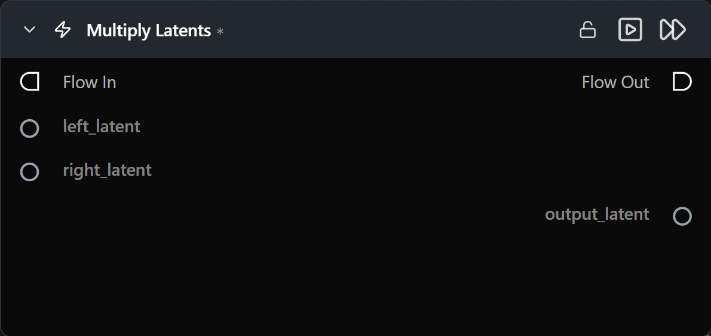

# Multiply Latents

**두 잠재(latent) 텐서의 요소별(elementwise) 곱을 계산합니다.**

카테고리: `ModularDiffusion/Transform`

## 어떤 노드인가요?

- 요소별 연산: `output = left_latent * right_latent`.
- 서로 다른 두 잠재 텐서의 마스크 기반 합성에는 [Latents Composite Mask](latents_composite_mask.md)를 사용하는 것이 좋습니다 — 해당 노드는 전용으로 설계되었으며 마스크 리샘플링을 자동으로 처리합니다.

## 일반적인 워크플로우 위치

```text
Latent A ─┐
          ├─→ [Multiply Latents] → Add Latents / Generate
Latent B ─┘
```

## 노드 미리보기



### 입력 (Inputs)

| 이름 | 유형 | 필수 여부 | 설명 |
| --- | --- | --- | --- |
| `left_latent` | `LatentArtifact` | 예 | 좌측 잠재 텐서입니다. |
| `right_latent` | `LatentArtifact` | 예 | 우측 잠재 텐서입니다. `left_latent`와 형태(shape)가 일치해야 합니다. |

### 출력 (Outputs)

| 이름 | 유형 | 설명 |
| --- | --- | --- |
| `output_latent` | `LatentArtifact` | `left * right` 결과 텐서입니다. |

## 팁 및 주의사항

- **행렬 곱셈이 아닌 요소별(elementwise) 곱셈입니다.** `a`의 각 요소는 `b`의 해당 요소와 곱해집니다.
- **스케일링(scaling)에 가장 유용합니다.** 하나의 잠재 텐서에 거의 일정한 상수 텐서를 곱하는 것이 가장 예측 가능한 사용법이며, 임의의 두 잠재 텐서를 요소별로 결합하면 예상치 못한 결과가 발생하기 쉽습니다.

## 관련 항목

- [Add Latents](add_latents.md) · [Subtract Latents](subtract_latents.md) · [Latents Composite Mask](latents_composite_mask.md)\n