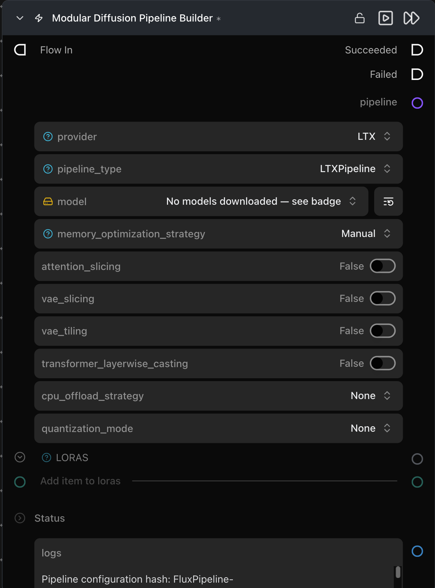

# Modular Diffusion Pipeline Builder

**🧨 Diffusers 파이프라인을 한 번 로드하고 캐시하여 플로우의 다른 모든 노드가 이를 재사용할 수 있도록 합니다.**

카테고리: `ModularDiffusion/Pipeline`

## 어떤 노드인가요?

- **한 번 빌드하고 여러 번 생성하세요.** 이 노드를 가장 먼저 배치하고, 가중치가 필요한 다른 모든 Modular Diffusion 노드(Generate Media Latent, VAE Encode/Decode, Create Noise 등)에 `pipeline` 출력을 연결하세요.
- **`provider`를 먼저 선택하세요.** 다른 모든 파라미터(모델 리포지토리, 런타임 노브)는 이 선택에 따라 다시 생성됩니다.
- **파이프라인은 구성 해시(hash)에 의해 캐시됩니다.** 로드 시점 파라미터(모델 리포지토리, 양자화, LoRA)를 변경하면 다시 빌드되고 재캐시됩니다. 런타임 파라미터(프롬프트, 스텝)는 재빌드를 트리거하지 **않습니다**.
- 출력 유형: `Pipeline Config`.

## 일반적인 워크플로우 위치

```text
[Pipeline Builder] → Create Noise Latents → Generate Media Latents → Decode Media Latent
```

## 노드 미리보기



### 입력 (Inputs)

| 이름 | 유형 | 필수 여부 | 설명 |
| --- | --- | --- | --- |
| `loras` | `loras` | 아니오 | 하나 이상의 [Load LoRA](load_lora.md) 노드를 연결합니다. 연결 순서대로 중첩됩니다. |

### 출력 (Outputs)

| 이름 | 유형 | 설명 |
| --- | --- | --- |
| `pipeline` | `Pipeline Config` | 캐시된 파이프라인 아티팩트입니다. `pipeline` 입력을 받는 모든 노드에 전달하세요. |
| `logs` | `str` | 확인된 구성 해시를 포함한 빌드 로그입니다. |

## 파라미터 (Parameters)

### 파이프라인 선택 *(동적 — `provider` 변경 시 다시 생성됨)*

| 이름 | 유형 | 설명 |
| --- | --- | --- |
| `provider` | choice | `Flux`, `Flux2`, `Stable Diffusion`, `Stable Diffusion 3`, `Qwen`, `Z-Image`, `HunyuanVideo 1.5`, `LTX`, `LTX2`, `WAN`. 이를 변경하면 아래의 모든 파라미터가 전환됩니다. |
| `pipeline_type` | choice | 제공업체별 파이프라인 클래스(예: `FluxPipeline`, `WanImageToVideoPipeline`). 파이프라인이 수행할 수 있는 작업을 결정합니다. |
| `<model repo>` | HF repo picker | Hugging Face 리포지토리 ID입니다. Diffusers 형식만 지원되며, 단일 파일 `.safetensors` 체크포인트는 직접 로드되지 않습니다. |

### 메모리 최적화 (Memory optimization)

| 이름 | 유형 | 기본값 | 설명 |
| --- | --- | --- | --- |
| `memory_optimization_strategy` | choice | `Manual` | `Automatic`은 아래의 개별 노브 토글을 숨기고 모델별로 합리적인 기본값을 사용합니다. |
| `attention_slicing` | bool | `False` | 약간의 속도 저하로 손쉽게 메모리를 절약합니다. |
| `vae_slicing` | bool | `False` | 잠재 텐서를 1개 단위 배치로 디코딩합니다. 큰 배치 크기에 유용합니다. |
| `transformer_layerwise_casting` | bool | `False` | 트랜스포머를 더 낮은 정밀도로 유지하고 계산 중에 레이어별로 업캐스팅합니다. |
| `cpu_offload_strategy` | choice | `None` | `Model` (전체 서브모듈) 또는 `Sequential` (레이어별) — 유휴 가중치를 CPU로 이동하여 VRAM을 확보하며, 추론 속도와 트레이드오프됩니다. |
| `quantization_mode` | choice | `None` | `fp8` / `int8` / `int4` (`optimum-quanto` / `bitsandbytes`를 통해). 약간의 품질 저하를 대가로 트랜스포머 가중치 크기를 줄입니다. |

필요한 항목만 활성화하세요 — 각 옵션은 속도와 메모리를 트레이드오프합니다.

## 팁 및 주의사항

- **재시작 후 파이프라인 캐시.** 캐시는 프로세스 메모리에만 존재하므로, 다음 실행 시 노드가 자동으로 다시 확인하여 로드합니다.
- **로드 시 VRAM 부족 (Out of VRAM).** 모델 가중치가 사용 가능한 GPU 메모리를 초과하는 경우입니다. 영향력이 큰 순서대로 다음 해결책을 시도해 보세요: `quantization_mode`를 `int8` 또는 `int4`로 설정, `cpu_offload_strategy`를 `Model`로 설정(유휴 서브모듈을 CPU로 이동), 또는 `vae_slicing` 활성화(디코딩 중 피크 메모리 감소). 각 옵션은 약간의 추론 속도를 희생하여 VRAM 사용량을 줄입니다.
- **LoRA가 적용되지 않음.** 두 가지를 확인하세요: (1) LoRA가 선택한 `pipeline_type`과 동일한 모델 아키텍처용으로 학습되었는지 확인하세요(Flux LoRA는 WAN 파이프라인에서 작동하지 않음). (2) [Load LoRA](load_lora.md) 노드가 이 노드의 `loras` 입력에 연결되어 있는지 확인하세요.
- **다른 파라미터를 구성하기 전에 `provider`를 먼저 설정하세요.** `provider`를 변경하면 새 모델에 맞게 모든 파라미터가 다시 생성됩니다. 파라미터 이름이 일치하는 연결은 유지되지만 값은 기본값으로 돌아갑니다. 올바른 제공업체를 미리 선택하면 설정을 반복하는 수고를 덜 수 있습니다.

## 관련 항목

- [Configure ControlNet](configure_controlnet.md) · [ControlNet Pipeline](controlnet_pipeline.md) — 빌드된 파이프라인에 ControlNet 추가.
- [Load LoRA](load_lora.md) — 이 빌더에 LoRA 연결.
- [Generate Media Latents](generate_media_latents.md) — `pipeline` 출력의 가장 일반적인 소비자.\n