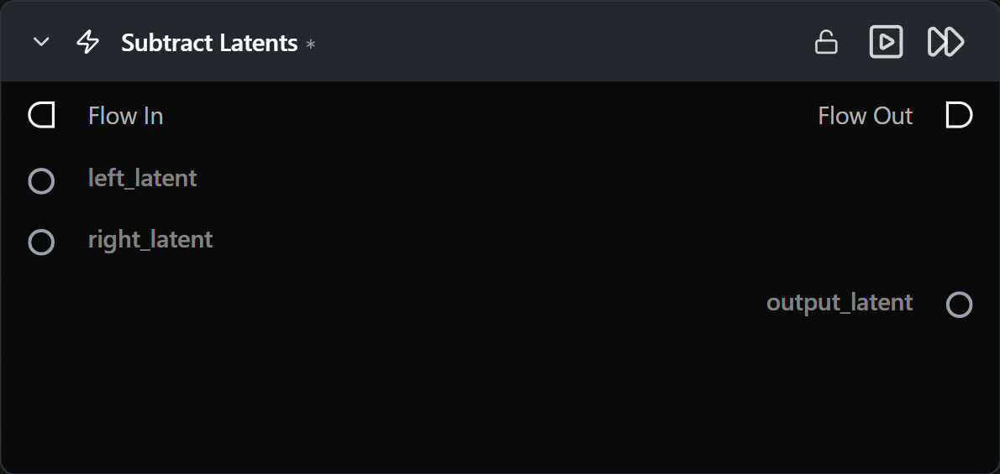

# Subtract Latents

**두 잠재(latent) 텐서의 요소별(elementwise) 차(차이)를 계산합니다.**

카테고리: `ModularDiffusion/Transform`

## 어떤 노드인가요?

- 요소별 연산: `output = left_latent - right_latent`.
- 두 입력은 동일한 형태(shape) 및 잠재 공간(즉, 동일한 파이프라인 유형)을 공유해야 합니다.
- 일반적인 용도: 노이즈 격리(노이즈 제거된 텐서 − 노이즈 텐서), 잠재 공간 절제(ablation) 실험.

## 일반적인 워크플로우 위치

```text
Latent A ─┐
          ├─→ [Subtract Latents] → Latent Math / Generate
Latent B ─┘
```

## 노드 미리보기



### 입력 (Inputs)

| 이름 | 유형 | 필수 여부 | 설명 |
| --- | --- | --- | --- |
| `left_latent` | `LatentArtifact` | 예 | 감수(Minuend, 빼지는 수)입니다. |
| `right_latent` | `LatentArtifact` | 예 | 감수(Subtrahend, 빼는 수)입니다. `left_latent`와 형태(shape)가 일치해야 합니다. |

### 출력 (Outputs)

| 이름 | 유형 | 설명 |
| --- | --- | --- |
| `output_latent` | `LatentArtifact` | `left − right` 결과 텐서입니다. |

## 팁 및 주의사항

- **순서가 중요합니다** — 뺄셈은 교환법칙이 성립하지 않습니다 (`a − b` ≠ `b − a`).
- **두 입력의 형태(shape)가 동일해야 합니다.** 빼기 전에 둘 중 하나의 크기를 조정하거나 업샘플링하여 일치시키세요.

## 관련 항목

- [Add Latents](add_latents.md) · [Multiply Latents](multiply_latents.md)\n