# Lesson 1: 시작하기 (Getting Started)

Griptape Nodes에 오신 것을 환영합니다! 이 튜토리얼에서는 강력한 시각적 워크플로우 도구인 Griptape Nodes의 기본 사항을 안내합니다. 애플리케이션을 실행하고, 인터페이스를 탐색하고, 노드를 추가 및 연결하며, 첫 번째 AI 에이전트를 실행하는 방법을 배웁니다. 이 가이드를 마치면 이후 튜토리얼을 진행하는 데 필요한 기초 지식을 갖추게 됩니다.

## 이번 단원에서 다룰 내용

이 튜토리얼에서 다루는 주제는 다음과 같습니다:

- Griptape Nodes 실행하기
- 랜딩 페이지에서 워크플로우로 이동하기
- Griptape Nodes Editor 인터페이스 익히기
- 워크스페이스에 노드 추가하기
- 노드 간 연결 규칙 이해하기
- 에이전트 실행하기

## Griptape Nodes 실행하기

Griptape Nodes를 실행하려면 터미널을 열고 다음 명령어 중 하나를 실행하세요:

```bash
griptape-nodes
```

또는 더 짧은 명령어를 사용할 수도 있습니다:

```bash
gtn
```

명령어를 실행하면 브라우저에서 [https://nodes.griptape.ai](https://nodes.griptape.ai)가 자동으로 열립니다. 자동으로 열리지 않으면 터미널에 표시된 링크를 Ctrl+클릭(Mac의 경우 Cmd+클릭)하고 안내가 나오면 "Open in browser"를 선택하세요. 브라우저에 북마크해 두고 언제든지 해당 링크로 접속할 수도 있습니다.

<p align="center">
  <a href="https://nodes.griptape.ai">
    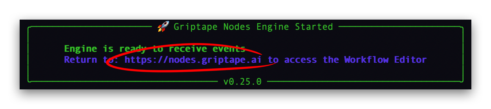
  </a>
</p>

!!! tip

    최적의 학습 환경을 위해 브라우저 창 두 개를 나란히 띄워두세요. 한쪽에는 이 튜토리얼을, 다른 한쪽에는 Griptape Nodes 세션을 열어두는 것이 좋습니다.

## 랜딩 페이지

브라우저가 열리면 Griptape Nodes 랜딩 페이지가 나타납니다. 이 페이지에는 사용자에게 소개하고자 하는 다양한 기능을 보여주는 여러 템플릿 워크플로우가 표시됩니다. 사용자가 직접 워크플로우를 저장하기 시작하면 최신순으로 이곳에 표시됩니다.

<p align="center">
  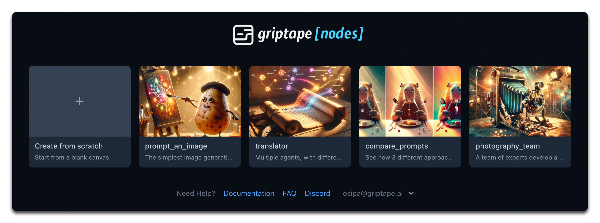
</p>

이러한 샘플 워크플로우는 Griptape Nodes의 기능을 학습하기에 훌륭한 자료이지만, 지금은 "처음부터(from scratch)" 시작해 보겠습니다.

## 빈 캔버스에서 새 워크플로우 만들기

랜딩 페이지에서 **"Create from scratch"** 타일을 찾아 클릭합니다. 워크플로우를 구축할 수 있는 빈 작업 공간이 열립니다.

<p align="center">
  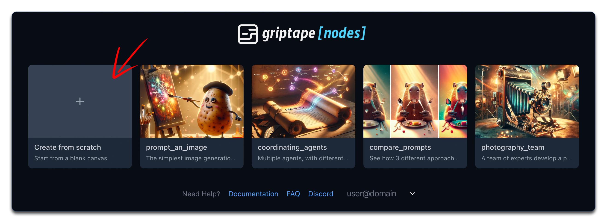
</p>

## Griptape Nodes 인터페이스 익히기

Workflow Editor에 들어왔다면 잠시 인터페이스를 둘러보세요:

<p align="center">
  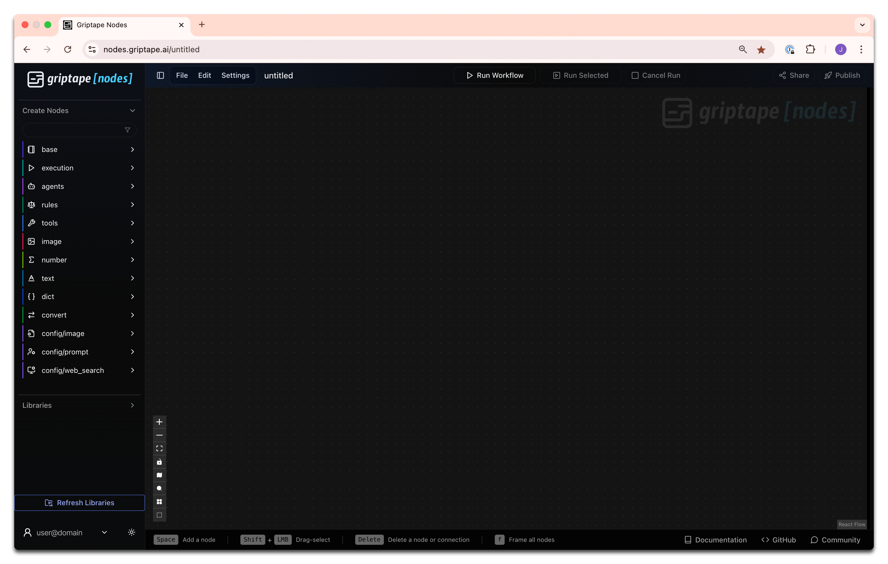
</p>

### 라이브러리

초기에 가장 중요하게 살펴볼 영역은 왼쪽 패널의 노드 라이브러리입니다. 상단에 **Create Nodes** 섹션이 있습니다. 이 패널에는 Griptape Nodes에 기본 제공되는 모든 표준 노드가 포함되어 있습니다. 각 노드는 특정 기능을 수행합니다. Griptape Nodes에 익숙해지면 이러한 노드가 어떻게 작동하고 이들을 조합하여 강력한 자동화를 만드는 방법을 배우게 됩니다.

<p align="center">
  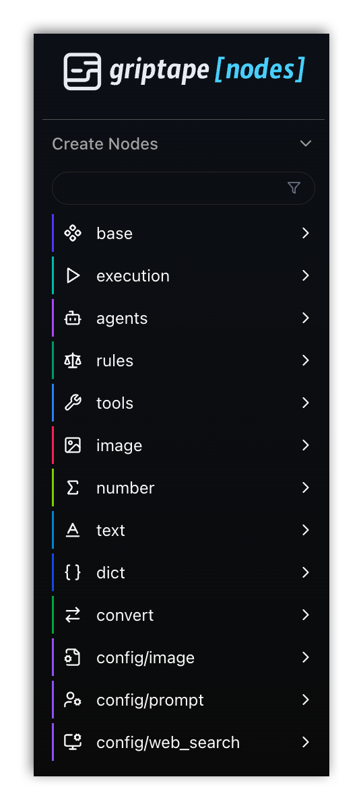
</p>

## 워크스페이스에 노드 추가하기

노드를 생성하는 데는 세 가지 대화형 방식이 있습니다([Retained Mode](../../development/retained_mode.md)에서는 더 많은 방식 지원):

<div style="display: flex; justify-content: space-between; gap: 20px; margin-bottom: 30px;">
  <div style="flex: 1;">
    <p><strong>드래그 앤 드롭 (Drag and Drop)</strong>: 왼쪽 패널에서 노드를 클릭한 상태로 작업 공간 위로 드래그합니다.</p>
    <p align="center">
      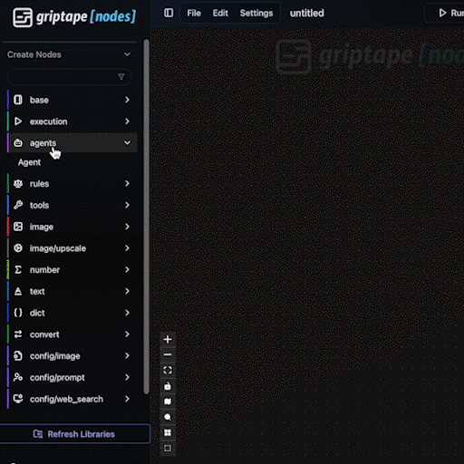
    </p>
    <h4 align="center">드래그 앤 드롭</h4>
  </div>

<div style="flex: 1;">
    <p><strong>더블 클릭 (Double-Click)</strong>: 왼쪽 패널의 아무 노드나 더블 클릭하면 작업 공간 중앙에 자동으로 배치됩니다.</p>
    <p align="center">
      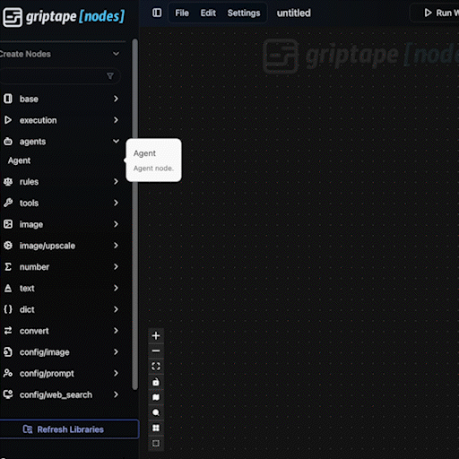
    </p>
    <h4 align="center">더블 클릭</h4>
  </div>

<div style="flex: 1;">
    <p><strong>Shift+A 또는 더블 클릭 검색</strong>: 플로우 에디터에서 Shift+A를 누르거나 더블 클릭하면 검색창이 나타납니다. 원하는 노드 이름을 입력하고 Enter를 누르면 생성됩니다.</p>
    <p align="center">
      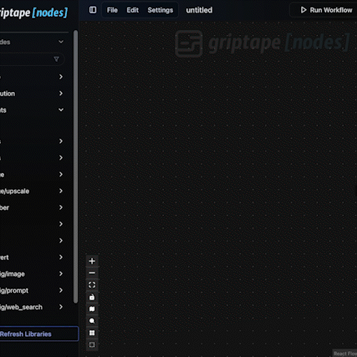
    </p>
    <h4 align="center">Shift+A 또는 더블 클릭 검색</h4>
  </div>
</div>

노드를 추가한 후에는 다음 작업을 수행할 수 있습니다:

- 클릭하고 드래그하여 작업 공간 내에서 위치 이동
- 설정값 및 동작 편집
- 다른 노드와 연결

## 노드 연결하기

위에서 언급한 첫 번째 방법(라이브러리에서 작업 공간으로 드래그 앤 드롭)을 사용하여 세 개의 노드를 만들어 보겠습니다.

1. **Agent** ( agents > Agent )
    \- LLM(OpenAI ChatGPT 또는 Anthropic Claude 등)과 상호작용하는 에이전트입니다.

    1. 사이드바에서 agents 카테고리를 엽니다.
    1. Agent 노드를 작업 공간으로 드래그하여 놓습니다.

    !!! info

        간결한 설명을 위해 이를 ( 카테고리 > 노드 ) 형태로 표시합니다. 예를 들어 Agent는 ( agents > Agent )로 표기합니다. 다음 두 노드도 동일한 방식으로 생성해 보세요.

1. **FloatInput** ( number > FloatInput )
    \- 소수점 숫자(float)를 입력받는 노드입니다.

1. **TextInput** ( text > TextInput )
    \- 텍스트를 입력받는 노드입니다.

<p align="center">
  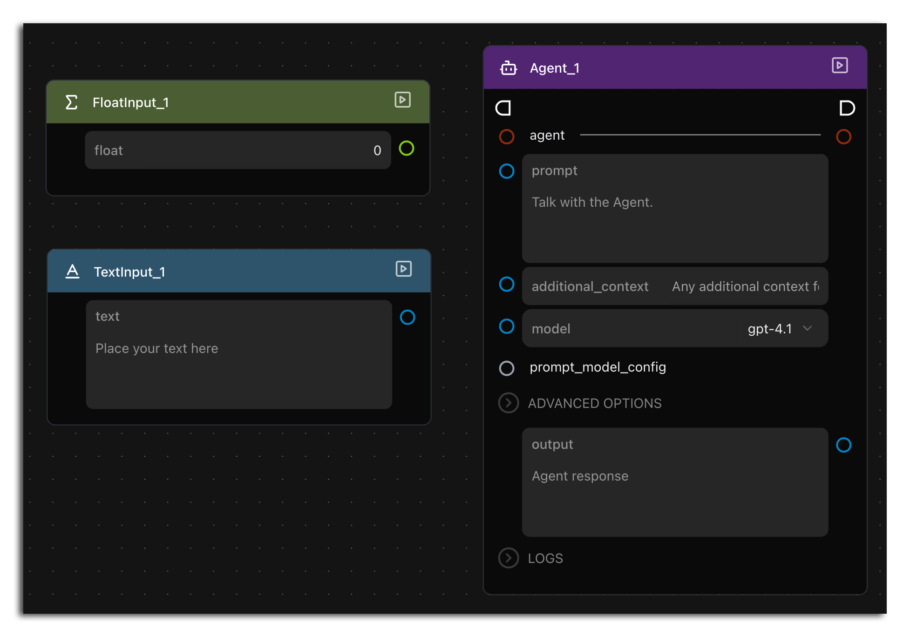
</p>

두 입력 노드의 포트에서 Agent의 다양한 포트로 드래그하여 연결을 시험해 보세요. 여러 조합을 시도해보면 모든 연결이 허용되지는 않는다는 것을 알 수 있습니다.

이는 데이터 유형이 호환될 때만 파라미터가 직접 연결될 수 있기 때문입니다:

- **TextInput** 노드는 **텍스트(text)**를 출력하므로 텍스트를 받는 모든 Agent 파라미터에 연결할 수 있습니다.
- **FloatInput** 노드는 소수점 숫자(**float**)를 출력하므로 Agent의 어떤 파라미터에도 연결할 수 없습니다.

FloatInput을 어디에도 연결할 수 없다고 걱정하지 마세요. 그것이 바로 확인하려던 점입니다! 이 노드는 모든 파라미터가 서로 연결될 수 있는 것은 아님을 보여주기 위해 *여기*에 포함되었습니다. FloatInput 노드는 매우 유용하지만 *이* 워크플로우에 있는 다른 노드들과는 함께 사용할 수 없을 뿐입니다.

!!! Pro tip "전문가 팁"

    포트 색상을 호환성에 대한 시각적 가이드로 활용하세요. 색상이 일치하는 포트끼리 서로 연결할 수 있습니다.

<p align="center">
  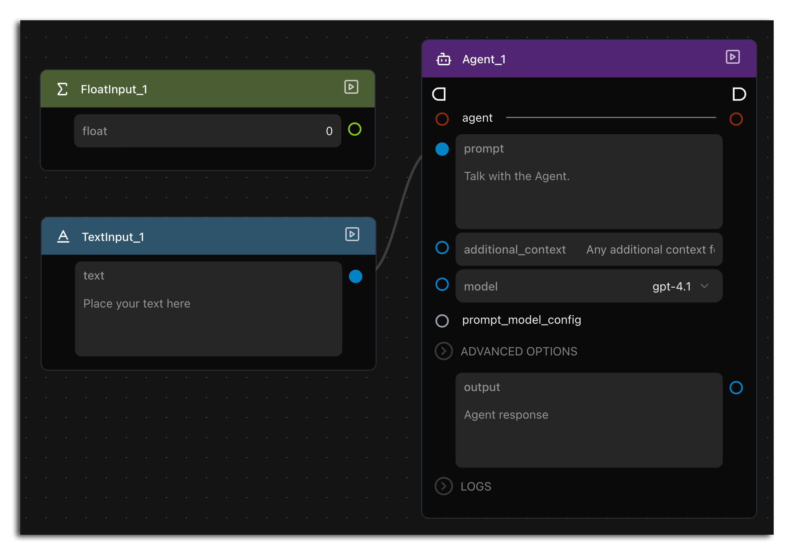
</p>

## Agent 사용해보기

이제 화면을 깨끗이 비우고 실제 AI 상호작용을 경험해 보겠습니다:

1. File 메뉴로 이동하여 **New**를 선택합니다.

1. 새 워크플로우에서 원하는 방법으로 Agent 노드를 하나 만듭니다.

1. 에이전트의 prompt 필드에 질문을 입력합니다. AI 서비스를 확인하기 위해 "Who trained you?"를 입력하거나 챗봇에 일상적으로 묻는 질문을 입력할 수 있습니다.

    <p align="center">
    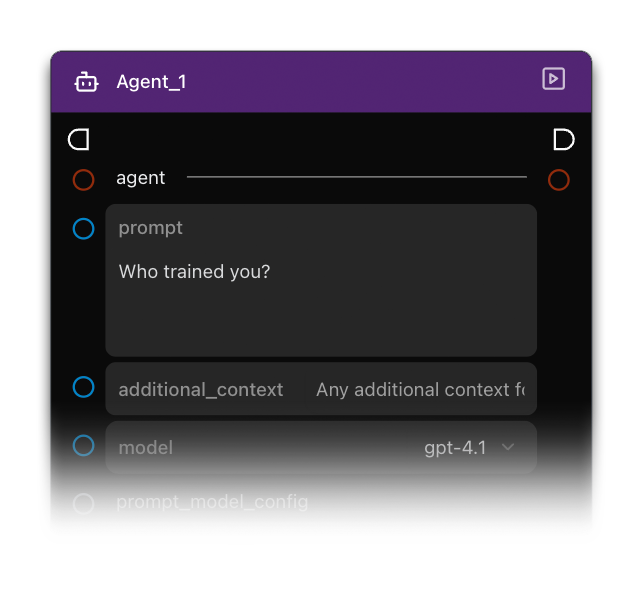
    </p>

1. 에이전트 우측 상단의 재생(Play) 버튼 아이콘을 클릭하여 노드를 실행합니다.

    <p align="center">
    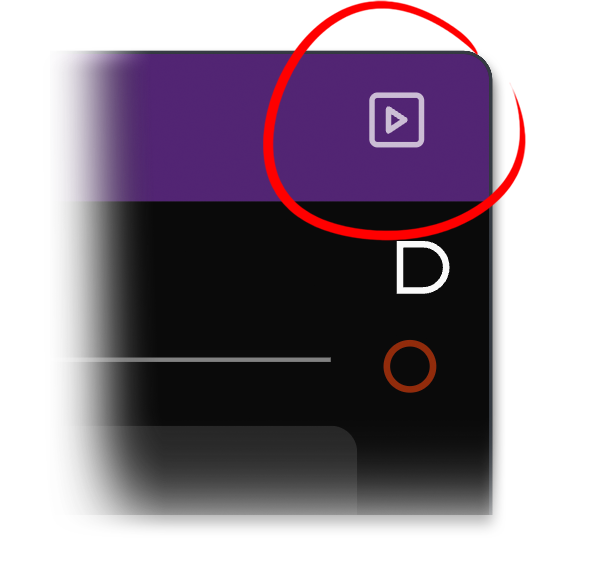
    </p>

1. 텍스트가 나타나면 출력 결과를 확인합니다.

방금 대규모 언어 모델(LLM)과 상호작용을 완료했습니다. 기본 설정을 유지했다면 구체적으로 OpenAI ChatGPT (GPT-4.1)를 사용한 것입니다.

이 경험이 웹에서 OpenAI ChatGPT나 Anthropic Claude를 사용하는 것과 비슷해 보일 수 있지만, 진정한 강력함은 Griptape Nodes의 다른 컴포넌트들과 LLM을 결합하여 사용할 때 나타납니다. 왼쪽 라이브러리 패널을 다시 확인하여 사용 가능한 다른 노드들을 살펴보세요. 이제 막 시작했을 뿐이며 탐색할 내용이 무궁무진합니다!

## 요약

이 튜토리얼에서 다룬 내용은 다음과 같습니다:

- Griptape Nodes 실행하기
- 랜딩 페이지에서 워크플로우로 이동하기
- Griptape Nodes Editor 익히기
- 작업 공간에 첫 노드 추가하기
- 노드 간 연결 규칙 배우기
- 에이전트 실행하기

## 다음 단계

다음 단원인 [Lesson 2: 이미지 프롬프트 생성](../01_prompt_an_image/index.md)에서는 본격적으로 재미있는 작업인 이미지 생성을 시작해 보겠습니다!
