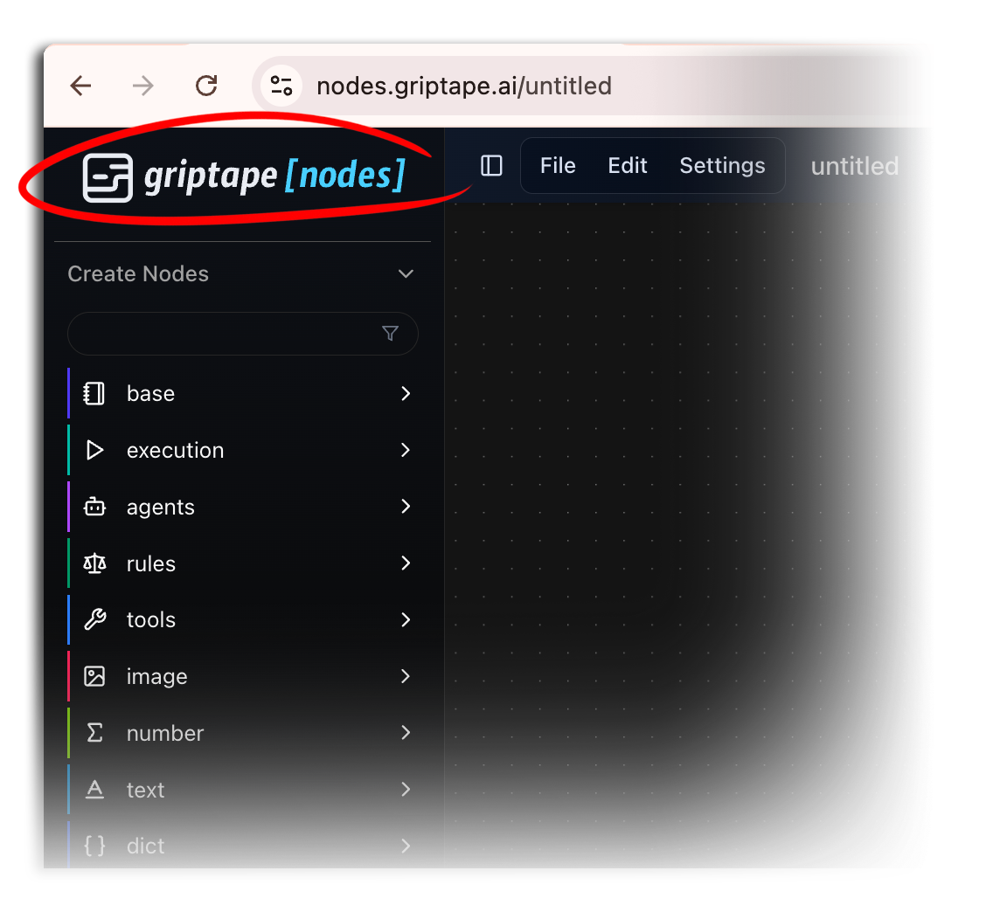
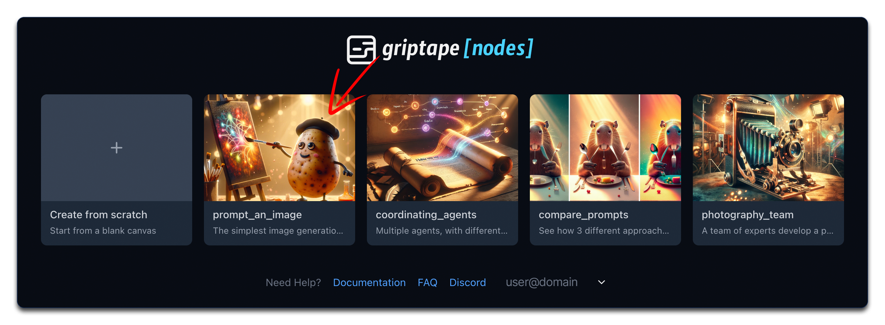
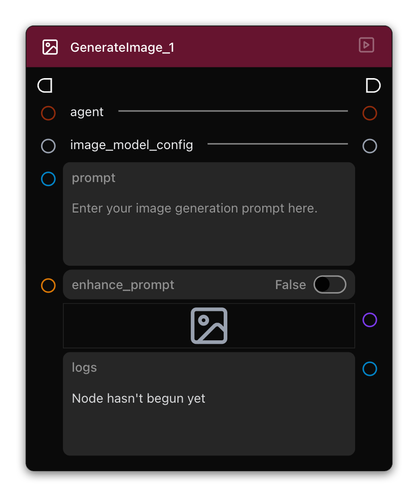
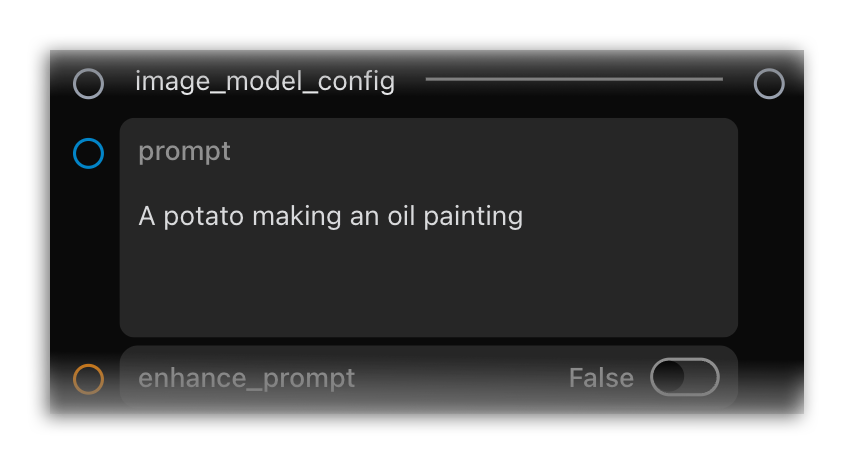
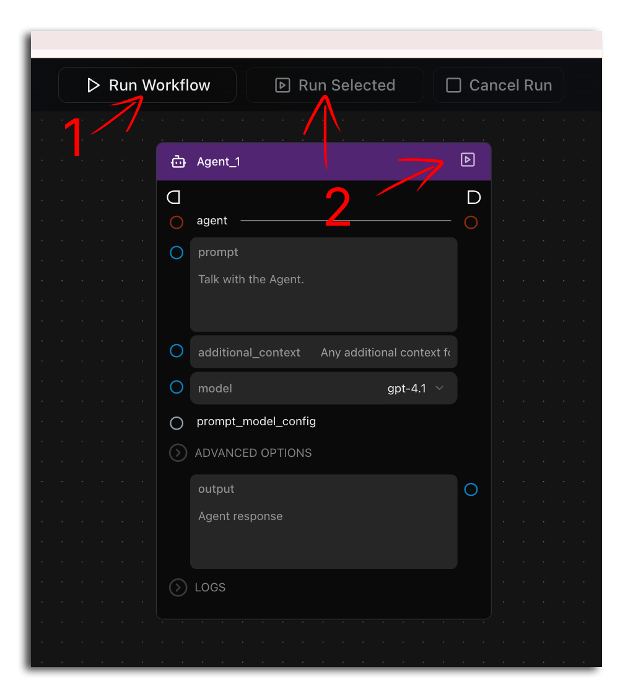
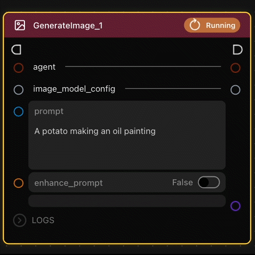
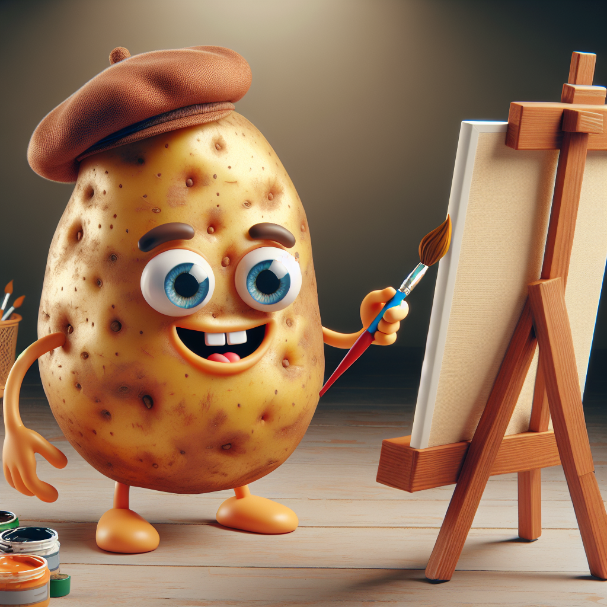

# Lesson 2: 이미지 프롬프트 생성 (Prompt an Image)

Griptape Nodes 시리즈의 두 번째 튜토리얼에 오신 것을 환영합니다! 이 가이드에서는 GenerateImage 노드를 익히는 데 집중합니다.

워크플로우 자체는 이 단일 노드로만 구성되어 매우 단순하지만, GenerateImage 노드는 초기 프로젝트에서 이미지 생성을 담당하는 핵심 노드가 될 것입니다. 이 강력한 노드는 다양한 시각적 콘텐츠를 제작하는 토대입니다.

## 이번 단원에서 다룰 내용

이 튜토리얼에서는 다음 내용을 배웁니다:

- 저장된 워크플로우를 여는 방법
- GenerateImage 노드 이해하기
- 텍스트 프롬프트를 사용하여 이미지 생성하기

## 랜딩 페이지로 이동하기

이 튜토리얼을 시작하려면 메인 랜딩 페이지로 돌아가야 합니다. 에디터 왼쪽 상단의 내비게이션 요소를 클릭하여 모든 템플릿 워크플로우와 저장된 파일이 표시되는 곳으로 돌아갑니다.

  

## 이미지 프롬프트 예제 열기

랜딩 페이지에서 **"Prompt an Image"** 타일을 찾아 클릭하여 이 예제 워크플로우를 엽니다.

  

## GenerateImage 노드 이해하기

예제가 로드되면 단 하나의 노드로 구성되어 있는 것을 볼 수 있습니다. 단순해 보인다고 얕보지 마세요. 이 노드는 Griptape Nodes에서 가장 강력한 도구 중 하나이며 앞으로 만들 플로우에서 핵심적인 역할을 하게 될 것입니다.

  

이 노드는 일반적으로 더 복잡한 플로우가 필요한 여러 작업을 자체적으로 처리하도록 구성되어 있어 AI 이미지 생성을 시작하기에 완벽합니다.

## 텍스트 프롬프트를 사용하여 이미지 생성하기

이 노드의 주요 상호작용 지점은 AI가 생성하기를 원하는 이미지를 설명하는 텍스트 프롬프트 필드입니다.

첫 번째 이미지를 생성하려면:

1. 노드에서 텍스트 프롬프트(prompt) 필드를 찾습니다.
1. 생성하려는 이미지에 대한 설명을 입력합니다.

    
  

이제 노드를 실행해 봅니다. UI에 세 개의 버튼이 있지만 실제로는 두 가지 작업만 수행합니다:

  

1. *전체* 워크플로우 실행:

    1. 에디터 상단의 **Run Workflow** 버튼을 클릭합니다. 처음부터 끝까지 전체 워크플로우가 실행되며, 연결 관계에 따라 모든 노드가 순차적으로 처리됩니다.

1. 워크플로우에서 단일 노드 실행 (동일한 작업을 수행하는 두 가지 방법):

    1. 특정 노드의 오른쪽 상단에 있는 **Run Node** 버튼을 클릭합니다.
    1. 또는 노드를 선택하고 툴바에서 **Run Selected**를 클릭합니다.

단일 노드 실행은 워크플로우의 특정 부분을 테스트하거나 디버깅할 때, 또는 다른 부분을 아직 업데이트하지 않고 빠르게 실행하고 싶을 때 매우 유용합니다.

차이점은 실행 범위에 있습니다. 첫 번째 옵션은 모든 것을 실행하고, 두 번째 옵션은 선택한 노드와 그 노드가 필요로 하는 선행 노드만 실행합니다.

!!! warning "생성 소요 시간"

    이미지 생성을 처음 접하는 사용자를 위한 참고 사항: 생성 작업에는 시간이 걸릴 수 있습니다. 실행이 시작되기 전 **Run Node** 아이콘이 있던 자리에 노드의 노란색 테두리와 회전하는 **Running** 아이콘이 표시되는지 확인하세요. 이러한 시각적 표시는 어떤 노드가 현재 처리 중인지 알려주며 정상적으로 작동하고 있음을 보여줍니다.

    

      
    

## 다양한 설명으로 실험하기

서로 다른 프롬프트로 이미지를 생성해 보겠습니다:

1. **첫 번째 예제**: 워크플로우가 로드되면 프롬프트 필드에 "A potato making an oil painting"(유화를 그리는 감자)이 입력되어 있습니다. 플로우를 실행합니다.

    

    
    

1. **두 번째 예제**: 프롬프트를 "A potato doing aerobics in 70s workout attire"(70년대 운동복을 입고 에어로빅을 하는 감자)로 변경하고 플로우를 다시 실행합니다.

    

    
    

프롬프트에서 단 몇 단어만 바꿨을 뿐인데 결과가 얼마나 극적으로 달라지는지 확인해 보세요. 이는 GenerateImage 노드의 유연성과 강력함을 잘 보여줍니다. 설명할 수 있는 모든 것을 생성할 수 있습니다.

## 요약

이 튜토리얼에서 다룬 내용은 다음과 같습니다:

- 저장된 워크플로우를 여는 방법
- GenerateImage 노드
- 텍스트 프롬프트를 사용하여 이미지를 생성하는 방법

GenerateImage 노드는 Griptape Nodes에서 창의적인 플로우를 만들기 위한 핵심 구성 요소입니다. 학습을 진행하면서 다른 노드들과 결합하여 더욱 강력한 애플리케이션을 개발하는 방법을 배우게 됩니다.

## 다음 단계

다음 단원인 [Lesson 3: 에이전트 조율하기](../02_coordinating_agents/index.md)에서는 AI들이 팀을 이루어 워크플로우를 통해 순차적으로 작업을 전달하는 방법을 알아봅니다.
