# Lesson 3: 에이전트 조율하기 (Coordinating Agents)

Griptape Nodes 시리즈의 세 번째 튜토리얼에 오신 것을 환영합니다! 이 가이드에서는 워크플로우 내에서 여러 에이전트를 조율하여 순차적인 작업(구체적으로 언어 간 이야기 번역 및 요약)을 수행하는 방법을 배웁니다.

## 이번 단원에서 다룰 내용

이 튜토리얼에서는 다음 내용을 다룹니다:

- 순차적으로 작동하는 에이전트 간의 번역 워크플로우를 분석하고 재현하기
- 출력 결과를 새 프롬프트로 가공하는 "텍스트 병합(merge texts)" 방법 알아보기
- 워크플로우 실행 순서를 제어하는 "실행 체인(exec chain)" 이해하기
- 템플릿 워크플로우를 확장하여 요약 작업 추가하기

이 단원을 마치면 에이전트들이 서로의 작업물을 이어받아 전문화된 작업 간에 정보를 원활하게 전달하는 워크플로우를 구축하는 방법을 이해하게 됩니다. 이 기초는 각 단계마다 서로 다른 지능이 요구되는 다단계 프로세스를 처리할 수 있는 정교한 AI 시스템을 만드는 밑거름이 될 것입니다.

이러한 원리를 실제로 보여주는 간단한 번역 워크플로우를 살펴보며 시작하겠습니다.

## 랜딩 페이지로 이동하기

이 튜토리얼을 시작하려면 왼쪽 상단의 Griptape Nodes 로고가 있는 내비게이션 바를 통해 랜딩 페이지로 이동합니다. 페이지 상단에서 "coordinating_agents"라는 예제 워크플로우를 찾아 엽니다.

  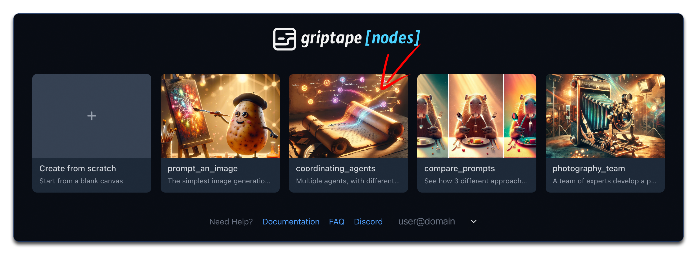

## 템플릿 워크플로우 살펴보기

템플릿이 로드되면 다음과 같은 구성 요소를 가진 워크플로우가 표시됩니다:

  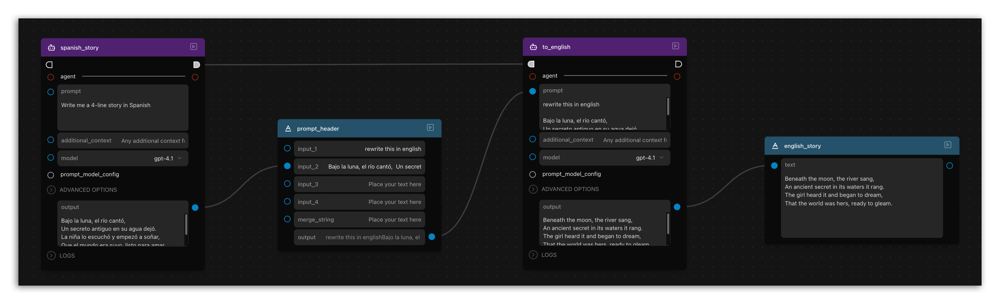

1. **Agent 노드 (spanish_story)**: 스페인어로 된 4줄짜리 이야기를 생성합니다.
1. **Merge Text 노드**: 스페인어 이야기와 "Rewrite this in English" 지시문을 결합합니다.
1. **두 번째 Agent 노드 (to_english)**: 결합된 프롬프트를 영어로 번역합니다.
1. **Display Text 노드**: 최종 영어 번역 결과를 표시합니다.

이 워크플로우는 여러 에이전트가 각자의 고유한 "역할"을 수행하는 방식을 보여줍니다.

한 에이전트의 출력을 **MergeTexts** 노드를 통해 다른 에이전트에 연결함으로써 다음 에이전트의 동작을 유도하는 *새로운* 프롬프트를 만들 수 있습니다.

## 여기서 MergeText 노드가 사용되는 방식

**MergeTexts** 노드가 하는 일은 입력되는 텍스트들을 "병합 문자열(merge string)"을 구분자로 사용하여 결합하는 것입니다. 기본 병합 문자열은 줄바꿈 두 개(`\n\n`)입니다. 이 예제에서는 MergeTexts 노드의 **input_1**에 "Rewrite this in English:"를 입력하고, **spanish_story** 노드의 출력을 **input_2**에 연결했습니다. 실행 시 **MergeTexts** 노드는 다음을 출력합니다:

> Rewrite this in English:
>
> Bajo la luna, el río cantó,
> Un secreto antiguo en su agua dejó.
> La niña lo escuchó y empezó a soñar,
> Que el mundo era suyo, listo para amar.

다른 노드의 결과물로부터 새 프롬프트를 만드는 이러한 방식을 통해 첫 번째 에이전트가 스페인어 이야기를 작성하고 두 번째 에이전트가 이를 영어로 번역하는 정교한 멀티 에이전트 워크플로우를 구현할 수 있습니다. 최종 출력물은 생성된 독특한 스페인어 이야기의 영어 번역본이 됩니다.

    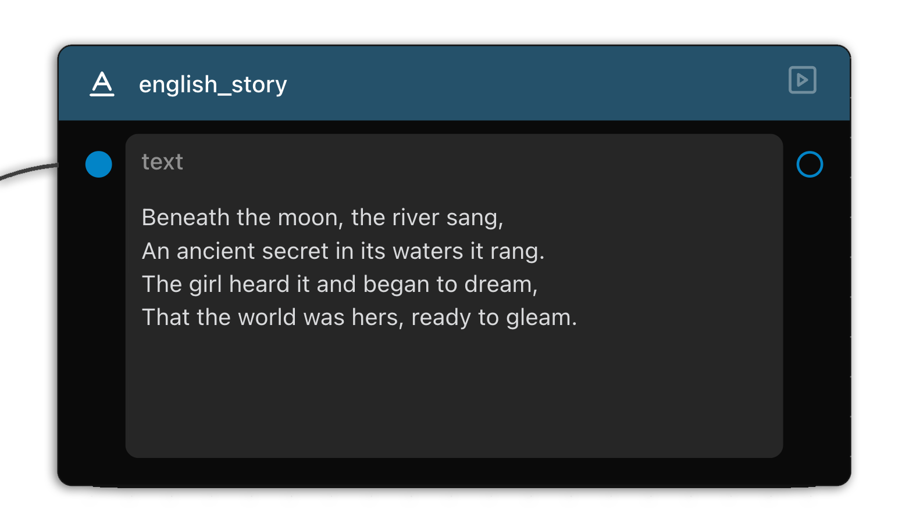
  

!!! info

    실행할 때마다 결과가 달라질 수 있습니다. 이는 정상적인 현상입니다! 에이전트와 대화하는 것은 사람과 대화하는 것과 비슷합니다. 같은 질문을 여러 번 하더라도 조금씩 다른 답변을 받을 수 있습니다.

## 유사한 워크플로우 직접 만들어보기

우리가 만들고자 하는 목표는 다음과 같습니다:

  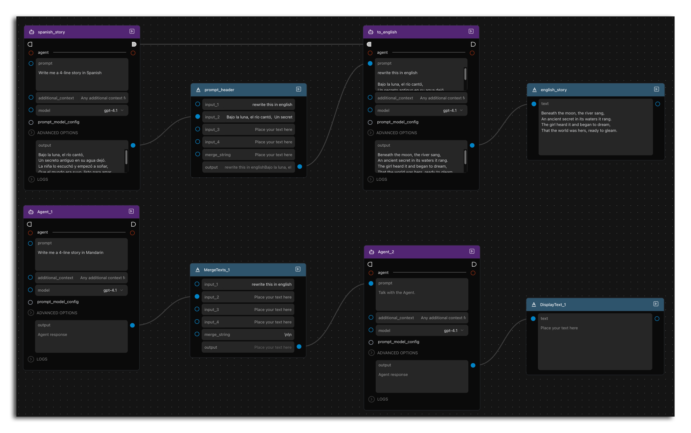

이제 직접 워크플로우를 만들어 볼 차례입니다. 노드 생성 및 연결을 연습하기 위해 기존 플로우 바로 아래에 거의 동일한 플로우를 만들어 보세요. 워크플로우에 다음을 추가합니다:

1. 두 개의 **Agent** ( agents > Agent )
    \- LLM(ChatGPT, Claude 등)과 상호작용하는 에이전트입니다.
1. **MergeTexts** 노드 ( text > MergeTexts )
    \- 여러 텍스트를 입력받아 "병합"하여 출력하는 노드입니다.
1. **DisplayText** 노드 ( text > DisplayInput )
    \- 보기 편하도록 텍스트 출력을 표시하는 노드입니다.

## 첫 번째 Agent 구성하기

선택한 언어로 콘텐츠를 생성하도록 첫 번째 에이전트를 설정합니다:

1. 첫 번째 에이전트 노드에 다음을 입력합니다: `Write me a four line story in [원하는 언어]` (예: Mandarin, French, Korean 등)
1. 이 에이전트는 번역할 초기 이야기를 생성합니다.

  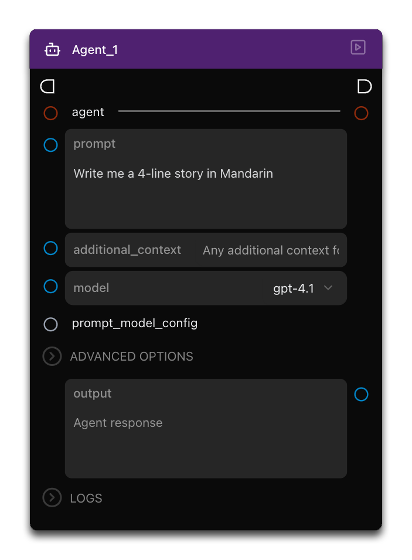

## MergeTexts 노드 연결하기

다음으로 번역 프롬프트를 준비합니다:

1. MergeTexts 노드의 **input_1** 필드에 직접 `Rewrite this in English`를 입력합니다.
1. 첫 번째 Agent의 출력을 MergeTexts 노드의 **input_2**에 연결합니다.

  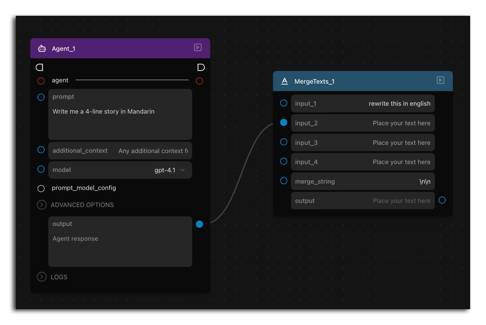

## 두 번째 Agent 구성하기

번역 에이전트를 설정합니다:

MergeTexts 노드의 출력을 두 번째 Agent 노드의 **prompt**에 연결합니다. 이제 이 에이전트는 원본 이야기와 번역 지시문을 모두 전달받게 됩니다.

  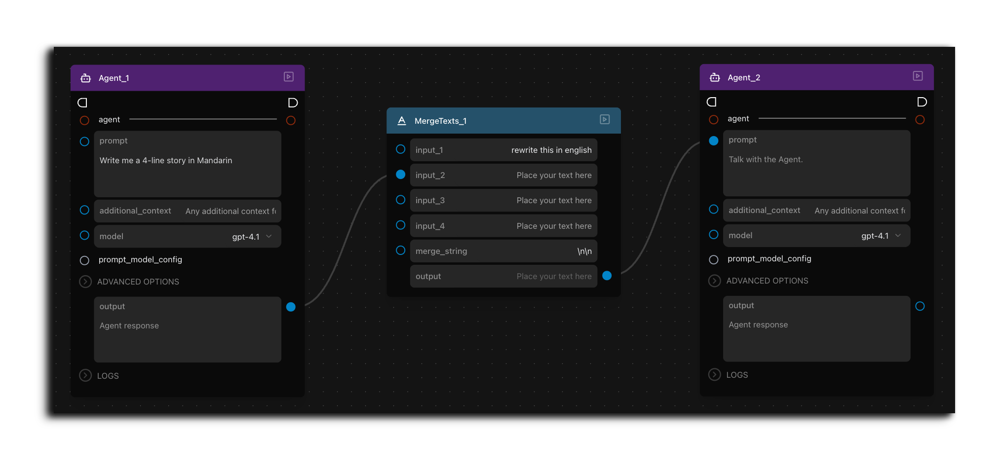

## 결과 표시하기

최종 번역을 확인하려면:

1. 두 번째 Agent의 출력을 DisplayText 노드에 연결합니다.
1. 워크플로우를 실행합니다.
1. 워크플로우가 실행된 후 이 노드에 번역된 영어 텍스트가 표시됩니다:

  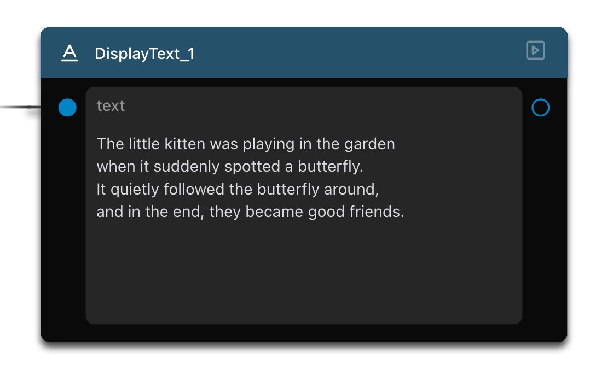

## 실행 순서 이해하기 (Exec Chain)

Griptape Nodes의 핵심 개념 중 하나는 실행 체인(execution chain)입니다. 워크플로우가 복잡해질수록 실행 순서를 제어하는 것이 중요해집니다. 이 개념을 살펴보겠습니다.

1. 노드에 있는 "exec in" 및 "exec out" 핀(반원 모양 커넥터)을 확인하세요.
1. 이 핀들이 노드의 실행 순서를 정의합니다.
1. 복잡한 워크플로우의 경우 원하는 실행 순서대로 exec 포트를 연결합니다.
1. 이렇게 하면 복잡한 데이터 흐름에서도 노드가 의도한 순서대로 실행됩니다.

  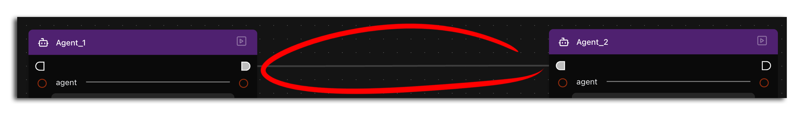

!!! info

    Griptape Nodes는 노드 간의 종속성을 분석하여 실행 순서를 자동으로 결정합니다.

    하지만 실행 순서를 보다 정밀하게 제어해야 할 때는 exec chain 기능을 사용할 수 있습니다. 자동 종속성 감지가 의도한 동작과 일치하지 않을 때 명시적으로 순서를 정의할 수 있습니다.

    원할 때 언제든지 exec chain을 사용해도 별도의 비용이나 불이익은 없으나, 잘못된 순서로 실행을 강제할 수 있다는 점만 주의하면 됩니다. 대부분의 단순한 플로우에서는 굳이 연결할 필요가 없습니다.

## 워크플로우 확장: 여러 이야기 요약하기

_모든_ 이야기를 요약할 수 있도록 워크플로우를 개선해 보겠습니다:

1. 두 영어 번역을 결합하는 새로운 **MergeTexts** 노드를 하나 더 추가합니다.
    1. 이 MergeTexts 노드의 **input_1**에 `Summarize both these stories`를 입력합니다.
    1. 두 번역 노드의 **출력(output)**을 각각 MergeTexts 노드의 **input_1**과 **input_2**에 연결합니다.
1. 또 다른 **Agent** 노드를 추가합니다.
1. MergeTexts의 **출력**을 새 에이전트의 **prompt**에 연결합니다.
1. 에이전트 **출력**을 새 **DisplayText** 노드에 연결합니다.
1. 선택적으로 exec chain 연결을 사용하여 이 요약 단계가 마지막에 실행되도록 합니다(원하는 순서대로 _모든 것_을 연결할 수도 있습니다).

  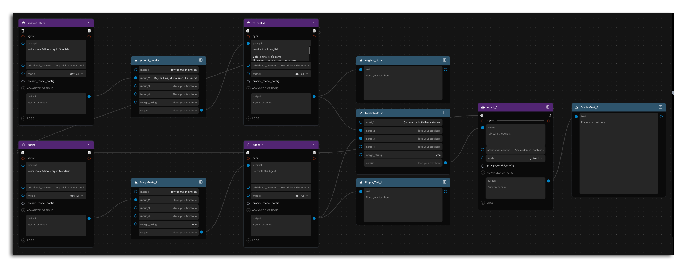

## 전체 워크플로우 실행하기

확장된 워크플로우를 실행하고 진행 과정을 관찰합니다:

1. 첫 번째 에이전트들이 서로 다른 언어로 이야기를 생성합니다.
1. MergeTexts 노드들이 이를 번역하기 위한 프롬프트를 만듭니다.
1. 두 번째 에이전트들이 이야기를 영어로 번역합니다.
1. 요약 에이전트가 두 번역을 결합하여 요약합니다.
1. Display 노드들이 모든 결과를 표시합니다.

  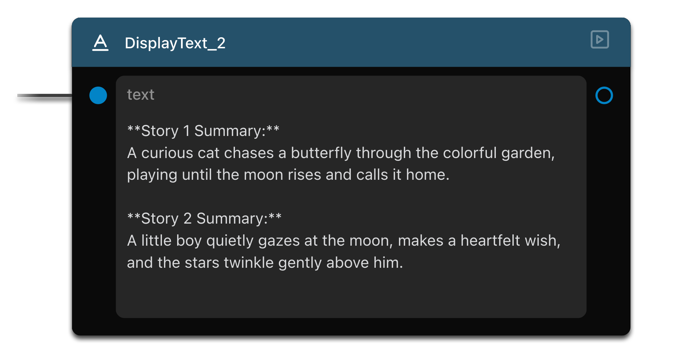

!!! info

    다시 강조하지만 응답 내용 자체보다는 이 _구조_가 올바르게 작동하는지 확인하세요. 텍스트 내용은 여기서 보이는 것과 완전히 다를 수 있습니다!

## 요약

이 튜토리얼에서 다룬 내용은 다음과 같습니다:

- 워크플로우가 번역과 같은 작업을 수행하기 위해 에이전트 간에 데이터를 전달하는 방법
- "MergeTexts"를 활용하여 출력을 새 프롬프트로 가공하는 방법
- 워크플로우 실행 순서를 제어하는 "exec chain"
- 템플릿 워크플로우를 확장하여 요약 작업 추가하기

## 다음 단계

다음 단원인 [Lesson 4: 프롬프트 비교하기](../03_compare_prompts/index.md)에서는 에이전트들이 플로우를 통해 순차적으로 작업을 전달하는 버킷 브리게이드(bucket-brigade) 방식을 배웁니다!
