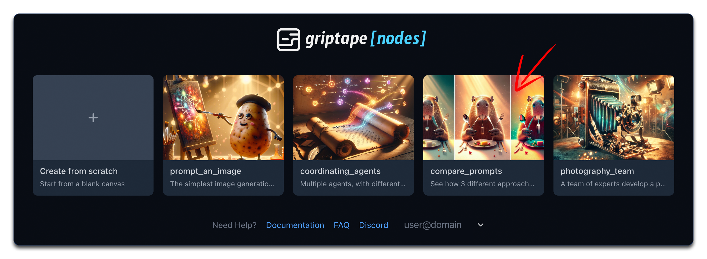
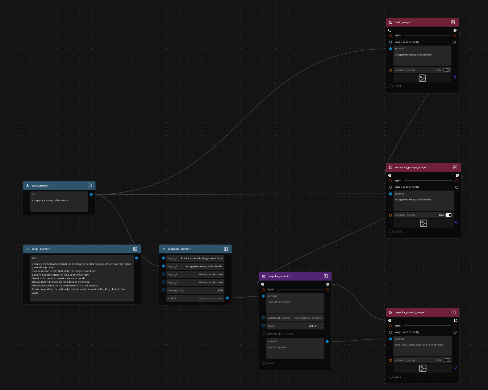
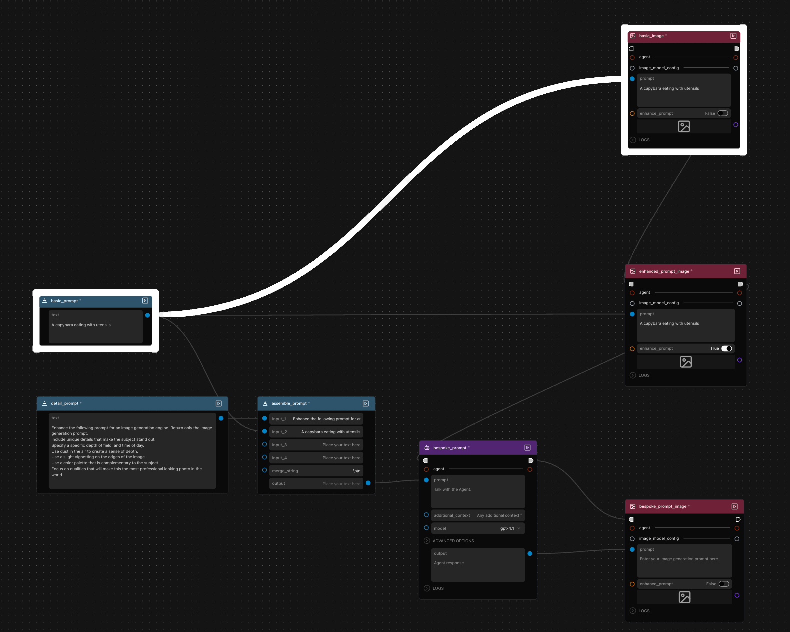
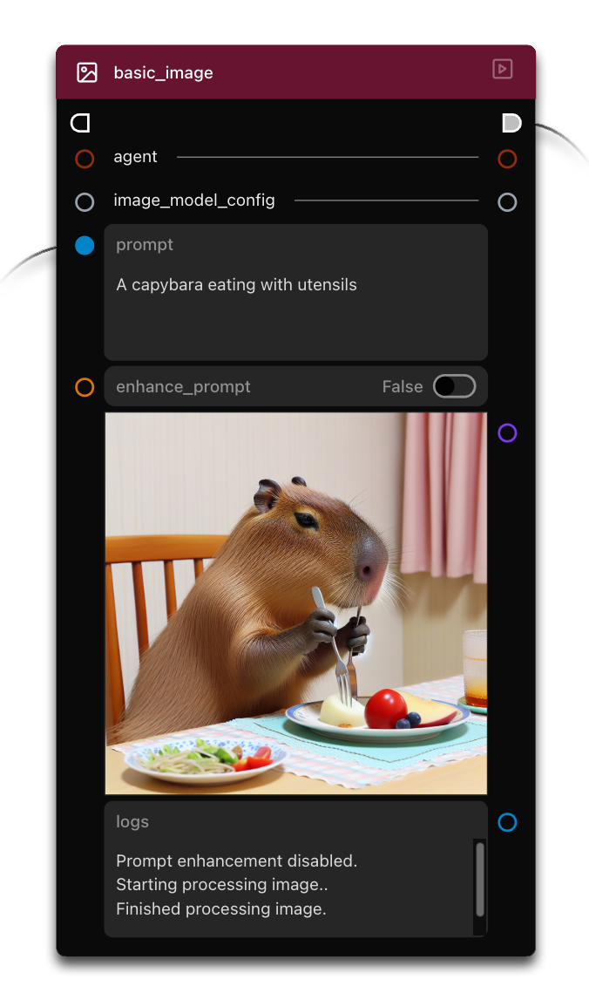
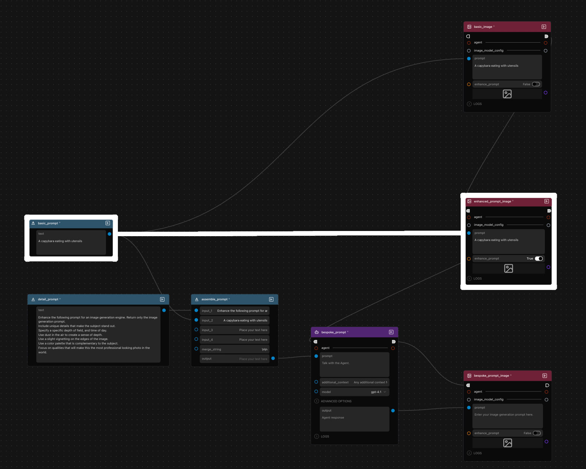
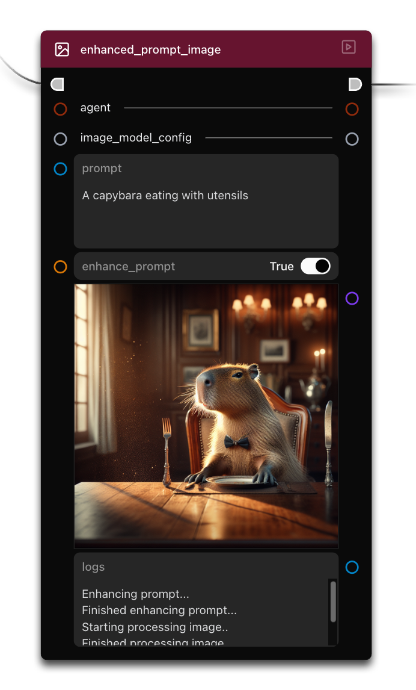
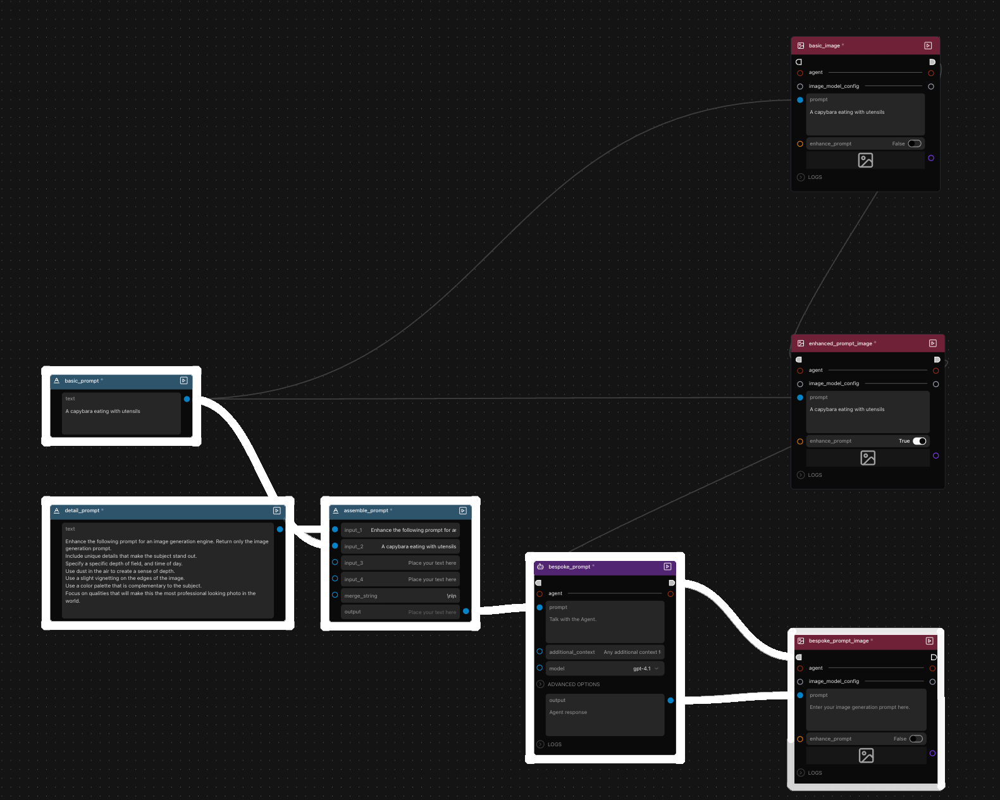
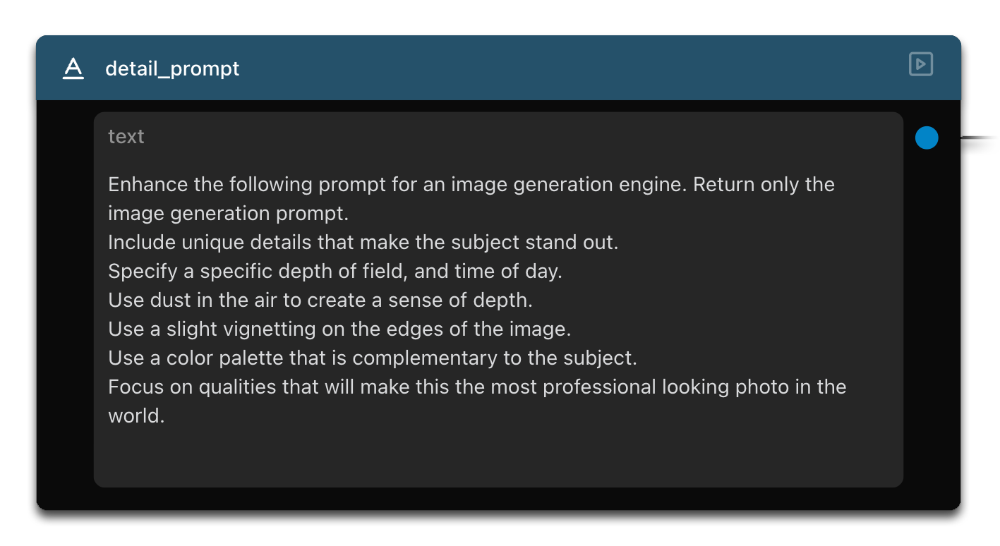
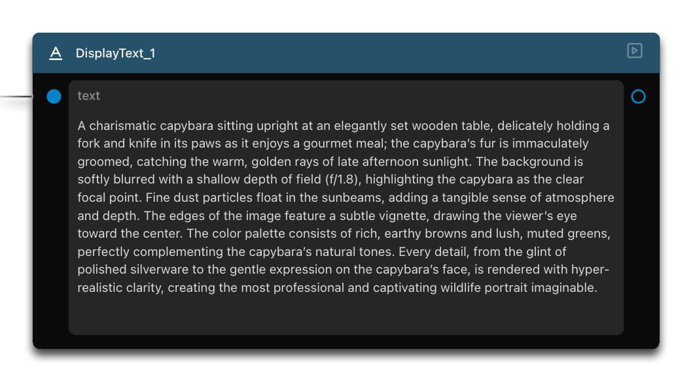
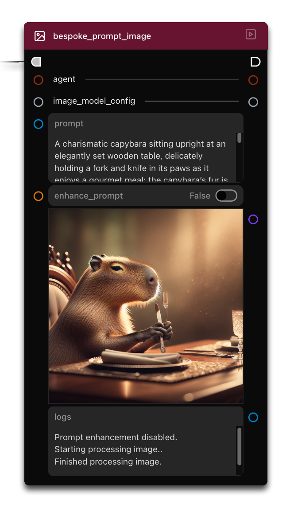

# Lesson 4: 프롬프트 비교하기 (Compare Prompts)

Griptape Nodes의 네 번째 튜토리얼에 오신 것을 환영합니다! 멀티 에이전트 시스템과 이미지 생성에 대해 이미 알고 있는 지식을 바탕으로 흥미로운 프롬프트 엔지니어링의 세계를 살펴봅니다. 기성 솔루션을 사용하는 방법과 지속적으로 더 나은 결과를 얻기 위해 자체 프롬프트 구축 워크플로우를 만드는 방법을 배웁니다. 또한 "Enhance Prompt" 기능이 배후에서 어떻게 마법을 부리는지도 함께 알아봅니다!

## 이번 단원에서 다룰 내용

이 튜토리얼에서는 다음 내용을 다룹니다:

- 이미지 생성을 위한 세 가지 서로 다른 프롬프트 접근 방식 비교
- "Enhance Prompt" 기능 이해하기
- 커스텀 프롬프트 향상 플로우에 대해 배우기

## 랜딩 페이지로 이동하기

이 튜토리얼을 시작하려면 인터페이스 왼쪽 상단의 Griptape Nodes 로고를 클릭하여 메인 랜딩 페이지로 돌아갑니다.

## Compare Prompts 예제 열기

랜딩 페이지에서 **"Compare Prompts"** 타일을 찾아 클릭하여 예제 워크플로우를 엽니다.

  

## 워크플로우 구조 이해하기

예제가 로드되면 여러 노드로 구성된 워크플로우가 표시됩니다:

  

이 워크플로우에는 다음이 포함되어 있습니다:

- 두 개의 TextInput 노드:
    - **basic_prompt**
    - **detail_prompt**
- MergeTexts 노드, **assemble_prompt**
- 세 개의 GenerateImage 노드:
    - **basic_image**
    - **enhanced_prompt_image**
    - **bespoke_prompt_image**
- 에이전트 노드, **bespoke_prompt**

서로 다른 프롬프트 기법의 결과를 비교하기 위해 워크플로우의 각 부분을 개별적으로 실행해 보겠습니다.

## 다양한 프롬프트 방식 비교하기

### 방식 1: 기본 프롬프트 (Basic Prompt)

가장 직관적인 접근 방식부터 시작해 보겠습니다:

  

1. "A capybara eating with utensils"(식기를 사용해 밥을 먹는 카피바라)라는 단순한 프롬프트가 있는 TextInput 노드를 찾습니다.
1. 첫 번째 GenerateImage 노드로 이어지는 연결선을 확인합니다.
1. 이 노드에서 **Enhance Prompt**가 **False**로 설정되어 있는지 확인합니다.
1. 노드 오른쪽 상단의 **Run Node** 버튼을 클릭하여 이 노드만 실행합니다.

결과 이미지를 관찰해 보세요. AI가 단순하고 직접적인 프롬프트를 어떻게 해석하는지 보여줍니다.

  

### 방식 2: Enhance Prompt 기능 사용

두 번째 방식에서는 동일한 단순 프롬프트를 사용하지만 GenerateImage의 내장 프롬프트 향상 기능을 사용합니다:

  

1. 동일한 단순 프롬프트를 전달받는 두 번째 GenerateImage 노드를 찾습니다.
1. 이 노드에서는 **Enhance Prompt**가 **True**로 설정되어 있는지 확인합니다.
1. 해당 노드의 **Run Node** 버튼을 사용하여 실행합니다.

이 결과를 첫 번째 이미지와 비교해 보세요. 훨씬 더 복잡하고 예술적인 해석을 확인할 수 있습니다. 동일한 단순 프롬프트임에도 향상된 버전은 훨씬 더 상세하고 시각적으로 매력적인 이미지를 생성합니다.

  

### 방식 3: 맞춤형 에이전트 향상 프롬프트 (Bespoke Agent-Enhanced Prompt)

세 번째 방식은 우리만의 커스텀 프롬프트 향상 과정을 만드는 방법을 보여줍니다:

  

1. MergeTexts 노드와 에이전트를 사용하여 프롬프트를 생성하는 방식을 살펴봅니다:

    - 상세한 프롬프트 지침이 MergeTexts 노드의 첫 번째 입력에 연결되어 있습니다.

    

    
    

    - 다른 예제와 동일한 단순 프롬프트가 MergeTexts 노드의 두 번째 입력에 연결됩니다.
    - "MergeTexts" 노드가 이들을 결합합니다.
    - 그런 다음 에이전트 노드가 결합된 프롬프트를 처리하여 이미지 생성을 위한 또 다른 프롬프트를 생성합니다.

1. 에이전트 노드를 실행합니다.

1. 에이전트의 출력을 검토합니다(자세히 확인하고 싶다면 DisplayText 노드를 추가하여 연결해 보세요!).

    
  

에이전트가 모든 세부 요구사항을 반영한 훨씬 더 정교한 프롬프트를 생성했음을 확인할 수 있습니다:

- 카피바라에 대한 고유한 세부 묘사
- 특정 시간대 (늦은 오후의 햇살)
- 피사계 심도 (Depth of field) 정보
- 색상 팔레트 가이드
- 전문 사진 촬영 요소

1. 마지막으로 세 번째 GenerateImage 노드(**Enhance Prompt**가 **False**로 설정됨)를 실행합니다. 방금 다룬 에이전트 향상 프롬프트를 사용합니다.

    
  

첫 번째 이미지에 비해 구체적인 세부 사항과 예술적 요소가 많이 포함되어 있으면서도 두 번째 방식과 유사한 수준의 정교함을 보여줍니다.

## 배후에서 일어나는 과정 이해하기

핵심 통찰은 다음과 같습니다. **Enhance Prompt** 기능을 **True**로 켤 때 Griptape는 맞춤형(bespoke) 경로에서 수동으로 시연했던 과정을 자동으로 수행합니다:

1. 기본 프롬프트와 상세 프롬프트를 가져옵니다.
1. 향상 지침(우리가 작성한 내용과 동일)을 가진 에이전트를 통해 이를 실행합니다.
1. 향상된 출력을 이미지 생성에 사용합니다.

직접 명시적인 향상 플로우를 구축함으로써 프롬프트가 개선되거나 변경되는 방식을 *완벽하게* 제어할 수 있습니다.

## 활용 및 모범 사례

학습한 내용을 바탕으로 프로젝트에 다음과 같은 접근 방식을 고려해 보세요:

- 빠르고 간단한 이미지 생성에는 기본 프롬프트(Enhance Prompt 꺼짐) 사용
- 최소한의 노력으로 전반적인 품질 향상을 원할 때는 "Enhance Prompt" 활성화
- 특정 예술적 요소를 정밀하게 제어하거나 특정 측면을 강조해야 할 때는 커스텀 에이전트 기반 향상 플로우 구축

## 요약

이 튜토리얼에서 다룬 내용은 다음과 같습니다:

- 이미지 생성을 위한 세 가지 서로 다른 프롬프트 접근 방식
- "Enhance Prompt" 기능의 원리
- 커스텀 프롬프트 향상 플로우

이러한 기법들은 AI 시스템에서 특화된 고품질 출력을 얻기 위해 프롬프트를 작성하고 다듬는 기술인 프롬프트 엔지니어링의 강력함을 보여줍니다.

## 다음 단계

다음 단원인 [Lesson 5: 포토그래피 팀 구축하기](../04_photography_team/index.md)에서는 룰셋(Rulesets), 도구(Tools), 그리고 에이전트를 도구로 변환하여 더욱 정교한 조율을 달성하는 방법을 배웁니다!
