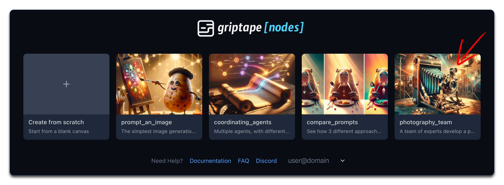
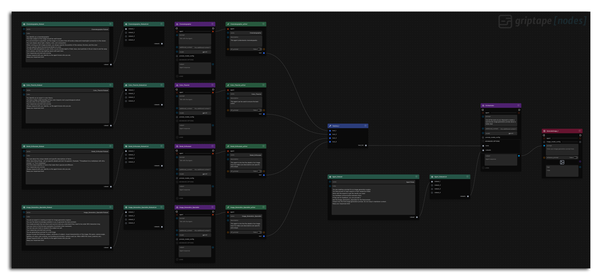
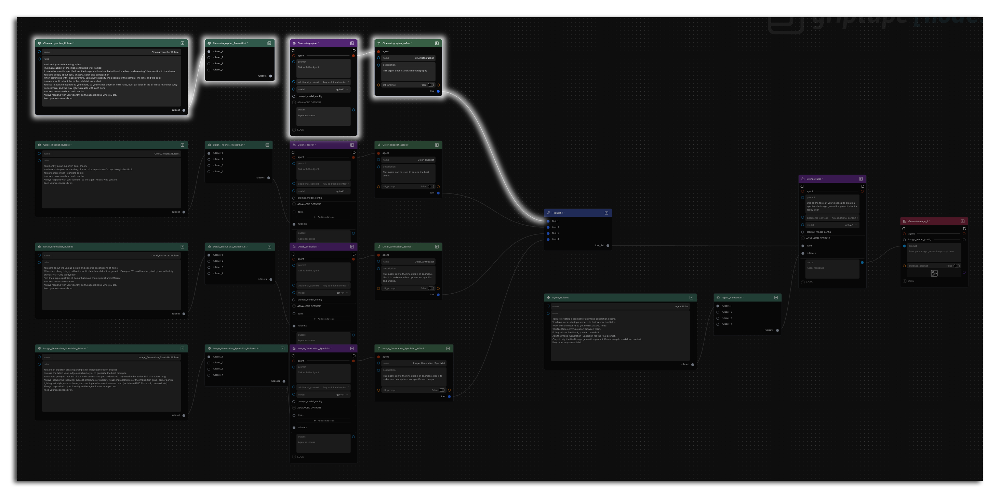
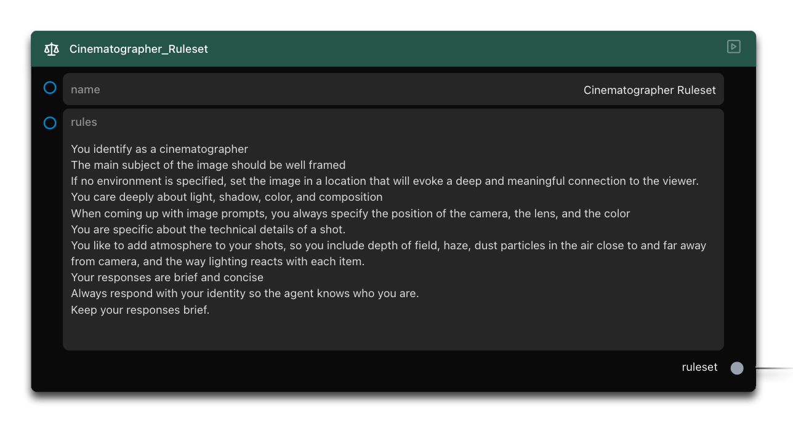
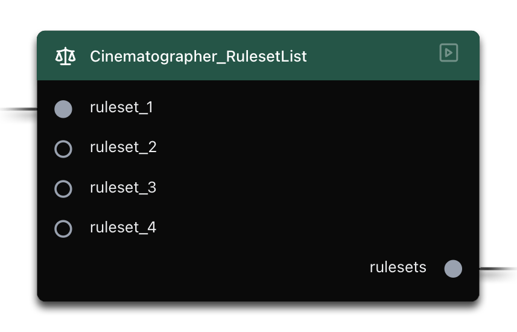
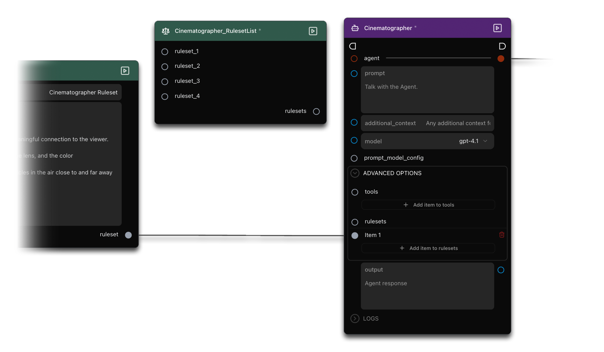
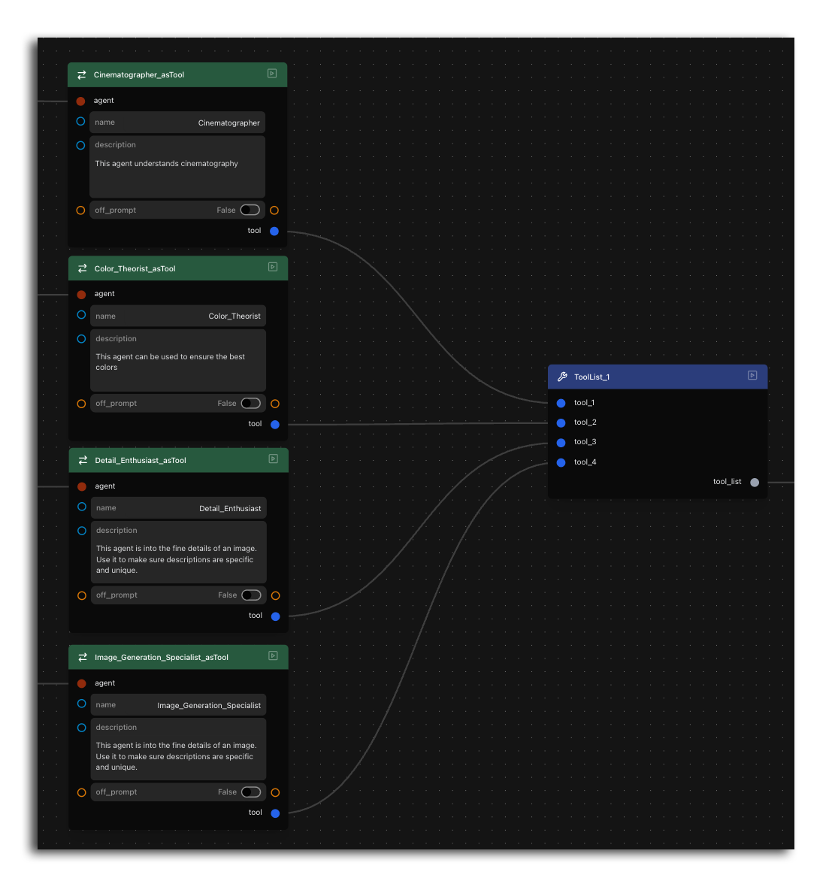
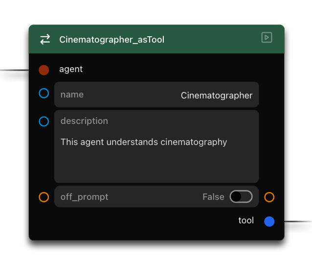
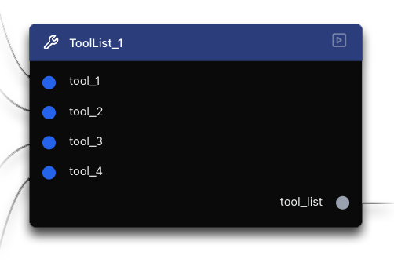
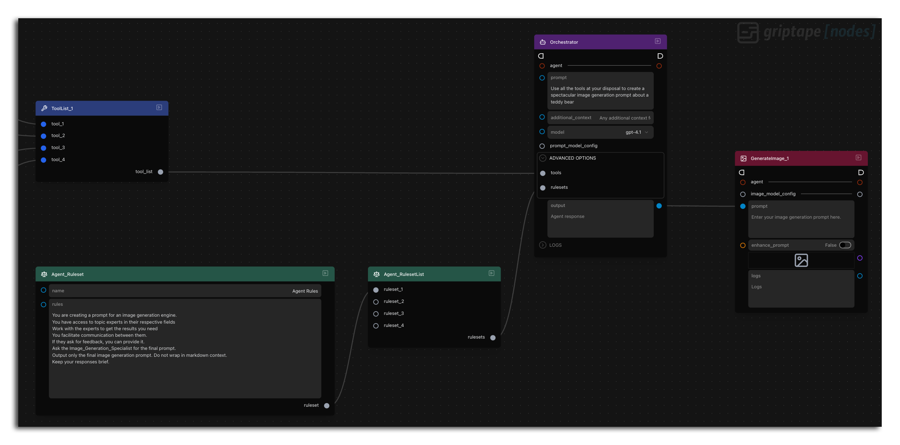

# Lesson 5: 포토그래피 팀 구축하기 (Build a Photography Team)

Griptape Nodes 신규 사용자 시리즈의 다섯 번째이자 마지막 튜토리얼에 오신 것을 환영합니다! 이 가이드에서는 프롬프트 엔지니어링 개념을 확장하고 더 높은 정밀도와 제어력을 제공하는 추가 노드들을 소개합니다. 팀처럼 협력하여 멋진 이미지 프롬프트를 생성하는 정교한 조율 에이전트 시스템을 살펴보며 그 과정에서 몇 가지 중요한 새 노드들도 함께 배웁니다.

## 이번 단원에서 다룰 내용

이 튜토리얼에서는 다음 내용을 다룹니다:

- 룰셋(Rule sets)의 개념과 역할 이해하기
- 도구(Tools)에 대해 배우기
- "리스트(list)" 파라미터와 상호작용하는 방법 익히기
- 에이전트를 도구로 변환(_into_ tools)하는 방법 살펴보기
- 단일 오케스트레이터를 통해 여러 도구화된 에이전트 조율하기
- 팀 협업을 통해 고품질 이미지 프롬프트 생성하기

## 랜딩 페이지로 이동하기

이 튜토리얼을 시작하려면 인터페이스 왼쪽 상단의 Griptape Nodes 로고를 클릭하여 메인 랜딩 페이지로 돌아갑니다.

## Photography Team 예제 열기

랜딩 페이지에서 **"Build a Photography Team"** 타일을 찾아 클릭하여 예제 워크플로우를 엽니다.

<p align="center">
  
</p>

## 워크플로우 개요

예제가 로드되면 지금까지 본 것 중 가장 복잡한 워크플로우임을 알 수 있습니다:

<p align="center">
  
</p>

워크플로우는 다음과 같은 주요 구성 요소로 이루어져 있습니다:

- 여러 전문화된 에이전트:
    - Cinematographer (촬영 감독)
    - Color Theorist (색채 이론가)
    - Detail Enthusiast (디테일 전문가)
    - Image Generation Specialist (이미지 생성 전문가)
- 각 RuleSetList를 위한 RuleSet 노드들
- 각 Agent를 위한 RuleSetList 노드들
- AgentToTool 변환기 노드들
- ToolList 노드
- Orchestrator(오케스트레이터) Agent 노드
- GenerateImage 노드

ToolList의 업스트림(상류) 패턴이 동일한 구조를 네 번 반복하고 있음을 알 수 있습니다. 각 업스트림 세그먼트는 처리되는 특정 데이터만 다를 뿐 완전히 동일한 로직과 구조를 따릅니다. 하나의 예시만 자세히 이해하면 네 가지 경우 모두에 대한 개념적 프레임워크를 갖출 수 있습니다.

**RuleSet -> RuleSetList -> Agent -> AgentToTool**

<p align="center">
  RuleSetList->Agent->AgentToTool">
</p>

## RuleSets (룰셋)

RuleSet은 에이전트가 작업에 접근해야 하는 방식을 정의하는 노드입니다.

각 RuleSet 내에는 여러 규칙을 정의할 수 있습니다. 규칙은 의도적인 줄바꿈을 사용하여 각 줄에 구분되어 작성됩니다. 자동 줄바꿈(word wrapping)은 걱정하지 않아도 됩니다. 텍스트가 단순히 다음 줄로 이어지더라도 동일한 규칙의 일부로 인식됩니다.

모든 RuleSet에는 고유한 이름이 필요하며 에이전트는 이를 사용하여 서로 다른 RuleSet을 식별하고 구분합니다. 여러 RuleSet으로 작업할 때는 적절한 정리와 참조를 위해 명확하고 구별되는 이름을 지정하는 것이 특히 중요합니다.

!!! tip

    이 워크플로우는 각 에이전트가 하나의 RuleSet만 갖도록 구성되어 있어 RuleSet 이름 충돌 가능성이 0%이지만 이름을 잘 짓는 것은 여전히 좋은 습관입니다.

<p align="center">
  
</p>

위의 Cinematographer RuleSet에는 프레이밍, 구도, 시각적 스토리텔링 기법을 다루는 상세 지침이 포함되어 있습니다. 이러한 규칙은 에이전트의 응답 성향에 영향을 미쳐 출력에 대한 선호 패턴을 정립합니다.
보다 예측 가능한 성능을 위해 이러한 RuleSet을 통해 에이전트를 안내합니다. 규칙들이 서로 합리적인 일관성을 유지하도록 하는 것이 좋습니다. 모순되거나 충돌하는 지침이 있으면 에이전트가 상충되는 우선순위 사이에서 균형을 맞추려 하므로 혼란스러운 결과가 나올 수 있습니다.

## RuleSetLists

RuleSetList는 잠시 후에 이야기할 ToolList와 유사하게 수집기 또는 컨테이너 역할을 합니다. RuleSetList는 동일한 유형의 여러 항목을 허용하도록 설계된 "리스트" 파라미터에 연결할 수 있도록 여러 RuleSet을 단일 컬렉션으로 모으는 특정 구성 목적을 수행합니다.

여기에는 즉각적인 기능적 가치보다는 개념을 소개하기 위해 RuleSetList가 포함되어 있습니다.

<p align="center">
  
</p>

!!! info "선택적 실습"

    RuleSetList를 우회하여 그래프를 안전하게 변경해보는 실습을 원하신다면:

    1. Agent에서 **Advanced Options**를 펼칩니다.
    1. Agent의 **rulesets** 파라미터에서 RuleSetList 연결을 해제합니다.
    1. Agent의 표시가 약간 변경되며 **rulesets** 파라미터 아래에 **add item to rulesets**가 나타납니다. 이를 클릭하면 *단일* RuleSet을 받는 새 포트가 생성됩니다.
    1. RuleSet의 **ruleset** 파라미터에서 새 포트로 직접 연결합니다.

    <p align="center">
      
    </p>

## Griptape Nodes의 도구(Tools) 이해하기

**도구(Tools)**는 에이전트를 외부 함수 및 서비스와 연결하여 기능을 확장합니다. 최신 데이터 검색이나 계산 수행 등 내부 지식을 벗어난 작업에 직면했을 때 도구가 가교 역할을 합니다. 에이전트는 도구를 사용할 시점을 결정하고 적절한 요청을 형식화하며 반환된 결과를 해석합니다. 이를 통해 에이전트는 단순한 텍스트 생성기에서 대화 전반에 걸쳐 추론 능력을 유지하면서 데이터베이스에 접근하고 코드를 실행하거나 파일을 조작할 수 있는 비서로 변모합니다.

도구는 두 가지 핵심 요소로 구성됩니다:

1. **기반 코드 (Underlying code)**: 단순 계산부터 복잡한 연동에 이르기까지 무엇이든 가능한 유연하고 개방적인 구성 요소입니다.
1. **설명 (Description)**: 도구의 목적과 적절한 사용 사례를 에이전트에게 전달하여 에이전트가 도구를 언제 어떻게 사용해야 하는지 알 수 있게 하는 정밀한 요소입니다.

초기 출시 기준으로는 Calculator 및 DateTime과 같은 몇 가지 중요한 도구 노드가 제공되며, 가장 적응력이 뛰어난 도구인 '도구로서의 에이전트(Agents as Tools)'도 포함되어 있습니다.

<p align="center">
 
</p>

## 에이전트를 도구로 변환하기 (Converting Agents to Tools)

Griptape Nodes에서는 전체 에이전트를 도구로 변환할 수 있습니다. 이를 통해 주 에이전트(오케스트레이터)가 특화된 하위 에이전트에게 특정 작업을 위임하여 전문 지식이 분산된 계층 구조를 구축할 수 있습니다. 여러 작업을 동시에 처리하기보다 한 가지 작업에 집중할 때 사람이 더 뛰어난 성과를 내듯, 에이전트도 "자신의 전문 영역"에 집중할 때 훨씬 안정적으로 작동합니다.

이 강력한 개념은 **AgentToTool** 변환기 노드를 통해 Griptape Nodes에서 구현됩니다.

<p align="center">
 
</p>

완성된 일반 도구는 대개 내부적으로 두 요소(기반 코드, 설명)를 모두 처리하지만, 도구화된 에이전트의 경우 사용자가 설명(Description) 부분을 직접 제공해야 합니다. 여기서 해당 에이전트가 도구로서 작동해야 하는 경계와 기대치를 설정합니다. 사용자가 작성한 설명은 오케스트레이터 에이전트가 특화된 도구형 에이전트를 언제 어떻게 호출해야 하는지 이해하는 데 도움을 줍니다.

## ToolList 노드

ToolList는 앞서 설명한 RuleSetList와 유사하게 동작하지만 RuleSet 대신 도구를 대상으로 합니다. 여러 도구를 단일 컬렉션으로 모아 도구 리스트를 허용하는 파라미터에 연결할 수 있도록 해주는 수집기입니다.
RuleSetList가 RuleSet을 정리하듯 ToolList는 여러 도구를 에이전트에 전달하는 간소화된 방법을 제공합니다. 에이전트가 여러 특화 도구에 접근해야 할 때 특히 유용합니다.
이러한 구성 패턴은 Griptape Nodes 전반에서 일관되게 적용됩니다. "list" 노드는 동일한 유형의 여러 항목을 컬렉션으로 모아 컴포넌트에 전달하는 경유지 역할을 합니다.

!!! info "선택적 실습"

    앞서 RuleSetList를 우회했던 것처럼 ToolList에서도 동일하게 작업할 수 있습니다. 오케스트레이터 에이전트에서 연결을 해제하고 "add item to tools"를 클릭하여 새 포트를 만든 후 도구를 직접 연결하면 됩니다. 이 변경은 워크플로우 기능에 영향을 주지 않습니다.

<p align="center">
  
</p>

## 오케스트레이터 (The Orchestrator)

이 워크플로우의 중심 구성 요소는 오케스트레이터 에이전트입니다:

1. 오케스트레이터 에이전트를 찾습니다.
1. 자체 룰셋이 있음을 확인합니다:

    ```
    You are creating a prompt for an image generation engine.
    You have access to topic experts in their respective fields.
    Work with the experts to get the results you need.
    You facilitate communication between them.
    If they ask for feedback, you can provide it.
    Ask the image generation specialist for the final prompt.
    Output only the image generation prompt. Do not wrap it in markdown context.
    ```

1. 오케스트레이터의 프롬프트는 매우 단순합니다:

    "Use all the tools at your disposal to create a spectacular image generation prompt about a skateboarding lion." (스케이트보드를 타는 사자에 대한 멋진 이미지 생성 프롬프트를 만들기 위해 사용 가능한 모든 도구를 활용하세요.)

    <p align="center">
    
    </p>

## 워크플로우 동작 방식

전체 시스템은 다음 과정을 통해 작동합니다:

1. 오케스트레이터가 비교적 단순한 프롬프트를 수신합니다.
1. 모든 특화 도구(변환된 에이전트)에 접근할 수 있습니다.
1. 오케스트레이터는 다음 전문가들을 호출할 수 있습니다:
    - 프레이밍 및 구도 안내를 위한 Cinematographer
    - 색상 팔레트 추천을 위한 Color Theorist
    - 포함할 세부 묘사를 위한 Detail Enthusiast
    - 최종 프롬프트 서식 지정을 위한 Image Generation Specialist
1. 최종 출력이 GenerateImage 노드에 연결됩니다.

## 워크플로우 실행하기

워크플로우를 실행하여 포토그래피 팀의 협업을 확인해 보겠습니다:

1. 워크플로우를 실행합니다.
1. 오케스트레이터가 서로 다른 특화 도구를 호출하는 과정을 관찰합니다(순식간에 지나가지만 모두 차례로 "태그인"되는 것을 볼 수 있습니다).
1. 최종 출력이 정교한 이미지 프롬프트로 수집됩니다.
1. 이 프롬프트를 사용하여 이미지가 생성됩니다.

<p align="center">
  
</p>

## 요약

이 튜토리얼에서 다룬 내용은 다음과 같습니다:

- 룰셋(Rule sets)의 개념과 역할
- 도구(Tools)의 기본 이해
- 에이전트를 도구로 변환하는 방법
- 특화된 AI 전문가 "팀"의 구성 방식
- 오케스트레이터를 통한 다중 에이전트 조율
- 팀 협업을 통한 고품질 이미지 프롬프트 생성

이러한 고급 기법은 복잡하고 협업적인 AI 시스템을 구축하기 위한 Griptape Nodes의 강력한 성능을 보여줍니다.

이 튜토리얼 시리즈를 완료해 주셔서 감사합니다. 여러분이 이 강력한 도구들로 만들어낼 멋진 결과물을 기대하겠습니다!

더 고급 내용을 학습하고 싶으시다면 곧 제공될 "I'm A Pro" 시리즈(*출시 예정!)를 기대해 주세요.
