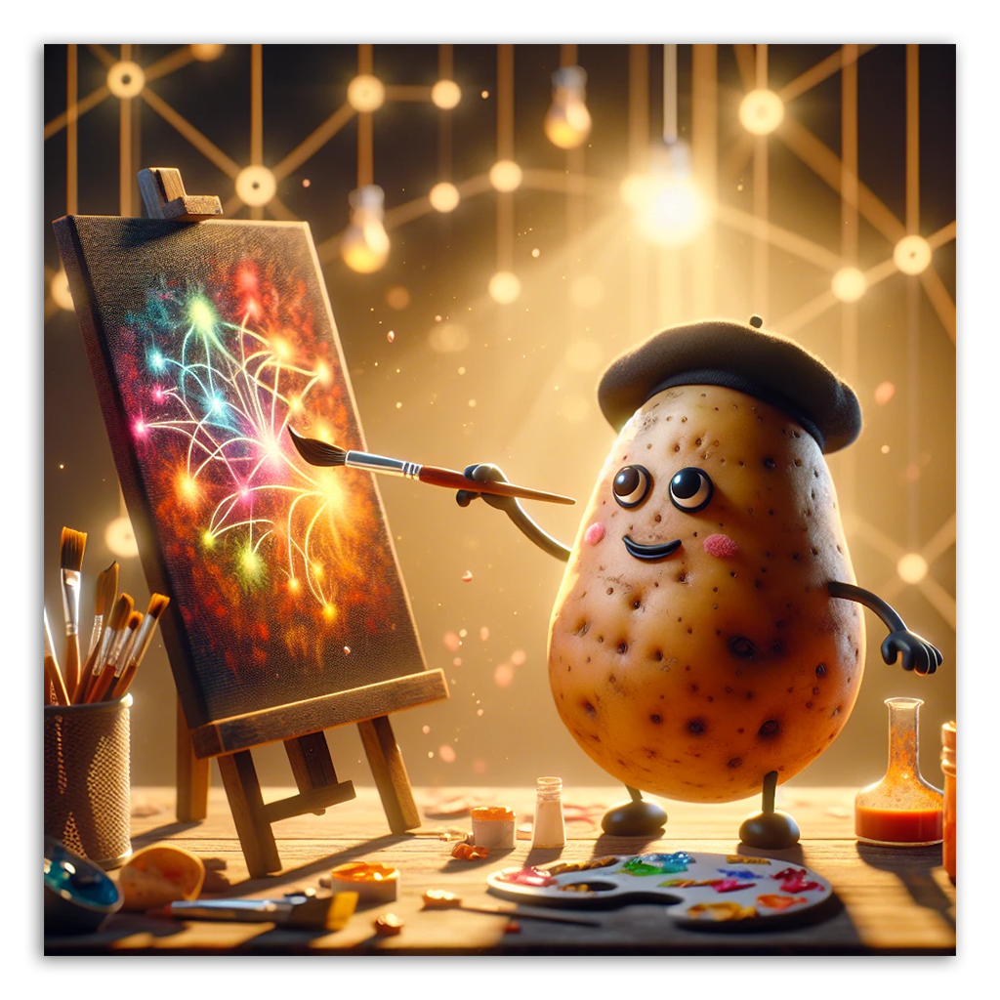
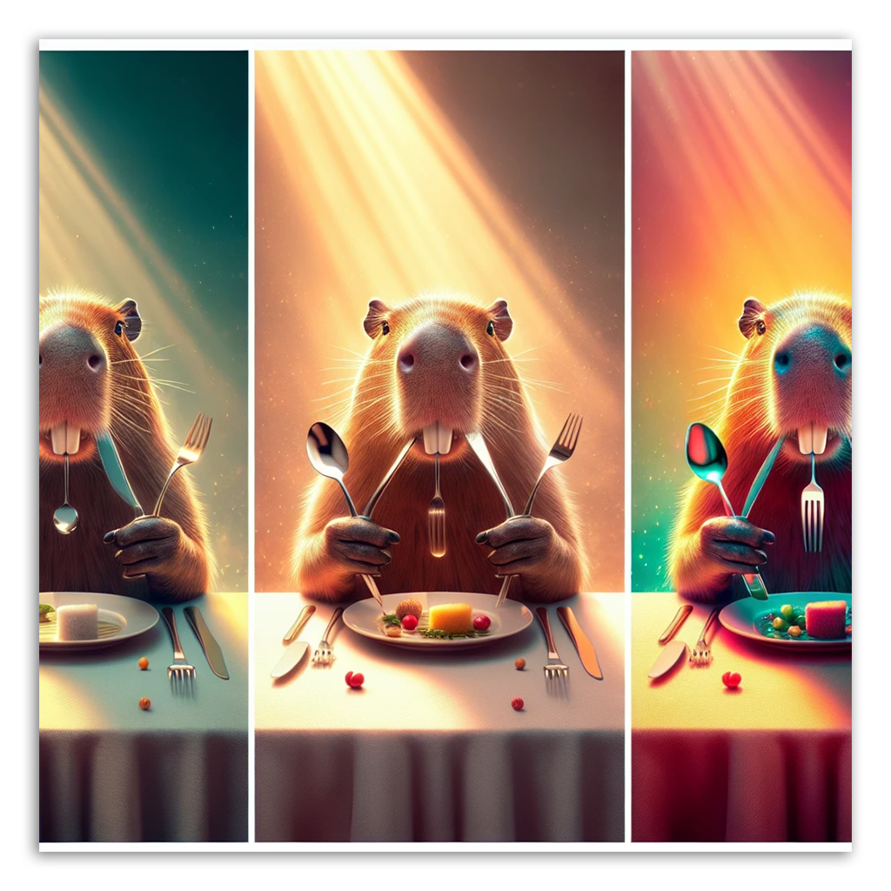

# 튜토리얼 개요 (Tutorial Overview)

Griptape Nodes와 함께하는 여정에 오신 것을 환영합니다! 이 학습 과정은 기본 설정부터 여러 에이전트를 활용한 복잡하고 조율된 워크플로우 제작에 이르기까지 모든 과정을 단계별로 안내합니다.

각 튜토리얼은 이전 단원에서 배운 지식을 바탕으로 점진적으로 더 심화된 개념과 기법을 소개합니다.

- # [Lesson 1. 시작하기](00_tour/index.md)

    

    Griptape Nodes Editor를 [설치](../installation.md)했다면 이제 Griptape Nodes를 실행하고 작업해 볼 차례입니다.

    인터페이스를 살펴보고 워크스페이스에 노드를 추가하는 방법을 이해합니다. 이 간단하지만 기초적인 튜토리얼은 앞으로의 모든 워크플로우를 준비하는 바탕이 됩니다.

- # [Lesson 2: 이미지 프롬프트 생성](01_prompt_an_image/index.md)

    

    강력한 [GenerateImage](../nodes/image/create_image.md) 노드를 사용하여 텍스트 설명을 생생한 시각적 작품으로 변환하는 방법을 배웁니다.

    이 튜토리얼에서는 Griptape 생태계에서 가장 널리 사용되고 다재다능한 노드 중 하나를 소개합니다.

- # [Lesson 3: 에이전트 조율하기](02_coordinating_agents/index.md)

    

    여러 에이전트를 조율하여 순차적인 작업을 수행하는 방법을 알아봅니다.

    언어 간에 콘텐츠를 번역하는 워크플로우를 분석하여 에이전트 간의 연결과 실행 체인(execution chain)의 기초를 학습합니다. 이 튜토리얼은 다단계(multi-step) 워크플로우의 개념을 소개합니다.

- # [Lesson 4: 프롬프트 비교하기](03_compare_prompts/index.md)

    

    다양한 프롬프트 작성 방식을 탐구하여 이미지 생성을 한 단계 더 발전시켜 봅니다.

    기본 프롬프트, GenerateImage의 "향상된 프롬프트(enhanced prompts)", 그리고 커스텀 에이전트로 향상된 프롬프트를 비교하여 각각이 결과에 미치는 영향을 살펴봅니다. 더욱 정밀한 창의적 제어를 위한 상세 지침 작성법을 배웁니다.

- # [Lesson 5: 포토그래피 팀 구축하기](04_photography_team/index.md)

    

    전문 에이전트들이 협력하여 멋진 이미지 프롬프트를 생성하는 고급 시스템을 구축합니다. 룰셋(Rule sets)과 도구(Tools)에 대해 배우고, 에이전트를 재사용 가능한 도구로 변환하여 기능을 확장하는 방법을 알아봅니다.

    이 고급 튜토리얼은 지금까지 배운 모든 내용을 하나로 통합합니다.

## 학습 목표

이 학습 과정을 완료하면 다음 내용을 완전히 익힐 수 있습니다:

- Griptape Nodes 인터페이스 설정 및 탐색
- 다양한 유형의 노드 생성 및 연결
- AI 이미지 생성 작업
- 특화된 에이전트를 위한 룰셋 및 도구 적용
- 에이전트를 재사용 가능한 도구로 변환
- 단일 시스템에서 여러 에이전트 조율

Griptape Nodes와 함께 여정을 시작할 준비가 되셨나요? [Lesson 1: 시작하기](00_tour/index.md)에서 인터페이스에 대해 알아보세요!
